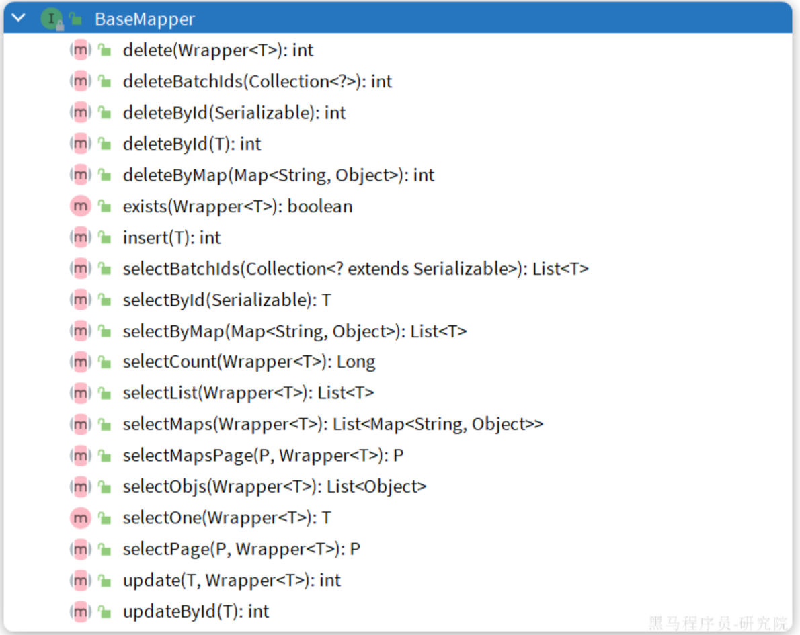
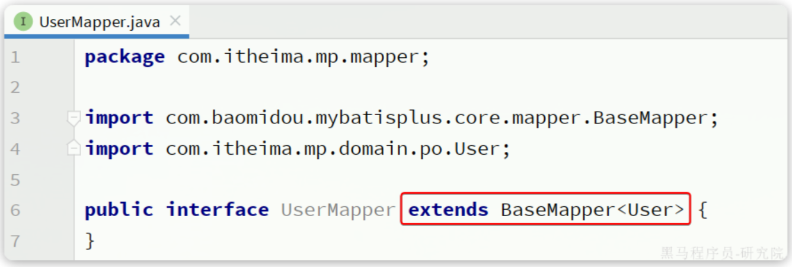
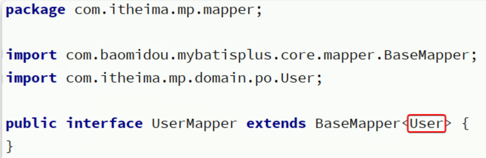
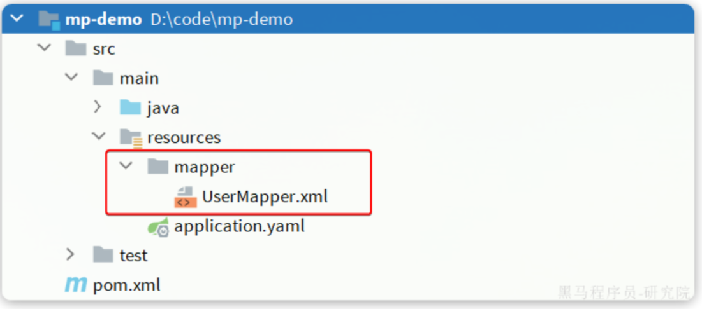
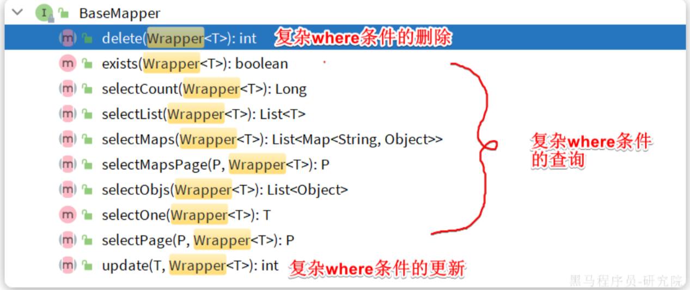
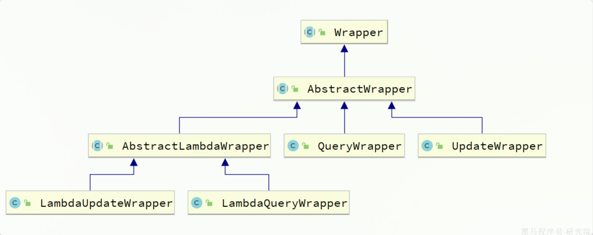
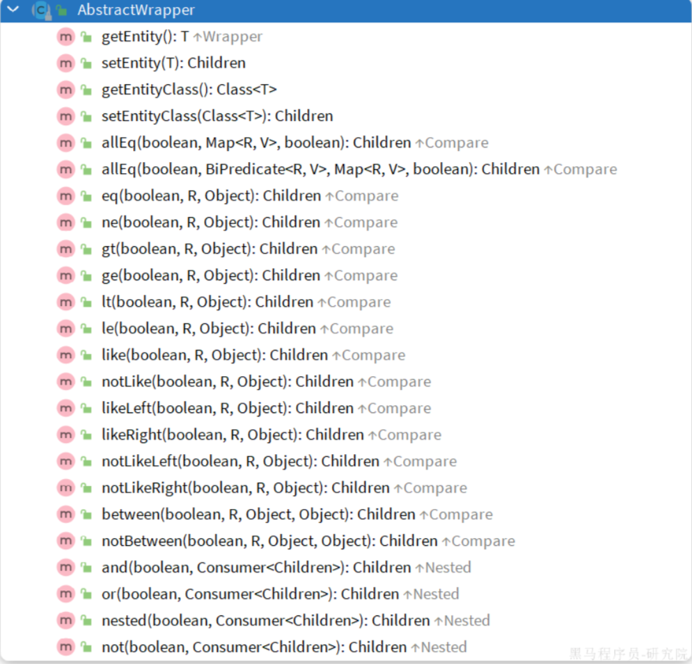
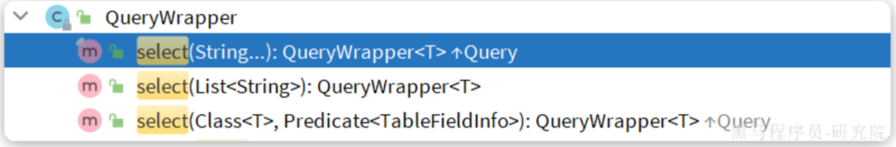
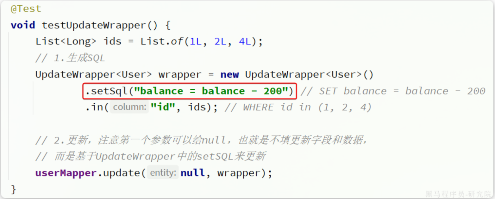

## MybatisPlus快速入门

### 快速开始

#### 引入依赖

MybatisPlus提供了starter，实现了自动Mybatis以及MybatisPlus的自动装配功能，坐标如下：

```xml
<dependency>
    <groupId>com.baomidou</groupId>
    <artifactId>mybatis-plus-boot-starter</artifactId>
    <version>3.5.3.1</version>
</dependency>
```

由于这个starter包含对mybatis的自动装配，因此完全可以替换掉Mybatis的starter。

最终，项目的依赖如下：

```xml
<dependencies>
    <dependency>
        <groupId>com.baomidou</groupId>
        <artifactId>mybatis-plus-boot-starter</artifactId>
        <version>3.5.3.1</version>
    </dependency>
    <dependency>
        <groupId>com.mysql</groupId>
        <artifactId>mysql-connector-j</artifactId>
        <scope>runtime</scope>
    </dependency>
    <dependency>
        <groupId>org.projectlombok</groupId>
        <artifactId>lombok</artifactId>
        <optional>true</optional>
    </dependency>
    <dependency>
        <groupId>org.springframework.boot</groupId>
        <artifactId>spring-boot-starter-test</artifactId>
        <scope>test</scope>
    </dependency>
</dependencies>
```

#### 定义Mapper

为了简化单表CRUD，MybatisPlus提供了一个基础的BaseMapper接口，其中已经实现了单表的CRUD：



因此我们自定义的Mapper只要实现了这个BaseMapper，就无需自己实现单表CRUD了。

修改mp-demo中的com.itheima.mp.mapper包下的UserMapper接口，让其继承BaseMapper：



代码如下：

```java
package com.itheima.mp.mapper;

import com.baomidou.mybatisplus.core.mapper.BaseMapper;
import com.itheima.mp.domain.po.User;

public interface UserMapper extends BaseMapper<User> {
}
```

#### 测试

新建一个测试类，编写几个单元测试，测试基本的CRUD功能：

```java
package com.itheima.mp.mapper;

import com.itheima.mp.domain.po.User;
import org.junit.jupiter.api.Test;
import org.springframework.beans.factory.annotation.Autowired;
import org.springframework.boot.test.context.SpringBootTest;

import java.time.LocalDateTime;
import java.util.List;

@SpringBootTest
class UserMapperTest {

    @Autowired
    private UserMapper userMapper;

    @Test
    void testInsert() {
        User user = new User();
        user.setId(5L);
        user.setUsername("Lucy");
        user.setPassword("123");
        user.setPhone("18688990011");
        user.setBalance(200);
        user.setInfo("{\"age\": 24, \"intro\": \"英文老师\", \"gender\": \"female\"}");
        user.setCreateTime(LocalDateTime.now());
        user.setUpdateTime(LocalDateTime.now());
        userMapper.insert(user);
    }

    @Test
    void testSelectById() {
        User user = userMapper.selectById(5L);
        System.out.println("user = " + user);
    }

    @Test
    void testSelectByIds() {
        List<User> users = userMapper.selectBatchIds(List.of(1L, 2L, 3L, 4L, 5L));
        users.forEach(System.out::println);
    }

    @Test
    void testUpdateById() {
        User user = new User();
        user.setId(5L);
        user.setBalance(20000);
        userMapper.updateById(user);
    }

    @Test
    void testDelete() {
        userMapper.deleteById(5L);
    }
}
```

可以看到，在运行过程中打印出的SQL日志，非常标准：

```SQl
11:05:01  INFO 15524 --- [main] com.zaxxer.hikari.HikariDataSource       : HikariPool-1 - Starting...
11:05:02  INFO 15524 --- [main] com.zaxxer.hikari.HikariDataSource       : HikariPool-1 - Start completed.
11:05:02 DEBUG 15524 --- [main] c.i.mp.mapper.UserMapper.selectById      : ==>  Preparing: SELECT id,username,password,phone,info,status,balance,create_time,update_time FROM user WHERE id=?
11:05:02 DEBUG 15524 --- [main] c.i.mp.mapper.UserMapper.selectById      : ==> Parameters: 5(Long)
11:05:02 DEBUG 15524 --- [main] c.i.mp.mapper.UserMapper.selectById      : <==      Total: 1
user = User(id=5, username=Lucy, password=123, phone=18688990011, info={"age": 21}, status=1, balance=20000, createTime=Fri Jun 30 11:02:30 CST 2023, updateTime=Fri Jun 30 11:02:30 CST 2023)
```

### 常见注解

在刚刚的入门案例中，我们仅仅引入了依赖，继承了BaseMapper就能使用MybatisPlus，非常简单。但是问题来了：

MybatisPlus如何知道我们要查询的是哪张表？表中有哪些字段呢？

大家回忆一下，UserMapper在继承BaseMapper的时候指定了一个泛型：



泛型中的User就是与数据库对应的PO。

MybatisPlus就是根据PO实体的信息来推断出表的信息，从而生成SQL的。默认情况下：

- MybatisPlus会把PO实体的类名驼峰转下划线作为表名
- MybatisPlus会把PO实体的所有变量名驼峰转下划线作为表的字段名，并根据变量类型推断字段类型
- MybatisPlus会把名为id的字段作为主键

但很多情况下，默认的实现与实际场景不符，因此MybatisPlus提供了一些注解便于我们声明表信息。

#### @TableName

说明：

- 描述：表名注解，标识实体类对应的表
- 使用位置：实体类

示例：

```java
@TableName("user")
public class User {
    private Long id;
    private String name;
}
```

TableName注解除了指定表名以外，还可以指定很多其它属性：

| **属性**         | **类型** | **必须指定** | **默认值** | **描述**                                                     |
| ---------------- | -------- | ------------ | ---------- | ------------------------------------------------------------ |
| value            | String   | 否           | ""         | 表名                                                         |
| schema           | String   | 否           | ""         | schema                                                       |
| keepGlobalPrefix | boolean  | 否           | false      | 是否保持使用全局的 tablePrefix 的值（当全局 tablePrefix 生效时） |
| resultMap        | String   | 否           | ""         | xml 中 resultMap 的 id（用于满足特定类型的实体类对象绑定）   |
| autoResultMap    | boolean  | 否           | false      | 是否自动构建 resultMap 并使用（如果设置 resultMap 则不会进行 resultMap 的自动构建与注入） |
| excludeProperty  | String[] | 否           | {}         | 需要排除的属性名 @since 3.3.1                                |

@TableId

说明：

- 描述：主键注解，标识实体类中的主键字段
- 使用位置：实体类的主键字段

示例：

```java
@TableName("user")
public class User {
    @TableId
    private Long id;
    private String name;
}
```

TableId注解支持两个属性：

| **属性** | **类型** | **必须指定** | **默认值**  | **描述**     |
| :------- | :------- | :----------- | :---------- | :----------- |
| value    | String   | 否           | ""          | 表名         |
| type     | Enum     | 否           | IdType.NONE | 指定主键类型 |

IdType支持的类型有：

| **值**        | **描述**                                                     |
| :------------ | :----------------------------------------------------------- |
| AUTO          | 数据库 ID 自增                                               |
| NONE          | 无状态，该类型为未设置主键类型（注解里等于跟随全局，全局里约等于 INPUT） |
| INPUT         | insert 前自行 set 主键值                                     |
| ASSIGN_ID     | 分配 ID(主键类型为 Number(Long 和 Integer)或 String)(since 3.3.0),使用接口IdentifierGenerator的方法nextId(默认实现类为DefaultIdentifierGenerator雪花算法) |
| ASSIGN_UUID   | 分配 UUID,主键类型为 String(since 3.3.0),使用接口IdentifierGenerator的方法nextUUID(默认 default 方法) |
| ID_WORKER     | 分布式全局唯一 ID 长整型类型(please use ASSIGN_ID)           |
| UUID          | 32 位 UUID 字符串(please use ASSIGN_UUID)                    |
| ID_WORKER_STR | 分布式全局唯一 ID 字符串类型(please use ASSIGN_ID)           |

这里比较常见的有三种：

- AUTO：利用数据库的id自增长
- INPUT：手动生成id
- ASSIGN_ID：雪花算法生成Long类型的全局唯一id，这是默认的ID策略

#### @TableField

说明：

- 描述：普通字段注解

示例：

```java
@TableName("user")
public class User {
    @TableId
    private Long id;
    private String name;
    private Integer age;
    @TableField(is_married")
    private Boolean isMarried;
    @TableField("`concat`")
    private String concat;
}
```

一般情况下我们并不需要给字段添加@TableField注解，一些特殊情况除外：

- 成员变量名与数据库字段名不一致
- 成员变量是以isXXX命名，按照JavaBean的规范，MybatisPlus识别字段时会把is去除，这就导致与数据库不符
- 成员变量名与数据库字段名一致，但是与数据库的关键字冲突。使用@TableField注解给字段名添加转义字符：``

支持的其他属性如下：

| **属性**         | **类型**   | **必填** | **默认值**            | **描述**                                                     |
| ---------------- | ---------- | -------- | --------------------- | ------------------------------------------------------------ |
| value            | String     | 否       | ""                    | 数据库字段名                                                 |
| exist            | boolean    | 否       | true                  | 是否为数据库表字段                                           |
| condition        | String     | 否       | ""                    | 字段 where 实体查询比较条件，有值设置则按设置的值为准，没有则为默认全局的 %s=#{%s}，[参考(opens new window)](https://github.com/baomidou/mybatis-plus/blob/3.0/mybatis-plus-annotation/src/main/java/com/baomidou/mybatisplus/annotation/SqlCondition.java) |
| update           | String     | 否       | ""                    | 字段 update set 部分注入，例如：当在version字段上注解update="%s+1" 表示更新时会 set version=version+1 （该属性优先级高于 el 属性） |
| insertStrategy   | Enum       | 否       | FieldStrategy.DEFAULT | 举例：NOT_NULL insert into table_a(<if test="columnProperty != null">column</if>) values (<if test="columnProperty != null">#{columnProperty}</if>) |
| updateStrategy   | Enum       | 否       | FieldStrategy.DEFAULT | 举例：IGNORED update table_a set column=#{columnProperty}    |
| whereStrategy    | Enum       | 否       | FieldStrategy.DEFAULT | 举例：NOT_EMPTY where <if test="columnProperty != null and columnProperty!=''">column=#{columnProperty}</if> |
| fill             | Enum       | 否       | FieldFill.DEFAULT     | 字段自动填充策略                                             |
| select           | boolean    | 否       | true                  | 是否进行 select 查询                                         |
| keepGlobalFormat | boolean    | 否       | false                 | 是否保持使用全局的 format 进行处理                           |
| jdbcType         | JdbcType   | 否       | JdbcType.UNDEFINED    | JDBC 类型 (该默认值不代表会按照该值生效)                     |
| typeHandler      | TypeHander | 否       |                       | 类型处理器 (该默认值不代表会按照该值生效)                    |
| numericScale     | String     | 否       | ""                    | 指定小数点后保留的位数                                       |

### 常见配置

MybatisPlus也支持基于yaml文件的自定义配置，详见官方文档：

https://baomidou.com/reference/

大多数的配置都有默认值，因此我们都无需配置。但还有一些是没有默认值的，例如：

- 实体类的别名扫描包
- 全局id类型

```yaml
mybatis-plus:
  type-aliases-package: com.itheima.mp.domain.po
  global-config:
    db-config:
      id-type: auto # 全局id类型为自增长
```

需要注意的是，MybatisPlus也支持手写SQL的，而mapper文件的读取地址可以自己配置：

```yaml
mybatis-plus:
  mapper-locations: "classpath*:/mapper/**/*.xml" # Mapper.xml文件地址，当前这个是默认值。
```

可以看到默认值是classpath*:/mapper/**/*.xml，也就是说我们只要把mapper.xml文件放置到这个目录下就一定会被加载。

例如，我们新建一个UserMapper.xml文件：



然后在其中定义一个方法：

```xml
<?xml version="1.0" encoding="UTF-8"?>
<!DOCTYPE mapper PUBLIC "-//mybatis.org//DTD Mapper 3.0//EN" "http://mybatis.org/dtd/mybatis-3-mapper.dtd">
<mapper namespace="com.itheima.mp.mapper.UserMapper">
    <select id="queryById" resultType="User">
        SELECT * FROM user WHERE id = #{id}
    </select>
</mapper>
```

然后在测试类UserMapperTest中测试该方法：

```java
@Test
void testQuery() {
    User user = userMapper.queryById(1L);
    System.out.println("user = " + user);
}
```

## MybatisPlus核心功能

刚才的案例中都是以id为条件的简单CRUD，一些复杂条件的SQL语句就要用到一些更高级的功能了。

### 方法引用：Lambda的快捷方式

Lambda表达式已经足够简洁，但Java 8还提供了另一种更简洁的表达方式：方法引用。尤其是在Lambda表达式仅仅是调用一个已经存在的方法时。

#### 什么是方法引用？

方法引用可以被看作是Lambda表达式的一种“快捷方式”或“语法糖”。它允许你直接引用现有的方法，而无需重新编写Lambda表达式。方法引用使用::操作符，将方法名与类名或对象名分隔开。

有三种主要的方法引用类型：

1、静态方法引用： ClassName::staticMethodName
例如：Integer::parseInt （等价于 s -> Integer.parseInt(s)）

2、实例方法引用（指向特定对象）： objectReference::instanceMethodName
例如：System.out::println （等价于 s -> System.out.println(s))
例如：假定一个局部变量expensiveTransaction用于存放Transaction类型的对象, 它支持实例 方法getValue，那么你就可以这么写expensiveTransaction::getValue

3、实例方法引用（指向任意对象）： ClassName::instanceMethodName
例如：String::length （等价于 (String s) -> s.length())
这种方式有点特殊。它表示引用一个特定类型的所有对象的实例方法。在调用时，Lambda表达式的第一个参数会成为方法的调用者。
让我们通过一些例子来更好地理解这三种方法引用：

```java
// 静态方法引用
Function<String, Integer> stringToInt = Integer::parseInt;

// 实例方法引用（指向特定对象）
Consumer<String> printString = System.out::println;

// 实例方法引用（指向任意对象）
Function<String, Integer> stringLength = String::length;
BiPredicate<List<String>, String> contains = List::contains;
```

这些方法引用都比对应的Lambda表达式更简洁、更易读。它们直接表达了“使用这个方法”的意图，而无需重复方法的实现细节。

#### 构造函数引用

除了普通方法，方法引用还可以用于构造函数。你可以使用ClassName::new的形式来引用一个类的构造函数。

例如：

```java
// 无参构造函数引用
Supplier<List<String>> newListSupplier = ArrayList::new;
List<String> list = newListSupplier.get(); // 创建一个新的ArrayList

// 有参构造函数引用
Function<Integer, String[]> stringArrayCreator = String[]::new;
String[] stringArray = stringArrayCreator.apply(10); //创建一个长度为10的String类型数组。
```

构造函数引用可以让你像使用普通方法一样使用构造函数，从而可以将其传递给函数式接口，实现延迟创建对象等功能。

方法引用提供了一种比Lambda表达式更简洁、更直接的方式来引用已有的方法或构造函数。在合适的场景下使用方法引用，可以进一步提高代码的可读性和表达力。

### 条件构造器

除了新增以外，修改、删除、查询的SQL语句都需要指定where条件。因此BaseMapper中提供的相关方法除了以id作为where条件以外，还支持更加复杂的where条件。



参数中的Wrapper就是条件构造的抽象类，其下有很多默认实现，继承关系如图：



Wrapper的子类AbstractWrapper提供了where中包含的所有条件构造方法：



而QueryWrapper在AbstractWrapper的基础上拓展了一个select方法，允许指定查询字段：



而UpdateWrapper在AbstractWrapper的基础上拓展了一个set方法，允许指定SQL中的SET部分：


接下来，我们就来看看如何利用Wrapper实现复杂查询。

#### QueryWrapper

无论是修改、删除、查询，都可以使用QueryWrapper来构建查询条件。接下来看一些例子： **查询**：查询出名字中带`o`的，存款大于等于1000元的人。代码如下：

```java
@Test
void testQueryWrapper() {
    // 1.构建查询条件 where name like "%o%" AND balance >= 1000
    QueryWrapper<User> wrapper = new QueryWrapper<User>()
            .select("id", "username", "info", "balance")
            .like("username", "o")
            .ge("balance", 1000);
    // 2.查询数据
    List<User> users = userMapper.selectList(wrapper);
    users.forEach(System.out::println);
}
```

**更新**：更新用户名为jack的用户的余额为2000，代码如下：

```Java
@Test
void testUpdateByQueryWrapper() {
    // 1.构建查询条件 where name = "Jack"
    QueryWrapper<User> wrapper = new QueryWrapper<User>().eq("username", "Jack");
    // 2.更新数据，user中非null字段都会作为set语句
    User user = new User();
    user.setBalance(2000);
    userMapper.update(user, wrapper);
}
```

#### UpdateWrapper

基于BaseMapper中的update方法更新时只能直接赋值，对于一些复杂的需求就难以实现。 例如：更新id为`1,2,4`的用户的余额，扣200，对应的SQL应该是：

```sql
UPDATE user SET balance = balance - 200 WHERE id in (1, 2, 4)
```

SET的赋值结果是基于字段现有值的，这个时候就要利用UpdateWrapper中的setSql功能了：

```java
@Test
void testUpdateWrapper() {
    List<Long> ids = List.of(1L, 2L, 4L);
    // 1.生成SQL
    UpdateWrapper<User> wrapper = new UpdateWrapper<User>()
            .setSql("balance = balance - 200") // SET balance = balance - 200
            .in("id", ids); // WHERE id in (1, 2, 4)
        // 2.更新，注意第一个参数可以给null，也就是不填更新字段和数据，
    // 而是基于UpdateWrapper中的setSQL来更新
    userMapper.update(null, wrapper);
}
```

#### LambdaQueryWrapper

无论是QueryWrapper还是UpdateWrapper在构造条件的时候都需要写死字段名称，会出现字符串`魔法值`。这在编程规范中显然是不推荐的。 那怎么样才能不写字段名，又能知道字段名呢？

其中一种办法是基于变量的`getter`方法结合反射技术。因此我们只要将条件对应的字段的`getter`方法传递给MybatisPlus，它就能计算出对应的变量名了。而传递方法可以使用JDK8中的`方法引用`和`Lambda`表达式。 因此MybatisPlus又提供了一套基于Lambda的Wrapper，包含两个：

- LambdaQueryWrapper
- LambdaUpdateWrapper

分别对应QueryWrapper和UpdateWrapper

其使用方式如下：

```java
@Test
void testLambdaQueryWrapper() {
    // 1.构建条件 WHERE username LIKE "%o%" AND balance >= 1000
    QueryWrapper<User> wrapper = new QueryWrapper<>();
    wrapper.lambda()
            .select(User::getId, User::getUsername, User::getInfo, User::getBalance)
            .like(User::getUsername, "o")
            .ge(User::getBalance, 1000);
    // 2.查询
    List<User> users = userMapper.selectList(wrapper);
    users.forEach(System.out::println);
}
```

### 自定义SQL

在演示UpdateWrapper的案例中，我们在代码中编写了更新的SQL语句：



这种写法在某些企业 也是不允许的，因为SQL语句最好都维护在持久层，而不是业务层。就当前案例来说，由于条件是in语句，只能将SQL写在Mapper.xml文件，利用foreach来生成动态SQL。
这是很麻烦的，假如查询条件更复杂，动态SQL的编写也会更加复杂。

所以MybatisPlus提供了自定义SQL功能，可以让我们利用Wrapper生成查询条件，再结合Mapper.xml编写SQL。

#### 基本用法

以当前案例来说，我们可以这样写：

```java
@Test
void testCustomWrapper() {
    // 1.准备自定义查询条件
    List<Long> ids = List.of(1L, 2L, 4L);
    QueryWrapper<User> wrapper = new QueryWrapper<User>().in("id", ids);

    // 2.调用mapper的自定义方法，直接传递Wrapper
    userMapper.deductBalanceByIds(200, wrapper);
}
```

然后在UserMapper中自定义SQL：

```java
public interface UserMapper extends BaseMapper<User> {
    @Select("UPDATE user SET balance = balance - #{money} ${ew.customSqlSegment}")
    void deductBalanceByIds(@Param("money") int money, @Param("ew") QueryWrapper<User> wrapper);
}
```

这样就省去了编写复杂查询条件的烦恼了。

#### 多表关联

理论上来讲MybatisPlus是不支持多表查询的，不过我们可以利用Wrapper中自定义条件结合自定义SQL来实现多表查询的效果。
例如，我们要查询出所有收货地址在北京的并且用户id在1、2、4之中的用户
要是自己基于mybatis实现SQL，大概是这样的：

```xml
<select id="queryUserByIdAndAddr" resultType="com.itheima.mp.domain.po.User">
      SELECT *
      FROM user u
      INNER JOIN address a ON u.id = a.user_id
      WHERE u.id
      <foreach collection="ids" separator="," item="id" open="IN (" close=")">
          #{id}
      </foreach>
      AND a.city = #{city}
</select>
```

可以看出其中最复杂的就是where条件的编写，如果业务复杂一些，这里的SQL会更变态。
但是基于自定义SQL结合Wrapper的玩法，我们就可以利用Wrapper来构建查询条件，然后手写select及from部分，实现多表查询。

查询条件这样来构建：

```java
@Test
void testCustomJoinWrapper() {
    // 1.准备自定义查询条件
    QueryWrapper<User> wrapper = new QueryWrapper<User>()
            .in("u.id", List.of(1L, 2L, 4L))
            .eq("a.city", "北京");

    // 2.调用mapper的自定义方法
    List<User> users = userMapper.queryUserByWrapper(wrapper);

    users.forEach(System.out::println);
}
```

然后在UserMapper中自定义方法：

```java
@Select("SELECT u.* FROM user u INNER JOIN address a ON u.id = a.user_id ${ew.customSqlSegment}")
List<User> queryUserByWrapper(@Param("ew")QueryWrapper<User> wrapper);
```

当然，也可以在UserMapper.xml中写SQL：

```xml
<select id="queryUserByIdAndAddr" resultType="com.itheima.mp.domain.po.User">
    SELECT * FROM user u INNER JOIN address a ON u.id = a.user_id ${ew.customSqlSegment}
</select>
```

