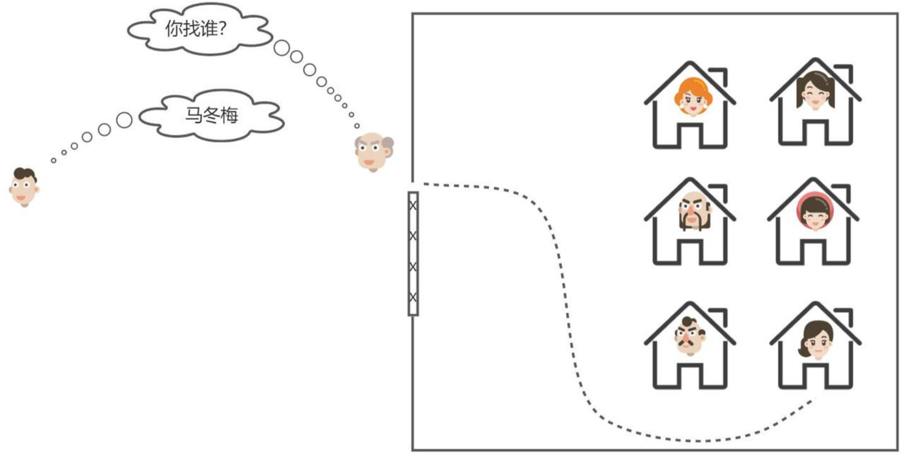
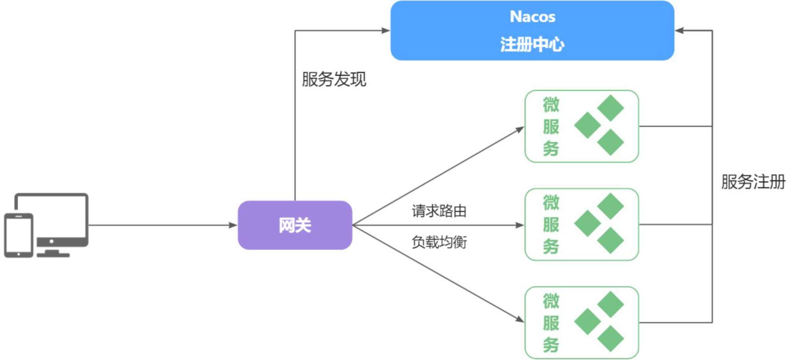
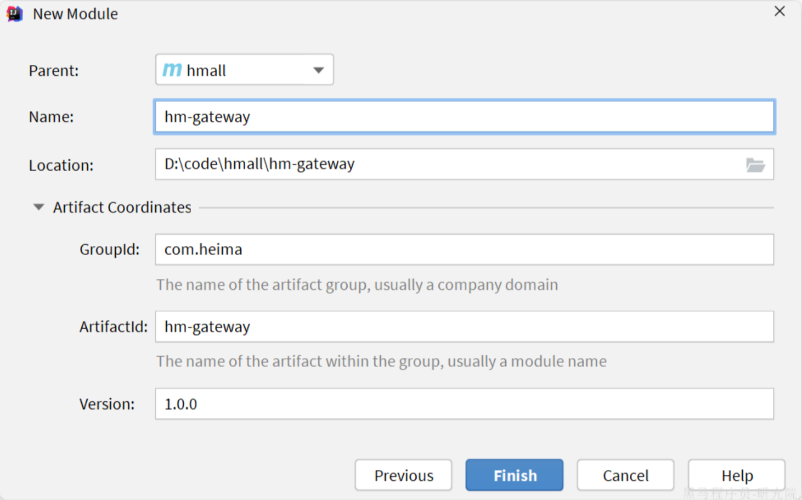
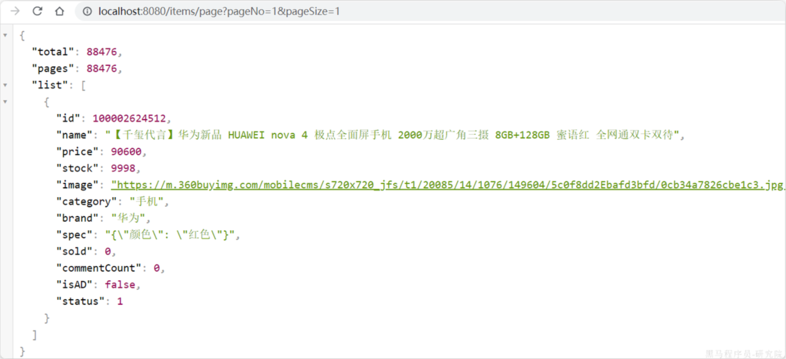
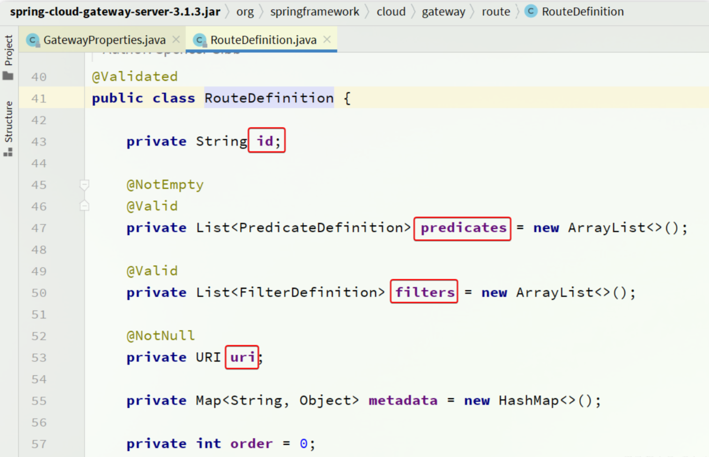

## 网关路由

### 认识网关

什么是网关？

顾明思议，网关就是**网**络的**关**口。数据在网络间传输，从一个网络传输到另一网络时就需要经过网关来做数据的**路由和转发以及数据安全的校验**。

更通俗的来讲，网关就像是以前园区传达室的大爷。

- 外面的人要想进入园区，必须经过大爷的认可，如果你是不怀好意的人，肯定被直接拦截。
- 外面的人要传话或送信，要找大爷。大爷帮你带给目标人。



现在，微服务网关就起到同样的作用。前端请求不能直接访问微服务，而是要请求网关：

- 网关可以做安全控制，也就是登录身份校验，校验通过才放行
- 通过认证后，网关再根据请求判断应该访问哪个微服务，将请求转发过去



在SpringCloud当中，提供了两种网关实现方案：

- Netflix Zuul：早期实现，目前已经淘汰
- SpringCloudGateway：基于Spring的WebFlux技术，完全支持响应式编程，吞吐能力更强

课堂中我们以SpringCloudGateway为例来讲解，官方网站：

https://spring.io/projects/spring-cloud-gateway#learn

### 快速入门

接下来，我们先看下如何利用网关实现请求路由。由于网关本身也是一个独立的微服务，因此也需要创建一个模块开发功能。大概步骤如下：

- 创建网关微服务
- 引入SpringCloudGateway、NacosDiscovery依赖
- 编写启动类
- 配置网关路由

#### 创建项目

首先，我们要在hmall下创建一个新的module，命名为hm-gateway，作为网关微服务：



#### 引入依赖

在`hm-gateway`模块的`pom.xml`文件中引入依赖：

```XML
<?xml version="1.0" encoding="UTF-8"?>
<project xmlns="http://maven.apache.org/POM/4.0.0"
         xmlns:xsi="http://www.w3.org/2001/XMLSchema-instance"
         xsi:schemaLocation="http://maven.apache.org/POM/4.0.0 http://maven.apache.org/xsd/maven-4.0.0.xsd">
    <parent>
        <artifactId>hmall</artifactId>
        <groupId>com.heima</groupId>
        <version>1.0.0</version>
    </parent>
    <modelVersion>4.0.0</modelVersion>

    <artifactId>hm-gateway</artifactId>

    <properties>
        <maven.compiler.source>11</maven.compiler.source>
        <maven.compiler.target>11</maven.compiler.target>
    </properties>
    <dependencies>
        <!--common-->
        <dependency>
            <groupId>com.heima</groupId>
            <artifactId>hm-common</artifactId>
            <version>1.0.0</version>
        </dependency>
        <!--网关-->
        <dependency>
            <groupId>org.springframework.cloud</groupId>
            <artifactId>spring-cloud-starter-gateway</artifactId>
        </dependency>
        <!--nacos discovery-->
        <dependency>
            <groupId>com.alibaba.cloud</groupId>
            <artifactId>spring-cloud-starter-alibaba-nacos-discovery</artifactId>
        </dependency>
        <!--负载均衡-->
        <dependency>
            <groupId>org.springframework.cloud</groupId>
            <artifactId>spring-cloud-starter-loadbalancer</artifactId>
        </dependency>
    </dependencies>
    <build>
        <finalName>${project.artifactId}</finalName>
        <plugins>
            <plugin>
                <groupId>org.springframework.boot</groupId>
                <artifactId>spring-boot-maven-plugin</artifactId>
            </plugin>
        </plugins>
    </build>
</project>
```

#### 启动类

在`hm-gateway`模块的`com.hmall.gateway`包下新建一个启动类：


代码如下：

```Java
package com.hmall.gateway;

import org.springframework.boot.SpringApplication;
import org.springframework.boot.autoconfigure.SpringBootApplication;

@SpringBootApplication
public class GatewayApplication {
    public static void main(String[] args) {
        SpringApplication.run(GatewayApplication.class, args);
    }
}
```

#### 配置路由

接下来，在`hm-gateway`模块的`resources`目录新建一个`application.yaml`文件，内容如下：

```YAML
server:
  port: 8080
spring:
  application:
    name: gateway
  cloud:
    nacos:
      server-addr: 192.168.150.101:8848
    gateway:
      routes:
        - id: item # 路由规则id，自定义，唯一
          uri: lb://item-service # 路由的目标服务，lb代表负载均衡，会从注册中心拉取服务列表
          predicates: # 路由断言，判断当前请求是否符合当前规则，符合则路由到目标服务
            - Path=/items/**,/search/** # 这里是以请求路径作为判断规则
        - id: cart
          uri: lb://cart-service
          predicates:
            - Path=/carts/**
        - id: user
          uri: lb://user-service
          predicates:
            - Path=/users/**,/addresses/**
        - id: trade
          uri: lb://trade-service
          predicates:
            - Path=/orders/**
        - id: pay
          uri: lb://pay-service
          predicates:
            - Path=/pay-orders/**
```

#### 测试

启动GatewayApplication，以 http://localhost:8080 拼接微服务接口路径来测试。例如：

http://localhost:8080/items/page?pageNo=1&pageSize=1



此时，启动UserApplication、CartApplication，然后打开前端页面，发现相关功能都可以正常访问了。

### 路由过滤

路由规则的定义语法如下：

```YAML
spring:
  cloud:
    gateway:
      routes:
        - id: item
          uri: lb://item-service
          predicates:
            - Path=/items/**,/search/**
```

其中routes对应的类型如下：


是一个集合，也就是说可以定义很多路由规则。集合中的`RouteDefinition`就是具体的路由规则定义，其中常见的属性如下：



四个属性含义如下：

- `id`：路由的唯一标示
- `predicates`：路由断言，其实就是匹配条件
- `filters`：路由过滤条件，后面讲
- `uri`：路由目标地址，`lb://`代表负载均衡，从注册中心获取目标微服务的实例列表，并且负载均衡选择一个访问。

这里我们重点关注`predicates`，也就是路由断言。SpringCloudGateway中支持的断言类型有很多：

| **名称**   | **说明**                       | **示例**                                                     |
| :--------- | :----------------------------- | :----------------------------------------------------------- |
| After      | 是某个时间点后的请求           | - After=2037-01-20T17:42:47.789-07:00[America/Denver]        |
| Before     | 是某个时间点之前的请求         | - Before=2031-04-13T15:14:47.433+08:00[Asia/Shanghai]        |
| Between    | 是某两个时间点之前的请求       | - Between=2037-01-20T17:42:47.789-07:00[America/Denver], 2037-01-21T17:42:47.789-07:00[America/Denver] |
| Cookie     | 请求必须包含某些cookie         | - Cookie=chocolate, ch.p                                     |
| Header     | 请求必须包含某些header         | - Header=X-Request-Id, \d+                                   |
| Host       | 请求必须是访问某个host（域名） | - Host=**.somehost.org,**.anotherhost.org                    |
| Method     | 请求方式必须是指定方式         | - Method=GET,POST                                            |
| Path       | 请求路径必须符合指定规则       | - Path=/red/{segment},/blue/**                               |
| Query      | 请求参数必须包含指定参数       | - Query=name, Jack或者- Query=name                           |
| RemoteAddr | 请求者的ip必须是指定范围       | - RemoteAddr=192.168.1.1/24                                  |
| weight     | 权重处理                       |                                                              |