## 基础语法

### 变量与数据类型

#### 标识符

**什么是标识符？需要注意什么？**

- 标识符就是名字。
- 标识符的规则：由数字，字母，下划线，美元符等组成，<font color='red'>且不能数字开头</font>，不能用关键字，不能用特殊符号(&、%)。
- 见名知意，驼峰命名。

#### 数据类型

**Java中的数据类型大体分为两类，分别是？**

基本数据类型，引用数据类型

**整数类型首选？小数类型首选？**

int、double

**定义字符串类型的变量，变量选的是？**

String

**八种基本数据类型**

整型：byte（1个字节）、short（2个字节）、int（4个字节）、long（8个字节）

浮点型：float（4个字节）、double（8个字节）

字符型：char（2个字节）

布尔型：boolean（1个字节）

### 运算符

#### 自增自减运算符

**面试题：给出代码运行结果**

```java
int a = 3;
int b = (++a) + (a++) + (a*10);
System.out.println(a);
System.out.println(b);
```

结果是5和58

#### 类型转换

**面试题：阅读代码，分析是否存在错误，如果有请说明并改正**

第一题

```java
byte b1 = 3;
byte b2 = 4;
byte b3 = b1 + b2;
```

回答：错误，b1和b2是两个byte类型的数据，相加的时候会直接提升为int，提升之后就是两个int相加，结果还是int，这里将int类型的结果，赋值给byte类型的变量，属于大的给小的赋值，不能直接赋值，需要强转，或者改变类型。

改正：

```java
// 强转
byte b3 = (byte)(b1 + b2);
// 改变b3的数据类型
int b3 = b1 + b2;
```

第二题

```java
byte b = 3 + 4;
```

回答：这句代码不会出现错误，Java存在字面量优化机制，在编译的时候(javac)就会完成运算。

字节码文件：`byte b = 7;`

#### 赋值运算符和关系运算符

**赋值运算符**

| 符号 | 作用       | 说明                        |
| ---- | ---------- | --------------------------- |
| =    | 赋值       | a=10，将10赋值给变量a       |
| +=   | 加后赋值   | a+=b，将a + b的值给a        |
| -=   | 减后赋值   | a-=b，将a - b的值给a        |
| *=   | 乘后赋值   | a*=b，将a **×**  b的值给a   |
| /=   | 除后赋值   | a/=b，将a **÷**  b的商给a   |
| %=   | 取余后赋值 | a%=b，将a **÷**  b的余数给a |

基本赋值运算符 : =

扩展赋值运算符 : += -= *= /= %=

扩展赋值运算符隐含了强转效果

**关系运算符**

| 符号 | 说明                                                    |
| ---- | ------------------------------------------------------- |
| ==   | a==b，判断a和b的值是否相等，成立为true，不成立为false   |
| !=   | a!=b，判断a和b的值是否不相等，成立为true，不成立为false |
| >    | a>b，判断a是否大于b，成立为true，不成立为false          |
| >=   | a>=b，判断a是否大于等于b，成立为true，不成立为false     |
| <    | a<b，判断a是否小于b，成立为true，不成立为false          |
| <=   | a<=b，判断a是否小于等于b，成立为true，不成立为false     |

最终返回的都是 boolean类型的结果

== 和 = 号不要弄混淆了

#### 逻辑运算符

**逻辑运算符有哪些，有什么特点？**

& ： 遇 false 则 false

&&： 左边为 false, 右边不执行

| ： 遇 true 则 true

|| ：左边为 true , 右边不执行了

! ：取反

^ ：相同是false、不同是true

注意：实际开发中、常用的逻辑运算符是：&& 、 || 、 !

#### 三元运算符

- 格式：判断条件 **?** 值1 **:** 值2;

- 执行流程：

	- 首先计算 **判断条件的值**

	- 如果值为 **true**，**值1** 就是运算结果

	- 如果值为 **false**，**值2** 就是运算结果

#### 运算符优先级

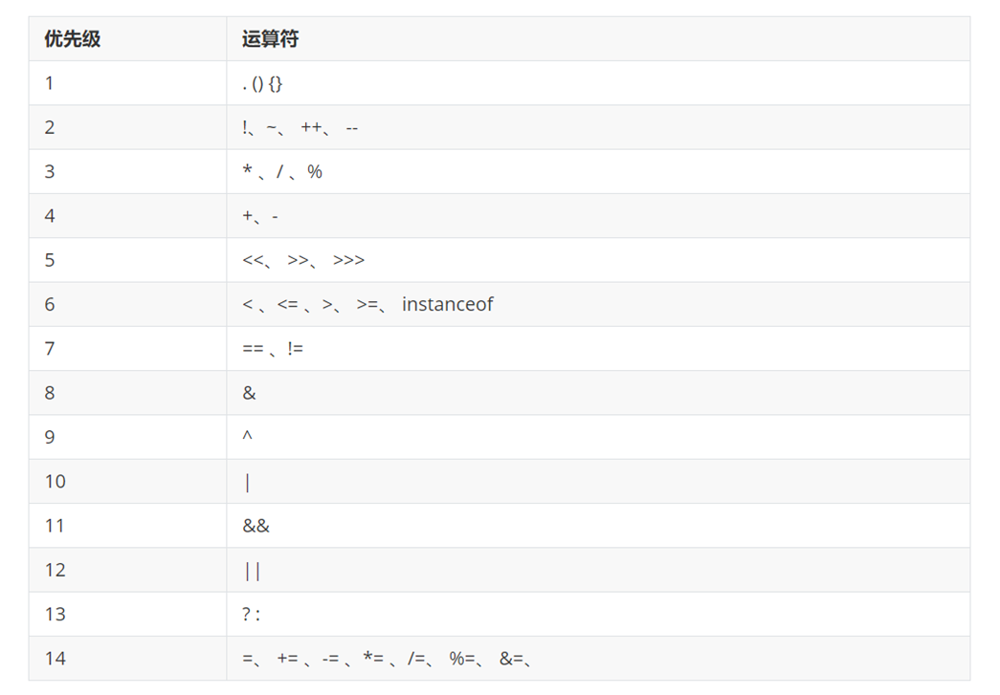

### 方法

#### 方法的调用流程

- 方法没有被调用的时候，在方法区中的字节码文件中存放
- 方法被调用的时候，需要进入到栈内存中运行

方法区：字节码文件加载时进入的内存

栈内存：方法运行时入栈，方法运行结束出栈

#### 方法的参数

形参：方法定义时声明的参数

实参：方法调用时传入的参数

#### 方法重载

- 在同一个类中，定义了多个**同名的方法**，但每个方法具有**不同的参数类型**或**参数个数**，这些同名的方法，就构成了重载关系 (Overload)
- 简单记：同一个类中，方法名相同，参数不同的方法
	- 参数不同：个数不同、类型不同、顺序不同

**<font color='red'>注意：识别方法之间是否是重载关系，只看方法名和参数，跟返回值无关。</font>**

## 流程控制语句

流程控制语句分为3类

- 顺序结构：程序默认
- 分支结构：if、switch
- 循环结构：for、while、do...while

### 分支结构控制

#### 分支结构if

- if 语句中，如果大括号控制的是一条语句，大括号可以省略不写
- if 语句的 ( ) 和 { } 之间不要写分号
- if 语句的 ( ) 中需要产生 boolean 类型的结果，根据结果决定程序的走向

#### 分支结构switch

**分支结构switch语句**

1、switch分支的格式、执行流程是怎么样的?

```java
switch (表达式) {
    case 常量1:
        // 分支语句1
        break; // 可选，跳出 switch
    case 常量2:
        // 分支语句2
        break;
    ...
    default:
        // 默认分支语句
        break;
}
```

各部分说明：

- **switch (表达式)**：表达式的值必须是 **整型、枚举、字符串**（Java 7 开始支持 String），或能转为 `int` 的类型（byte、short、char）。
- **case 常量**：与表达式的值进行匹配。常量必须是 **编译时常量**，不能重复。
- **break**：用于终止 `switch`，跳出整个分支结构。如果没有 `break`，会出现**“case 穿透”**（继续执行下一个 case）。
- **default**：可选，当所有 case 都不匹配时执行。通常放在最后，但不强制。

2、if、switch的比较，各自适合什么业务场景?

- if 适合做条件是区间判断的情况
- switch 适合做：条件是比较值的情况、代码优雅、性能较好

**switch语句注意事项**

①表达式类型只能是byte、short、int、char 不支持 double、float、long

JDK5开始支持枚举

JDK7开始支持String

②case 给出的值不允许重复，且只能是字面量，不能是变量

③正常使用 switch 的时候，不要忘记写 break，否则会出现穿透现象

### 循环控制与应用

#### for循环

**for循环语句注意事项**

- 循环 { } 中定义的变量，在每一轮循环结束后，都会从内存中释放
- 循环 ( ) 中定义的变量，在整个循环结束后，都会从内存中释放
- 循环语句 ( ) 和 { } 之间不要写分号

**循环嵌套**

循环嵌套：在循环中继续编写循环语句

执行流程：外循环执行一次，内循环执行一圈

思路：如果一个循环任务还要继续执行多次，使用外循环包裹

#### while循环

**while和for有什么区别？什么时候用for，什么时候用while？**

- 功能上是完全一样的，for能解决的while也能解决，反之亦然
- 使用规范：知道循环次数，使用for；不知道循环次数建议使用while

#### do...while循环

for和while是先判断后执行，do...while是先执行后判断

明确循环次数推荐使用 for，不明确循环次数推荐使用 while

for 循环结束后，控制循环的变量不可以继续使用，while则相反

#### break和continue

break结束循环，结束switch语句

continue跳过某次循环，继续下一次

如果出现循环嵌套，默认操作内层循环，如需改动，可以使用标号控制

```java
lo:
for (int i = 0; i < 10; i++) {
    for (int j = 0; j < 10; j++) {
        if (i == 5) {
            break lo;
        }
        System.out.println(i + " " + j);
    }
}
```

<font color='red'>注意事项</font>

break : 只能在循环, 和 switch 当中进行使用

continue : 只能在循环中进行使用

## 数组

### 数组基础

#### 数组定义

**数组的定义格式**

`数据类型[] 数组名;`

**数组的静态初始化格式**

**完整格式**

`数据类型[] 数组名 = new 数据类型[]{元素1,元素2,元素3,.....};`

**简化格式**

`数据类型[] 数组名 = {元素1,元素2,元素3,.....};`

**细节：**打印数组名，看到的不是数组内容，而是数组的十六进制内存地址

例如`[I@10f87f48`

`@`：分隔符

`[`：当前的空间是数组类型

`I`：数组中元素的类型

`10f87f48`：十六进制地址值(0 1 2 3 4 5 6 7 8 9 a b c d e f)

#### 数组的动态初始化

**动态初始化：**

格式：`数据类型[] 数组名 = new 数据类型[长度];`

特点：手动指定长度，系统自动分配默认初始化值

场景：不明确要操作元素的时候

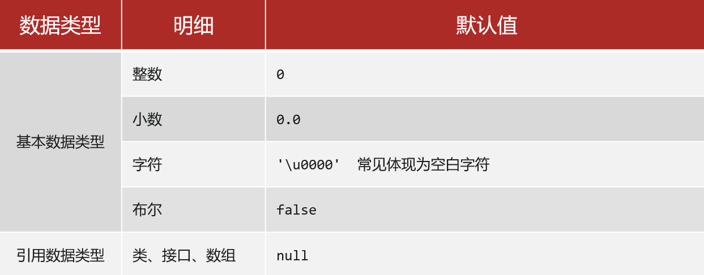

**静态初始化：**

格式：`数据类型[] 数组名 = {元素1, 元素2, 元素3...};`

特点：手动指定元素，系统计算出数组长度

场景：明确具体要操作的元素

### 数组应用

#### 数组的内存图

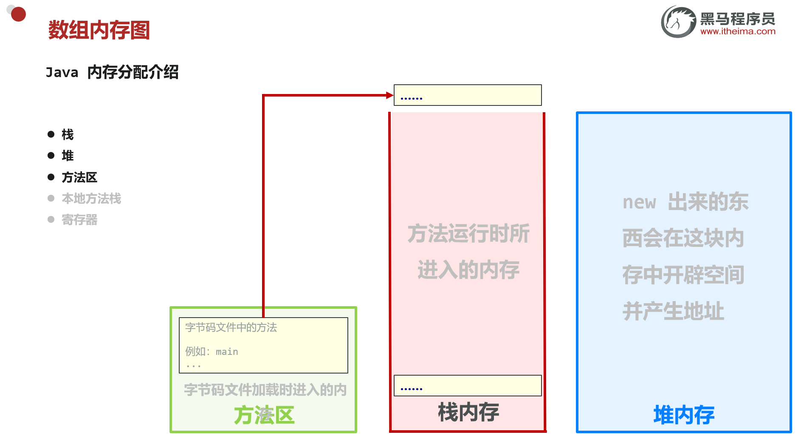

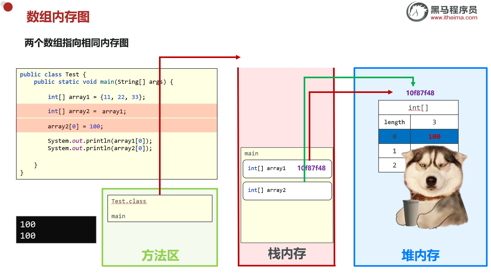

#### 方法参数传递

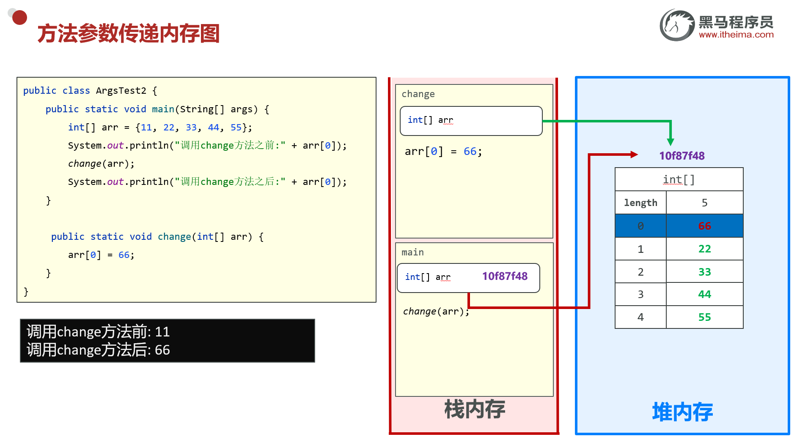

**面试题**

方法形参如果是基本数据类型，则方法内数据的改变不会对方法外产生影响

方法形参如果是引用数据类型，则将值赋给形参的时候传递的是地址，方法内和方法外指向的是同一块堆内存地址，所以方法内如果对形参数据进行了修改，方法外的数据也会被修改

#### 数组常见问题

**索引越界异常(ArrayIndexOutOfBoundsException)**

当访问了数组中不存在的索引，就会引发索引越界异常

**空指针异常(NullPointerException)**

当引用数据类型变量被赋值为 null 之后，地址的指向被切断，还继续访问堆内存数据，就会引发空指针异常

## 面向对象基础

### 面向对象基础1

#### 类和对象内存图

**单个对象内存图**

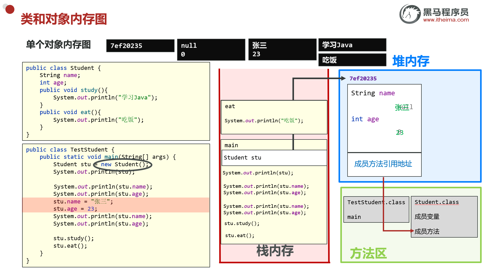

**两个对象内存图**

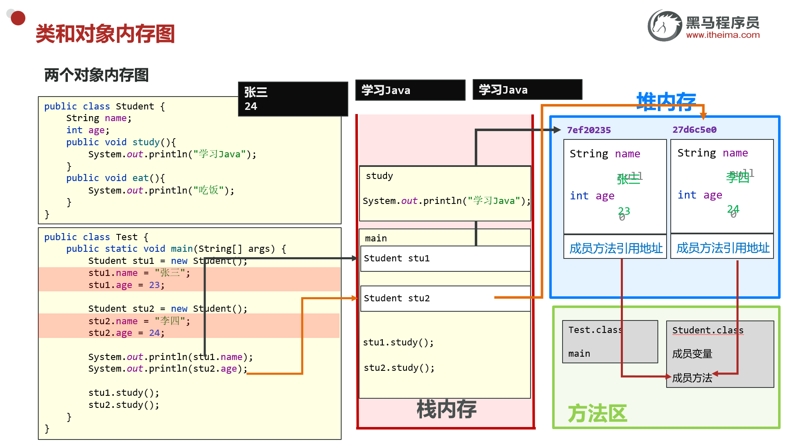

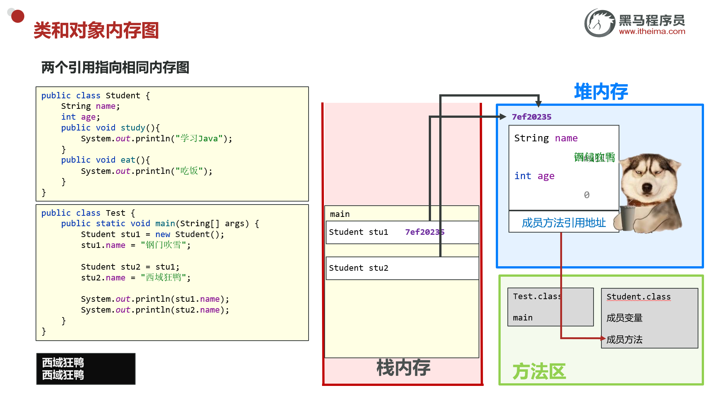

流程：方法区 -> 栈内存 -> 堆内存

<font color='red'>注意点</font>

- 在一次程序的执行过程中，某一个类就算创建了多个对象，该类的字节码也只有一份
- 每new一个对象都会在堆内存分配一块新的内存空间，各个对象的数据相互独立，互不打扰
- 对象之间的数据相互独立，但是共用一个方法，因为类的字节码只有一份

#### 成员变量和局部变量

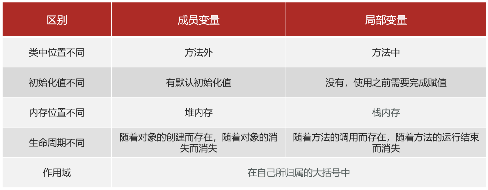

#### this关键字

**this关键字内存图**

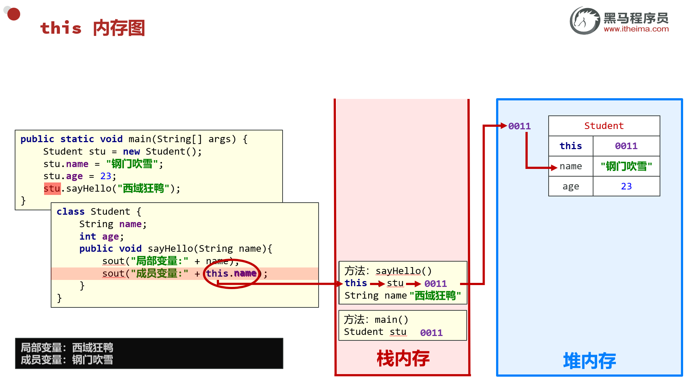

**当局部变量和成员变量重名的时候，Java使用的是？**

<font color='red'>就近原则</font>

**this关键字的作用是？**

<font color='red'>调用本类成员</font>

`this.本类成员变量;`

- <font color='red'>如果不涉及变量重复，this.可以省略</font>

`this.本类成员方法();`

- <font color='red'>没有前提条件，this.可以直接省略</font>

**this代表什么？**

<font color='red'>代表当前类对象的引用(地址)</font>

### 面向对象基础2

#### 构造方法

**构造方法的作用：**

1.创建对象

2.给成员变量初始化

**构造方法的格式：**

1.方法名与类名相同，大小写也要一致

2.没有返回值类型，连 void 都没有

3.没有具体的返回值

**构造方法的注意事项：**

1.如果一个类中没写构造方法，系统会提供一个默认的无参构造方法

2.如果手动编写了构造方法，系统将不会提供默认的那个无参构造

**建议：**无参构造，带参构造全部手动给出

**构造方法执行流程：**

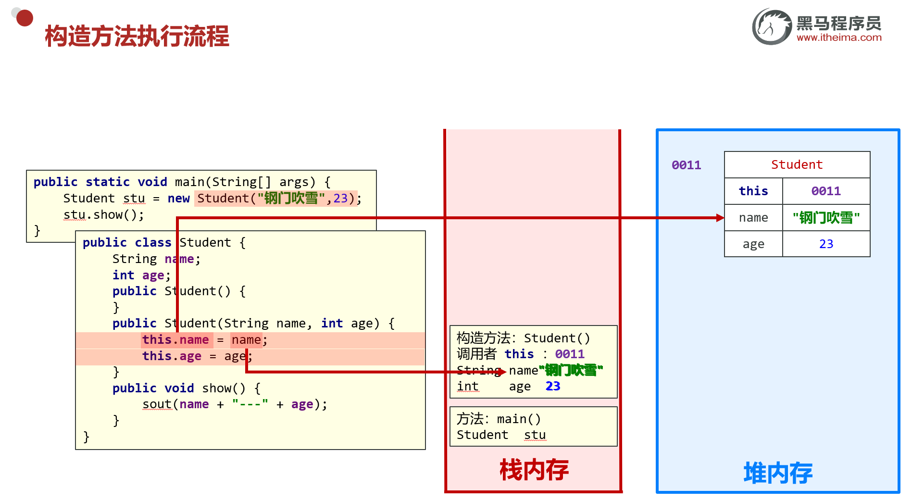

#### 封装

封装：一种思想

- 封装就是将<font color='red'>数据（属性）</font>和<font color='red'>操作数据的方法</font>捆绑在一起
- 组成一个整体，也就是类
- 通过权限修饰符来控制对类中属性和方法的访问权限，从而实现信息隐藏
- 使用封装设计类的时候，要做到合理隐藏，合理暴露

权限修饰符：

private、（default）、protected、public

#### JavaBean

JavaBean 是 Java 语言中一种特殊的类，它遵循特定的编码约定，主要用于封装多个对象作为一个单独的对象（即"Bean"）。JavaBean 是一种可重用的软件组件，可以在各种 Java 程序中使用。

**标准JavaBean**

- 这个类中的成员变量都要私有，并且要对外提供相应的get，set方法
- 类中提供无参，带参构造方法

#### static关键字

**static修饰成员的特点**

- 被其修饰的成员，被该类的所有对象所共享
- 多了一种调用方式，可以通过类名调用
- 随着类的加载而加载，优先于对象存在

**static内存图**

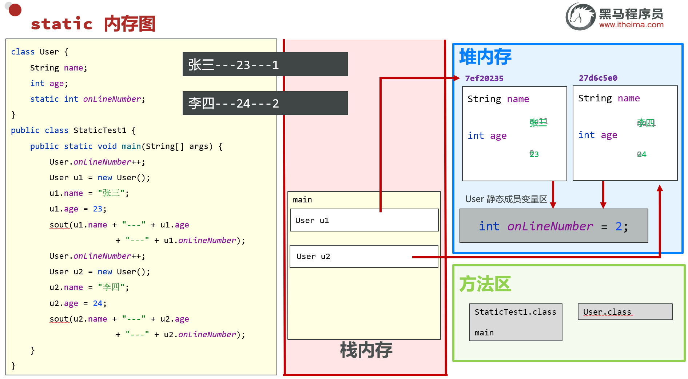

**static使用场景**

1. 成员变量：需要共享的数据
2. 成员方法：工具类的方法大多数是static的

**注意事项：**静态方法中只能访问静态成员（直接访问），静态中没有this关键字

#### main方法

```java
public class HelloWorld {
    public static void main(String[] args) {
        System.out.println("hello world");
    }
}
```

public：被JVM调用，访问权限足够大

static：被JVM调用，不用创建对象

因为main方法是静态的，所以测试类中其他方法也需要是静态的

void：被JVM调用，不需要给JVM返回值

main：一个通用的名称，虽然不是关键字，但是被JVM识别

String[] args：以前用于接收键盘录入数据的，现在没用

## 面向对象高级

### 继承

#### 继承概念

**继承是什么?**

继承是面向对象三大特征之一，可以让类与类之间产生关系，父与子的关系，

子类可以直接使用父类中非私有的成员

**实现继承的关键字是什么 ?**

extends

**继承的好处是什么？**

提高代码的复用性，维护性

**什么时候使用继承 ?** 

发现多个类中存在共性内容，并且存在 is...a 的关系

**当子父类中出现了重名的成员变量，会根据什么原则进行选择？**

就近原则

**重名情况下，使用什么关键字可以调用到父类的成员呢？**

super

#### 重写

**Override（重写）：**

在子类中重新定义父类中已存在的方法

**使用场景：**

子类需要父类的方法，但是觉得父类的方法不好

想要修改或者是增强，就可以重写父类方法

**格式要求：**

子类重写父类方法的时候，方法声明需要和父类完全一致

**重写父类方法的时候需要注意：**

1. 子类不可重写父类中私有的方法
2. 子类重写父类方法的时候，权限修饰符要大于等于父类

#### Java中继承的特点

Java中的继承只允许单继承，不允许多继承，允许多层继承

#### 继承中的构造方法执行流程

**内存图**

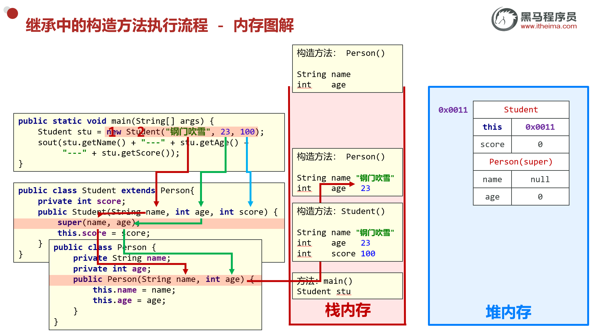

**子类是否可以继承到父类的构造方法？**

不可以，子类需要手动编写构造方法

**在子类所有的构造方法中，都默认隐藏了一句什么代码？**

super();

#### this和super关键字

**this**：代表本类对象的引用

**super**：代表父类存储空间的标识

| **关键字** | **访问成员变量**    | **访问成员方法**      | **访问构造方法**                 |
| ---------- | ------------------- | --------------------- | -------------------------------- |
| this       | this.本类成员变量;  | this.本类成员方法();  | this(); this(…);  本类构造方法   |
| super      | super.父类成员变量; | super.父类成员方法(); | super(); super(…);  父类构造方法 |

this调用本类成员、super调用父类成员 

this()，super()二者都在争夺构造方法的第一行位置，所以二者不能共存

### final关键字&抽象类

#### Object类

**Object类介绍**

所有的类，都直接或者间接的继承了 Object 类 （祖宗类）

Object类的方法是一切子类都可以直接使用的，所以我们要学习Object类的方法

**toString方法**

| 方法名                   | 说明                                                         |
| ------------------------ | ------------------------------------------------------------ |
| public String toString() | 默认是返回当前对象在堆内存中的地址信息:类的全类名@十六进制哈希值 |

开发中直接输出对象，默认输出对象的地址其实是毫无意义的

开发中输出对象变量，更多的时候是希望看到对象的内容数据而不是对象的地址信息

#### final关键字

**final可以修饰什么？**

方法，类，变量

**修饰的内容有什么特点？**

方法：不能重写

类：不能继承

变量：不能更改

**final 修饰基本类型变量和引用类型变量有什么不同？**

基本类型：数据值不可改变

引用类型：地址值不可改变

**final 修饰成员变量的话，赋值时机是？**

定义时，或者在构造方法中完成赋值

#### 抽象类

**什么是抽象类 ?**

一种特殊的父类

**特殊点在哪里呢 ?**

内部可以编写抽象方法

**什么样的方法该定义为抽象方法 ?**

共性方法抽取到父类之后, 无法给出具体明确的方法

**定义抽象类和抽象方法使用的关键字是 ?**

abstract

**抽象类是否可以实例化？**

不可以，避免调用内部的抽象方法

**抽象类不允许创建对象，内部是否可以编写构造方法？**

可以，子类可以通过super()访问

**抽象类中可以写普通的方法吗？**

可以，子类可以直接继承到使用

**抽象类的子类需要做什么？**

要么重写所有抽象方法，要么将子类变成抽象类

**abstract 关键字与哪些关键字冲突？**

private final static

#### 模板设计模式

- 设计模式是软件开发中针对反复出现问题总结归纳出的通用解决方案
- 模板设计模式：把抽象类整体就可以看做成一个模板，模板中不能决定的东西定义成抽象方法让使用模板的类（继承抽象类的类）去重写抽象方法实现需求 
- 模板设计模式的优势：模板已经定义了通用结构，使用者只需要关心自己需要实现的功能即可

### 接口&多态

#### 接口概念

接口的思想是声明规则

定义接口使用 interface 关键字

类实现接口使用 implements 关键字

接口的实现类要么重写所有抽象方法，要么是抽象类

#### 接口中的成员特点

**成员变量**

只能是常量
默认修饰符：**public static final**

**构造方法**

没有

**成员方法**

只能是抽象方法

默认修饰符：**public abstract**

<font color='red'>关于接口中的方法，JDK8和JDK9中有一些新特性</font>

#### 类和接口之间的关系

**类和类的关系**

继承关系，只能单继承，但是可以多层继承

**类和接口的关系**

实现关系，可以单实现，也可以多实现，还可以在继承一个类的同时实现多个接口

**接口和接口的关系**

继承关系，可以单继承，也可以多继承

#### 抽象类和接口的区别

**成员变量:**

抽象类 : 可以定义变量, 也可以定义常量

接口 : 只能定义常量

**成员方法：**

抽象类 : 可以是定义具体方法, 也可以定义抽象方法

接口 : 只能定义抽象方法

**构造方法：**

抽象类 : 有

接口 : 没有

**总结：**

抽象类对事物做抽象 (描述事物)

接口对行为抽象 (制定规则)

#### JDK8和JDK9的接口新特性

JDK8的新特性：接口中可以定义有方法体的方法（默认、静态）

JDK9的新特性：接口中可以定义私有方法

#### 多态的前提和成员访问特点

**多态的三个前提条件是？**

- 继承 | 实现关系
- 方法重写
- 父类引用指向子类对象

**多态创建对象后，成员访问特点是？**

- 成员变量：编译看父类，运行看父类
- 成员方法：编译看父类，运行看子类
- 静态成员：编译看父类，运行看父类

#### 多态的好处和概念

多态的好处 ：提高了程序的扩展性

对象多态 ：将方法的形参定义为父类类型, 这个方法可以接收该父类的任意子类对象 

行为多态 ：同一个行为, 具有多个不同表现形式或形态的能力

#### 多态的弊端

多态的弊端 ：不能使用子类的特有成员

#### 多态的转型问题

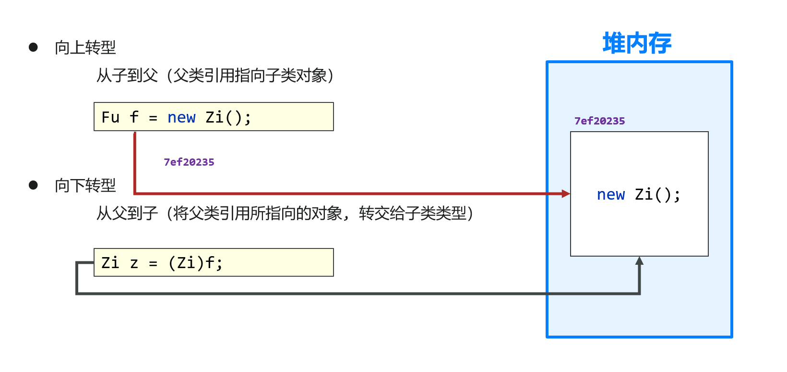

概述：如果被转的引用类型变量，对应的实际类型和目标类型不是同一种类型，那么在转换的时候就会出现ClassCastException 

**关键字instanceof**

使用格式：

对象名 instanceof 类型

判断一个对象是否是一个类的实例

通俗的理解：判断关键字左边的对象，是否是右边的类型，返回boolean类型结果

### 源码分析（equals方法&代码块）

#### equals方法

| 方法名                          | 说明                 |
| ------------------------------- | -------------------- |
| public boolean equals(Object o) | 比较两个对象是否相同 |

**==号和equals方法的区别**

<font color='cornflowerblue'>**== 号可以比较基本数据类型，也可以比较引用数据类型**</font>

基本类型：比较数据值

引用类型：比较地址值

<font color='cornflowerblue'>**equals方法用于比较引用数据类型**</font>

此方法来自于Object类，默认比较对象地址值

如果不希望比较地址值，可重写该方法，自定义比较规则 

**IDEA生成的equals方法**

```java
@Override
public boolean equals(Object o) {
    // this：stu1
    // o：stu2
    if (this == o) return true;

    // 代码如果可以执行到这里，说明stu1肯定不是null值
    // stu1不是null，stu2为null，直接返回false
    // 比较两个对象的字节码，如果字节码不相同，代表类型不一致，返回false
    if (o == null || getClass() != o.getClass()) return false;

    // 向下转型，调用子类特有的属性
    Student student = (Student) o;

    // 比较两个对象的属性值
    return age == student.age && Objects.equals(name, student.name);
}
```

**Objects工具类的equals方法**

```java
public static boolean equals(Object a, Object b) {
    return a == b || a != null && a.equals(b);
}
```

Objects 中的 equals 方法仅仅是个工具类中的方法

底层依赖于我们自己编写的equals方法

优势：加入了健壮性判断

#### 代码块

在Java类下，使用 { } 括起来的代码被称为代码块

**局部代码块（了解）**

位置：方法中定义

作用：限定变量的生命周期，提早释放，提高内存利用率

**构造代码块（了解）**

位置：类中方法外定义

特点：构造方法执行时（创建对象的时候），都会执行该代码块中的代码，并且在构造方法执行前执行

作用：将多个构造方法中相同的代码，抽取到构造代码块中，提高代码的复用性

**静态代码块**

位置：类中方法外定义

特点：需要通过static关键字修饰，随着类的加载而加载，并且只执行一次（因为类的字节码文件只加载一次）

作用：在类加载的时候做一些数据初始化的操作

### 内部类

#### package 包

包本质来说就是文件夹, 用来管理类文件的

建包的语法格式：package 公司域名倒写.技术名称。包名建议全部英文小写，且具备意义

建包语句必须在第一行，一般IDEA工具会帮助创建

**导包**

相同包下的类可以直接访问，不同包下的类必须导包,才可以使用！导包格式：**import包名.类名;**

如果导入的类在 **java.lang包(核心包)** , 就不需要编写 import 导包代码

假如一个类中需要用到不同类，而这个两个类的名称是一样的，那么默认只能导入一个类，另一个类要带包名访问

#### 内部类的介绍和使用

内部类指定义在一个类中的类

```java
class Outer {
    // 内部类   
    class Inner {
    }
}
```

**创建对象格式：**

外部类名.内部类名 对象名 = new 外部类对象().new 内部类对象();

```java
Outer.Inner in = new Outer().new Inner();
```

**访问特点：**

内访外：直接访问

外访内：创建对象访问

**优势：**

封装性更好（但是使用起来较为麻烦，建议少用）

#### 静态内部类和局部内部类

**内部类的分类**

成员内部类、静态内部类、局部内部类、匿名内部类 

**静态内部类**

有 static 修饰的成员内部类

```java
class Outer {
    // 内部类   
    static class Inner {
    }
}
```

<font color='cornflowerblue'>创建对象格式：</font>

外部类名.内部类名 对象名 = new 外部类名.内部类对象();

```java
Outer.Inner in = new Outer.Inner();
```

**局部内部类（了解）**

局部内部类放在方法、代码块、构造器等执行体中

#### 方法形参是接口类型

**调用方法时，方法的形参是接口，该传入什么？**

需要传入接口的实现类对象

**分为下面三步**

1. 编写实现类，实现接口
2. 重写方法
3. 创建实现类对象，将对象作为参数传入

#### 匿名内部类

概述：匿名内部类本质上是一个特殊的局部内部类（定义在方法内部）

前提：需要存在一个接口或类

格式

```java
new 类名 / 接口 () {
    
}
```

<font color='red'>匿名内部类可以使代码更加简洁，定义一个类的同时对其进行实例化</font>

### Lambda表达式

#### Lambda表达式

Lambda表达式是jdk8版本开始出现的新语法，可以简化匿名内部类的写法

**格式：** () -> {}

```java
(匿名内部类被重写方法的形参列表) -> {   
    被重写方法的方法体代码。
}
注：-> 是语法形式，无实际含义
```

**<font color='red'>注意：Lambda表达式只能简化函数式接口的匿名内部类的写法形式</font>**

**前提：**Lambda只能操作函数式接口

<font color='cornflowerblue'>**什么是函数式接口？**</font>

首先必须是接口、其次接口中有且仅有一个抽象方法的形式

通常我们会在接口上加上一个@FunctionalInterface注解，标记该接口必须是满足函数式接口。

**细节：**Lambda表达式不会产生单独的.class文件

#### Lambda表达式省略规则

1、参数类型可以省略不写。

2、如果只有一个参数，参数类型可以省略，同时 () 也可以省略。

3、如果Lambda表达式的方法体代码只有一行代码

- 可以省略大括号不写,同时要省略分号
- 此时，如果这行代码是return语句，必须省略return不写
- 同时也必须省略 ";" 不写

#### Lambda表达式和匿名内部类的区别

**使用限制不同**

匿名内部类 : 可以操作类、接口

Lambda表达式 : 只能操作函数式接口

**实现原理不同**

匿名内部类：编译之后，产生一个单独的.class字节码文件

Lambda表达式：编译之后，没有一个单独的.class字节码文件

## 常用API

### API介绍和字符串处理

#### API介绍

**API** (**A**pplication **P**rogramming **I**nterface) ：应用程序编程接口

就是别人写好的一些类，给咱们程序员直接拿去调用即可解决问题的

#### String类的特点

- Java程序中所有双引号字符串，都是String类的对象
- 字符串在创建之后，其内容不可更改
	- 想要更改，需要使用新的对象进行替换
- 字符串虽然不可改变但是可以被共享
	- 字符串常量池：当使用双引号创建字符串对象的时候，会检查该数据在常量池中是否存在
		- 不存在：创建新的
		- 存在：不会创建新的对象，复用已有的

#### String类常见的构造方法

| 构造方法                       | 说明                             |
| ------------------------------ | -------------------------------- |
| public String()                | 创建空白字符串，不含任何内容     |
| public String(String original) | 根据传入的字符串，创建字符串对象 |
| public String(char[] chs)      | 根据字符数组，创建字符串对象     |

#### String类的面试题

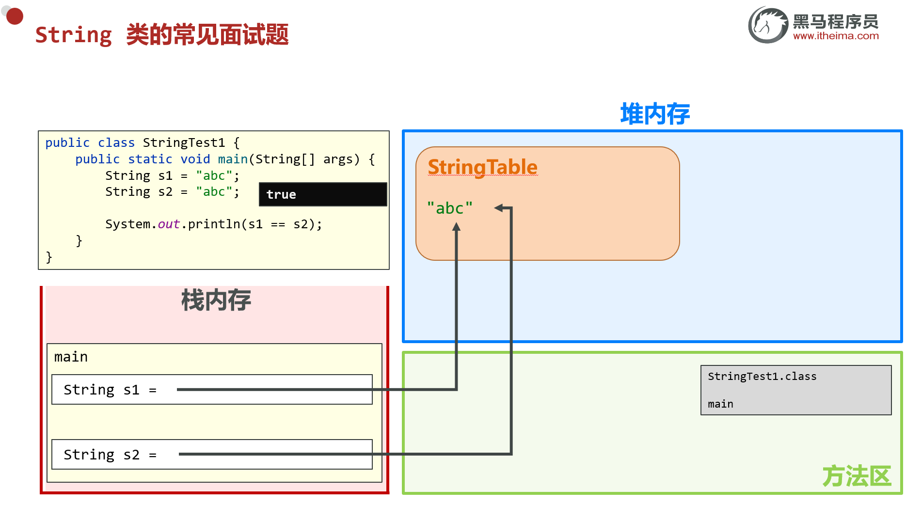

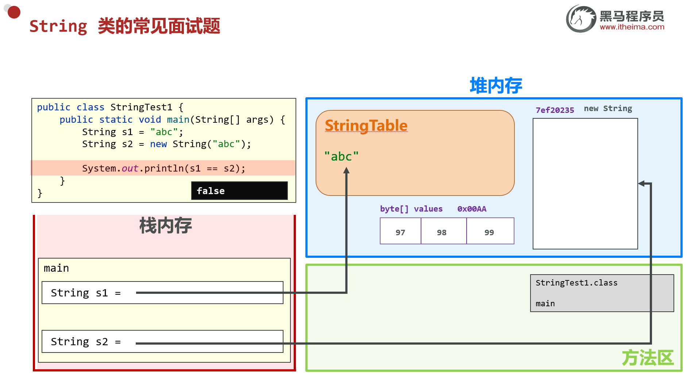

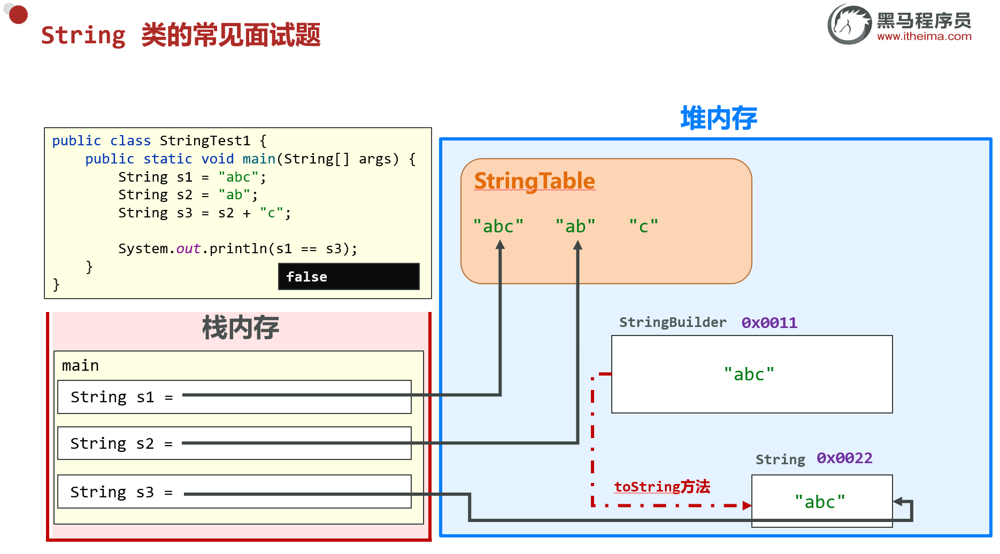

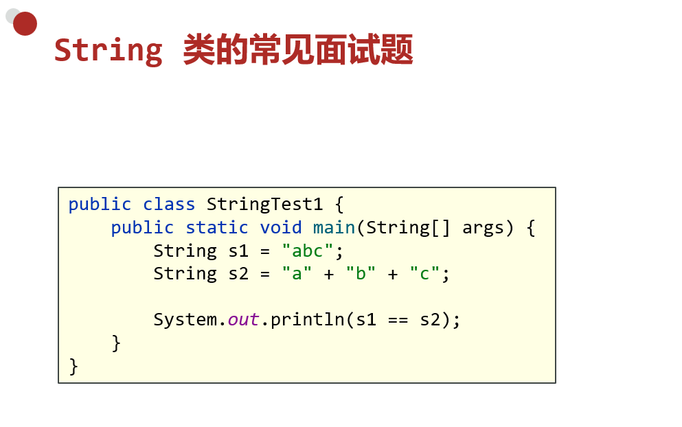

这道题结果是true，原因是java中存在字面量优化机制，会在编译的时候，计算常量表达式的结果（常量折叠）

也就是说编译出来的字节码文件中，`String s2 = "abc";`

#### String类用于比较的方法

| 方法                                            | 作用                              |
| ----------------------------------------------- | --------------------------------- |
| public boolean equals(要比较的字符串)           | 完全一样结果才是true，否则为false |
| public boolean equalsIgnoreCase(要比较的字符串) | 忽略大小写的比较                  |

####  String类和遍历有关的方法

| 方法                          | 作用                   |
| ----------------------------- | ---------------------- |
| public char[] toCharArray()   | 将字符串转换为字符数组 |
| public char chatAt(int index) | 根据索引找字符         |
| public int length()           | 返回字符串的长度       |

#### String类用于截取的方法

`public String substring(int beginIndex, int endIndex)`   截取

<font color='red'>注意点：</font>包头不包尾，包左不包右

返回值才是截取的小串

`public String substring(int beginIndex)`   截取到末尾

#### String类用于替换和切割的方法

`public String replace(旧值,新值)`   替换

<font color='red'>注意点：</font>返回值才是替换之后的结果

`public String[] split(String regex)` ：

根据传入的字符串作为规则进行切割

将切割后的内容存入字符串数组中，并将字符串数组返回

<font color='cornflowerblue'>可以理解成把一个字符串分割成多个字符串，传入的参数就是告诉方法要以谁为分割符</font>

### StringBuilder和StringBuffer

#### StringBuilder特点

StringBuilder是字符串的缓冲区, 我们可以将其理解为是一种容器

StringBuilder是一种可变的字符序列

#### StringBuilder构造方法和成员方法

**StringBuilder构造方法**

| 构造方法                         | 说明                                           |
| -------------------------------- | ---------------------------------------------- |
| public StringBuilder()           | 创建一个空的字符串缓冲区(容器)                 |
| public StringBuilder(String str) | 创建一个字符串缓冲区, 并初始化好指定的参数内容 |

**StringBuilder常用的方法**

| 方法名                                 | 说明                                                |
| -------------------------------------- | --------------------------------------------------- |
| public StringBuilder append (任意类型) | 添加数据，并返回对象本身                            |
| public StringBuilder reverse()         | 反转容器中的内容                                    |
| public int  length()                   | 返回长度 ( 字符出现的个数)                          |
| public String toString()               | 通过toString()就可以实现把StringBuilder转换为String |

<font color='cornflowerblue'>**链式编程：如果方法的返回值是对象，就可以继续向下调用方法**</font>

#### StringBuilder原理

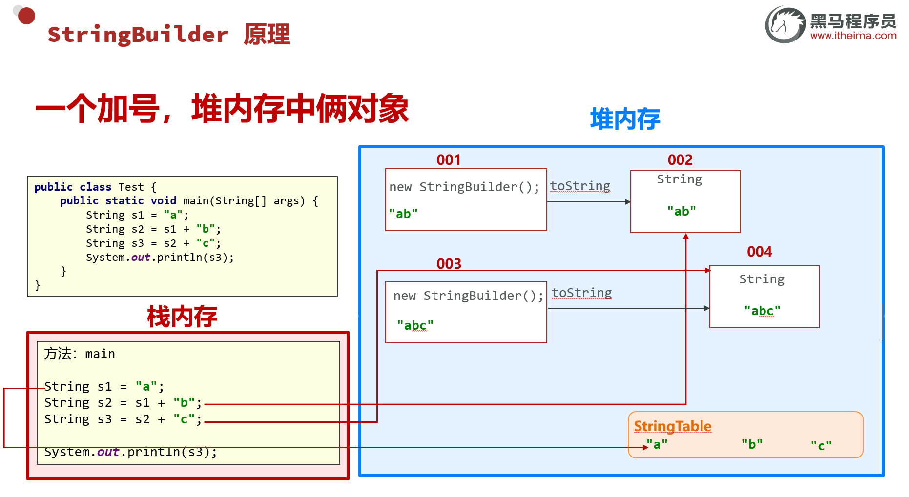

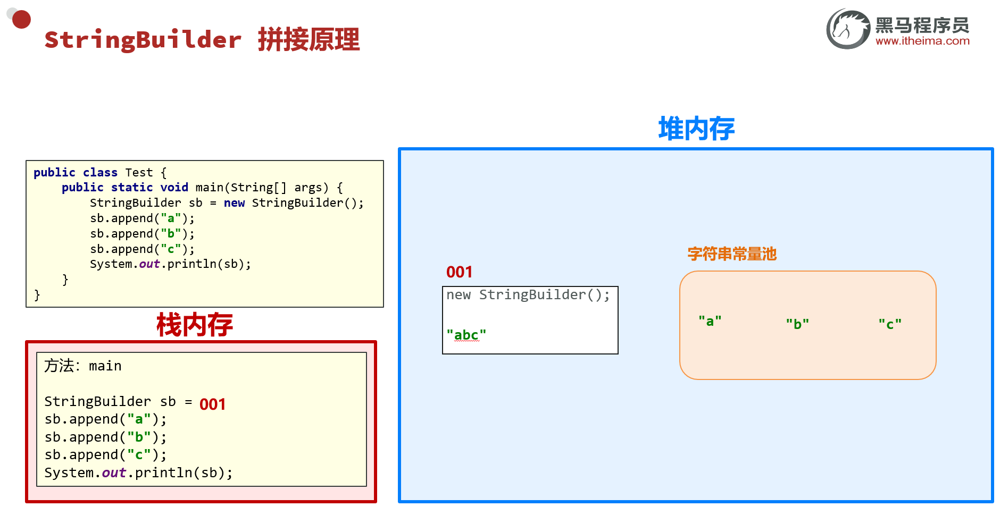

**结论：**

StringBuilder可以大幅度提升字符串操作效率

今后若频繁进行字符拼接操作，建议使用StringBuilder

#### StringBuilder和StringBuffer的区别

这两个类的方法都是一样的区别在于线程安全问题

| 特性         | **StringBuilder**  | **StringBuffer**             |
| :----------- | :----------------- | :--------------------------- |
| **线程安全** | ❌ 非线程安全       | ✅ 线程安全                   |
| **性能**     | ✅ 更快             | ❌ 稍慢（因为同步开销）       |
| **同步**     | ❌ 不同步           | ✅ 方法使用 synchronized 同步 |
| **引入版本** | Java 5             | Java 1.0                     |
| **使用场景** | 单线程环境         | 多线程环境                   |
| **推荐程度** | ✅ 大多数情况下推荐 | ❌ 除非需要线程安全           |

**关键区别：**

- `StringBuilder`：更快，非线程安全
- `StringBuffer`：稍慢，线程安全（方法使用 `synchronized`）

在现代Java开发中，由于大多数字符串操作都是在单线程环境下进行的，`StringBuilder` 成为了更常用的选择。只有在明确的跨线程共享场景中才需要考虑使用 `StringBuffer`

### 集合基础

#### ArrayList长度可变原理

1. 当创建 ArrayList 集合容器的时候, 底层会存在一个长度为10个大小的空数组
2. 如果存满了，则会创建一个扩容原数组 1.5 倍大小的新数组
3. 将原数组数据，拷贝到新数组中
4. 将新元素添加到新数组

#### 集合和数组的使用选择

数组: 存储的元素个数固定不变

集合: 存储的元素个数经常发生改变

#### 创建集合

- 集合在创建的时候如果不加泛型 <> 添加数据的时候可以是任意类型
- 建议创建的时候加入泛型，保证数据的严谨和规范
- JDK7版本开始，右侧 <> 中可以省略类型
- 集合的泛型不能是基本数据类型，所以要用对应的包装类代替

#### 集合常用的成员方法

**ArrayList集合常用成员方法**

| 方法名                               | 说明                                   |
| ------------------------------------ | -------------------------------------- |
| public boolean add(E e)              | 将指定的元素添加到此集合的末尾         |
| public void add(int index,E element) | 在此集合中的指定位置插入指定的元素     |
| public E get(int index)              | 返回指定索引处的元素                   |
| public int size()                    | 返回集合中的元素的个数                 |
| public E remove(int index)           | 删除指定索引处的元素，返回被删除的元素 |
| public boolean remove(Object o)      | 删除指定的元素，返回删除是否成功       |
| public E set(int index,E element)    | 修改指定索引处的元素，返回被修改的元素 |

#### 集合存储对象内存图

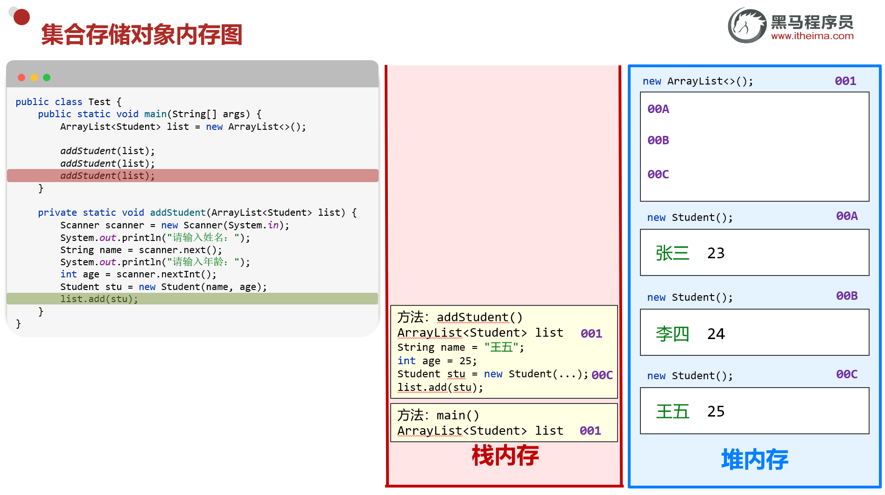
