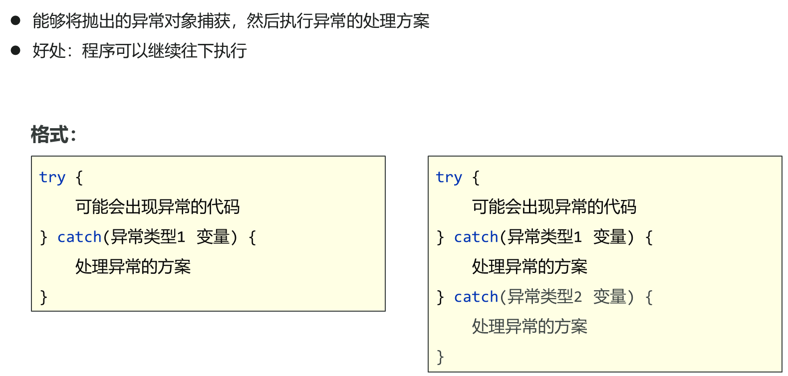
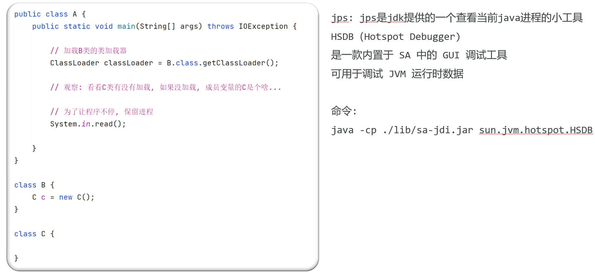
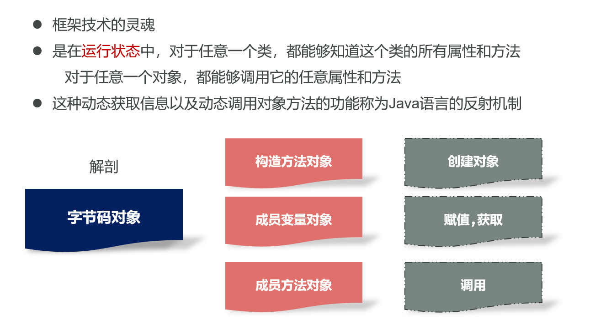

## 集合高级

### Collection集合

#### Collection接口常用的成员方法


Collection 是所有单列集合的父接口，内部的方法，所有单列集合都可以使用

remove() contains() 底层依赖对象的equals方法

#### 迭代器

迭代器遍历


hashNext() : 判断集合中是否还有元素

next() : 取出集合元素, 并将指针向后移动

注意 : 在循环过程中 next 方法最好只调用一次

#### 增强for和forEach方法

**增强for**

简化迭代器的代码书写

它是JDK5之后出现的，其内部原理就是一个Iterator迭代器


**forEach方法**

| **方法名**                                                   | **说明** |
| ------------------------------------------------------------ | -------- |
| default void forEach(Consumer<?  super [T](mk:@MSITStore:E:\DevelopTools\API\jdk-11中文api修订版.CHM::/java.base/java/lang/Iterable.html)> action) | 遍历集合 |

<font color='cornflowerblue'>迭代器</font>

<font color='cornflowerblue'>增强 for 循环</font>

<font color='cornflowerblue'>forEach 方法</font>

<font color='cornflowerblue'>所有的单列集合都可以用以上三种方式遍历</font>

#### 方法引用

方法引用是 JDK8 开始出现，主要的作用，是对 Lambda 表达式进行进一步的简化

方法引用使用一对冒号 ::

通过方法的名字来指向一个方法

可以使语言的构造更紧凑简洁，减少冗余代码


<font color='cornflowerblue'>可推导可省略原则，省略参数</font>

### List集合

#### List集合的特点和遍历方式

**List 集合的特点**

存取有序：存入元素和取出元素的顺序一致

有索引：提供了跟索引有关的 api

可以存储重复的

**遍历方式：5种**

通用遍历方式3种

普通for循环配合索引遍历，ListIterator 列表迭代器

#### 并发修改异常

使用迭代器遍历集合的过程中，调用了集合对象的添加，删除方法，就会出现此异常

<font color='cornflowerblue'>解决方案: 不允许使用集合的添加或删除方法, 就使用迭代器自身的添加或删除</font>

迭代过程中做删除 : 使用 Iterator 自带的 remove 方法

迭代过程中做添加 : 使用 ListIterator 自带的 add 方法

#### 数据结构-栈、队列、数组、链表

栈：后进先出，先进后出

队列：先进先出，后进后出

数组：内存连续区域，查询快，增删慢

链表：元素是游离的，查询慢，首尾操作极快

#### ArrayList源码

<font color='cornflowerblue'>ArrayList 底层是基于数组实现的，查询元素快，增删相对慢</font>

①使用空参构造器创建的集合，在底层创建一个默认长度为0的数组

②添加第一个元素时，底层会创建一个新的长度为10的数组

③存满时，会扩容1.5倍

#### LinkedList集合的特有方法

<font color='cornflowerblue'>LinkedList 底层基于双链表实现的，查询元素慢，增删首尾元素是非常快的</font>


### 泛型

泛型是JDK5引入的, 可以在编译阶段约束操作的数据类型, 并进行检查

泛型的好处：统一数据类型，将运行期的错误提升到了编译期

#### 泛型类、泛型方法

**泛型类** 

创建对象的时候确定具体类型


**泛型方法**

非静态: 泛型是根据类的泛型去匹配的


静态: 需要声明出自己独立的泛型


#### 泛型接口、泛型通配符

**泛型接口 :** 

类实现接口的时候，如果接口带有泛型，有两种操作方式：

类实现接口的时候，直接确定类型

保持接口的泛型，等创建对象的时候再确定


**泛型限定 :** 

? (任意类型)

? extends E (只能接收 E 或者是 E 的子类)

? super E (只能接收 E 或者是 E 的父类)

### Set集合

**<font color='cornflowerblue'>Set 集合特点:</font>** 存取顺序不一致，没有跟索引有关的方法，不能存储重复的元素

**<font color='cornflowerblue'>遍历方式：</font>**三种通用遍历方式

**<font color='cornflowerblue'>TreeSet特点：</font>**元素排序

**<font color='cornflowerblue'>HashSet特点：</font>**元素唯一

**<font color='cornflowerblue'>LinkedHashSet特点：</font>** 元素唯一，保证存取顺序

#### TreeSet集合底层的数据结构

TreeSet 底层是红黑树结构

红黑树是一种自平衡的二叉树，增删改查性能都很好

**<font color='cornflowerblue'>基本特点：</font>**

1.任意节点开始，左边的节点都比当前节点小，右边的节点都比当前节点大

2.每一次添加节点，都从根节点开始比大小，小的左边走，大的右边走，一样的不存

#### TreeSet集合排序方式-自然排序

1、让类实现 Comparable 接口

2、重写 compareTo 方法

3、根据方法的返回值来指定排序规则

- this.xxx – o.xxx 正序

- o.xxx – this.xxx 降序

4、取出元素的过程（左，中，右）


#### TreeSet集合排序方式-比较器排序

可通过比较器排序来覆盖自然排序的规则

**操作流程：**

1、在 TreeSet 集合的构造方法中，传入比较器对象

- （Comparator接口的实现类对象）

2、重写 compare 方法

3、根据方法的返回值组织排序规则（负数 : 左边走，正数 : 右边走，0 : 不存）

- 参数1.xxx – 参数2.xxx 正序
- 参数2.xxx – 参数1.xxx 倒序

**重点:** 如果同具备自然排序, 和比较器排序, 会优先按照比较器进行排序操作

**使用场景：**

Java已经写好类, 大多数都具有自然排序的规则, 这些规则放在源代码中, 我们无法修改

(String, Integer, Double...)

String : 默认是字典顺序排序

Integer : 默认是升序排序

Double : 默认是升序排序

如果我们要实现的需求, 排序规则, 跟已经具备的自然排序, 不一样.

这时候就要使用比较器排序.

#### HashSet集合-保证元素唯一的两个方法

**HashSet介绍**

HashSet 集合底层采取**哈希表**存储数据，确保元素的唯一性

哈希表是一种对于增删改查数据性能都较好的结构

HashSet想要保证元素唯一，需要同时重写对象中的 hashCode 方法和 equals 方法

**hashCode方法和equals方法的配合流程**

当添加对象的时候, 会先调用对象的hashCode方法计算出一个应该存入的索引位置, 查看该位置上是否存在元素

不存在：直接存

存在：调用equals方法比较内容

false : 存

true : 不存

#### hashCode方法

**哈希值**

就是一个int类型的**随机值，Java中每个对象都有一个哈希值**。

**hashCode方法改造**


根据对象内容生成hash值, 不同的对象, hash值也有可能会相等(哈希碰撞)。

重写 hashCode 方法 

根据对象的属性值计算出的哈希值

#### HashSet集合的底层原理

**HashSet是基于哈希表实现的**

JDK8之前的，哈希表：底层使用数组+链表组成

JDK8开始后，哈希表：底层采用数组+链表+红黑树组成

- <font color='red'>JDK8开始，当链表长度超过8，且数组长度>=64时，自动将链表转成红黑树</font>

**哈希表存储数据的详细流程**

① 创建一个默认长度16，默认加载因子为0.75的数组，数组名table

② 根据元素的哈希值和数组的长度计算出应存入的位置

③ 判断当前位置是否为null

- 如果是null直接存入

- 如果位置不为null，表示有元素，则调用equals方法比较

	- 如果一样，则不存

	- 如果不一样，则存入数组
		- JDK 8之前，新元素存入数组，占老元素位置，老元素挂下面（头插法）
		- JDK 8开始之后，新元素直接挂在老元素下面（尾插法）

④ 当数组存满到16\*0.75=12（元素数量，不是链表数量）时，就自动扩容，每次扩容成原先的两倍

#### LinkedHashSet集合和单列集合总结

**LinkedHashSet底层原理**

依然是基于哈希表(数组、链表、红黑树)实现的

但是，它的每个元素都额外的多了一个双链表的机制记录它前后元素的位置

**单列集合总结**


#### 可变参数、Collections工具类

**可变参数**

- 可变参数用在形参中可以接收多个数据
- 可变参数的格式: 数据类型...参数名称
- 传输参数非常灵活, 方便, 可以不传输参数, 可以传输一个或者多个, 也可以传输一个数组
- **<font color='red'>可变参数在方法内部本质就是一个数组</font>**

**<font color='red'>注意事项：</font>**

1、可变参数, 在方法中只能有一个

2、如果方法中除了可变参数, 还有其它的参数, 需要将可变参数放在最后

**Collections集合工具类**

- java.utils.Collections:是集合工具类
- <font color='red'>作用：Collections并不属于集合，是用来操作集合的工具类。</font>


### Map集合

**Map集合是什么？什么时候可以考虑使用Map集合？**

Map集合是键值对集合

- Map 集合是一种双列集合，每个元素包含两个数据

- Map 集合的每个元素的格式：key = value(键值对元素)

	- key (键) : 不允许重复

	- value (值) : 允许重复

	- 键和值是一一对应的，每个键只能找到自己对应的值

- key + value 这个整体 我们称之为“键值对”或者“键值对对象” 在Java中使用Entry对象表示

需要存储一一对应的数据时，就可以考虑使用Map集合来做

**Map集合的实现类有哪些？各自的特点是？**

HashMap: 元素按照键是无序，不重复，无索引，值不做要求。

LinkedHashMap: 元素按照键是有序，不重复，无索引，值不做要求。

TreeMap：元素按照键是排序，不重复，无索引的，值不做要求。

#### Map集合常用的API

Map是双列集合的顶层接口，它的功能是全部双列集合都可以使用的

| 方法名称                            | 说明                                 |
| ----------------------------------- | ------------------------------------ |
| V put(K key,V value)                | 添加元素                             |
| V remove(Object  key)               | 根据键删除键值对元素                 |
| void clear()                        | 移除所有的键值对元素                 |
| boolean containsKey(Object key)     | 判断集合是否包含指定的键             |
| boolean containsValue(Object value) | 判断集合是否包含指定的值             |
| boolean isEmpty()                   | 判断集合是否为空                     |
| int size()                          | 集合的长度，也就是集合中键值对的个数 |

#### Map集合的三种遍历方式

**1、通过键找值**

1. 调用 keySet 方法获取所有的键 (得到的是Set集合)
2. 遍历 Set 集合, 获取每一个键
3. 遍历的过程中调用 get 方法, 根据键找值

```java
/*
    Map集合的第一种遍历方式: 键找值

    public V get(Object key) : 根据键查找对应的值
    public Set<K> keySet() : 获取 Map 集合中所有的键
 */
public static void main(String[] args) {
    Map<String, String> map = new HashMap<>();
    map.put("张三", "北京");
    map.put("李四", "上海");
    map.put("王五", "成都");

    // 1. 获取Map集合中, 所有的键
    Set<String> keySet = map.keySet();
    // 2. 遍历set集合, 获取每一个键
    for (String key : keySet) {
        // 3. 通过map集合的get方法, 根据键查找对应的值
        String value = map.get(key);
        System.out.println(key + "---" + value);
    }
}
```

**2、通过键值对对象获取键和值**

1. 调用 entrySet 方法获取所有的键值对对象(得到的是Set集合)
2. 遍历 Set 集合, 获取每一个键值对对象
3. 通过键值对对象的 getKey() getValue() 获取键和值

| 方法名称                       | 说明                       |
| ------------------------------ | -------------------------- |
| Set<Map.Entry<K,V>> entrySet() | 获取集合中所有的键值对对象 |

```java
/*
    Map集合的第二种遍历方式: 键值对对象, 获取键和值.

    public Set<Map.Entry<K,V>> entrySet() : 获取集合中所有的键值对对象
 */
public static void main(String[] args) {
    Map<String, String> map = new LinkedHashMap<>();
    map.put("张三", "北京");
    map.put("李四", "北京");
    map.put("王五", "北京");

    // 1. 调用entrySet方法, 获取所有的键值对对象.
    Set<Map.Entry<String, String>> entrySet = map.entrySet();
    // 2. 遍历Set集合, 获取每一个键值对对象
    for (Map.Entry<String, String> entry : entrySet) {
        // 3. 通过键值对对象, 获取键和值
        String key = entry.getKey();
        String value = entry.getValue();
        System.out.println(key + "---" + value);
    }
}
```

**3、通过forEach方法遍历**

| 方法名称                                                     | 说明                    |
| ------------------------------------------------------------ | ----------------------- |
| default void forEach  (BiConsumer<? super K,? super V> action) | 遍历Map集合, 获取键和值 |

```java
/*
    Map集合的第三种遍历方式: foreach方法

    public default void forEach (BiConsumer<? super K,? super V> action)
                                                    遍历Map集合, 获取键和值
 */
public static void main(String[] args) {
    Map<String, String> map = new TreeMap<>();
    map.put("张三", "北京");
    map.put("李四", "北京");
    map.put("王五", "北京");

    map.forEach((key, value) -> System.out.println(key + "---" + value));
    map.forEach((k, v) -> System.out.println(k + "---" + v));
}
```

#### Map集合的实现类

双列集合的数据结构，都只针对于键有效，和值没有关系，单列集合底层依赖于双列集合

TreeMap : 键（红黑树）

HashMap : 键（哈希表）

LinkedHashMap : 键（哈希表 + 双向链表）

底层数据结构和单列集合一样，所以实现流程也是一样的

### Stream流

Stream流配合Lambda表达式，可以简化集合和数组操作

**Stream流的思想（流水线思想）**

1、将数据放到流中（获取流对象）

2、中间方法

3、终结方法

#### Stream流对象获取方式


\* Map集合获取Stream流对象, 需要间接获取 - map.entrySet().stream()

**示例代码：**

```java
import java.util.*;
import java.util.function.Consumer;
import java.util.stream.IntStream;
import java.util.stream.Stream;

public class StreamDemo1 {
    /*
        获取Stream流对象演示
            - 将数据放在流水线的传送带上

            1. 集合获取 Stream 流对象 (使用Collection接口中的默认方法)
                    default Stream<E> stream()

                    * Map集合获取Stream流对象, 需要间接获取
                            - map.entrySet().stream()

            2. 数组获取 Stream 流对象 (使用Arrays数组工具类中的静态方法)
                    static <T> Stream<T> stream (T[] array)

            3. 零散的数据获取 Stream 流对象 (使用 Stream 类中的静态方法)
                    static <T> Stream<T> of(T... values)
     */
    public static void main(String[] args) {

        int[] arr = {11, 22, 33};
        String[] names = {"张三", "李四", "王五"};

        Arrays.stream(arr).forEach(System.out::println);
        Arrays.stream(names).forEach(System.out::println);

        Stream<Integer> s1 = Stream.of(1, 2, 3, 4, 5);
        Stream<String> s2 = Stream.of("张三", "李四", "王五");

    }

    private static void method() {
        List<String> list = new ArrayList<>();
        list.add("张三丰");
        list.add("张无忌");
        list.add("张翠山");
        list.add("王二麻子");
        list.add("张良");
        list.add("谢广坤");

        list.stream().forEach(System.out::println);
        System.out.println("---------------------------");

        Set<String> set = new HashSet<>();
        set.add("张三丰");
        set.add("张无忌");
        set.add("张翠山");
        set.add("王二麻子");
        set.add("张良");
        set.add("谢广坤");

        set.stream().forEach(System.out::println);
        System.out.println("---------------------------");

        Map<String, Integer> map = new HashMap<>();
        map.put("张三丰", 100);
        map.put("张无忌", 35);
        map.put("张翠山", 55);
        map.put("王二麻子", 22);
        map.put("张良", 30);
        map.put("谢广坤", 55);

        Stream<String> s1 = map.keySet().stream();
        s1.forEach(System.out::println);

        Stream<Integer> s2 = map.values().stream();
        s2.forEach(System.out::println);

        System.out.println("---------------------------");

        // 获取map集合中, 所有键值对的对象
        // Set<Map.Entry<String, Integer>> entrySet = map.entrySet();
        // Stream<Map.Entry<String, Integer>> s3 = entrySet.stream();
        // s3.forEach(System.out::println);
        map.entrySet().stream().forEach(System.out::println);
    }
}
```

####  Stream流的中间操作方法

| 名称                                                   | 说明                                              |
| ------------------------------------------------------ | ------------------------------------------------- |
| Stream<T>  filter(Predicate<? super T> predicate)      | 用于对流中的数据进行**过滤**                      |
| Stream<T>  limit(long maxSize)                         | 获取前几个元素                                    |
| Stream<T>  skip(long n)                                | 跳过前几个元素                                    |
| Stream<T>  distinct()                                  | 去除流中重复的元素依赖   (hashCode 和 equals方法) |
| static  <T> Stream<T> concat(Stream a, Stream b)       | **合并**a和b两个流为一个流                        |
| Stream<R>  map(Function<? super T,? extends R> mapper) | 对流中的每一个元素进行转换                        |

- 中间方法调用完成后返回新的 Stream 流可以继续使用，支持链式编程
- <font color='red'>注意事项：</font>如果流对象已经被消费过，就不允许再次使用了

**示例代码：**

```java
import java.util.ArrayList;
import java.util.function.Function;
import java.util.function.Predicate;
import java.util.stream.Stream;

public class StreamDemo2 {
    /*
        Stream流的中间操作方法
            - 操作后返回Stream对象, 可以继续操作

            Stream<T> filter(Predicate<? super T> predicate) 用于对流中的数据进行过滤
            Stream<T> limit(long maxSize) 获取前几个元素
            Stream<T> skip(long n) 跳过前几个元素
            Stream<T> distinct() 去除流中重复的元素依赖 (hashCode 和 equals方法)
            static <T> Stream<T> concat(Stream a, Stream b) 合并a和b两个流为一个流
            Stream<R> map(Function<? super T,? extends R> mapper) 对流中的每一个元素进行转换

            注意事项: 流对象已经被消费过(使用过), 就不允许再次消费了.
     */
    public static void main(String[] args) {
        Stream<Integer> s1 = Stream.of(1, 2, 3, 4, 5);
        s1.map(i -> i + "").forEach(System.out::println);

        Stream<Integer> s2 = Stream.of(1, 2, 3, 4, 5);
        s2.map(j -> j + 10).forEach(System.out::println);
    }

    private static void method() {
        ArrayList<String> list = new ArrayList<>();
        list.add("林青霞");
        list.add("张曼玉");
        list.add("王祖贤");
        list.add("柳岩");
        list.add("张敏");
        list.add("张无忌");

        // 需求: 将集合中以 【张】 开头的数据，过滤出来并打印在控制台
        list.stream()
            .filter(a -> a.startsWith("张"))
            .filter(s -> s.length() == 3)
            .forEach(System.out::println);
        System.out.println("--------------------------");

        // 需求1: 取前3个数据在控制台输出
        list.stream().limit(3).forEach(System.out::println);
        System.out.println("--------------------------");
        
        // 需求2: 跳过3个元素, 把剩下的元素在控制台输出
        list.stream().skip(3).forEach(System.out::println);
        System.out.println("--------------------------");
        
        // 需求3: 跳过2个元素, 把剩下的元素中前2个在控制台输出
        list.stream().skip(2).limit(2).forEach(System.out::println);
        System.out.println("--------------------------");
        
        // 需求4: 取前4个数据组成一个流
        Stream<String> s1 = list.stream().limit(4);
        
        // 需求5: 跳过2个数据组成一个流
        Stream<String> s2 = list.stream().skip(2);
        
        // 需求6: 合并需求4和需求5得到的流, 并把结果在控制台输出
        Stream<String> s3 = Stream.concat(s1, s2);
        // s3.forEach(System.out::println);
        
        // 需求7: 合并需求4和需求5得到的流, 并把结果在控制台输出，要求字符串元素不能重复
        System.out.println("--------------------------");
        s3.distinct().forEach(System.out::println);
    }
}
```

#### Stream流的终结方法和收集操作

**终结方法**

| 名称                            | 说明                         |
| ------------------------------- | ---------------------------- |
| void  forEach(Consumer  action) | 对此流的每个元素执行遍历操作 |
| long count()                    | 返回此流中的元素数           |

**<font color='cornflowerblue'>示例代码：</font>**

```java
import java.util.ArrayList;
import java.util.Collections;
import java.util.stream.Stream;

public class StreamDemo3 {
    /*
        Stream流的终结操作方法
            - 流水线中的最后一道工序

            public void forEach (Consumer action) 对此流的每个元素执行遍历操作
            public long count () 返回此流中的元素数
     */
    public static void main(String[] args) {
        System.out.println(Stream.of(1, 2, 3).count());

        // 细节: 流中的操作, 不会修改数据源
        ArrayList<Integer> list = new ArrayList<>();
        Collections.addAll(list, 1, 2, 3, 4, 5, 6, 7, 8, 9, 10);

        list.stream().filter(s -> s % 2 == 0).forEach(System.out::println);

        System.out.println(list);
    }
}
```

**收集操作**

**作用：**把 Stream 流操作后的结果数据转回到集合

**原因：**Stream 流操作，不会修改数据源

| 名称                           | 说明                         |
| ------------------------------ | ---------------------------- |
| R collect(Collector collector) | 开始收集Stream流，指定收集器 |

**<font color='cornflowerblue'>Collectors 工具类提供了具体的收集方式</font>**

| 名称                                                         | 说明                   |
| ------------------------------------------------------------ | ---------------------- |
| public static <T>  Collector toList()                        | 把元素收集到List集合中 |
| public static <T>  Collector toSet()                         | 把元素收集到Set集合中  |
| public static Collector toMap(Function  keyMapper , Function valueMapper) | 把元素收集到Map集合中  |

**<font color='cornflowerblue'>示例代码：</font>**

**<font color='orange'>收集到单列集合：</font>**

```java
import java.util.ArrayList;
import java.util.Collections;
import java.util.List;
import java.util.Set;
import java.util.stream.Collectors;

public class StreamDemo4 {
    /*
        Stream流的收集操作

            public R collect (Collector c) : 将流中的数据收集到集合

                Collectors
                    public static <T> Collector toList()
                    public static <T> Collector toSet()
                    public static  Collector toMap(Function keyMapper , Function valueMapper)
     */
    public static void main(String[] args) {
        ArrayList<Integer> list = new ArrayList<>();
        Collections.addAll(list, 1, 2, 3, 4, 5, 6, 7, 8, 9, 10, 10, 10);

        List<Integer> result1 = list.stream().filter(s -> s % 2 == 0).collect(Collectors.toList());
        System.out.println(result1);

        Set<Integer> result2 = list.stream().filter(s -> s % 2 == 0).collect(Collectors.toSet());
        System.out.println(result2);

        // List<Integer> result3 = list.stream().filter(s -> s % 2 == 0).toList();
    }
}
```

**<font color='orange'>收集到双列集合：</font>**

```java
import java.util.ArrayList;
import java.util.Map;
import java.util.function.Function;
import java.util.stream.Collectors;

public class StreamDemo5 {
    /*
        创建一个 ArrayList 集合，并添加以下字符串
        "张三,23"
        "李四,24"
        "王五,25"
        将数据收集到Map集合中，姓名为键，年龄为值
     */
    public static void main(String[] args) {
        ArrayList<String> list = new ArrayList<>();
        list.add("张三,23");
        list.add("李四,24");
        list.add("王五,25");

        Map<String, String> map = list.stream()
            .collect(Collectors.toMap(new Function<String, String>() {
            @Override
            public String apply(String s) {
                return s.split(",")[0];
            }
        }, new Function<String, String>() {
            @Override
            public String apply(String s) {
                return s.split(",")[1];
            }
        }));

        System.out.println(map);
    }
}
```

## 异常

### 异常

**异常是什么？**

异常是代码在编译或者执行的过程中可能出现的错误

**异常的体系结构 ?**

**<font color='cornflowerblue'>Throwable</font>** 

- Error : 严重级别问题, 通常跟系统有关
	- 常见的 : 栈内存溢出 (StackOverflowError) 堆内存溢出 (OutOfMemoryError)

- Exception : 异常类, 程序常见的错误

**<font color='cornflowerblue'>Exception的分类 ?</font>**

编译时异常、运行时异常。

- 编译时异常：没有继承 RuntimeExcpetion 的异常，编译阶段就会出错
- 运行时异常：继承自 RuntimeException的 异常或其子类（编译阶段不报错，运行可能报错）

#### Java程序异常默认处理流程

**示例代码：**

```java
public class ExceptionDemo1 {
    /*
        异常默认的处理方式: 向上抛出
     */
    public static void main(String[] args) {
        System.out.println("main方法开始执行...");
        method();                   // ③ main方法接收到异常对象, 继续向上抛出 new ArithmeticException();
                                    // ④ JVM虚拟机接收到异常对象, 将异常的错误信息打印在控制台, 将程序停止.
        System.out.println("main方法执行结束...");
    }

    private static void method() {
        System.out.println("method方法开始...");
        int i = 1 / 0;              // ① 会在出现异常的位置, 创建一个异常对象  new ArithmeticException();
                                    // ② 将异常对象向上抛出, 抛给main方法
        System.out.println("method方法结束...");
    }
}
```

①  虚拟机会在出现异常的代码那里自动的创建一个异常对象：ArithmeticException

②  异常会从方法中出现的点这里抛出给调用者，调用者最终抛出给JVM虚拟机

③  虚拟机接收到异常对象后，先在控制台直接输出异常信息数据

④  终止 Java 程序的运行

#### 异常处理方式

**异常的两种处理方式是？**

**<font color='cornflowerblue'>try…catch 捕获异常 ：</font>**出现问题，程序可以继续执行



<font color='red'>注意：如果使用多个catch, 最大的异常需要放在最后</font>

**<font color='cornflowerblue'>Throwable的常见方法</font>**

| **方法名**                    | **说明**               |
| ----------------------------- | ---------------------- |
| public String getMessage()    | 获取异常的错误原因     |
| public void printStackTrace() | 展示完整的异常错误信息 |

**<font color='cornflowerblue'>throws 抛出异常 ：</font>**出现问题，程序会在错误点停止，不会继续执行


<font color='red'>注意：子类重写父类方法时，不能抛出父类没有的异常, 或者比父类更大的异常</font>

**两种处理方式该怎么选？**

思路：看这个问题是否需要暴露出来

需要：抛出

不需要：try…catch

**throw 和 throws 的区别**

throw : 用在方法中, 后面跟的是异常对象, 其作用是抛出异常对象

throws : 用在方法名后面, 起到声明作用（声明此方法中存在异常, 如果出现问题, 做抛出处理）

**细节 :** 

抛出的异常对象如果是编译时异常, 必须使用 throws 声明

如果是运行时异常, 则不需要写 throws 

**示例代码：**

Student类的setAge()方法：

```java
/*
    throw : 用在方法中, 后面跟的是异常对象, 用于真正的抛出异常.
    throws : 用在方法声明上, 后面跟的是异常类名, 作用是声明, 声明方法中的异常做抛出处理.

    细节: 如果抛出的异常对象, 是运行时异常, 就不需要编写throws, 反之必须写.
 */
public void setAge(int age) throws Exception {
    if (age >= 0 && age <= 100) {
        this.age = age;
    } else {
        throw new Exception("年龄有误, 请检查是否是0~100之间的!");
    }
}
```

测试代码：

```java
import com.itheima.exception.StudentAgeException;
import com.itheima.pojo.Student;

import java.util.Scanner;

public class ExceptionTest {
    /*
        键盘录入学生的姓名和年龄, 封装为学生对象并打印.

        异常的两种处理方式:
        1. try...catch捕获异常
        2. 抛出异常

        使用思路: 看问题是否需要暴露
                    要: 抛出异常
                    不要: try...catch捕获.
     */
    public static void main(String[] args) {

        Scanner sc = new Scanner(System.in);

        Student stu = new Student();

        System.out.println("请输入学生姓名: ");
        String name = sc.next();
        stu.setName(name);

        while (true) {
            try {
                System.out.println("请输入学生年龄: ");
                int age = Integer.parseInt(sc.next());
                stu.setAge(age);
                break;
            } catch (NumberFormatException e) {
                System.out.println("您输入的年龄有误, 请检查!");
            } catch (Exception e) {
                System.out.println(e.getMessage());
            }
        }

        System.out.println(stu);
    }
}
```

#### 自定义异常

- Java无法为这个世界上全部的问题提供异常类
- 如果企业想通过异常的方式来管理自己的某个业务问题，就需要自定义异常类了

通过自定义异常可以精准表达特定错误

自定义编译时异常，继承 Exception，在构造方法中调用父类构造方法

自定义运行时异常，继承 RuntimeException，在构造方法中调用父类构造方法

**示例代码：**

StudentAgeException

```java
public class StudentAgeException extends RuntimeException {
    public StudentAgeException() {
    }

    public StudentAgeException(String message) {
        super(message);
    }
}
```

<font color='cornflowerblue'>对上面的代码进行修改：</font>

Student类的setAge()方法：

```java
/*
    throw : 用在方法中, 后面跟的是异常对象, 用于真正的抛出异常.
    throws : 用在方法声明上, 后面跟的是异常类名, 作用是声明, 声明方法中的异常做抛出处理.

    细节: 如果抛出的异常对象, 是运行时异常, 就不需要编写throws, 反之必须写.
 */
public void setAge(int age) {
    if (age >= 0 && age <= 100) {
        this.age = age;
    } else {
        throw new StudentAgeException("年龄有误, 请检查是否是0~100之间的!");
    }
}
```

测试代码（修改部分）：

```java
while (true) {
    try {
        System.out.println("请输入学生年龄: ");
        int age = Integer.parseInt(sc.next());
        stu.setAge(age);
        break;
    } catch (NumberFormatException e) {
        System.out.println("您输入的年龄有误, 请检查!");
    } catch (StudentAgeException e) {
        System.out.println(e.getMessage());
    }
}
```

## File类

### File类（常用API）

#### File类创建对象和路径的分类

**File类创建对象**

- File类代表操作系统的文件对象（文件、文件夹）
- File类的常用构造方法

| 方法名称                                 | 说明                                               |
| ---------------------------------------- | -------------------------------------------------- |
| public File(String pathname)             | 根据文件路径创建文件对象                           |
| public File(String parent, String child) | 根据父路径名字符串和子路径名字符串创建文件对象     |
| public File(File   parent, String child) | 根据父路径对应文件对象和子路径名字符串创建文件对象 |

- File 封装的对象仅仅是一个路径名，这个路径可以是存在的，也可以是不存在的

**<font color='cornflowerblue'>示例代码：</font>**

```java
import java.io.File;
import java.io.IOException;

public class FileDemo1 {
    /*
        File类的常用构造方法

            public File(String pathname)               根据文件路径创建文件对象
            public File(String parent, String child)   根据父路径名字符串和子路径名字符串创建文件对象
            public File(File  parent, String child)    根据父路径对应文件对象和子路径名字符串创建文件对象
     */
    public static void main(String[] args) throws IOException {
        File f1 = new File("E:\\A.txt");
        System.out.println(f1.exists());

        File f2 = new File("E:\\Develop");
        System.out.println(f2.exists());

        File f3 = new File("E:\\","Develop");
        System.out.println(f3.exists());

        File f4 = new File(new File("E:\\"),"Develop");
        System.out.println(f4.exists());

        File f5 = new File("E:\\B.txt");
        f5.createNewFile();
    }
}
```

**路径的分类**

- 绝对路径：从磁盘根目录开始，一直到某个具体的文件或文件夹
- 相对路径：相对于当前项目的所在目录

**<font color='cornflowerblue'>示例代码：</font>**

```java
import java.io.File;
import java.io.IOException;

public class FileDemo2 {
    /*
        绝对路径: 从盘符根目录开始，一直到某个具体的文件或文件夹
                        E:\\A.txt
                        E:\\Develop

        相对路径: 相对于当前项目
     */
    public static void main(String[] args) throws IOException {
        File f1 = new File("A.txt");
        // f1.createNewFile();

        File f2 = new File("");
        System.out.println(f2.getAbsoluteFile());

        File f3 = new File("stage2_day03\\A.txt");
        f3.createNewFile();
    }
}
```

#### File类常用的API

**File类的判断方法**

| 方法名称                     | 说明                               |
| ---------------------------- | ---------------------------------- |
| public boolean isDirectory() | 判断此路径名表示的File是否为文件夹 |
| public boolean isFile()      | 判断此路径名表示的File是否为文件   |
| public boolean exists()      | 判断此路径名表示的File是否存在     |

**<font color='cornflowerblue'>案例：</font>**

```java
import java.io.File;
import java.util.Scanner;

public class FileTest1 {
    /*
        需求: 键盘录入一个文件夹路径，如果输入错误就给出提示，并继续录入，直到正确为止

        分析:
            1. 输入的路径有可能不存在
            2. 输入的路径有可能是文件路径

            封装为File对象
                调用 exists() 判断是否存在
                调用 isFile() 判断是否是文件

     */
    public static void main(String[] args) {

        File dir = getDir();
        System.out.println(dir);

    }

    public static File getDir() {
        Scanner sc = new Scanner(System.in);
        while (true) {
            System.out.println("请输入一个文件夹路径: ");
            String dir = sc.next();

            File file = new File(dir);

            if (!file.exists()) {
                System.out.println("您输入的文件夹路径不存在, 请检查!");
            } else if (file.isFile()) {
                System.out.println("您输入的是一个文件路径, 请重新输入文件夹路径: ");
            } else {
                return file;
            }
        }
    }
}
```

**File类获取相关的方法**

| 方法名称                        | 说明                                 |
| ------------------------------- | ------------------------------------ |
| public long length()            | 返回文件的大小（字节数量）           |
| public String getAbsolutePath() | 返回文件的绝对路径                   |
| public String getPath()         | 返回定义文件时使用的路径             |
| public String getName()         | 返回文件的名称，带后缀               |
| public long lastModified()      | 返回文件的最后修改时间（时间毫秒值） |

**<font color='cornflowerblue'>示例代码：</font>**

```java
import java.io.File;
import java.util.Date;

public class FileDemo4 {
    /*
        File类常用方法:

        public long length()                返回文件的大小（字节数量）
                                                    注意: 如果是文件夹对象, 调用该方法, 返回的结果是错误的.
        public String getAbsolutePath()     返回文件的绝对路径
        public String getPath()             返回定义文件时使用的路径
        public String getName()             返回文件的名称，带后缀
        public long lastModified()          返回文件的最后修改时间（时间毫秒值）
     */
    public static void main(String[] args) {
        File f1 = new File("E:\\A.txt");
        System.out.println(f1.length());

        File f2 = new File("E:\\Develop");
        System.out.println(f2.length());

        File f3 = new File("stage2_day03\\A.txt");
        System.out.println(f3.getAbsolutePath());

        System.out.println(f2.getPath());
        System.out.println(f3.getPath());

        System.out.println(f3.getName());

        long time = f1.lastModified();
        System.out.println(time);

        Date d = new Date(time);
        System.out.println(d);
    }
}
```

**File类创建和删除的方法**

**<font color='cornflowerblue'>创建</font>**

| 方法名称                       | 说明                 |
| ------------------------------ | -------------------- |
| public boolean createNewFile() | 创建一个新的空的文件 |
| public boolean mkdir()         | 只能创建一级文件夹   |
| public boolean mkdirs()        | 可以创建多级文件夹   |

**<font color='cornflowerblue'>删除</font>**

| 方法名称                | 说明                                   |
| ----------------------- | -------------------------------------- |
| public boolean delete() | 删除由此抽象路径名表示的文件或空文件夹 |

**<font color='red'>注意：</font>**delete() 方法只能删除空文件夹，且不走回收站

**<font color='cornflowerblue'>示例代码：</font>**

```java
import java.io.File;
import java.io.IOException;

public class FileDemo5 {
    /*
        File类常用方法: 创建和删除

            public boolean createNewFile()      创建一个新的空的文件
            public boolean mkdir()              只能创建一级文件夹
            public boolean mkdirs()             可以创建多级文件夹
            public boolean delete()             删除由此抽象路径名表示的文件或空文件夹
     */
    public static void main(String[] args) throws IOException {
        File f1 = new File("stage2_day03\\B.txt");
        System.out.println(f1.createNewFile());

        File f2 = new File("stage2_day03\\aaa");
        System.out.println(f2.mkdirs());

        System.out.println(f1.delete());
        System.out.println(f2.delete());
    }
}
```

**File类遍历的方法**

| 方法名称                  | 说明                                                 |
| ------------------------- | ---------------------------------------------------- |
| public File[] listFiles() | 获取当前目录下所有的 “一级文件对象”   返回 File 数组 |

**<font color='cornflowerblue'>案例：</font>**

```java
import java.io.File;

public class FileTest2 {
    /*
        需求：键盘录入一个文件夹路径，找出这个文件夹下所有的 .java 文件

        public File[] listFiles()  获取当前目录下所有的  “一级文件对象”  返回 File 数组
     */
    public static void main(String[] args) {
        File dir = FileTest1.getDir();

        printJavaFile(dir);
    }

    private static void printJavaFile(File dir) {
        // 1. 获取当前文件夹下所有的文件和文件夹对象
        File[] files = dir.listFiles();
        // 2. 遍历数组, 获取每一个文件和文件夹对象
        for (File file : files) {
            // 3. 判断当前对象是否是文件, 并且是java文件
            if (file.isFile() && file.getName().endsWith(".java")) {
                // 4. 打印在控制台
                System.out.println(file);
            }
        }
    }
}
```

### File类（递归）

#### 递归概念、递归求阶乘

**递归概念**

**递归：**方法直接或间接调用本身

**<font color='red'>注意：</font>**递归如果没有控制好终止，会出现递归死循环，导致栈内存溢出现象

**递归求阶乘**

**<font color='cornflowerblue'>代码：</font>**

```java
public class RecursionDemo2 {
    /*
        需求: 使用递归求5的阶乘

        5的阶乘（5!）:  5 * 4 * 3 * 2 * 1

            5的阶乘（5!）:  5 * 4!
            4的阶乘（4!）:  4 * 3!
            3的阶乘（3!）:  3 * 2!
            2的阶乘（2!）:  2 * 1!
            1的阶乘（1!）:  1
     */
    public static void main(String[] args) {
        System.out.println(jc(5));
    }

    public static int jc(int num) {
        if (num == 1) {
            return 1;
        } else {
            // 思路: 需要调用一个方法, 获取4的阶乘
            // 5 * jc(4)
            // 4 * jc(3)
            // ...
            return num * jc(num - 1);
        }
    }
}
```

**<font color='cornflowerblue'>图解：</font>**


#### 递归练习-不死神兔


**代码：**

```java
public class RecursionTest {
    /*
        有一对兔子，从出生后第3个月起每个月都生一对兔子
        小兔子长到第三个月后每个月又生一对兔子，假如兔子都不死，问第二十个月的兔子对数为多少？

        规律: 从第三个月开始，兔子的对数是前两个月相加的和
     */
    public static void main(String[] args) {
        System.out.println(get(20));
    }

    public static int get(int month) {
        // 第一个, 第二个月兔子的对数为1
        if (month == 1 || month == 2) {
            return 1;
        } else {
            // 第三个月: 第一个月 + 第二个月  month 3
            // 第四个月: 第二个月 + 第三个月  month 4
            // ...
            return get(month - 2) + get(month - 1);
        }
    }
}
```

#### 递归练习-找出文件夹下所有的java文件

**代码：**

```java
import java.io.File;

public class FileTest3 {
    /*
        需求：键盘录入一个文件夹路径，找出这个文件夹下所有的 .java 文件 (考虑子文件夹)

     */
    public static void main(String[] args) {
        File dir = FileTest1.getDir();
        printJavaFile(dir);
    }

    private static void printJavaFile(File dir) {
        // 获取当前目录下, 所有文件和文件夹对象
        File[] files = dir.listFiles();
        // 遍历数组, 获取每一个文件和文件夹对象
        for (File file : files) {
            // 如果是文件, 并且是.java文件, 就打印在控制台
            if (file.isFile() && file.getName().endsWith(".java")) {
                System.out.println(file);
            } else if (file.isDirectory()) {
                // 说明是文件夹, 进入这个文件夹, 继续查找.java文件
                // 思路: 需要调用一个方法, 进入文件夹查找.java文件, 发现自己这个方法就是解决此问题, 递归调用.
                if (file.listFiles() != null) {
                    printJavaFile(file);
                }
            }
        }
    }
}
```

#### 递归练习-删除文件夹

**代码：**

```java
import java.io.File;

public class FileTest4 {
    /*
        需求 : 设计一个方法, 删除文件夹
        注意 : delete() 只能删除空文件夹
     */
    public static void main(String[] args) {
        File dir = new File("E:\\test");
        deleteDir(dir);
    }

    private static void deleteDir(File dir) {
        File[] files = dir.listFiles();
        for (File file : files) {
            if (file.isFile()) {
                file.delete();
            } else {
                if (file.listFiles() != null) {
                    deleteDir(file);
                }
            }
        }
        dir.delete();
    }
}
```

#### 递归练习-统计文件夹大小

**代码：**

```java
import java.io.File;

public class FileTest5 {
    /*
        需求: 键盘录入一个文件夹路径，统计文件夹的大小
     */
    public static void main(String[] args) {
        File dir = FileTest1.getDir();

        long length = getDirLength(dir);

        System.out.println("字节数量为:" + length);
    }

    private static long getDirLength(File dir) {
        long result = 0;
        File[] files = dir.listFiles();
        for (File file : files) {
            if (file.isFile()) {
                result += file.length();
            } else {
                if (file.listFiles() != null) {
                    result += getDirLength(file);
                }
            }
        }
        return result;
    }
}
```

## 常用API和IO流

### 常用API

#### Math类和System类

**Math类**

**<font color='cornflowerblue'>Math类：</font>**包含执行基本数字运算的方法

**<font color='cornflowerblue'>Math类的常用方法</font>**

| 方法名                                       | 说明                                  |
| -------------------------------------------- | ------------------------------------- |
| public static int abs(int a)                 | 获取参数绝对值                        |
| public static double ceil(double a)          | 向上取整                              |
| public static double floor(double a)         | 向下取整                              |
| public static int  round(float a)            | 四舍五入                              |
| public static int max(int a,int b)           | 获取两个int值中的较大值               |
| public static  double pow(double a,double b) | 返回a的b次幂的值                      |
| public static  double random()               | 返回值为double的随机值，范围[0.0,1.0) |

**<font color='cornflowerblue'>示例代码：</font>**

```java
public class MathDemo {
    /*
        Math类 : 包含执行基本数字运算的方法

        --------------------------------------------------------------------
        public static int abs (int a) : 获取参数绝对值
        public static double ceil (double a) : 向上取整
        public static double floor (double a) : 向下取整
        public static int round (float a) : 四舍五入
        public static int max (int a, int b) : 获取两个int值中的较大值
        public static double pow (double a,double b) : 返回a的b次幂的值
        public static double random () : 返回值为double的随机值，范围[0.0,1.0)
        --------------------------------------------------------------------
     */
    public static void main(String[] args) {
        // public static int abs (int a) : 获取参数绝对值
        System.out.println(Math.abs(10));
        System.out.println(Math.abs(-10));
        System.out.println("---------------------------------");
        // public static double ceil (double a) : 向上取整
        System.out.println(Math.ceil(12.3));
        System.out.println(Math.ceil(12.9));
        System.out.println(Math.ceil(12.0));
        System.out.println("---------------------------------");
        // public static double floor (double a) : 向下取整
        System.out.println(Math.floor(12.3));
        System.out.println(Math.floor(12.9));
        System.out.println(Math.floor(12.0));
        System.out.println("---------------------------------");
        // public static int round (float a) : 四舍五入
        System.out.println(Math.round(12.3));
        System.out.println(Math.round(12.9));
        System.out.println("---------------------------------");
        // public static int max (int a, int b) : 获取两个int值中的较大值
        System.out.println(Math.max(10, 20));
        System.out.println(Math.min(10, 20));
        System.out.println("---------------------------------");
        // public static double pow (double a,double b) : 返回a的b次幂的值
        System.out.println(Math.pow(2, 3));
        System.out.println("---------------------------------");
        // public static double random () : 返回值为double的随机值，范围[0.0,1.0)
        System.out.println(Math.random());
    }
}
```

**System类**

**<font color='cornflowerblue'>System类：</font>**System的功能是静态的，都是直接用类名调用即可

**<font color='cornflowerblue'>System类的常用方法</font>**

| 方法名                                                       | 说明                                         |
| ------------------------------------------------------------ | -------------------------------------------- |
| public static void  exit(int status)                         | 终止当前运行的 Java 虚拟机，非零表示异常终止 |
| public static long  currentTimeMillis()                      | 返回当前系统的时间毫秒值形式                 |
| public static void  arraycopy(数据源数组, 起始索引, 目的地数组, 起始索引, 拷贝个数) | 数组拷贝                                     |

**<font color='cornflowerblue'>示例代码：</font>**

```java
public class SystemDemo {
    /*
        System类常见方法 :

            1. public static void exit (int status) : 终止当前运行的 Java 虚拟机，非零表示异常终止
            2. public static long currentTimeMillis () : 返回当前系统的时间毫秒值形式
                                                                - 返回1970年1月1日 0时0分0秒, 到现在所经历过的毫秒值
                                                                - 返回1970年1月1日 8时0分0秒, 到现在所经历过的毫秒值

            3. public static void arraycopy(Object src, int srcPos, Object dest, int destPos, int length) : 数组拷贝

                                                        1. 数据源数组
                                                        2. 起始索引
                                                        3. 目的地数组
                                                        4. 起始索引
                                                        5. 拷贝的个数
     */
    public static void main(String[] args) {
        int[] arr1 = {11, 22, 33, 44, 55};
        int[] arr2 = new int[3];

        System.arraycopy(arr1, 1, arr2, 0, 3);

        for (int i : arr2) {
            System.out.println(i);
        }
    }

    private static void method() {
        long start = System.currentTimeMillis();

        String s = "";

        for (int i = 1; i <= 100000; i++) {
            s += i;
        }

        System.out.println(s);


        long end = System.currentTimeMillis();

        System.out.println(end - start);
    }
}
```

#### 包装类

**包装类：**将**基本数据类型**, 包装成**类** (变成引用数据类型)

| 基本数据类型 | 引用数据类型 |
| ------------ | ------------ |
| byte         | Byte         |
| short        | Short        |
| int          | Integer      |
| long         | Long         |
| char         | Character    |
| float        | Float        |
| double       | Double       |
| boolean      | Boolean      |

**Integer类**

**<font color='cornflowerblue'>自动装箱：</font>**基本类型的数据和变量可以直接赋值给包装类型的变量

**<font color='cornflowerblue'>自动拆箱：</font>**包装类型的变量可以直接赋值给基本数据类型的变量

有了自动拆装箱, 基本数据类型和对应的包装类, 可以直接运算, 操作起来非常便捷

**<font color='cornflowerblue'>自动拆装箱示例代码：</font>**

```java
public class IntegerDemo {
    /*
        将基本数据类型, 包装成类 (变成引用数据类型)

        byte            Byte
        short           Short
        int             Integer
        long            Long
        char            Character
        float           Float
        double          Double
        boolean         Boolean

        手动装箱: 手动调用 Integer.valueOf() 方法, 将基本数据类型, 手动包装为类
        手动拆箱: 手动调用 Integer中的 intValue() 方法, 将包装类对象, 转换为基本数据类型

        自动拆装箱: 基本数据类型和对应的包装类, 可以直接运算, 操作起来非常便捷
     */
    public static void main(String[] args) {
        int i1 = 10;
        Integer i2 = 20;

        int result = i1 + i2;
    }
}
```

**<font color='cornflowerblue'>Integer类的常用方法示例代码：</font>**

```java
public class IntegerMethodDemo {
    /*
        Integer类的常见方法:

            public static String toBinaryString(int i)      得到二进制
            public static String toOctalString(int i)       得到八进制
            public static String toHexString(int i)         得到十六进制
            public static int parseInt(String s)            将字符串类型的整数转成int类型的整数

     */
    public static void main(String[] args) {
        System.out.println(Integer.toBinaryString(12));
        System.out.println(Integer.toOctalString(12));
        System.out.println(Integer.toHexString(12));

        int i = Integer.parseInt("123");
        System.out.println(i + 100);

        String s = "itheima";

        // Character中不存在 parseXxx方法, 其它的包装类都有.

        char c = s.charAt(0);
        char[] charArray = s.toCharArray();
    }
}
```

#### BigDecimal类

BigDecimal 解决小数运算的精度损失问题

**创建对象**

| 方法                                         |
| -------------------------------------------- |
| public BigDecimal(double val)                |
| public BigDecimal(String val)                |
| public static BigDecimal valueOf(double val) |

**常用方法**

| 方法名                                                       | 说明 |
| ------------------------------------------------------------ | ---- |
| public BigDecimal add(BigDecimal b)                          | 加法 |
| public BigDecimal subtract(BigDecimal b)                     | 减法 |
| public BigDecimal multiply(BigDecimal b)                     | 乘法 |
| public BigDecimal divide(BigDecimal b)                       | 除法 |
| public BigDecimal divide (另一个BigDecimal对象，精确几位，舍入模式) | 除法 |

**divide除法细节**


**示例代码：**

```java
import java.math.BigDecimal;
import java.math.RoundingMode;

public class BigDecimalDemo {
    /*
        BigDecimal类 : 用于解决小数运算中, 出现的不精确问题

        BigDecimal创建对象 :

                public BigDecimal(double val) : 不推荐, 无法保证小数运算的精确
                ---------------------------------------------------------------
                public BigDecimal(String val)
                public static BigDecimal valueOf(double val)

        BigDecimal常用成员方法 :

                public BigDecimal add(BigDecimal b) : 加法
                public BigDecimal subtract(BigDecimal b) : 减法
                public BigDecimal multiply(BigDecimal b) : 乘法
                public BigDecimal divide(BigDecimal b) : 除法
                public BigDecimal divide (另一个BigDecimal对象，精确几位，舍入模式) : 除法

                                RoundingMode.HALF_UP : 四舍五入
                                RoundingMode.UP : 进一法
                                RoundingMode.DOWN : 去尾法

        注意: 如果使用BigDecimal运算, 出现了除不尽的情况, 就会出现异常
     */
    public static void main(String[] args) {
        BigDecimal bd1 = BigDecimal.valueOf(10.0);
        BigDecimal bd2 = BigDecimal.valueOf(3.0);

        double result1 = bd1.add(bd2).doubleValue();
        double result2 = bd1.subtract(bd2).doubleValue();
        double result3 = bd1.multiply(bd2).doubleValue();

        System.out.println(result1);
        System.out.println(result2);
        System.out.println(result3);


        double result4 = bd1.divide(bd2, 2, RoundingMode.HALF_UP).doubleValue();
        System.out.println(result4);

    }

    private static void method() {
        BigDecimal bd1 = new BigDecimal("0.1");
        BigDecimal bd2 = new BigDecimal("0.2");

        System.out.println(bd1.add(bd2));

        BigDecimal bd3 = BigDecimal.valueOf(0.1);
        BigDecimal bd4 = BigDecimal.valueOf(0.2);
        System.out.println(bd3.add(bd4));
    }
}
```

#### Arrays数组工具类

**Arrays类：**数组操作工具类，专门用于操作数组元素

**常用方法**

| 方法名                                            | 说明                                |
| ------------------------------------------------- | ----------------------------------- |
| public static String toString(类型[] a)           | 将数组元素拼接为带有格式的字符串    |
| public  static boolean equals(类型[] a, 类型[] b) | 比较两个数组内容是否相同            |
| public  static int binarySearch(int[] a, int key) | 查找元素在数组中的索引 (二分查找法) |
| public  static void sort(类型[] a)                | 对数组进行默认升序排序              |

**示例代码：**

```java
import java.util.Arrays;
import java.util.Comparator;

public class ArraysDemo {
    /*
        Arrays 数组操作工具类, 专门用于操作数组元素

        public static String toString(类型[] a)                将数组元素拼接为带有格式的字符串
        public static boolean equals(类型[] a, 类型[] b)        比较两个数组内容是否相同 (元素, 个数, 顺序)
        public static int binarySearch(int[] a, int key)       查找元素在数组中的索引 (二分查找法)
                                                                        - 注意: 操作的数组, 必须是排好顺序.
        public static void sort(类型[] a)                       对数组进行默认升序排序
     */
    public static void main(String[] args) {
        int[] arr1 = {11, 22, 33, 44, 55};
        int[] arr2 = {11, 22, 33, 44, 66};

        // 将数组元素拼接为带有格式的字符串
        System.out.println(Arrays.toString(arr1));

        // 比较两个数组内容是否相同
        System.out.println(Arrays.equals(arr1, arr2));

        // 查找元素在数组中的索引 (二分查找法)
        System.out.println(Arrays.binarySearch(arr1, 66));

        // 对数组进行默认升序排序
        Integer[] arr = {22, 11, 66, 77, 44, 55};
        Arrays.sort(arr);
        System.out.println(Arrays.toString(arr));

        Arrays.sort(arr, new Comparator<Integer>() {
            @Override
            public int compare(Integer o1, Integer o2) {
                return o2 - o1;
            }
        });

        System.out.println(Arrays.toString(arr));
    }
}
```

#### Date类、SimpleDateFormat类

**Date类**

代表的是日期和时间

**<font color='cornflowerblue'>构造器</font>**

| 构造器                 | 说明                                             |
| ---------------------- | ------------------------------------------------ |
| public Date()          | 创建一个Date对象，代表的是系统当前此刻日期时间。 |
| public Date(long time) | 把时间毫秒值转换成Date日期对象。                 |

**<font color='cornflowerblue'>常用方法</font>**

| 常见方法                       | 说明                                              |
| ------------------------------ | ------------------------------------------------- |
| public long getTime()          | 返回从1970年1月1日   00:00:00走到此刻的总的毫秒数 |
| public void setTime(long time) | 设置日期对象的时间为当前时间毫秒值对应的时间      |

**<font color='cornflowerblue'>1、日期对象如何创建，如何获取时间毫秒值？</font>**

public Date();

public long getTime();

**<font color='cornflowerblue'>2、时间毫秒值怎么转成日期对象?</font>**

public Date(long time);

public void setTime(long time);

**<font color='cornflowerblue'>示例代码：</font>**

```java
import java.util.Date;

public class DateDemo {
    /*
         Date类 : 表示时间的类

            1. 构造方法 :

                public Date() : 将当前时间, 封装为Date日期对象
                public Date(long time) : 把时间毫秒值转换成Date日期对象

            2. 常见方法 :

                public long getTime() : 返回从1970年1月1日 00:00:00走到此刻的总的毫秒数
                public void setTime(long time) : 设置日期对象的时间为当前时间毫秒值对应的时间

     */
    public static void main(String[] args) {
        Date d1 = new Date();
        System.out.println(d1);

        Date d2 = new Date();
        d2.setTime(5000);
        System.out.println(d2);

        System.out.println(d1.getTime());
        System.out.println(d2.getTime());
    }
}
```

**SimpleDateFormat类**

用于日期格式化

**<font color='cornflowerblue'>构造器</font>**

| 构造器                                  | 说明                                     |
| --------------------------------------- | ---------------------------------------- |
| public  SimpleDateFormat()              | 构造一个SimpleDateFormat，使用默认格式   |
| public SimpleDateFormat(String pattern) | 构造一个SimpleDateFormat，使用指定的格式 |

**<font color='cornflowerblue'>常用方法</font>**

| 格式化方法                                 | 说明                          |
| ------------------------------------------ | ----------------------------- |
| public final String **format(Date date)**  | 将日期格式化成日期/时间字符串 |
| public final Date **parse(String source)** | 将字符串解析为日期类型        |

**<font color='cornflowerblue'>1、SimpleDateFormat 代表什么，有什么作用？</font>**

可以把日期对象格式化成我们想要的形式；

可以把字符串的时间形式解析成Date日期对象。

**<font color='cornflowerblue'>2、SimpleDateFormat 的对象如何创建？</font>**

public SimpleDateFormat(String pattern)

**<font color='cornflowerblue'>3、SimpleDateFormat 格式化，以及解析时间的方法是哪些？</font>**

public final String format(Date d):格式化日期对象

public Date parse(String source)：解析字符串时间

**<font color='cornflowerblue'>示例代码：</font>**

```java
import java.text.ParseException;
import java.text.SimpleDateFormat;
import java.util.Date;

public class SimpleDateFormatDemo {
    /*
        SimpleDateFormat类 : 用于日期格式化

        1. 构造方法 :

                public SimpleDateFormat() : 创建一个日期格式化对象, 使用 [默认模式]
                public SimpleDateFormat(String pattern) : 创建一个日期格式化对象, [手动指定模式]

        2. 常用方法 :

                public final String format(Date date) : 将日期对象, 转换为字符串
                public final Date parse(String source) : 将日期字符串, 解析为日期对象

     */
    public static void main(String[] args) throws ParseException {
        SimpleDateFormat sdf = new SimpleDateFormat("yyyy年MM月dd日");

        Date now = new Date();

        // 将日期对象, 转换为指定格式的字符串.
        String result = sdf.format(now);

        System.out.println(result);

        String birthday = "2008年08月08日";
        Date parse = sdf.parse(birthday);
        System.out.println(parse);
    }
}
```

**综合案例：**

```java
/*
    需求: 键盘录入用户的生日, 计算出用户的年龄.
 */
private static void method() throws ParseException {
    Scanner sc = new Scanner(System.in);
    System.out.println("请输入您的生日: ");
    String birthday = sc.next();

    SimpleDateFormat sdf = new SimpleDateFormat("yyyy年MM月dd日");

    // 1. 将用户的生日, 解析为时间对象
    Date birthdayDate = sdf.parse(birthday);
    // 2. 获取此刻的时间
    Date now = new Date();
    // 3. 计算时间差
    long time = now.getTime() - birthdayDate.getTime();
    // 4. 转换单位
    System.out.println(time / 1000 / 60 / 60 / 24 / 365);
}
```

#### LocalDateTime类

LocalDate：代表本地日期(年、月、日、星期)

LocalTime：代表本地时间(时、分、秒、纳秒)

LocalDateTime：代表本地日期、时间(年、月、日、星期、时、分、秒、纳秒)

**获取对象**


**获取年月日时分秒相关的方法**

| 方法名                   | 功能                             |
| ------------------------ | -------------------------------- |
| int getYear()            | 获取年份字段                     |
| Month getMonth()         | 使用 Month 枚举获取年份字段      |
| int getMonthValue()      | 获取1到12之间的月份字段          |
| int getDayOfMonth()      | 获取日期字段                     |
| DayOfWeek getDayOfWeek() | 获取星期几字段，即枚举 DayOfWeek |
| int getHour()            | 获取当日时间字段                 |
| int getMinute()          | 获取分钟字段                     |
| int getSecond()          | 获取第二分钟字段                 |

**示例代码：**

```java
import java.time.*;

public class LocalDateTimeDemo {
    /*
       ------------------------------------------
       LocalDate、LocalTime、LocalDateTime

       对象的创建方式:

       1. now() : 当前时间

       2. of(...) : 设置时间

       ------------------------------------------
       LocalDateTime 转换LocalDate, LocalTime

       1. toLocalDate()
       2. toLocalTime()
    */
    public static void main(String[] args) {
        show();
    }

    private static void method() {
        LocalDateTime now = LocalDateTime.now();
        System.out.println(now);

        LocalDate localDate = now.toLocalDate();
        LocalTime localTime = now.toLocalTime();
        System.out.println(localDate);
        System.out.println(localTime);

        LocalDateTime localDateTime = LocalDateTime.of(2008, 8, 8, 8, 8, 8, 8);
        System.out.println(localDateTime);

        LocalDate now1 = LocalDate.now();
        LocalTime now2 = LocalTime.now();

        System.out.println(now1);
        System.out.println(now2);
    }

    public static void show() {
        // 日期 时间
        LocalDateTime now = LocalDateTime.now();
        // 年
        int year = now.getYear();
        // 月
        Month month = now.getMonth();
        int monthValue = now.getMonthValue();
        // 日
        int dayOfMonth = now.getDayOfMonth();
        // 星期
        DayOfWeek dayOfWeek = now.getDayOfWeek();
        int week = dayOfWeek.getValue();
        // 时
        int hour = now.getHour();
        // 分
        int minute = now.getMinute();
        // 秒
        int second = now.getSecond();
        // 纳秒
        int nano = now.getNano();
    }
}
```

**修改年月日时分秒相关的方法**

<font color='cornflowerblue'>LocalDateTime 、LocalDate 、LocalTime 都是不可变的, 下列方法返回的是一个新的对象</font>

| **方法名**                                         | **说明**                                |
| -------------------------------------------------- | --------------------------------------- |
| withHour、withMinute、withSecond、withNano         | 修改时间，返回新时间对象                |
| plusHours、plusMinutes、plusSeconds、plusNanos     | 把某个信息加多少，返回新时间对象        |
| minusHours、minusMinutes、minusSeconds、minusNanos | 把某个信息减多少，返回新时间对象        |
| equals isBefore isAfter                            | 判断2个时间对象，是否相等，在前还是在后 |

**<font color='cornflowerblue'>示例代码：</font>**

```java
import java.time.LocalDate;
import java.time.LocalDateTime;
import java.time.MonthDay;

public class UpdateTimeDemo {
    public static void main(String[] args) {
        LocalDateTime nowTime = LocalDateTime.now();

        // 当前时间
        System.out.println(nowTime);
        // minus : 减去
        // minusYears(年), minusMonths(月), minusDays(日), minusWeeks(周), minusHours(时), minusMinutes(分), minusSeconds(秒), minusNanos(纳秒)
        System.out.println("减一小时:" + nowTime.minusHours(1));
        System.out.println("减一分钟:" + nowTime.minusMinutes(1));
        System.out.println("减一秒钟:" + nowTime.minusSeconds(1));
        System.out.println("减一纳秒:" + nowTime.minusNanos(1));

        System.out.println("对比时间, 确定方法返回的都是新的实例 >>>>>> " + nowTime);

        System.out.println("----------------");

        // plus : 加
        // plusYears(年), plusMonths(月), plusDays(日), plusWeeks(周), plusHours(时), plusMinutes(分), plusSeconds(秒), plusNanos(纳秒)
        System.out.println("加一小时:" + nowTime.plusHours(1));
        System.out.println("加一分钟:" + nowTime.plusMinutes(1));
        System.out.println("加一秒钟:" + nowTime.plusSeconds(1));
        System.out.println("加一纳秒:" + nowTime.plusNanos(1));

        System.out.println("---------------");

        // with : 这里体现出的是,设置效果
        System.out.println("修改的效果:");
        // withYear(年), withMonth(月), withDayOfMonth(日), withHour(时), withMinute(分), withSecond(秒), withNano(纳秒)
        System.out.println(nowTime.withYear(2008));
        System.out.println(nowTime.withMonth(8));
        System.out.println(nowTime.withDayOfMonth(8));
        System.out.println(nowTime.withHour(8));
        System.out.println(nowTime.withMinute(8));
        System.out.println(nowTime.withSecond(8));
        System.out.println(nowTime.withNano(8));
        System.out.println("---------------");

        LocalDate myDate = LocalDate.of(2008, 8, 8);
        LocalDate nowDate = LocalDate.now();

        // 2008-08-08是否在nowDate之前?
        System.out.println(myDate + "是否在" + nowDate + "之前? " + myDate.isBefore(nowDate));

        // 2008-08-08是否在nowDate之后?
        System.out.println(myDate + "是否在" + nowDate + "之后? " + myDate.isAfter(nowDate));
        System.out.println("---------------------------");

        // 判断两个时间是否相同
        System.out.println(myDate.equals(nowDate));
    }
}
```

**总结**

<font color='cornflowerblue'>LocalDate LocalTime LocalDateTime 对象如何创建?</font>

- now : 当前时间
- of : 指定时间

<font color='cornflowerblue'>获取的相关方法是 ?</font>

- getXxx();
- getYear() getMonth() getMonthValue() ...

<font color='cornflowerblue'>修改的相关方法是 ?</font>

- withXxx：修改
- minusXxx：减
- plusXxx: 加

<font color='cornflowerblue'>注意点：</font>

- <font color='red'>LocalDateTime 、LocalDate 、LocalTime 都是不可变的</font>
- <font color='red'>调用修改的相关方法, 返回的都是新的对象</font>

#### DateTimeFormatter类和ChronoUnit类

**DateTimeFormatter类**

用于时间的格式化和解析

| 方法名                                       | 说明               |
| -------------------------------------------- | ------------------ |
| static DateTimeFormatter **ofPattern**(格式) | 获取格式对象       |
| String **format**(时间对象)                  | 按照指定方式格式化 |

**<font color='cornflowerblue'>示例代码：</font>**

```java
import java.time.LocalDate;
import java.time.LocalDateTime;
import java.time.format.DateTimeFormatter;

public class DateTimeFormatterDemo {
    /*
        用于时间的格式化和解析:

        1. 对象的获取 :

                static DateTimeFormatter ofPattern(格式) : 获取格式对象

        2. 格式化 :

                String format(时间对象) : 按照指定方式格式化

        3. 解析 :

                LocalDateTime.parse("解析字符串", 格式化对象);
                LocalDate.parse("解析字符串", 格式化对象);
                LocalTime.parse("解析字符串", 格式化对象);

     */
    public static void main(String[] args) {
        LocalDateTime now = LocalDateTime.now();
        System.out.println("格式化之前:" + now);

        // 获取格式化对象
        DateTimeFormatter formatter = DateTimeFormatter.ofPattern("yyyy年M月d日");
        // 格式化
        String result = formatter.format(now);
        System.out.println(result);

        // 解析
        String time = "2008年12月12日";

        LocalDate parse = LocalDate.parse(time, formatter);

        System.out.println(parse);
    }
}
```

**ChronoUnit类**

用于计算两个"日期"间隔

**<font color='cornflowerblue'>示例代码：</font>**

```java
import java.time.LocalDateTime;
import java.time.temporal.ChronoUnit;

/**
 * ChronoUnit可用于在单个时间单位内测量一段时间，这个工具类是最全的了，可以用于比较所有的时间单位
 */
public class ChronoUnitDemo {
    public static void main(String[] args) {
        // 本地日期时间对象：此刻的
        LocalDateTime today = LocalDateTime.now();
        System.out.println(today);

        // 生日时间
        LocalDateTime birthDate = LocalDateTime.of(2028, 8, 7,
                0, 0, 0);
        System.out.println(birthDate);

        System.out.println("相差的年数：" + ChronoUnit.YEARS.between(birthDate, today));
        System.out.println("相差的月数：" + ChronoUnit.MONTHS.between(birthDate, today));
        System.out.println("相差的周数：" + ChronoUnit.WEEKS.between(birthDate, today));
        System.out.println("相差的天数：" + ChronoUnit.DAYS.between(birthDate, today));
        System.out.println("相差的时数：" + ChronoUnit.HOURS.between(birthDate, today));
        System.out.println("相差的分数：" + ChronoUnit.MINUTES.between(birthDate, today));
        System.out.println("相差的秒数：" + ChronoUnit.SECONDS.between(birthDate, today));
        System.out.println("相差的毫秒数：" + ChronoUnit.MILLIS.between(birthDate, today));
        System.out.println("相差的微秒数：" + ChronoUnit.MICROS.between(birthDate, today));
        System.out.println("相差的纳秒数：" + ChronoUnit.NANOS.between(birthDate, today));
        System.out.println("相差的半天数：" + ChronoUnit.HALF_DAYS.between(birthDate, today));
        System.out.println("相差的十年数：" + ChronoUnit.DECADES.between(birthDate, today));
        System.out.println("相差的世纪（百年）数：" + ChronoUnit.CENTURIES.between(birthDate, today));
        System.out.println("相差的千年数：" + ChronoUnit.MILLENNIA.between(birthDate, today));
        System.out.println("相差的纪元数：" + ChronoUnit.ERAS.between(birthDate, today));
    }
}
```

**案例：**

```java
/*
    需求: 键盘录入用户的生日, 计算出用户的年龄.
 */
public static void main(String[] args) throws ParseException {
    Scanner sc = new Scanner(System.in);
    System.out.println("请输入您的生日: ");
    String birthday = sc.next();

    // 创建时间格式化对象
    DateTimeFormatter formatter = DateTimeFormatter.ofPattern("yyyy年M月d日");
    LocalDate birthdayDate = LocalDate.parse(birthday, formatter);

    // 计算时间间隔
    long age = ChronoUnit.YEARS.between(birthdayDate, LocalDate.now());

    System.out.println(age);
}
```

### IO流

#### IO流的介绍和分类

**IO流介绍**


**IO流分类和体系结构**


#### FileOutputStream字节输出流


**构造方法**

| 构造方法                                      | 说明                                        |
| --------------------------------------------- | ------------------------------------------- |
| FileOutputStream(String name)                 | 输出流关联文件, 文件路径以字符串形式给出    |
| FileOutputStream(String name, boolean append) | 第二个参数是追加写入的开关                  |
| FileOutputStream(File file)                   | 输出流关联文件,  文件路径以File对象形式给出 |
| FileOutputStream(File file, boolean append)   | 第二个参数是追加写入的开关                  |

**成员方法**

| 成员方法                                | 说明                 |
| --------------------------------------- | -------------------- |
| void write(int b)                       | 写出单个字节         |
| void  write(byte[] b)                   | 写出一个字节数组     |
| void  write(byte[] b, int off, int len) | 写出字节数组的一部分 |

**<font color='red'>注意事项</font>**

关联的文件如果不存在 : 自动创建

存在 : 会清空现有的, 再开始写入

**示例代码：**

```java
import java.io.File;
import java.io.FileNotFoundException;
import java.io.FileOutputStream;
import java.io.IOException;

public class FileOutputStreamDemo1 {
    /*
      字节流写出数据

          构造方法:
                  1. public FileOutputStream(String name) : 输出流关联文件, 文件路径以字符串形式给出
                     public FileOutputStream(String name, boolean append) : 参数2为追加写入的开关

                  2. public FileOutputStream(File file) : 输出流关联文件, 文件路径以File对象形式给出
                     public FileOutputStream(File file, boolean append) : 参数2为追加写入的开关

          成员方法:
                  public void write(int i) : 写出一个字节
                  public void write(byte[] b) : 写出一个字节数组
                  public void write(byte[] b, int off, int len) : 写出字节数组的一部分

          细节:
                  输出流关联文件, 文件如果不存在: 会自动创建出来
                                  如果文件存在: 会清空现有的内容, 然后再进行写入操作
   */
    public static void main(String[] args) throws IOException {
        // 1. 创建字节输出流对象关联文件
        FileOutputStream fos = new FileOutputStream("stage2_day04\\A.txt", true);

        // 2. 写出数据
        byte[] bys = {97, 98, 99};

        fos.write(bys, 0, 2);

        fos.write("你好".getBytes());
    }
}
```

#### IO流标准异常处理代码

**关流**

流对象使用完毕后, 记得调用 close 方法关闭，不然会占用资源

**标准的IO异常处理**

**<font color='cornflowerblue'>finally代码块</font>**

```java
public class FinallyDemo {
    /*
        finally 代码块: 被它包裹的代码一定会执行.
     */
    public static void main(String[] args) {
        method();
    }

    public static void method() {
        System.out.println("开始");

        try {
            System.out.println(10 / 2);
            // System.exit(0);
            return;
        } finally {
            System.out.println("看看我执行了吗?");
        }

        // System.out.println("结束");
    }
}
```

**<font color='cornflowerblue'>JDK7之前（了解即可）</font>**

```java
import java.io.FileOutputStream;
import java.io.IOException;

public class FileOutputStreamDemo3 {
    /*
        IO流的异常处理方式: jdk7版本之前
     */
    public static void main(String[] args) {

        FileOutputStream fos = null;

        try {
            fos = new FileOutputStream("E:\\A.txt");
            fos.write("abc".getBytes());
            System.out.println(10 / 0);
        } catch (IOException e) {
            e.printStackTrace();
        } finally {
            if (fos != null) {
                try {
                    fos.close();
                } catch (IOException e) {
                    throw new RuntimeException(e);
                }
            }
        }

    }
}
```

**<font color='cornflowerblue'>JDK7之后</font>**


**<font color='red'>注意：</font>**try () 中的对象, 需要实现过 AutoCloseable 接口

```java
import java.io.FileOutputStream;
import java.io.IOException;

public class FileOutputStreamDemo4 {
    /*
        IO流的异常处理方式: jdk7版本开始

        try
            (需要调用close方法的流对象)
            {
                IO流逻辑代码
            }
        catch (异常类名 对象名) {
            异常处理方案
        }

        ()中的流对象, 会自动调用close方法, 就算有异常, 也会调用close.
     */
    public static void main(String[] args) {
        try (FileOutputStream fos = new FileOutputStream("stage2_day04\\A.txt");) {
            fos.write("abc".getBytes());
        } catch (IOException e) {
            e.printStackTrace();
        }

        try (Demo d = new Demo();) {
            System.out.println(10 / 0);
        } catch (NullPointerException e) {
        }
    }
}

class Demo implements AutoCloseable {
    @Override
    public void close() throws NullPointerException {
        System.out.println("我关了.");
    }
}
```

#### FileInputStream字节输入流


**构造方法**

| 构造方法                     | 说明                                        |
| ---------------------------- | ------------------------------------------- |
| FileInputStream(String name) | 输入流关联文件, 文件路径以字符串形式给出    |
| FileInputStream(File file)   | 输入流关联文件,  文件路径以File对象形式给出 |

**成员方法**

| 成员方法            | 说明                                                         |
| ------------------- | ------------------------------------------------------------ |
| int read()          | 读取一个字节并返回, 如果到达文件结尾则返回 -1                |
| int  read(byte[] b) | 将读取到字节, 放到传入的数组  返回读取到的有效字节个数  如果到达文件结尾则返回 -1 |

**<font color='red'>注意事项</font>**

关联的文件不存在会抛出 FileNotFoundException 异常，文件夹的话会拒绝访问

**解决残留数据问题**

只保留这一次读取到的字节数长度的数组部分

| 构造方法                                              | 说明                                                         |
| ----------------------------------------------------- | ------------------------------------------------------------ |
| public String  (byte[] bytes, int offset, int length) | 将字节数组转换为字符串  参数1 : 字节数组  参数2 : 起始索引  参数3 : 转换的个数 |

**示例代码：**

```java
import java.io.FileInputStream;
import java.io.IOException;
import java.util.Arrays;

public class FileInputStreamDemo {
    /*
        FileInputStream 字节输入流读取数据

        1. 构造方法:

            FileInputStream(String name)    输入流关联文件, 文件路径以字符串形式给出
            FileInputStream(File file)      输入流关联文件, 文件路径以File对象形式给出

        2. 成员方法:

            public int read()               读取单个字节
            public int read(byte[] bys)     读取一个字节数组
                                                - 将读取到的字节, 存入数组容器, 返回读取到的有效字节个数

     */
    public static void main(String[] args) throws IOException {
        FileInputStream fis = new FileInputStream("stage2_day04\\A.txt");

        byte[] bys = new byte[2];

        // 将读取到的字节, 存入数组容器, 返回读取到的有效字节个数
        int len;
        while ((len = fis.read(bys)) != -1) {
            String s = new String(bys, 0, len);
            System.out.print(s);
        }

        fis.close();
    }

    private static void method1() throws IOException {
        FileInputStream fis = new FileInputStream("E:\\A.txt");

        int i;
        while ((i = fis.read()) != -1) {
            System.out.print((char) i);
        }

        fis.close();
    }
}
```

**总结**

FileInputStream 字节输入流

创建对象的时候关联文件, 文件不存在就会抛出异常

调用 read 方法读取字节

| 成员方法            | 说明                                                         |
| ------------------- | ------------------------------------------------------------ |
| int read()          | 读取一个字节并返回, 如果到达文件结尾则返回 -1                |
| int  read(byte[] b) | 将读取到字节, 放到传入的数组  返回读取到的有效字节个数  如果到达文件结尾则返回 -1 |

#### 案例：文件拷贝

```java
import java.io.FileInputStream;
import java.io.FileOutputStream;
import java.io.IOException;

public class CopyTest {
    /*
        将 E:\Test\滴蜡熊2.jpg，拷贝到 E:\Test\Copy 目录下
     */
    public static void main(String[] args) {
        try ( // 创建输入流对象读取文件
              FileInputStream fis = new FileInputStream("E:\\Test\\滴蜡熊2.jpg");
              // 创建输出流对象关联数据目的x
              FileOutputStream fos = new FileOutputStream("E:\\Test\\Copy\\copy.jpg");
        ) {
            // 读写操作
            int len;
            byte[] bys = new byte[1024];
            while ((len = fis.read(bys)) != -1) {
                fos.write(bys, 0, len);
            }
        } catch (IOException e) {
            e.printStackTrace();
        }
    }
}
```

#### FileReader字符输入流

用于读取纯文本文件，解决中文乱码问题

**构造方法**

| 构造方法                    | 说明                                       |
| --------------------------- | ------------------------------------------ |
| FileReader(String fileName) | 字符输入流关联文件，路径以字符串形式给出   |
| FileReader(File file)       | 字符输入流关联文件，路径以File对象形式给出 |

**成员方法**

| 成员方法                      | 说明                                       |
| ----------------------------- | ------------------------------------------ |
| public int read()             | 读取单个字符                               |
| public  int read(char[] cbuf) | 读取一个字符数组, 返回读取到的有效字符个数 |

**示例代码：**

```java
import java.io.FileInputStream;
import java.io.FileNotFoundException;
import java.io.FileReader;
import java.io.IOException;

public class FileReaderDemo {
    /*
        FileReader: 用于读取纯文本文件，解决中文乱码问题

            构造方法:
                    1. public FileReader(String fileName) 字符输入流关联文件，路径以字符串形式给出
                    2. public FileReader(File file) 字符输入流关联文件，路径以File对象形式给出

            成员方法:
                    public int read() : 读取单个字符
                    public int read(char[] cbuf) : 读取一个字符数组, 返回读取到的有效字符个数
     */
    public static void main(String[] args) throws IOException {
        FileReader fr = new FileReader("E:\\A.txt");

        int len;
        char[] chs = new char[1024];
        while ((len = fr.read(chs)) != -1) {
            String s = new String(chs, 0, len);
            System.out.println(s);
        }

        fr.close();

    }

    private static void method1() throws IOException {
        FileInputStream fis = new FileInputStream("E:\\A.txt");

        int i;
        byte[] bys = new byte[3];
        while ((i = fis.read(bys)) != -1) {
            String s = new String(bys, 0, i);
            System.out.println(s);
        }

        fis.close();
    }
}
```

#### FileWriter字符输出流

**构造方法**

| 构造方法                                    | 说明                                       |
| ------------------------------------------- | ------------------------------------------ |
| FileWriter(String fileName)                 | 字符输出流关联文件，路径以字符串形式给出   |
| FileWriter(String fileName, boolean append) | 参数2:  追加写入的开关                     |
| FileWriter(File file)                       | 字符输出流关联文件，路径以File对象形式给出 |
| FileWriter(File file, boolean append)       | 参数2:  追加写入的开关                     |

**成员方法**

| 成员方法                                         | 说明                 |
| ------------------------------------------------ | -------------------- |
| public void write(int c)                         | 写出单个字符         |
| public  void write(char[] cbuf)                  | 写出一个字符数组     |
| public  write(char[] cbuf, int off, int len)     | 写出字符数组的一部分 |
| public  void write(String str)                   | 写出字符串           |
| public  void write(String str, int off, int len) | 写出字符串的一部分   |

**<font color='red'>注意事项</font>**

字符输出流写出数据，需要调用flush或close方法，数据才会从**缓冲区**写出，Flush后可以继续写出，Close 后不能继续写出

**示例代码：**

```java
import java.io.FileWriter;
import java.io.IOException;

public class FileWriterDemo1 {
    /*
        FileWriter字符输出流写出数据 :

        构造方法:
                FileWriter(String fileName):                         字符输出流关联文件，路径以字符串形式给出
                FileWriter(String fileName, boolean append):         参数2: 追加写入的开关
                FileWriter(File file):                               字符输出流关联文件，路径以File对象形式给出
                FileWriter(File file, boolean append):               参数2: 追加写入的开关

        成员方法:
                public void write(int c)                             写出单个字符
                public void write(char[] cbuf)                       写出一个字符数组
                public void write(char[] cbuf, int off, int len)     写出字符数组的一部分
                public void write(String str)                        写出字符串
                public void write(String str, int off, int len)      写出字符串的一部分
     */
    public static void main(String[] args) throws IOException {
        FileWriter fw = new FileWriter("E:\\A.txt");

        char[] chs = {'a','b','c'};

        fw.write('你');
        fw.write(chs);
        fw.write(chs, 0, 2);
        fw.write("哈哈");
        fw.write("黑马程序员", 0, 2);

        fw.close();
    }
}
```

```java
import java.io.FileOutputStream;
import java.io.FileWriter;
import java.io.IOException;

public class FileWriterDemo2 {
    /*
        注意事项: 字符输出流写出数据, 需要调用flush或close方法, 数据才会写出

            flush() : 从缓冲区刷出数据, 刷出后可以继续写出
            close() : 关闭流释放资源, 顺便刷出数据, 关闭后不可以继续写出
     */
    public static void main(String[] args) throws IOException {
        FileWriter fw = new FileWriter("E:\\A.txt");

        fw.write("你好");
        fw.write("我好");

        fw.close();
    }
}
```

#### Properties集合

**Properties介绍**

- 其实就是一个Map集合
- 内部存在着两个方法，可以很方便的将集合中的键值对写入文件，也可以方便的从文件中读取（将来加载配置文件的时候很方便）

**Properties作为集合的使用**

**<font color='cornflowerblue'>构造方法</font>**


**<font color='cornflowerblue'>成员方法</font>**

| 方法                                          | 说明                 |
| --------------------------------------------- | -------------------- |
| Object setProperty(String  key, String value) | 添加(修改)一个键值对 |
| String getProperty(String  key)               | 根据键获取值         |
| Set<String> stringPropertyNames()             | 获取集合中所有的键   |

**<font color='cornflowerblue'>示例代码：</font>**

```java
import java.util.Properties;
import java.util.Set;

public class PropertiesDemo1 {
    /*
        Properties作为集合的使用

            Object setProperty (String key, String value) : 类似Map集合的put方法
            String getProperty (String key) : 类似Map集合的get方法
            Set<String> stringPropertyNames() : 类似Map是集合的keySet方法
     */
    public static void main(String[] args) {
        Properties prop = new Properties();

        prop.setProperty("username", "admin");
        prop.setProperty("password", "123456");

        String username = prop.getProperty("username");
        String password = prop.getProperty("password");

        System.out.println(username);
        System.out.println(password);

        System.out.println("--------------------------");

        Set<String> keySet = prop.stringPropertyNames();

        for (String key : keySet) {
            System.out.println(key + "---" + prop.getProperty(key));
        }
    }
}
```

**Properties和IO有关的方法**

**<font color='cornflowerblue'>成员方法</font>**

| 方法                                           | 说明                                                         |
| ---------------------------------------------- | ------------------------------------------------------------ |
| void load(InputStream inStream)                | 从输入字节流读取属性列表（键和元素对）                       |
| void  load(Reader reader)                      | 从输入字符流读取属性列表（键和元素对）                       |
| void store(OutputStream out,  String comments) | 将此属性列表（键和元素对）写入此 Properties表中，以适合于使用load(InputStream)方法的格式写入输出字节流 |
| void  store(Writer writer, String  comments)   | 将此属性列表（键和元素对）写入此 Properties表中，以适合使用 load(Reader)方法的格式写入输出字符流 |

****

**<font color='cornflowerblue'>示例代码：</font>**

```java
import java.io.FileInputStream;
import java.io.FileOutputStream;
import java.io.FileWriter;
import java.io.IOException;
import java.util.Properties;

public class PropertiesDemo2 {
    /*
        Properties 和 IO 有关的方法

            void load(InputStream inStream)     从输入字节流读取属性列表（键和元素对）
            void load(Reader reader)            从输入字符流读取属性列表（键和元素对）
            void store(OutputStream out, String comments)   将集合的键值对写出到文件(字节流)
            void store(Writer writer, String comments)      将集合的键值对写出到文件(字符流)
     */
    public static void main(String[] args) throws IOException {
        Properties prop = new Properties();
        prop.setProperty("name", "zhangsan");
        prop.setProperty("age", "23");

        FileWriter fos = new FileWriter("stage2_day04\\test.properties");

        prop.store(fos, null);

        fos.close();
    }

    private static void method() throws IOException {
        Properties prop = new Properties();

        FileInputStream fis = new FileInputStream("stage2_day04\\config.properties");

        prop.load(fis);

        fis.close();

        System.out.println(prop);
    }
}
```

#### Hutool工具和Lombok

**Hutool介绍**

Hutool 是一个小而全的 Java 工具类库，通过静态方法封装，降低相关API的学习成本，提高工作效率

**Hutool常用API**

| IOUtil 类提供的部分方法展示                             | 说明               |
| ------------------------------------------------------- | ------------------ |
| copy(InputStream in, OutputStream out, int bufferSize)  | 字节流拷贝         |
| copy(Reader reader, Writer writer)                      | 字符流拷贝         |
| readLines(Reader reader, Collection<String> collection) | 按行读取内容到集合 |
| close(Closeable closeables)                             | 安全关闭流         |

| FileUtil 类提供的部分方法展示       | 说明                       |
| ----------------------------------- | -------------------------- |
| touch(filePath)                     | 创建文件（自动创建父目录） |
| mkdir(dirPath)                      | 创建目录（支持多级目录）   |
| copy(srcPath, destPath, isOverride) | 复制文件或目录（可选覆盖） |
| move(srcFile, destDir, isOverride)  | 移动文件或目录             |

**引入Hutool**


Hutool 该工具不属于JDK，使用的时候需要导入jar包

Tips: 这种导jar包的方式较为繁琐，后面学到Maven的时候可以简化

**示例代码：**

```java
import cn.hutool.core.io.FileUtil;
import cn.hutool.core.io.IoUtil;

import java.io.*;
import java.util.ArrayList;

public class HuToolDemo {
    /*
        IOUtil常用方法
            copy(InputStream in, OutputStream out, int bufferSize)      字节流拷贝
            copy(Reader reader, Writer writer)                          字符流拷贝
            readLines(Reader reader, Collection<String> collection)     按行读取内容到集合
            close(Closeable closeables)                                 安全关闭流

        FileUtil常用方法
            touch(filePath)                                             创建文件（自动创建父目录）
            mkdir(dirPath)                                              创建目录（支持多级目录）
            copy(srcPath, destPath, isOverride)                         复制文件或目录（可选覆盖）
            move(srcFile, destDir, isOverride)                          移动文件或目录
     */
    public static void main(String[] args) throws IOException {
        // 创建文件（自动创建父目录）
        FileUtil.touch("E:\\aaa\\bbb\\ccc\\A.txt");
        // 创建目录（支持多级目录）
        FileUtil.mkdir("E:\\abc\\ddd");
        // 复制文件或目录（可选覆盖）
        FileUtil.copy("E:\\test", "D:\\", true);
        // 移动文件或目录
        FileUtil.move(new File("E:\\test"), new File("D:\\"), true);
    }

    private static void method() throws FileNotFoundException {
        FileInputStream fis = new FileInputStream("D:\\1.jpg");
        FileOutputStream fos = new FileOutputStream("E:\\copy.jpg");

        IoUtil.copy(fis, fos, 2048);

        IoUtil.close(fis);
        IoUtil.close(fos);

        // 按行读取内容到集合
        ArrayList<String> list = new ArrayList<>();
        FileReader fr = new FileReader("day04\\出师表.txt");
        IoUtil.readLines(fr, list);
        IoUtil.close(fr);

        list.forEach(System.out::println);
    }
}
```

**Lombok**

简化JavaBean的编写

**<font color='cornflowerblue'>示例代码：</font>**

```java
import lombok.AllArgsConstructor;
import lombok.Data;
import lombok.NoArgsConstructor;

@Data
@AllArgsConstructor
@NoArgsConstructor
public class Student {
    private String name;
    private int age;
}
```

## 多线程

### 多线程（概念、创建方式、常见方法）

#### 进程和线程相关概念

**进程介绍**

**<font color='cornflowerblue'>概念</font>**

- 进程 (Process) 是计算机中的程序关于某数据集合上的一次运行活动，是系统进行资源分配的基本单位
- 简单理解：程序的执行过程

**<font color='cornflowerblue'>特性</font>**

- 独立性：每一个进程都有自己的空间，在没有经过进程本身允许的情况下，一个进程不可以直接访问其它的的进程空间
- 动态性：进程是动态产生，动态消亡的
- 并发性：任何进程都可以同其它进程一起并发执行

**并行和并发**

- 并行：在同一时刻，有多个指令在多个CPU上【同时】执行 
- 并发：在同一时刻，有多个指令在单个CPU上【交替】执行

**进程总结**

**<font color='cornflowerblue'>进程（Process）：</font>**程序的执行过程

**<font color='cornflowerblue'>独立性：</font>**

每一个进程都有自己的空间，在没有经过进程本身允许的

情况下，一个进程不可以直接访问其它的的进程空间

**<font color='cornflowerblue'>动态性：</font>**进程是动态产生，动态消亡的

并发性：任何进程都可以同其它进程一起并发执行

**<font color='cornflowerblue'>多进程同时工作</font>**

对于一个 CPU 而言，它是在多个进程间轮换执行的

**线程介绍**

**<font color='cornflowerblue'>线程：</font>**进程中的任务，多线程就是多个任务

**<font color='cornflowerblue'>多线程的意义：</font>**

- 提高效率
- 可以同时处理多个任务

**<font color='cornflowerblue'>Java程序默认就是多线程的</font>**

- main线程
- 垃圾回收线程

```java
public class ThreadDemo1 {
    /*
        Java程序默认是多线程的.

            1. main线程
            2. 垃圾回收线程
     */
    public static void main(String[] args) {
        for (int i = 1; i <= 500000; i++) {
            new Demo();
        }
    }
}


class Demo {
    @Override
    protected void finalize() throws Throwable {
        System.out.println("垃圾被清理了...");
    }
}
```

#### Java中开启线程的方式

**继承Thread类**

```java
public class ThreadDemo2 {
    /*
        开启线程的第一种方式 - 继承Thread类

        1. 编写一个类继承Thread类
        2. 重写run方法
        3. 将线程任务代码写在run方法中
        4. 创建线程对象
        5. 调用start方法开启线程

        注意事项: 调用start方法的时候, 会自动调用run方法.

                    - 只有是调用了start()方法, 才是开启了新的线程.
     */
    public static void main(String[] args) {
        // 4. 创建线程对象
        MyThread mt = new MyThread();
        // 5. 调用start方法开启线程
        mt.start();

        for (int i = 1; i <= 500; i++) {
            System.out.println("main线程执行任务" + i);
        }
    }
}

// 1. 编写一个类继承Thread类
class MyThread extends Thread {
    // 2. 重写run方法
    @Override
    public void run() {
        // 3. 将线程任务代码写在run方法中
        for (int i = 1; i <= 500; i++) {
            System.out.println("线程任务执行了" + i);
        }
    }
}
```

**实现Runnable接口**

```java
public class ThreadDemo3 {
    /*
        开启线程第二种方式 - 实现Runnable接口

        1. 编写一个类实现Runnable接口
        2. 重写run方法
        3. 将线程任务代码, 写在run方法中
        4. 创建Runnable接口的实现类对象
        5. 创建线程对象, 并将Runnable接口的实现类对象传入
        6. 使用线程对象调用start方法开启线程
     */
    public static void main(String[] args) {
        // 4. 创建Runnable接口的实现类对象
        MyRunnable mr = new MyRunnable();
        // 5. 创建线程对象, 并将Runnable接口的实现类对象传入
        Thread t1 = new Thread(mr);
        Thread t2 = new Thread(mr);
        // 6. 使用线程对象调用start方法开启线程
        t1.start();
        t2.start();
    }
}

// 1. 编写一个类实现Runnable接口
class MyRunnable implements Runnable {
    // 2. 重写run方法
    @Override
    public void run() {
        // 3. 将线程任务代码, 写在run方法中
        for (int i = 1; i <= 500; i++) {
            System.out.println("自己的线程任务" + i);
        }
    }
}
```

**实现Callable接口**

```java
import java.util.concurrent.Callable;
import java.util.concurrent.ExecutionException;
import java.util.concurrent.FutureTask;

public class ThreadDemo4 {
    /*
        开启线程的第三种方式 - 实现 Callable 接口

        1. 编写一个类实现Callable接口
        2. 重写call方法 (此方法存在返回值)
        3. 将线程任务代码写在call方法中
        4. 创建线程资源对象
        5. 创建线程任务对象, 封装线程资源
        6. 创建线程对象, 传入线程任务
        7. 使用线程对象调用start开启线程
     */
    public static void main(String[] args) throws ExecutionException, InterruptedException {
        // 4. 创建线程资源对象
        MyCallable mc = new MyCallable();
        // 5. 创建线程任务对象, 封装线程资源
        FutureTask<Integer> task1 = new FutureTask<>(mc);
        FutureTask<Integer> task2 = new FutureTask<>(mc);
        // 6. 创建线程对象, 传入线程任务
        Thread t1 = new Thread(task1);
        Thread t2 = new Thread(task2);

        // 7. 使用线程对象调用start开启线程
        t1.start();
        t2.start();

        Integer result1 = task1.get();
        System.out.println("task1 返回的结果为:" + result1);

        Integer result2 = task2.get();
        System.out.println("task2 返回的结果为:" + result2);
    }
}

// 1. 编写一个类实现Callable接口
class MyCallable implements Callable<Integer> {
    // 2. 重写call方法 (此方法存在返回值)
    @Override
    public Integer call() throws Exception {
        // 3. 将线程任务代码写在call方法中
        int sum = 0;
        for (int i = 1; i <= 100; i++) {
            sum += i;
        }
        return sum;
    }
}
```

#### Thread类的常见方法

| 方法名称                           | 说明                                     |
| ---------------------------------- | ---------------------------------------- |
| String getName()                   | 返回此线程的名称                         |
| void setName(String  name)         | 设置线程的名字（构造方法也可以设置名字） |
| **static**  Thread currentThread() | 获取当前线程的对象                       |
| **static** void  sleep(long time)  | 让线程休眠指定的时间，单位为毫秒         |
| setPriority(int newPriority)       | 设置线程的优先级                         |
| final  int getPriority()           | 获取线程的优先级                         |
| final  void setDaemon(boolean on)  | 设置为守护线程                           |

**示例代码1（线程名字，获取当前线程对象）：**

**<font color='cornflowerblue'>继承Thread类方式</font>**

```java
public class ThreadNameDemo1 {
    /*
        线程设置名字和获取名字

        Thread类的方法:

            public String getName() : 获取线程名字
            public void setName() : 设置线程名字
            public static Thread currentThread() : 获取当前线程的对象

     */
    public static void main(String[] args) {
        MyThread mt1 = new MyThread("线程A: ");
        MyThread mt2 = new MyThread("线程B: ");

        // mt1.setName("线程A: ");
        // mt2.setName("线程B: ");

        mt1.start();
        mt2.start();
    }
}

class MyThread extends Thread {
    public MyThread() {
    }

    public MyThread(String name) {
        super(name);
    }

    @Override
    public void run() {
        for (int i = 1; i <= 200; i++) {
            System.out.println(super.getName() + "线程任务执行了" + i);
        }
    }
}
```

**<font color='cornflowerblue'>实现Runnable接口方式</font>**

```java
public class ThreadNameDemo2 {
    /*
        线程设置名字和获取名字

        Thread类的方法:

            public String getName() : 获取线程名字
            public void setName() : 设置线程名字
            public static Thread currentThread() : 获取当前线程的对象

     */
    public static void main(String[] args) {
        MyRunnable mr = new MyRunnable();
        Thread t = new Thread(mr, "线程A");
        t.start();

        for (int i = 1; i <= 200; i++) {
            System.out.println(Thread.currentThread().getName() + "线程执行了" + i);
        }
    }
}

class MyRunnable implements Runnable {
    @Override
    public void run() {
        for (int i = 1; i <= 200; i++) {
            System.out.println(Thread.currentThread().getName() + "线程任务执行了" + i);
        }
    }
}
```

**<font color='cornflowerblue'>实现Callable接口方式</font>**

```java
import java.util.concurrent.Callable;
import java.util.concurrent.FutureTask;

public class ThreadNameDemo3 {
    /*
        线程设置名字和获取名字

        Thread类的方法:

            public String getName() : 获取线程名字
            public void setName() : 设置线程名字
            public static Thread currentThread() : 获取当前线程的对象

     */
    public static void main(String[] args) throws Exception {
        MyCallable mc = new MyCallable();

        FutureTask<Integer> task1 = new FutureTask<>(mc);
        FutureTask<Integer> task2 = new FutureTask<>(mc);

        Thread t1 = new Thread(task1, "线程A: ");
        Thread t2 = new Thread(task2, "线程B: ");

        t1.start();
        t2.start();

        Integer result1 = task1.get();
        Integer result2 = task2.get();

        System.out.println(t1.getName() + "获取到的结果为:" + result1);
        System.out.println(t2.getName() + "获取到的结果为:" + result2);
    }
}

class MyCallable implements Callable<Integer> {
    @Override
    public Integer call() throws Exception {
        int sum = 0;
        for (int i = 1; i <= 100; i++) {
            sum += i;
        }
        return sum;
    }
}
```

**示例代码2（线程休眠）：**

```java
public class ThreadMethodDemo1 {
    /*
        休眠线程的方法

        public static void sleep(long time) : 让线程休眠指定的时间，单位为毫秒
     */
    public static void main(String[] args) throws InterruptedException {
        for(int i = 5; i >= 1; i--){
            System.out.println("倒计时:" + i + "秒");
            // 项目经理要求此处代码运行缓慢, 让甲方加钱优化.
            Thread.sleep(1000);
        }
    }
}
```

**示例代码3（线程优先级）：**

```java
public class ThreadMethodDemo2 {
    /*
        线程优先级的方法:

            public setPriority(int newPriority) : 设置线程优先级
            public final int getPriority() : 获取线程优先级
     */
    public static void main(String[] args) {
        Thread t1 = new Thread(new Runnable() {
            @Override
            public void run() {
                for (int i = 1; i <= 200; i++) {
                    System.out.println(Thread.currentThread().getName() + "--- 线程任务执行" + i);
                }
            }
        }, "线程A: ");

        Thread t2 = new Thread(new Runnable() {
            @Override
            public void run() {
                for (int i = 1; i <= 200; i++) {
                    System.out.println(Thread.currentThread().getName() + "--- 线程任务执行" + i);
                }
            }
        }, "线程B: ");

        t1.setPriority(1);
        t2.setPriority(10);

        // System.out.println(t1.getPriority());
        // System.out.println(t2.getPriority());

        t1.start();
        t2.start();
    }
}
```

**示例代码4（守护线程）：**

```java
public class ThreadMethodDemo3 {
    /*
        public final void setDaemon(boolean on) : 设置为守护线程
     */
    public static void main(String[] args) {
        Thread t1 = new Thread(new Runnable() {
            @Override
            public void run() {
                for (int i = 1; i <= 20; i++) {
                    System.out.println(Thread.currentThread().getName() + "--- 任务执行了" + i);
                }
            }
        }, "线程A");

        Thread t2 = new Thread(new Runnable() {
            @Override
            public void run() {
                for (int i = 1; i <= 200; i++) {
                    System.out.println(Thread.currentThread().getName() + "--- 任务执行了" + i);
                }
            }
        }, "线程B");

        t2.setDaemon(true);

        t1.start();
        t2.start();
    }
}
```

### 多线程（线程安全、线程同步）

#### 线程安全问题和同步代码块

**安全问题出现的条件**

- 是多线程环境
- 有共享数据
- 有多条语句操作共享数据

**线程同步**

同步技术：将多条语句操作共享数据的代码给锁起来，让任意时刻只能有一个线程可以执行

- 同步代码块
- 同步方法
- Lock锁

**同步代码块**


**<font color='red'>注意事项</font>**

- 锁对象可以是任意对象，但是需要保证多条线程的锁对象，是同一把锁
- 同步可以解决多线程的数据安全问题，但是也会降低程序的运行效率

**<font color='cornflowerblue'>示例代码：</font>**

```java
import java.util.ArrayList;
import java.util.List;

public class ThreadTest1 {
    /*
        需求：某电影院目前正在上映国产大片，共有100张票，而它有3个窗口卖票，请设计一个程序模拟该电影院卖票
                - 多条线程共享操作同一份资源
     */
    public static void main(String[] args) {
        TicketTask task = new TicketTask();
        List<String> threads = new ArrayList<>();
        threads.add("窗口A");
        threads.add("窗口B");
        threads.add("窗口C");
        threads.add("窗口D");
        System.out.println(threads);


        Thread t1 = new Thread(task, "窗口A");
        Thread t2 = new Thread(task, "窗口B");
        Thread t3 = new Thread(task, "窗口C");

        t1.start();
        t2.start();
        t3.start();
    }
}

class TicketTask implements Runnable {
    int tickets = 1000;

    @Override
    public void run() {
        while (true) {
            synchronized (TicketTask.class) {
                if (tickets <= 0) {
                    break;
                }

                System.out.println(Thread.currentThread().getName() + "卖出了第" + tickets + "号票");
                tickets--;
            }
        }
    }
}
```

#### 同步方法

**同步方法概念**

在方法的返回值类型前面加入 synchronized 关键字


**小细节**

- 方法分为静态和非静态
- 静态方法的锁对象是字节码对象，非静态方法的锁对象是 this

**示例代码：**

```java
public class ThreadTest2 {
    /*
        同步方法: 在方法的返回值类型前面加入 synchronized 关键字

        方法分为静态和非静态
        静态方法的锁对象是字节码对象，非静态方法的锁对象是 this
     */
    public static void main(String[] args) {
        TicketTask2 task = new TicketTask2();

        Thread t1 = new Thread(task, "窗口A");
        Thread t2 = new Thread(task, "窗口B");

        t1.start();
        t2.start();
    }
}

class TicketTask2 implements Runnable {
    static int tickets = 1000;

    @Override
    public void run() {
        while (true) {

            String name = Thread.currentThread().getName();

            if ("窗口A".equals(name)) {
                if (method()) {
                    break;
                }
            } else if ("窗口B".equals(name)) {
                synchronized (TicketTask2.class) {
                    if (tickets == 0) {
                        break;
                    }
                    System.out.println(Thread.currentThread().getName() + "卖出了第" + tickets + "号票");
                    tickets--;
                }
            }

        }
    }

    private static synchronized boolean method() {
        if (tickets == 0) {
            return true;
        }
        System.out.println(Thread.currentThread().getName() + "卖出了第" + tickets + "号票");
        tickets--;
        return false;
    }
}
```

#### Lock锁

**Lock锁作用**

使用 Lock 锁，我们可以更清晰的看到哪里加了锁，哪里释放了锁


**Lock锁相关的方法**

Lock 是接口，无法直接创建对象

**<font color='cornflowerblue'>构造方法</font>**

| 构造方法                | 说明                           |
| ----------------------- | ------------------------------ |
| public  ReentrantLock() | 创建一个  ReentrantLock 的实例 |

**<font color='cornflowerblue'>成员方法</font>**

| 成员方法       | 说明   |
| -------------- | ------ |
| void  lock()   | 加锁   |
| void unlock(); | 释放锁 |

**示例代码：**

```java
import java.util.concurrent.locks.ReentrantLock;

public class ThreadTest3 {
    /*
        使用 Lock 锁, 我们可以更清晰的看到哪里加了锁，哪里释放了锁
        Lock 是接口, 无法直接创建对象, 需要创建 ReentrantLock
     */
    public static void main(String[] args) {
        TicketTask3 task = new TicketTask3();

        Thread t1 = new Thread(task, "窗口A");
        Thread t2 = new Thread(task, "窗口B");

        t1.start();
        t2.start();
    }
}

class TicketTask3 implements Runnable {
    int tickets = 1000;
    ReentrantLock lock = new ReentrantLock();

    @Override
    public void run() {
        while (true) {
            try {
                lock.lock();
                if (tickets == 0) {
                    break;
                }
                System.out.println(Thread.currentThread().getName() + "卖出了第" + tickets + "号票");
                tickets--;
            } finally {
                lock.unlock();
            }
        }
    }
}
```

### 多线程（线程池）

#### 线程池介绍和JDK提供的线程池

**线程池介绍**

系统创建一个线程的成本是比较高的，因为它涉及到与操作系统交互

当程序中需要创建大量生存期很短暂的线程时，频繁的创建和销毁线程，就会严重浪费系统资源

将线程对象交给线程池维护，可以降低系统成本，从而提升程序的性能

**JDK提供的线程池（了解即可）**

Executors 中提供静态方法来创建线程池

| **方法**                                       | **介绍**                         |
| ---------------------------------------------- | -------------------------------- |
| static  ExecutorService newCachedThreadPool () | 创建一个默认的线程池             |
| static  newFixedThreadPool (int nThreads)      | 创建一个指定最多线程数量的线程池 |

**<font color='cornflowerblue'>示例代码：</font>**

```java
import java.util.concurrent.ExecutorService;
import java.util.concurrent.Executors;

public class ThreadPoolDemo1 {
    /*
        JDK自带的线程池 (了解)

        Executors 中提供静态方法来创建线程池

        1. static ExecutorService newCachedThreadPool()     创建一个默认的线程池
        2. static newFixedThreadPool(int nThreads)          创建一个指定最多线程数量的线程池
     */
    public static void main(String[] args) {
        // 获取线程池对象
        ExecutorService pool = Executors.newFixedThreadPool(10);

        // 提交线程任务到线程池
        for (int i = 1; i <= 100; i++) {
            pool.submit(new Runnable() {
                @Override
                public void run() {
                    System.out.println(Thread.currentThread().getName() + "提交了线程任务");
                }
            });
        }

        pool.shutdown();
    }
}
```

#### 自定义线程池

**线程池的参数**


**线程池的拒绝策略**

| 策略选项                               | 说明                                                        |
| -------------------------------------- | ----------------------------------------------------------- |
| ThreadPoolExecutor.AbortPolicy         | 丢弃任务并抛出RejectedExecutionException异常 (默认)（推荐） |
| ThreadPoolExecutor.DiscardPolicy       | 丢弃任务，但是不抛出异常 这是不推荐的做法                   |
| ThreadPoolExecutor.DiscardOldestPolicy | 抛弃队列中等待最久的任务 然后把当前任务加入队列中           |
| ThreadPoolExecutor.CallerRunsPolicy    | 调用任务的run()方法, 绕过线程池直接执行                     |

**临时线程什么时候创建?** 

线程任务数 > 核心线程数 + 任务队列的数量

**什么时候会开启拒绝策略？**

线程任务数 > 最大线程数 + 任务队列的数量

**示例代码：**

```java
import java.util.concurrent.*;

public class ThreadPoolDemo2 {
    /*
        自定义线程池

        1. 有界队列  new ArrayBlockingQueue<>(10)
        2. 无界队列  new LinkedBlockingQueue<>()
     */
    public static void main(String[] args) {
        ThreadPoolExecutor pool = new ThreadPoolExecutor(
                2,
                5,
                60,
                TimeUnit.SECONDS,
                new ArrayBlockingQueue<>(10),
                Executors.defaultThreadFactory(),
                new ThreadPoolExecutor.CallerRunsPolicy());

        for (int i = 1; i <= 16; i++) {
            pool.submit(new Runnable() {
                @Override
                public void run() {
                    System.out.println(Thread.currentThread().getName() + "--- 提交了任务");
                }
            });
        }
    }
}
```

## 网络编程

### 网络通信三要素

#### 网络编程的基本概念

**网络编程**

可以让设备中的程序与网络上其他设备中的程序进行数据交互的技术（实现网络通信）

**基本的通信架构**

基本的通信架构有2种形式：CS架构（ Client客户端/Server服务端 ） 、 BS架构(Browser浏览器/Server服务端)

**<font color='cornflowerblue'>CS架构</font>**


**<font color='cornflowerblue'>BS架构</font>**


**注意点**

<font color='red'>无论是CS架构，还是BS架构的软件都必须依赖网络编程</font>

Java提供了哪些网络编程解决方案？

<font color='red'>java.net.*包下提供了网络编程的解决方案</font>

#### 网络通信的三要素

**网络通信三要素都是什么？**


**IP地址**

IP（Internet Protocol）：全称”互联网协议地址”，是分配给上网设备的唯一标识

目前，被广泛采用的IP地址形式有两种：IPv4、IPv6

**<font color='cornflowerblue'>IPV4</font>**


**<font color='cornflowerblue'>IPV6</font>**

IPv6是Internet Protocol version 6的缩写，它使用128位地址，号称可以为地球上的每一粒沙子编号

IPv6分成8段，每段每四位编码成一个十六进制位表示， 每段之间用冒号（:）分开，将这种方式称为<font color='red'>冒分十六进制</font>


**<font color='orange'>IP地址第一部分总结</font>**

IP 的作用

<font color='red'>设备在网络中的地址，是唯一的标识</font>

IPv4 有什么特点

<font color='red'>目前的主流方案</font>

<font color='red'>最多只有2^32次方个ip，目前已经用完了</font>

IPv6有什么特点

<font color='red'>为了解决IPv4不够用而出现的</font>

<font color='red'>最多有2^128次方个ip</font>

<font color='red'>可以为地球上的每一粒沙子都设定ip</font>

**<font color='cornflowerblue'>IPV4的地址分类形式</font>**

- 公网地址(万维网使用)和私有地址(局域网使用)

- 192.168. 开头的就是私有地址，范围即为192.168.0.0--192.168.255.255，专门为组织机构内部使用，以此节省IP
- 公有IP地址是有限的，而私有IP地址可以在不同的局域网中重复使用


**<font color='cornflowerblue'>特殊IP地址</font>**

127.0.0.1，也可以是localhost：是回送地址也称本地回环地址，也称本机IP，永远只会寻找当前所在本机

**<font color='cornflowerblue'>常用的和IP相关的CMD命令</font>**

- ipconfig：查看本机IP地址
- ping：检查网络是否连通

**<font color='orange'>IP地址第二部分总结</font>**

现在如何解决IPv4不够的问题？

<font color='red'>利用局域网IP解决IP不够的问题</font>

特殊的IP是什么？

<font color='red'>127.0.0.1（永远表示本机）</font>

常见的两个CMD命令？

<font color='red'>ipconfig：</font>查看本机IP地址

<font color='red'>ping：</font>检查网络是否连通

**<font color='cornflowerblue'>IP地址和网址</font>**


**<font color='cornflowerblue'>InetAddress对象</font>**

为了方便我们对IP地址的获取和操作，Java提供了一个类InetAddress 供我们使用

InetAddress：此类表示Internet协议（IP）地址

| 方法名                                     | 说明                                                         |
| ------------------------------------------ | ------------------------------------------------------------ |
| static InetAddress getByName(String  host) | 确定主机名称的IP地址。  主机名称可以是机器名称，也可以是IP地址 |
| String getHostName()                       | 获取此 IP 地址的主机名                                       |
| String getHostAddress()                    | 返回文本显示中的 IP 地址字符串                               |

```java
import java.net.InetAddress;
import java.net.UnknownHostException;

public class InetAddressDemo {
    /*
        static InetAddress getByName(String host)   确定主机名称的IP地址(主机名称可以是机器名称，也可以是IP地址)
        String getHostName()                        获取此 IP 地址的主机名
        String getHostAddress()                     返回文本显示中的 IP 地址字符串
     */
    public static void main(String[] args) throws UnknownHostException {
        // 将需要操作的ip或者是主机名封装为 InetAddress对象.
        InetAddress byName = InetAddress.getByName("ys");
        System.out.println(byName);

        // 获取此 IP 地址的主机名
        System.out.println(byName.getHostName());

        // 返回文本显示中的 IP 地址字符串
        System.out.println(byName.getHostAddress());
    }
}
```

**端口号**

应用程序在设备中唯一的标识

端口号：由两个字节表示的整数，取值范围：0~65535

- 其中0~1023之间的端口号用于一些知名的网络服务或者应用
- 我们自己使用1024以上的端口号就可以了

<font color='red'>注意：一个端口号只能被一个应用程序使用</font>

**协议**


### UDP、TCP通信

#### UDP协议收发数据

**UDP协议**

UDP是<font color='red'>面向无连接</font>通信协议。

速度快，有大小限制一次最多发送64K，数据不安全，易丢失数据

**UDP协议发送数据**


**UDP协议接收数据**


**示例代码：**

**<font color='cornflowerblue'>发送端：</font>**

```java
import java.net.*;

public class Send {
    public static void main(String[] args) throws Exception {
        // 1. 创建发送端的DatagramSocket对象 (发送端的驿站)
        // DatagramSocket socket = new DatagramSocket();  随机绑定端口
        DatagramSocket socket = new DatagramSocket(8888);

        // 2. 准备发送的数据
        String msg = "你好";
        byte[] bytes = msg.getBytes();

        // 3. 将数据打包
        DatagramPacket packet = new DatagramPacket(bytes, bytes.length,
                InetAddress.getByName("127.0.0.1"), 9999);

        // 4. 发送数据
        socket.send(packet);

        // 5. 释放资源
        socket.close();
    }
}
```

**<font color='cornflowerblue'>接收端：</font>**

```java
import java.io.IOException;
import java.net.DatagramPacket;
import java.net.DatagramSocket;

public class Receive {
    public static void main(String[] args) throws IOException {
        // 1. 创建接收端的DatagramSocket对象 (接收端的驿站)
        DatagramSocket socket = new DatagramSocket(9999);

        // 2. 准备接收端的包裹对象
        DatagramPacket packet = new DatagramPacket(new byte[1024], 1024);

        // 3. 接受数据
        System.out.println(1);
        socket.receive(packet);
        System.out.println(2);

        // 4. 拆包裹
        byte[] data = packet.getData();
        String msg = new String(data, 0, packet.getLength());
        String ip = packet.getAddress().getHostAddress();
        System.out.println("接收到" + ip + "发送的数据为:" + msg);

        // 5. 释放资源
        socket.close();
    }
}
```

**总结**

**<font color='cornflowerblue'>UDP协议收发数据</font>**

使用 DatagramSocket 搭建站点

使用 DatagramPacket 打包数据

send 方法用于发送

receive 方法用于接收

#### TCP协议收发数据

**TCP协议**

TCP 协议是 <font color='red'>面向连接</font> 的通信协议

速度慢，没有大小限制，数据安全

通过三次握手建立连接

通过四次挥手断开连接

**三次握手**


**四次挥手**


**TCP协议收发数据流程**

**<font color='cornflowerblue'>客户端</font>**


**<font color='cornflowerblue'>服务端</font>**


**<font color='cornflowerblue'>示例代码：</font>**

**<font color='orange'>客户端：</font>**

```java
import java.io.*;
import java.net.Socket;

public class Client {
    public static void main(String[] args) throws IOException {
        // 使用File对象, 封装要上传的文件
        File src = new File("D:\\2.jpg");

        // 1. 创建客户端的站点指定服务端的ip和端口
        Socket socket = new Socket("localhost", 8899);

        // 2. 客户端通过socket获取传输数据的输入输出流
        InputStream is = socket.getInputStream();
        OutputStream os = socket.getOutputStream();

        // 3. 客户端创建本地的流对象, 读取要上传的文件
        FileInputStream fis = new FileInputStream(src);
        byte[] bys = new byte[1024];
        int len;
        while((len = fis.read(bys)) != -1){
            // 重点: 将读取到的字节, 通过网络流对象, 写出给服务端
            os.write(bys, 0, len);
        }
        // 客户端给服务端结束的标记
        socket.shutdownOutput();
        fis.close();

        // 4. 读取服务端发送回来的消息  (上传成功)
        byte[] data = new byte[1024];
        int dataLength = is.read(data);
        String msg = new String(data, 0, dataLength);

        System.out.println("读取到服务的消息为:" + msg);

        // 5. 关闭流, 释放资源
        is.close();
        os.close();
        socket.close();
    }
}
```

**<font color='orange'>服务端：</font>**

```java
import java.io.FileOutputStream;
import java.io.IOException;
import java.io.InputStream;
import java.io.OutputStream;
import java.net.ServerSocket;
import java.net.Socket;

public class Server {
    public static void main(String[] args) throws IOException {
        // 1. 创建ServerSocket对象
        ServerSocket server = new ServerSocket(8899);
        System.out.println("服务端开启, 等待客户端连接...");
        // 2. 响应客户端发送的请求
        Socket socket = server.accept();
        System.out.println("响应成功!");

        // 3. 服务端通过socket获取传输数据的输入输出流
        InputStream is = socket.getInputStream();
        OutputStream os = socket.getOutputStream();

        // 本地字节输出流
        FileOutputStream fos = new FileOutputStream("E:\\result.jpg");

        // 4. 读取客户端发送过来的文件 (图片的字节)
        byte[] bys = new byte[1024];
        int len;
        while ((len = is.read(bys)) != -1) {
            fos.write(bys, 0, len);
        }
        fos.close();

        // 5. 写出上传成功的消息给客户端
        os.write("上传成功".getBytes());

        // 6. 关闭流, 释放资源
        is.close();
        os.close();
        socket.close();
    }
}
```

**总结**

**<font color='cornflowerblue'>TCP 协议区分客户端和服务端</font>**

客户端创建 Socket 对象，指定IP和端口号

服务端创建 ServerSocket 对象，指定端口号，调用accept响应请求，得到Socket对象

两端通过socket对象获取输入输出流，收发数据

## Java高级技术

### 枚举、类加载器

#### 枚举

**枚举介绍和定义格式**

**<font color='cornflowerblue'>枚举介绍</font>**

枚举是 Java 中的一种特殊类型，一般用来做信息的标记和分类

**<font color='cornflowerblue'>枚举的定义格式</font>**


**枚举的特点**

- 每一个枚举项其实就是该枚举的一个对象
- 通过枚举类名去访问指定的枚举项 
- 所有枚举类都是 Enum 的子类
- 枚举也是类, 可以定义成员变量
- 枚举类的第一行上必须是枚举项，最后一个枚举项后的分号是可以省略的，但是如果枚举类有其他的东西，这个分号就不能省略 (建议不要省略)

- 枚举类可以有构造器，但必须是 private 的，它默认也是 private 
- 枚举类也可以有抽象方法，但是枚举项必须重写该方法

**示例代码：**

```java
import java.lang.annotation.ElementType;

public class EnumTest {
    /*
        枚举介绍: Java中的一种特殊的类型, 常用于信息的标记和分类
                    1. 常量
                    2. 枚举 (入参严谨, 提示性更好代码优雅)
     */
    public static void main(String[] args) {
        useSeason(Season.WINTER);

        System.out.println(Season.SPRING.ordinal());
        System.out.println(Season.SUMMER.ordinal());
        System.out.println(Season.AUTUMN.ordinal());
        System.out.println(Season.WINTER.ordinal());
    }

    public static void useSeason(Season season) {
        switch (season) {
            case SPRING:
                System.out.println("春季");
                break;
            case SUMMER:
                System.out.println("夏季");
                break;
            case AUTUMN:
                System.out.println("秋季");
                break;
            case WINTER:
                System.out.println("冬季");
                break;
        }
    }
}

enum Season {
    SPRING, SUMMER, AUTUMN, WINTER;
}
```

**总结**

使用枚举做信息的标记和分类

代码可读性更高，入参约束严谨，代码优雅

#### 类加载器

**类加载器介绍**


**类加载器的加载过程**


**<font color='cornflowerblue'>加载</font>**


**<font color='cornflowerblue'>链接</font>**


**<font color='orange'>准备</font>**


**<font color='orange'>解析</font>**




**<font color='cornflowerblue'>初始化</font>**


**总结**

类加载器负责将类的字节码载入到方法区中

加载时机：用到就加载

加载过程：加载 – 链接（验证、准备、解析） – 初始化

**类加载器的分类**

- Bootstrap class loader：启动类加载器，虚拟机的内置类加载器，通常表示为null（C++ 实现, 获取到的只能是 null）

- Platform class loader：平台类加载器,负责加载 JDK中一些特殊的模块（负责加载 lib\modules 内部的类）
	- JDK9 之前是:（Extension Class Loader） 扩展类加载器（负责加载 jre\lib\ext 目录下的类）

- Application class loader：应用程序类加载器（负责加载自己写的类）

- 自定义类加载器: 上级为 Application（目前不做讲解）

| **方法**                             | **功能**                 |
| ------------------------------------ | ------------------------ |
| public  Classloader getClassLoader() | 获取该类的, 类加载器对象 |

**<font color='cornflowerblue'>示例代码：</font>**

```java
public class ClassLoaderDemo {
    public static void main(String[] args) {
        // 1. 获取BootStrapClassLoader (启动类\引导类加载器)
        ClassLoader classLoader1 = String.class.getClassLoader();
        System.out.println(classLoader1);

        // 2. 获取PlatformClassLoader (平台类加载器 jdk\lib\modules)

        // 3. 获取ApplicationClassLoader (应用程序类加载器)
        ClassLoader classLoader2 = ClassLoaderDemo.class.getClassLoader();
        System.out.println(classLoader2);

        // 测试类加载器的上下级关系
        System.out.println(classLoader2.getParent());
        System.out.println(classLoader2.getParent().getParent());
    }
}
```

#### 双亲委派模式


1、如果一个类加载器收到了类加载请求，它并不会自己先去加载

2、而是把这个请求委托给父类的加载器去执行

3、如果父类加载器还存在其父类加载器，则进一步向上委托，依次递归

4、请求最终将到达顶层的启动类加载器

5、如果父类加载器可以完成类加载任务，就成功返回

6、倘若父类加载器无法完成此加载任务，子加载器才会尝试自己去加载，这就是双亲委派模式

7、避免类的重复加载

### 反射

#### 反射介绍、获取字节码对象

**反射介绍**



**反射的步骤**

1. 获取类的字节码对象
2. 反射类中的构造方法, 随后创建对象
3. 反射类中的成员变量, 完成赋值和获取
4. 反射类中的成员方法, 调用成员方法

**获取类的字节码对象**

1. Class.forName("全类名");
2. 类名.class;
3. 对象.getClass();

**示例代码：**

```java
import com.itheima.pojo.Student;

public class ReflectDemo1 {
    /*
        反射获取类的字节码对象

            1. Class.forName("全类名");
            2. 类名.class
            3. 对象.getClass();
     */
    public static void main(String[] args) throws ClassNotFoundException {
        // 1. Class.forName("全类名");
        Class<?> class1 = Class.forName("com.itheima.pojo.Student");

        // 2. 类名.class
        Class<Student> class2 = Student.class;

        // 3. 对象.getClass();
        Student stu = new Student();
        Class<? extends Student> class3 = stu.getClass();

        System.out.println(class1 == class2);
        System.out.println(class2 == class3);
        System.out.println(class3 == class1);
    }
}
```

**总结**

反射是框架技术的灵魂

在运行状态中，可以操作到任意类中的任意属性任意方法

反射操作的是字节码对象

**<font color='cornflowerblue'>获取字节码对象的三种方式</font>**

1. Class.forName(全类名)
2. 类名.class
3. 对象名.getClass();

#### 反射获取构造方法创建对象

**反射类中的构造方法**

| **方法**                                                     | **功能**                       |
| ------------------------------------------------------------ | ------------------------------ |
| Constructor<?>[] getConstructors()                           | 返回所有公共构造方法对象的数组 |
| Constructor<?>[] getDeclaredConstructors()                   | 返回所有构造方法对象的数组     |
| Constructor<T> getConstructor(Class<?>...  parameterTypes)   | 返回单个公共构造方法对象       |
| Constructor<T> getDeclaredConstructor(Class<?>... parameterTypes) | 返回单个构造方法对象           |

**Constructor类用于创建对象的方法**

| **方法**                          | **功能**                    |
| --------------------------------- | --------------------------- |
| T  newInstance(Object...initargs) | 根据指定的构造方法创建对象  |
| setAccessible(boolean flag)       | 设置为true,表示取消访问检查 |

**示例代码：**

```java
import com.itheima.pojo.Student;

import java.lang.reflect.Constructor;

public class ReflectDemo2 {
    /*
        反射类中的构造方法

        1. Constructor<?>[] getConstructors()               返回所有公共构造方法对象的数组
        2. Constructor<?>[] getDeclaredConstructors()       返回所有构造方法对象的数组
        3. Constructor<T> getConstructor(Class<?>... parameterTypes)            返回单个公共构造方法对象
        4. Constructor<T> getDeclaredConstructor(Class<?>... parameterTypes)    返回单个构造方法对象

        ---------------------------------------------------------------------------------------------------
        创建对象的方法
        1. T newInstance(Object...initargs)     根据指定的构造方法创建对象
        2. setAccessible(boolean flag)          设置为true,表示取消访问检查
        ---------------------------------------------------------------------------------------------------
     */
    public static void main(String[] args) throws Exception {
        // 1. 获取类的字节码对象
        Class<Student> studentClass = Student.class;
        // 2. 反射构造方法对象
        Constructor<Student> constructor = studentClass.getDeclaredConstructor(String.class, int.class);
        constructor.setAccessible(true);
        // 3. 通过构造方法对象, 完成实例化
        Student stu = constructor.newInstance("张三", 23);

        System.out.println(stu);
    }

    private static void method(Class<Student> studentClass) {
        Constructor<?>[] constructors = studentClass.getDeclaredConstructors();
        for (Constructor<?> c : constructors) {
            System.out.println(c);
        }
    }
}
```

#### 反射操作类中的成员变量

**反射类中的成员变量**

| **方法**                            | **功能**                       |
| ----------------------------------- | ------------------------------ |
| Field[] getFields()                 | 返回所有公共成员变量对象的数组 |
| Field[] getDeclaredFields()         | 返回所有成员变量对象的数组     |
| Field getField(String name)         | 返回单个公共成员变量对象       |
| Field getDeclaredField(String name) | 返回单个成员变量对象           |

**Field类的设置和获取方法**

| **方法**                           | **功能** |
| ---------------------------------- | -------- |
| void set(Object obj, Object value) | 赋值     |
| Object get(Object obj)             | 获取值   |

**示例代码：**

```java
import com.itheima.pojo.Student;

import java.lang.reflect.Field;

public class ReflectDemo3 {
    /*
        反射类中的成员变量

        1. Field[] getFields()                      返回所有公共成员变量对象的数组
        2. Field[] getDeclaredFields()              返回所有成员变量对象的数组
        3. Field getField(String name)              返回单个公共成员变量对象
        4. Field getDeclaredField(String name)      返回单个成员变量对象

        ---------------------------------------------------------------------------------------------------

        Field类的设置和获取方法
        1. void set(Object obj, Object value)       赋值
        2. Object get(Object obj)                   获取值

        ---------------------------------------------------------------------------------------------------
     */
    public static void main(String[] args) throws Exception {
        Class<Student> studentClass = Student.class;

        // 反射类的空参构造方法并创建对象
        Student stu1 = studentClass.getConstructor().newInstance();
        Student stu2 = studentClass.getConstructor().newInstance();

        // 获取成员变量的对象
        Field nameField = studentClass.getDeclaredField("name");
        nameField.setAccessible(true);
        Field ageField = studentClass.getDeclaredField("age");
        ageField.setAccessible(true);

        // 通过成员变量对象, 完成赋值和获取操作
        nameField.set(stu1, "张三");
        nameField.set(stu2, "李四");

        ageField.set(stu1, 23);
        ageField.set(stu2, 24);

        System.out.println(nameField.get(stu1));
        System.out.println(nameField.get(stu2));

        System.out.println(ageField.get(stu1));
        System.out.println(ageField.get(stu2));
    }
}
```

#### 反射操作类中的成员方法

**反射建议**

禁止暴力反射操作

**反射类中的成员方法**

| **方法**                                                     | **功能**                                   |
| ------------------------------------------------------------ | ------------------------------------------ |
| Method[]  getMethods()                                       | 返回所有公共成员方法对象的数组，包括继承的 |
| Method[]  getDeclaredMethods()                               | 返回所有成员方法对象的数组，不包括继承的   |
| Method  getMethod(String  name, Class<?>... parameterTypes)  | 返回单个公共成员方法对象                   |
| Method  getDeclaredMethod  (String  name, Class<?>... parameterTypes) | 返回单个成员方法对象                       |

**Method类用于执行方法的方法**

| **方法**                                   | **功能** |
| ------------------------------------------ | -------- |
| Object  invoke(Object obj, Object... args) | 运行方法 |

**示例代码：**

```java
import com.itheima.pojo.Student;

import java.lang.reflect.Method;

public class ReflectDemo4 {
    /*
        反射类中的成员方法

        1. Method[] getMethods()                返回所有公共成员方法对象的数组，包括继承的
        2. Method[] getDeclaredMethods()        返回所有成员方法对象的数组, 不包括继承的
        3. Method getMethod(String name, Class<?>... parameterTypes)                返回单个公共成员方法对象
        4. Method getDeclaredMethod(String name, Class<?>... parameterTypes)        返回单个成员方法对象

        ---------------------------------------------------------------------------------------------------

        Method类的执行方法
        Object invoke(Object obj, Object... args)       运行方法

        ---------------------------------------------------------------------------------------------------
     */
    public static void main(String[] args) throws Exception {
        Class<Student> studentClass = Student.class;

        Student stu = studentClass.getConstructor().newInstance();

        // 反射指定的成员方法对象
        Method eat1 = studentClass.getMethod("eat");
        Method eat2 = studentClass.getMethod("eat", int.class);

        // 让成员方法执行
        eat1.invoke(stu);
        eat2.invoke(stu, 3);
    }
}
```

#### 反射练习

**练习1：**

```java
import java.lang.reflect.Method;
import java.util.ArrayList;

public class ReflectTest1 {
    /*
        需求: 请向一个泛型为 Integer 的集合，添加一个 String 字符串
        思路: Java 中的泛型是假的，只在编译的时候有效
     */
    public static void main(String[] args) throws Exception {
        ArrayList<Integer> list = new ArrayList<>();

        list.add(1);
        list.add(2);
        list.add(3);

        Class<? extends ArrayList> listClass = list.getClass();

        Method addMethod = listClass.getMethod("add", Object.class);

        addMethod.invoke(list, "张三");

        System.out.println(list);
    }
}
```

**练习2：**

<font color='cornflowerblue'>config.properties</font>

```properties
className=com.itheima.test.Worker
methodName=work
```

<font color='cornflowerblue'>ReflectTest2.java</font>

```java
import java.io.FileInputStream;
import java.lang.reflect.Method;
import java.util.Properties;

public class ReflectTest2 {
    /*
        编写三个任意的Javabean类，Student类，Teacher类，Worker类。
        属性均为：name，age
        方法要求：
            Student里面写学习study和吃饭eat的方法（方法无参无返回）
            Teacher里面写上课teach和吃饭eat的方法（方法无参无返回）
            Worker里面写工作work和睡觉sleep的方法（方法无参无返回）
        本地新建配置文件properties
            属性： className=Student类的全类名    methodName=study

        在测试类中读取properties文件中的两个属性值
        利用反射创建对象学生类的对象，并调用方法
        修改配置文件，不修改代码，运行老师类中的上课方法
        修改配置文件，不修改代码，运行工人类中的工作方法
     */
    public static void main(String[] args) throws Exception {
        // 1. 加载配置文件
        FileInputStream fis = new FileInputStream("day06\\config.properties");
        // 2. 创建Properties集合, 加载数据
        Properties prop = new Properties();
        prop.load(fis);
        fis.close();
        // 3. 取出数据
        String className = prop.getProperty("className");
        String methodName = prop.getProperty("methodName");
        // 4. 获取类的字节码对象
        Class<?> aClass = Class.forName(className);
        // 5. 反射内部的构造方法对象, 并实例化
        Object obj = aClass.getConstructor().newInstance();
        // 6. 反射内部的成员方法对象
        Method method = aClass.getMethod(methodName);
        // 7. 让方法执行
        method.invoke(obj);
    }
}
```

### 注解、动态代理

#### 注解

**注解介绍**

Annotation表示注解，是JDK1.5的新特性

**<font color='cornflowerblue'>注解的主要作用：</font>**对程序进行标注

**<font color='cornflowerblue'>理解：</font>**注释是给人看的，注解是给虚拟机看的

通过注解可以给类增加额外的信息

编译器或JVM可以根据注解来完成对应的功能

**<font color='cornflowerblue'>JDK中常见注解：</font>**

@Override：表示方法的重写

@Deprecated：表示修饰的方法已过时

@SuppressWarnings("all")：压制警告

**自定义注解**

自定义注解单独存在意义不大，一般会跟反射结合起来使用

**<font color='cornflowerblue'>自定义注解的格式</font>**


**<font color='cornflowerblue'>自定义注解的使用</font>**

常用位置：类、方法

**<font color='red'>注意：</font>**

- 在使用注解时, 如果注解的属性没有给出默认值，需要手动给出
- @Anno(name="张三")
- 如果数组中只有一个属性值，在使用时{}是可以省略的

**<font color='cornflowerblue'>特殊的属性value</font>**

如果只有一个属性名字为value没有赋值，使用时直接给出值，不需要写属性名

例如：@SuppressWarnings("all")：压制警告

**元注解**

元注解就是用在注解上的注解

| **元注解名** | **说明**                     |
| ------------ | ---------------------------- |
| @Target      | 指定了注解能在哪里使用       |
| @Retention   | 可以理解为保留时间(生命周期) |

<font color='cornflowerblue'>**@Target:** </font>用来标识注解使用的位置，如果没有使用该注解标识，则自定义的注解可以使用在任意位置 


**<font color='cornflowerblue'>@Retention：</font>**用来标识注解的生命周期(有效范围)


**练习代码：**

需求：自定义一个注解@Test，用于指定类的方法上

如果类中的某个的方法上使用了该注解，就执行该方法

<font color='cornflowerblue'>@Test注解定义</font>

```java
import java.lang.annotation.ElementType;
import java.lang.annotation.Retention;
import java.lang.annotation.RetentionPolicy;
import java.lang.annotation.Target;

@Target(ElementType.METHOD)
@Retention(RetentionPolicy.RUNTIME)
public @interface Test {

}
```

<font color='cornflowerblue'>测试类MethodDemo类定义</font>

```java
public class MethodDemo {

    @Test
    public void print() {
        System.out.println("print");
    }


    public void show() {
        System.out.println("show");
    }

    @Test
    public void method() {
        System.out.println("method");
    }

}
```

<font color='cornflowerblue'>结合反射模拟一个框架扫描注解ScanTest</font>

```java
import java.lang.reflect.Method;

public class ScanTest {
    public static void main(String[] args) throws Exception {
        Class<MethodDemo> methodDemoClass = MethodDemo.class;

        MethodDemo instance = methodDemoClass.getConstructor().newInstance();

        // 获取该类中所有成员方法的对象
        Method[] methods = methodDemoClass.getMethods();

        // 遍历数组获取每一个成员方法对象
        for (Method method : methods) {
            // 判断该方法的头顶上, 是否存在@Test注解
            if (method.isAnnotationPresent(Test.class)) {
                // 方法执行
                method.invoke(instance);
            }
        }
    }
}
```

#### 动态代理

动态代理是对象的另外一种创建方式，这种方式可以在不修改源码的情况下，增强方法

**代理**


**动态代理**

在运行时动态生成代理类，无需手动为每个目标类编写代理类

**<font color='cornflowerblue'>java.lang.reflect.Proxy类：</font>**提供了使用动态代理方式创建对象的API

`static Object newProxyInstance(ClassLoader loader, Class<?>[] interfaces, InvocationHandler h)`


**示例代码：**

需求：让ArrayList的add方法每次执行完，计算出方法执行耗时

思路：利用动态代理，在不修改ArrayList源码的情况下，对add方法进行增加计算方法耗时的功能

```java
import java.lang.reflect.InvocationHandler;
import java.lang.reflect.Method;
import java.lang.reflect.Proxy;
import java.util.ArrayList;
import java.util.List;

@SuppressWarnings("all")
public class ProxyDemo {
    /*
        Proxy类:
            static Object newProxyInstance(ClassLoader loader, Class<?>[] interfaces, InvocationHandler h)

            参数一: 用于指定用哪个类加载器,去加载生成的实现类
            参数二: 指定接口,这些接口用于指定生成的实现类中有什么,也就是有哪些方法
            参数三: 用来指定生成的实现类中不同方法的实现方案

        动态代理: 对象的另外一种创建方式, 这种方式可以在不修改源码的情况下, 对方法进行增强
     */
    public static void main(String[] args) {
        ArrayList<String> list = new ArrayList<>();

        List<String> newList = (List<String>) Proxy.newProxyInstance(
                ClassLoader.getSystemClassLoader(),
                new Class[]{List.class},
                new InvocationHandler() {
                    // proxy : 生成的代理对象, 一般放在这里不用
                    // method : 代理的方法
                    // args : 调用方法的时候, 传入的实际参数
                    @Override
                    public Object invoke(Object proxy, Method method, Object[] args) throws Throwable {
                        String name = method.getName();

                        if ("add".equals(name)) {
                            // 计算add方法的耗时
                            long begin = System.currentTimeMillis();
                            Object result = method.invoke(list, args);
                            long end = System.currentTimeMillis();
                            System.out.println("耗时: " + (end - begin));
                            return result;
                        }
                        return null;
                    }
                }
        );

        newList.add("张三");
        newList.add("李四");
        newList.add("王五");

        System.out.println(list);
    }
}
```

**总结**

- 动态代理是对象的另外一种创建方式，这种方式可以在不修改源码的情况下，增强方法
- 代理对象可以在原有功能的基础上进行增强
- 动态代理在运行时动态的生成代理类，无需手动为每个目标类编写代理类
- 使用 Proxy 中的 newProxyInstance() 方法创建代理对象

`static Object newProxyInstance(ClassLoader loader, Class<?>[] interfaces, InvocationHandler h)`

参数一：用于指定用哪个类加载器，去加载生成的实现类

参数二：指定接口，这些接口用于指定生成的实现类中有什么，也就是有哪些方法

参数三：用来指定生成的实现类中不同方法的实现方案
