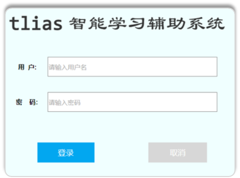
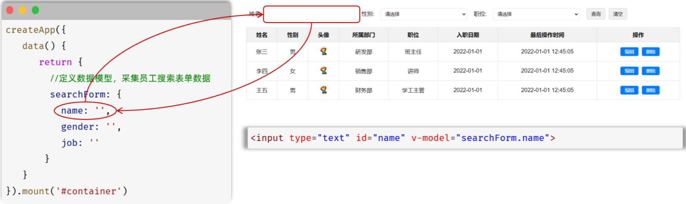
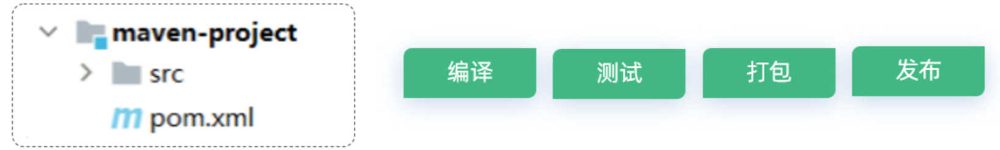
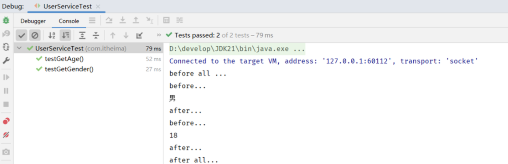
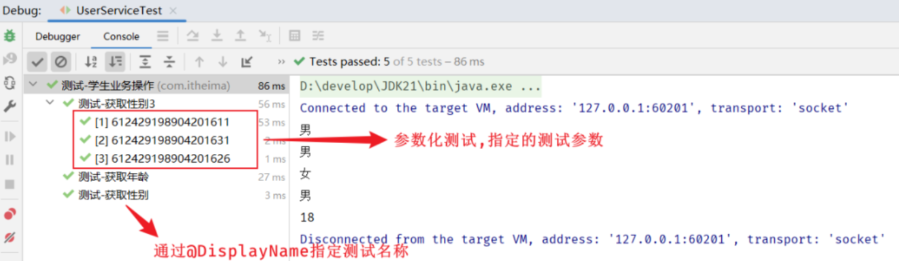
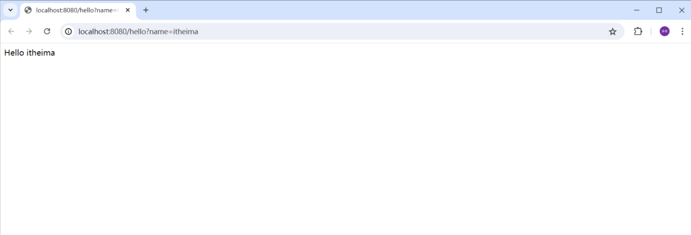
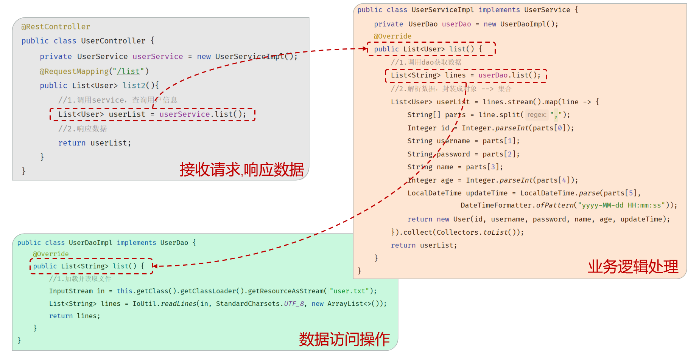

## 前端Web基础（HTML+CSS）

### HTML快速入门

#### Web前端开发介绍

**Web标准**

Web标准也称网页标准，由一系列的标准组成，大部分由W3C（World Wide Web Consortium，万维网联盟）负责制定

**网页的三个组成部分：**

HTML：负责网页的结构（页面元素和内容）

CSS：负责网页的表现（页面元素的外观、位置等页面样式，如：颜色、大小等）

JavaScript：负责网页的行为（交互效果）

#### HTML、CSS介绍

**HTML**

- HTML（HyperText Markup Language）：超文本标记语言
	- 超文本：超越了文本的限制，比普通文本更强大。除了文字信息，还可以定义图片、音频、视频等内容
	- 标记语言：由标签 "<标签名>" 构成的语言
		- HTML标签都是预定义好的。例如：使用\<h1>展示标题，使用\展示图片，使用\<video>展示视频
		- HTML代码直接在浏览器中运行，HTML标签由浏览器解析


**CSS**

CSS（Cascading Style Sheet）：层叠样式表，用于控制页面的样式(表现)


#### HTML入门程序

**HTML快速入门**

1. 新建文本文件，后缀名改为 .html
2. 编写HTML的基本骨架，定义标题
3. 在 \<body> 中填写内容

**HTML基本骨架**


**HTML标签特点**

- html标签不区分大小写，<font color='red'>建议小写</font>
- html标签的属性值使用单引号/<font color='red'>双引号</font>都可以
- html语法结构松散，但是<font color='red'>建议规范书写</font>

### 常见标签和样式（央视新闻案例）

- html页面在渲染展示的时候，是从上往下逐行解析展示的。
- 所以，编写页面的时候，根据页面的布局，从上往下编写。

#### 央视新闻-标题排版

- 标题标签：`<h1> - <h6>`
- 超链接标签：`<a href="" target="">...</a>`
	- `href`：指定资源访问的url
	- `target`：指定在何处打开资源链接
		- `_self`：默认值，在当前页面打开
		- `_blank`：在空白页面打开

**示例代码：**

```html
<!DOCTYPE html>
<html lang="en">
  <head>
    <meta charset="UTF-8" />
    <meta name="viewport" content="width=device-width, initial-scale=1.0" />
    <title>【新思想引领新征程】推进长江十年禁渔 谱写长江大保护新篇章</title>
  </head>
  <body>
    <!-- 定义一个标题, 标题内容: 【新思想引领新征程】推进长江十年禁渔 谱写长江大保护新篇章 -->
    <h1>【新思想引领新征程】推进长江十年禁渔 谱写长江大保护新篇章</h1>

    <!-- 定义一个超链接, 里面展示 央视网 -->
    <!-- 
    a 超链接标签:
      href: 链接地址 - url地址
      target: 打开方式 
        _blank: 新窗口打开
        _self: 本窗口打开(默认)
    -->
    <a href="https://www.cctv.com" target="_blank">央视网</a>
    2024年05月15日 20:07
  </body>
</html>
```

#### 央视新闻-标题样式

**CSS引入方式**

- 行内样式：写在标签的style属性中（`<h1 style="...">`）（<font color='red'>配合JavaScript使用</font>）
- 内部样式：写在style标签中（`<style> … </style>`）（<font color='red'>可以写在页面任何位置，但通常约定写在head标签中</font>）
- 外部样式：写在一个单独的.css文件中（`xxx.css   <link href="...">`）（<font color='red'>需要通过 link 标签在网页中引入</font>）

**颜色表示**

| **表示方式**   | **属性值**    | **说明**                             | **示例**                           |
| -------------- | ------------- | ------------------------------------ | ---------------------------------- |
| 关键字         | 颜色英文单词  | red、green、blue                     | red、green、blue...                |
| rgb表示法      | rgb(r,g,b)    | 红绿蓝三原色，取值：0-255            | rgb(0,0,0)、rgb(255,0,0)           |
| rgba表示法     | rgba(r,g,b,a) | 红绿蓝三原色，a表示透明度，取值：0-1 | rgba(0,0,0,0.3)、rgba(255,0,0,0.5) |
| 十六进制表示法 | #rrggbb       | #开头，将数字转换成十六进制表示      | #000000、#ff0000，简写：#000、#f00 |

**颜色属性**

- `color`: 设置文本内容的颜色

**示例代码：**

```html
<!DOCTYPE html>
<html lang="en">
  <head>
    <meta charset="UTF-8" />
    <meta name="viewport" content="width=device-width, initial-scale=1.0" />
    <title>【新思想引领新征程】推进长江十年禁渔 谱写长江大保护新篇章</title>
    <!-- 方式二: 内部样式 -->
    <style>
      span {
        /* 关键字 */
        /* color: gray; */

        /* RGB表示法 */
        /* color: rgb(255, 120, 0); */

        /* RGBA表示法 */
        /* color: rgba(255, 120, 0, 0); */

        /* 十六进制表示法 */
        /* color: #0000ff; */
        color: #b2b2b2;
      }
    </style>

    <!-- 方式三: 外部样式 -->
    <!-- <link rel="stylesheet" href="css/news.css"> -->
  </head>

  <body>
    <!-- 定义一个标题, 标题内容: 【新思想引领新征程】推进长江十年禁渔 谱写长江大保护新篇章 -->
    <h1>【新思想引领新征程】推进长江十年禁渔 谱写长江大保护新篇章</h1>

    <!-- 定义一个超链接, 里面展示 央视网 -->
    <a href="https://www.cctv.com" target="_blank">央视网</a>

    <!-- 方式一: 行内样式 -->
    <!-- <span style="color: gray;">2024年05月15日 20:07</span> -->

    <span>2024年05月15日 20:07</span>
  </body>
</html>
```

#### 央视新闻-标题样式（选择器）

**最为常见的三类选择器**

| **选择器**     | **写法**           | **示例**   | **示例说明**                       |
| -------------- | ------------------ | ---------- | ---------------------------------- |
| **元素选择器** | 元素名称 {...}     | h1 {...}   | 选择页面上所有的\<h1>标签          |
| **类选择器**   | .class属性值 {...} | .cls {...} | 选择页面上所有class属性为cls的标签 |
| **id选择器**   | #id属性值 {...}    | #hid {...} | 选择页面上id属性为hid的标签        |

**<font color='cornflowerblue'>优先级：id选择器 -> 类选择器 -> 元素选择器</font>**

**示例代码：**

```html
<!DOCTYPE html>
<html lang="en">
  <head>
    <meta charset="UTF-8" />
    <meta name="viewport" content="width=device-width, initial-scale=1.0" />
    <title>【新思想引领新征程】推进长江十年禁渔 谱写长江大保护新篇章</title>
    <style>
      /* 元素选择器 */
      /*
      span {
        color: #b2b2b2;
      }
      */

      /* 类选择器 */
      /*
      .cls {
        color: #ff0000;
      }
      */

      /* ID选择器 */
      #time {
        color: #b2b2b2;
      }

      a {
        /* 去除超链接下方的下划线 */
        text-decoration: none;
      }
    </style>
  </head>

  <body>
    <!-- 定义一个标题, 标题内容: 【新思想引领新征程】推进长江十年禁渔 谱写长江大保护新篇章 -->
    <h1>【新思想引领新征程】推进长江十年禁渔 谱写长江大保护新篇章</h1>

    <!-- 定义一个超链接, 里面展示 央视网 -->
    <a href="https://www.cctv.com" target="_blank">央视网</a>

    <span class="cls" id="time">2024年05月15日 20:07</span>
  </body>
</html>
```

#### 央视新闻-正文排版

**标签**

`<video>`

- 作用：视频标签
- 属性/说明：
	- src：指定视频的url（绝对路径/相对路径）
	- controls：是否显示播放控件
	- width：宽度（像素/相对于父元素百分比）；备注: 一般width 和 height 我们只会指定一个，另外一个会自动的等比例缩放
	- height：高度（像素/相对于父元素百分比）；备注: 一般width 和 height 我们只会指定一个，另外一个会自动的等比例缩放

``

- 作用：图片标签
- 属性/说明：src, width，height

`<p>`

- 作用：段落标签

**资源路径写法**

绝对路径

- 绝对磁盘路径（D:/xxx.jpg）
- 绝对网络路径（https://xxx.jpg）

相对路径

- 当前目录：./ (可以省略)
- 上一级目录：../

**示例代码：**

```html
<!DOCTYPE html>
<html lang="en">
  <head>
    <meta charset="UTF-8" />
    <meta name="viewport" content="width=device-width, initial-scale=1.0" />
    <title>【新思想引领新征程】推进长江十年禁渔 谱写长江大保护新篇章</title>
    <style>
      #time {
        color: #b2b2b2;
      }

      a {
        /* 去除超链接下方的下划线 */
        text-decoration: none;
      }
    </style>
  </head>

  <body>
    <!-- --------------------------- 新闻标题 -------------------------------- -->
    <!-- 定义一个标题, 标题内容: 【新思想引领新征程】推进长江十年禁渔 谱写长江大保护新篇章 -->
    <h1>【新思想引领新征程】推进长江十年禁渔 谱写长江大保护新篇章</h1>

    <!-- 定义一个超链接, 里面展示 央视网 -->
    <a href="https://www.cctv.com" target="_blank">央视网</a>

    <span class="cls" id="time">2024年05月15日 20:07</span>
    <br /><br />

    <!-- --------------------------- 新闻正文 -------------------------------- -->
    <!-- 定义一个视频, 引入 video/news.mp4 -->
    <!-- 
      video标签属性 
        src: 视频地址
        controls: 显示播放控件
        autoplay: 自动播放
        width: 视频宽度(建议: 宽度和高度只设置一个即可, 另一个会等比例缩放) 
        height: 视频高度
          单位: 
            px: 像素
            %: 百分比 (相对于父元素的百分比)
    -->
    <video src="video/news.mp4" controls width="80%"></video>
    <!-- <audio src="audio/news.mp3" controls></audio> -->

    <p>
      央视网消息（新闻联播）：作为共抓长江大保护的标志性工程，长江十年禁渔今年进入第四年。总书记指出，长江禁渔是为全局计、为子孙谋的重要决策。牢记总书记嘱托，沿江省市持续推进长江水生生物多样性恢复，努力保障退捕渔民就业生活。这段时间，记者深入长江两岸，记录下禁渔工作取得的重要阶段性成效和广大干部群众坚定不移推进长江十年禁渔的扎实行动。
    </p>

    <p>行走在长江沿线，科研人员发现很多可喜现象。</p>

    <!-- 定义一张图片, 引入 img/1.gif -->
    <!-- 
      img标签属性:  
        src: 图片的访问地址
          1. 绝对路径
            1.1 绝对磁盘路径: C:\Users\Administrator\Desktop\img\1.gif (不推荐)
            1.2 绝对网络路径: https://www.baidu.com/img/1.gif
          2. 相对路径
            2.1 ./ : 当前目录 (可以省略) , 如: ./img/1.gif
            2.2 ../: 上一级目录
        width: 图片宽度(建议: 宽度和高度只设置一个即可, 另一个会等比例缩放)
        height: 图片高度
    -->
    

    <p>
      在长江南源，一处小头裸裂尻鱼新的栖息地被发现，鱼的数量大约超3万尾，为水生态保护提供了珍贵数据。
    </p>

    <p>
      在长江中游，追踪显示，人工增殖放流的中华鲟成功入海率已经从45%左右提升至60%以上；鄱阳湖鱼类小型化、低龄化趋势得到遏制，栖息地生存环境得以改善。
    </p>

    <p>
      在长江下游，今年3月起，南京秦淮河入江口首次出现野生中华绒螯蟹大规模洄游现象，种群数量明显增加。
    </p>

    

    <p>水生生物资源恢复向好，见证了长江十年禁渔三年多来的阶段性成果。</p>

    <p>
      实施长江十年禁渔，是以同志为核心的党中央从中华民族长远利益出发作出的重要决策。党的十八大以来，总书记多次深入长江沿线考察调研，详细了解长江十年禁渔的实施情况，他指出，要坚定推进长江十年禁渔，巩固好已经取得的成果。
    </p>

    

    <p>
      按照部署，自2021年1月1日起，在长江干流、大型通江湖泊、重要支流和长江口部分海域实行为期十年的禁渔，常年禁止天然渔业资源的生产性捕捞。禁渔三年多来，相关评估显示，长江干流和鄱阳湖、洞庭湖水生生物完整性指数由禁渔前最差的“无鱼”提升了两个等级。2022年，长江江豚数量达到1249头，实现历史性止跌回升。长江干流水质连续4年全线保持Ⅱ类。
    </p>

    <p>
      实施长江十年禁渔，解决好渔民上岸后的生产生活问题，禁渔才有稳定扎实的社会基础。
    </p>

    

    <p>
      安徽退捕转产的3万多名渔民，在政府的引导下接受就业培训。在当涂县，免费学习养殖技术，养殖生态螃蟹成了退捕渔民的新选择。
    </p>

    <p>
      在拥有洞庭湖超六成水域的湖南岳阳，政府帮扶上岸渔民建起养殖场，发展风干鱼产业，还带领他们学习直播带货，拓宽销路。
    </p>

    <p>
      在渔民退捕上岸的鄱阳湖棠荫岛，当地在继续保护好生态的前提下，正探索规划利用独特的自然资源发展旅游产业。禁渔三年多来，有关部门对23.1万退捕渔民逐一建档立卡，多渠道提升就业、社保水平。
    </p>

    

    <p>
      长江十年禁渔实施以来，沿江省市合力攻坚、久久为功，长江大保护不断向纵深推进，持续巩固禁渔成果。下一步，沿江省市还将加强水生生物重要栖息地修复，建立退捕渔民动态精准帮扶服务，完善跨区域、跨部门执法合作机制，确保一江清水绵延后世、惠泽人民。
    </p>
  </body>
</html>
```

#### 央视新闻-正文样式

**标签**

| **标签**                                  | **作用** | **属性/说明**          |
| ----------------------------------------- | -------- | ---------------------- |
| \<b> / <font color='red'>\<strong></font> | **加粗** | \<strong> 具有强调语义 |
| \<u> / <font color='red'>\<ins></font>    | 下划线   | \<ins> 具有强调语义    |
| \<i> / <font color='red'>\<em></font>     | *倾斜*   | \<em> 具有强调语义     |
| \<s> / <font color='red'>\<del>  </font>  | 删除线   | \<del> 具有强调语义    |

**字符实体**

| **字符实体** | **属性/说明** |
| ------------ | ------------- |
| \&nbsp;      | 空格          |
| \&lt;        | <             |
| \&gt;        | >             |

**CSS属性**

`line-height`：设置行高

`text-indent`：首行缩进

**示例代码：**

```html
<!DOCTYPE html>
<html lang="en">
  <head>
    <meta charset="UTF-8" />
    <meta name="viewport" content="width=device-width, initial-scale=1.0" />
    <title>【新思想引领新征程】推进长江十年禁渔 谱写长江大保护新篇章</title>
    <style>
      #time {
        color: #b2b2b2;
      }

      a {
        /* 去除超链接下方的下划线 */
        text-decoration: none;
      }

      p {
        /* 设置行高 */
        line-height: 2; /* 行高: 2倍行高 */

        /* 设置首行缩进 */
        text-indent: 2em; /* 首行缩进2个字符 */
      }
    </style>
  </head>

  <body>
    <!-- --------------------------- 新闻标题 -------------------------------- -->
    <!-- 定义一个标题, 标题内容: 【新思想引领新征程】推进长江十年禁渔 谱写长江大保护新篇章 -->
    <h1>【新思想引领新征程】推进长江十年禁渔 谱写长江大保护新篇章</h1>

    <!-- 定义一个超链接, 里面展示 央视网 -->
    <a href="https://www.cctv.com" target="_blank">央视网</a>

    <span class="cls" id="time">2024年05月15日 20:07</span>
    <br /><br />

    <!-- --------------------------- 新闻正文 -------------------------------- -->
    <!-- 定义一个视频, 引入 video/news.mp4 -->
    <video src="video/news.mp4" controls width="80%"></video>

    <p>
      <!-- <b>央视网消息</b> -->
      <!-- <strong>&nbsp;&nbsp;&nbsp;&nbsp;央视网消息</strong> -->
      <strong>央视网消息</strong>
      （新闻联播）：作为共抓长江大保护的标志性工程，长江十年禁渔今年进入第四年。总书记指出，长江禁渔是为全局计、为子孙谋的重要决策。牢记总书记嘱托，沿江省市持续推进长江水生生物多样性恢复，努力保障退捕渔民就业生活。这段时间，记者深入长江两岸，记录下禁渔工作取得的重要阶段性成效和广大干部群众坚定不移推进长江十年禁渔的扎实行动。
    </p>

    <p>行走在长江沿线，科研人员发现很多可喜现象。</p>

    <!-- 定义一张图片, 引入 img/1.gif -->
    

    <p>
      在长江南源，一处小头裸裂尻鱼新的栖息地被发现，鱼的数量大约超3万尾，为水生态保护提供了珍贵数据。
    </p>

    <p>
      在长江中游，追踪显示，人工增殖放流的中华鲟成功入海率已经从45%左右提升至60%以上；鄱阳湖鱼类小型化、低龄化趋势得到遏制，栖息地生存环境得以改善。
    </p>

    <p>
      在长江下游，今年3月起，南京秦淮河入江口首次出现野生中华绒螯蟹大规模洄游现象，种群数量明显增加。
    </p>

    

    <p>水生生物资源恢复向好，见证了长江十年禁渔三年多来的阶段性成果。</p>

    <p>
      实施长江十年禁渔，是以同志为核心的党中央从中华民族长远利益出发作出的重要决策。党的十八大以来，总书记多次深入长江沿线考察调研，详细了解长江十年禁渔的实施情况，他指出，要坚定推进长江十年禁渔，巩固好已经取得的成果。
    </p>

    

    <p>
      按照部署，自2021年1月1日起，在长江干流、大型通江湖泊、重要支流和长江口部分海域实行为期十年的禁渔，常年禁止天然渔业资源的生产性捕捞。禁渔三年多来，相关评估显示，长江干流和鄱阳湖、洞庭湖水生生物完整性指数由禁渔前最差的“无鱼”提升了两个等级。2022年，长江江豚数量达到1249头，实现历史性止跌回升。长江干流水质连续4年全线保持Ⅱ类。
    </p>

    <p>
      实施长江十年禁渔，解决好渔民上岸后的生产生活问题，禁渔才有稳定扎实的社会基础。
    </p>

    

    <p>
      安徽退捕转产的3万多名渔民，在政府的引导下接受就业培训。在当涂县，免费学习养殖技术，养殖生态螃蟹成了退捕渔民的新选择。
    </p>

    <p>
      在拥有洞庭湖超六成水域的湖南岳阳，政府帮扶上岸渔民建起养殖场，发展风干鱼产业，还带领他们学习直播带货，拓宽销路。
    </p>

    <p>
      在渔民退捕上岸的鄱阳湖棠荫岛，当地在继续保护好生态的前提下，正探索规划利用独特的自然资源发展旅游产业。禁渔三年多来，有关部门对23.1万退捕渔民逐一建档立卡，多渠道提升就业、社保水平。
    </p>

    

    <p>
      长江十年禁渔实施以来，沿江省市合力攻坚、久久为功，长江大保护不断向纵深推进，持续巩固禁渔成果。下一步，沿江省市还将加强水生生物重要栖息地修复，建立退捕渔民动态精准帮扶服务，完善跨区域、跨部门执法合作机制，确保一江清水绵延后世、惠泽人民。
    </p>
  </body>
</html>
```

#### 央视新闻-整体布局

**需求**

通过css使新闻网页的整体内容，占用整个页面宽度的70%，并且横向居中展示。

**实现代码：**

```html
<!DOCTYPE html>
<html lang="en">
  <head>
    <meta charset="UTF-8" />
    <meta name="viewport" content="width=device-width, initial-scale=1.0" />
    <title>【新思想引领新征程】推进长江十年禁渔 谱写长江大保护新篇章</title>
    <style>
      #time {
        color: #b2b2b2;
      }

      a {
        /* 去除超链接下方的下划线 */
        text-decoration: none;
      }

      p {
        /* 设置行高 */
        line-height: 2; /* 行高: 2倍行高 */

        /* 设置首行缩进 */
        text-indent: 2em; /* 首行缩进2个字符 */
      }

      /* 整体版面居中显示 */
      #content-container {
        width: 70%; /* 宽度: 70% */
        margin: 0 auto;
      }
    </style>
  </head>

  <body>
    <div id="content-container">
      <!-- --------------------------- 新闻标题 -------------------------------- -->
      <!-- 定义一个标题, 标题内容: 【新思想引领新征程】推进长江十年禁渔 谱写长江大保护新篇章 -->
      <h1>【新思想引领新征程】推进长江十年禁渔 谱写长江大保护新篇章</h1>

      <!-- 定义一个超链接, 里面展示 央视网 -->
      <a href="https://www.cctv.com" target="_blank">央视网</a>

      <span class="cls" id="time">2024年05月15日 20:07</span>
      <br /><br />

      <!-- --------------------------- 新闻正文 -------------------------------- -->
      <!-- 定义一个视频, 引入 video/news.mp4 -->
      <video src="video/news.mp4" controls width="100%"></video>

      <p>
        <strong>央视网消息</strong>
        （新闻联播）：作为共抓长江大保护的标志性工程，长江十年禁渔今年进入第四年。总书记指出，长江禁渔是为全局计、为子孙谋的重要决策。牢记总书记嘱托，沿江省市持续推进长江水生生物多样性恢复，努力保障退捕渔民就业生活。这段时间，记者深入长江两岸，记录下禁渔工作取得的重要阶段性成效和广大干部群众坚定不移推进长江十年禁渔的扎实行动。
      </p>

      <p>行走在长江沿线，科研人员发现很多可喜现象。</p>

      <!-- 定义一张图片, 引入 img/1.gif -->
      

      <p>
        在长江南源，一处小头裸裂尻鱼新的栖息地被发现，鱼的数量大约超3万尾，为水生态保护提供了珍贵数据。
      </p>

      <p>
        在长江中游，追踪显示，人工增殖放流的中华鲟成功入海率已经从45%左右提升至60%以上；鄱阳湖鱼类小型化、低龄化趋势得到遏制，栖息地生存环境得以改善。
      </p>

      <p>
        在长江下游，今年3月起，南京秦淮河入江口首次出现野生中华绒螯蟹大规模洄游现象，种群数量明显增加。
      </p>

      

      <p>水生生物资源恢复向好，见证了长江十年禁渔三年多来的阶段性成果。</p>

      <p>
        实施长江十年禁渔，是以同志为核心的党中央从中华民族长远利益出发作出的重要决策。党的十八大以来，总书记多次深入长江沿线考察调研，详细了解长江十年禁渔的实施情况，他指出，要坚定推进长江十年禁渔，巩固好已经取得的成果。
      </p>

      

      <p>
        按照部署，自2021年1月1日起，在长江干流、大型通江湖泊、重要支流和长江口部分海域实行为期十年的禁渔，常年禁止天然渔业资源的生产性捕捞。禁渔三年多来，相关评估显示，长江干流和鄱阳湖、洞庭湖水生生物完整性指数由禁渔前最差的“无鱼”提升了两个等级。2022年，长江江豚数量达到1249头，实现历史性止跌回升。长江干流水质连续4年全线保持Ⅱ类。
      </p>

      <p>
        实施长江十年禁渔，解决好渔民上岸后的生产生活问题，禁渔才有稳定扎实的社会基础。
      </p>

      

      <p>
        安徽退捕转产的3万多名渔民，在政府的引导下接受就业培训。在当涂县，免费学习养殖技术，养殖生态螃蟹成了退捕渔民的新选择。
      </p>

      <p>
        在拥有洞庭湖超六成水域的湖南岳阳，政府帮扶上岸渔民建起养殖场，发展风干鱼产业，还带领他们学习直播带货，拓宽销路。
      </p>

      <p>
        在渔民退捕上岸的鄱阳湖棠荫岛，当地在继续保护好生态的前提下，正探索规划利用独特的自然资源发展旅游产业。禁渔三年多来，有关部门对23.1万退捕渔民逐一建档立卡，多渠道提升就业、社保水平。
      </p>

      

      <p>
        长江十年禁渔实施以来，沿江省市合力攻坚、久久为功，长江大保护不断向纵深推进，持续巩固禁渔成果。下一步，沿江省市还将加强水生生物重要栖息地修复，建立退捕渔民动态精准帮扶服务，完善跨区域、跨部门执法合作机制，确保一江清水绵延后世、惠泽人民。
      </p>
    </div>
  </body>
</html>
```

#### CSS盒子模型

**盒子模型介绍**

- 盒子：页面中所有的元素（标签），都可以看做是一个 <font color='red'>盒子</font>，由盒子将页面中的元素包含在一个矩形区域内，通过盒子的视角更方便的进行页面布局
- 盒子模型组成：<font color='red'>内容区域（content）</font>、<font color='red'>内边距区域（padding）</font>、<font color='red'>边框区域（border）</font>、<font color='red'>外边距区域（margin）</font>


CSS盒子模型，其实和日常生活中的包装盒是非常类似的，就比如：


盒子的大小，其实就包括三个部分： border、padding、content，而margin外边距是不包括在盒子之内的

**布局标签**

- 布局标签：实际开发网页中，会大量频繁的使用 div 和 span 这两个没有语义的布局标签。
- 标签：`<div>` `<span>`
- 特点：
- `<div>`标签：
	- 一行只显示一个（独占一行）
	- 宽度默认是父元素的宽度，高度默认由内容撑开
	- 可以设置宽高（`width`、`height`）
- `<span>`标签：
	- 一行可以显示多个
	- 宽度和高度默认由内容撑开
	- 不可以设置宽高（`width`、`height`）

**示例代码：**

```html
<!DOCTYPE html>
<html lang="en">
  <head>
    <meta charset="UTF-8" />
    <meta http-equiv="X-UA-Compatible" content="IE=edge" />
    <meta name="viewport" content="width=device-width, initial-scale=1.0" />
    <title>盒子模型</title>
    <style>
      div {
        width: 200px; /* 宽度 */
        height: 200px; /* 高度 */
        box-sizing: border-box; /* 指定width height为盒子的高宽 */
        background-color: aquamarine; /* 背景色 */

        padding: 20px 20px 20px 20px; /* 内边距, 上 右 下 左 , 边距都一行, 可以简写: padding: 20px;*/
        border: 10px solid red; /* 边框, 宽度 线条类型 颜色 */
        margin: 30px 30px 30px 30px; /* 外边距, 上 右 下 左 , 边距都一行, 可以简写: margin: 30px; */
      }
    </style>
  </head>

  <body>
    <div>
      A A A A A A A A A A A A A A A A A A A A A A A A A A A A A A A A A A
    </div>
  </body>
</html>
```

代码编写好了, 可以通过浏览器打开该页面, 通过开发者工具,我们就可以看到盒子的大小 , 以及盒子各个组成部分(内容、内边距、边框、外边距)：


我们也可以，通过浏览器的开发者工具，清晰的看到这个盒子，以及每一个部分的大小：


**备注：**

- 上述的padding、margin属性值，可以是4个值、也可以是两个值、也可以是一个值，具体的含义如下：
- `padding: 20px 20px 20px 20px;`  -------> 表示上、右、下、左都是20px；
- `padding: 20px 10px;` ----------------------> 表示上下是20px，左右是10px；
- `padding: 20px;` -----------------------------> 表示上、右、下、左都是20px；

**<font color='red'>注意事项：</font>**

- 如果只需要设置某一个方位的边框、内边距、外边距，可以在属性名后加上 –位置，如：padding-top、padding-left、padding-right …

### 常见标签和样式（Tlias案例）

#### Tlias案例-顶部导航栏制作

**页面原型：**


**给AI的提示词：**

```html
你是一名前端开发工程师，帮我生成一个HTML页面，页面整体有4个部分组成，先来实现第一个部分：
1. 顶栏
内容：包含左侧的标题“Tlias智能学习辅助系统”，字体需加大加粗，以突出显示；右侧则放置“退出登录”文字链接。
布局：确保标题与退出登录文本位于同一行内，分别左对齐与右对齐 。
```

**页面代码：**

```html
<!DOCTYPE html>
<html lang="zh-CN">
  <head>
    <meta charset="UTF-8" />
    <meta name="viewport" content="width=device-width, initial-scale=1.0" />
    <title>Tlias智能学习辅助系统</title>
    <style>
      body {
        margin: 0;
      }

      /* 顶栏样式 */
      .header {
        display: flex;
        justify-content: space-between;
        align-items: center;
        background-color: #f1f1f1;
        padding: 10px 20px;
        box-shadow: 0 2px 5px rgba(0, 0, 0, 0.1);
      }

      /* 加大加粗标题 */
      .header h1 {
        margin: 0;
        font-size: 24px;
        font-weight: bold;
      }

      /* 文本链接样式 */
      .header a {
        text-decoration: none;
        color: #333;
        font-size: 16px;
      }
    </style>
  </head>
  <body>
    <!-- 顶栏 -->
    <div class="header">
      <h1>Tlias智能学习辅助系统</h1>
      <a href="#">退出登录</a>
    </div>

    <!-- 其他部分可以在这里添加 -->
  </body>
</html>
```

#### Flex布局

那在上述的案例代码中，其实我们用到了一种布局模式，叫 **flex布局**

- flex是flexible Box的缩写，意为"弹性布局"。采用flex布局的元素，称为Flex容器（container），它的所有子元素自动成为容器成员，称为Flex项目（item）

- <font color='red'>通过给父容器添加flex属性,来控制子元素的位置和排列方式</font>


**示例代码：**

```html
<!DOCTYPE html>
<html lang="en">
  <head>
    <meta charset="UTF-8" />
    <meta name="viewport" content="width=device-width, initial-scale=1.0" />
    <title>Document</title>
    <style>
      #container {
        display: flex;
        /* justify-content: space-between; */ /* 先两边贴边，再平分剩余空间 */
        /* justify-content: flex-start;*/ /* 从头开始排列  */
        /* justify-content: flex-end; */ /* 从尾开始排列 */
        /* justify-content: center; */ /* 居中排列 */
        /* justify-content: space-around; */ /* 两边留白，中间平分，平分剩余空间 */
        flex-direction: row;
        justify-content: space-between;
        background-color: #aeea6a;
        width: 400px;
        height: 300px;
      }

      #container div {
        background-color: #e866ef;
        width: 100px;
        height: 50px;
      }
    </style>
  </head>
  <body>
    <div id="container">
      <div>Flex Item</div>
      <div>Flex Item</div>
      <div>Flex Item</div>
    </div>
  </body>
</html>
```

**flex布局相关的CSS样式**


如果主轴设置为row，其实就是横向布局； 主轴设置为column，其实就是纵向布局


#### 常见的标签和样式-表单标签

**表单：**在网页中主要负责数据采集功能，如 注册、登录等数据采集

**表单项：**表单项是组成表单的基本元素，允许用户输入或选择数据，并将这些数据提交给服务器



**表单标签**

- 表单场景: 表单就是在网页中负责数据采集功能的，如：注册、登录的表单。 
- 表单标签: `<form>`
- 表单属性:
	- `action`: 规定表单提交时，向何处发送表单数据，表单提交的URL。
	- `method`: 规定用于发送表单数据的方式，常见为： GET、POST。
		- `GET`：表单数据是拼接在url后面的， 如： xxxxxxxxxxx?username=Tom&age=12，url中能携带的表单数据大小是有限制的。
		- `POST`： 表单数据是在请求体（消息体）中携带的，大小没有限制。
- 表单项标签: 不同类型的input元素、下拉列表、文本域等。
	- `input`: 定义表单项，通过type属性控制输入形式
	- `select`: 定义下拉列表
	- `textarea`: 定义文本域

**GET方式提交表单：**

```html
<!DOCTYPE html>
<html lang="en">
  <head>
    <meta charset="UTF-8" />
    <meta http-equiv="X-UA-Compatible" content="IE=edge" />
    <meta name="viewport" content="width=device-width, initial-scale=1.0" />
    <title>HTML-表单</title>
  </head>
  <body>
    <!-- 
      form表单属性: 
        action: 表单提交的url, 往何处提交数据 . 如果不指定, 默认提交到当前页面
        method: 表单的提交方式 .
          get: 在url后面拼接表单数据, 比如: ?username=Tom&age=12 , url长度有限制 . 默认值
          post: 在消息体(请求体)中传递的, 参数大小无限制的.
    -->

    <form action="" method="get">
      用户名: <input type="text" name="username" /> 
        
      年龄: <input type="text" name="age" />
        
      <input type="submit" value="提交" />
    </form>
  </body>
</html>
```

表单编写完毕之后，通过浏览器打开此表单，然后再表单项中录入值之后，点击提交，我们会看到表单的数据在url后面提交到服务端，格式为：?username=Tom&age=12


**POST方式提交表单：**

```html
<!DOCTYPE html>
<html lang="en">
  <head>
    <meta charset="UTF-8" />
    <meta http-equiv="X-UA-Compatible" content="IE=edge" />
    <meta name="viewport" content="width=device-width, initial-scale=1.0" />
    <title>HTML-表单</title>
  </head>
  <body>
    <!-- 
      form表单属性: 
        action: 表单提交的url, 往何处提交数据 . 如果不指定, 默认提交到当前页面
        method: 表单的提交方式 .
          get: 在url后面拼接表单数据, 比如: ?username=Tom&age=12 , url长度有限制 . 默认值
          post: 在消息体(请求体)中传递的, 参数大小无限制的.
    -->

    <form action="" method="post">
      用户名: <input type="text" name="username" />

      年龄: <input type="text" name="age" />

      <input type="submit" value="提交" />
    </form>
  </body>
</html>
```

表单编写完毕之后，通过浏览器打开此表单，然后再表单项中录入值之后，点击提交，我们会看到表单的数据在url后面提交到服务端，格式为：?username=Tom&age=12


**<font color='red'>注意事项：</font>**

表单中的所有表单项，要想能够正常的采集数据，在提交的时候能提交到服务端，表单项必须指定name属性。 否则，无法提交该表单项

```html
用户名: <input type="text" name="username">
```

#### 常见的标签和样式-表单项标签

在一个表单中，可以存在很多的表单项，而虽然表单项的形式各式各样，但是表单项的标签其实就只有三个，分别是：

- `<input>`: 表单项 , 通过type属性控制输入形式。

| type取值                 | 描述                                 |
| ------------------------ | ------------------------------------ |
| text                     | 默认值，定义单行的输入字段           |
| password                 | 定义密码字段                         |
| radio                    | 定义单选按钮                         |
| checkbox                 | 定义复选框                           |
| file                     | 定义文件上传按钮                     |
| date/time/datetime-local | 定义日期/时间/日期时间               |
| number                   | 定义数字输入框                       |
| email                    | 定义邮件输入框                       |
| hidden                   | 定义隐藏域                           |
| submit / reset / button  | 定义提交按钮 / 重置按钮 / 可点击按钮 |

- `<select>`: 定义下拉列表, `<option>` 定义列表项
- `<textarea>`: 文本域

**示例代码：**

创建一个新的表单项的html文件，具体内容如下：

```html
<!DOCTYPE html>
<html lang="en">
  <head>
    <meta charset="UTF-8" />
    <meta http-equiv="X-UA-Compatible" content="IE=edge" />
    <meta name="viewport" content="width=device-width, initial-scale=1.0" />
    <title>HTML-表单项标签</title>
  </head>
  <body>
    <!-- value: 表单项提交的值 -->
    <form action="/save" method="post">
      姓名: <input type="text" name="name" /> <br /><br />

      密码: <input type="password" name="password" /> <br /><br />

      性别: <input type="radio" name="gender" value="1" /> 男
      <label><input type="radio" name="gender" value="2" /> 女 </label>
      <br /><br />

      爱好:
      <label><input type="checkbox" name="hobby" value="java" /> java </label>
      <label><input type="checkbox" name="hobby" value="game" /> game </label>
      <label><input type="checkbox" name="hobby" value="sing" /> sing </label>
      <br /><br />

      图像: <input type="file" name="image" /> <br /><br />

      生日: <input type="date" name="birthday" /> <br /><br />

      时间: <input type="time" name="time" /> <br /><br />

      日期时间: <input type="datetime-local" name="datetime" /> <br /><br />

      学历:
      <select name="degree">
        <option value="">----------- 请选择 -----------</option>
        <option value="1">大专</option>
        <option value="2">本科</option>
        <option value="3">硕士</option>
        <option value="4">博士</option>
      </select>
      <br /><br />

      描述: <textarea name="description" cols="30" rows="10"></textarea>
      <br /><br />

      <input type="hidden" name="id" value="1" />

      <!-- 表单常见按钮 -->
      <input type="button" value="按钮" />
      <input type="reset" value="重置" />
      <input type="submit" value="提交" />
      <br />
    </form>
  </body>
</html>
```

`<label>`标签用于为表单元素（如输入框、复选框、单选按钮等）定义标签文本，主要作用是增强表单的可用性和可访问性

- **<font color='cornflowerblue'>提升用户体验</font>**：扩大了可点击区域，用户点击文本即可操作对应的表单元素，尤其对复选框和单选按钮非常友好
- **<font color='cornflowerblue'>增强可访问性</font>**：屏幕阅读器会将`<label>`文本与关联的表单元素关联起来，帮助视力障碍用户理解表单用途

通过浏览器打开上述的表单项html文件，最终展示出的表单信息如下：


而对于`<input type="hidden">`，是一个隐藏域，在表单中并不会显示出来，但是在提交表单的时候，是会提交到服务端的。 接下来，我们就点击提交按钮，来提交当前表单，看看提交的数据：


#### Tlias案例-搜索表单区域

**页面原型：**


**AI提示词：**

```html
再继续帮我生成第二个部分: 
2. 搜索表单区域
组成：包括三个输入控件和两个操作按钮。输入控件具体为：姓名（文本输入框）、性别（下拉选择，选项包括 男/女， 默认为空）、职位（下拉选择，选项包括班主任、讲师、学工主管、教研主管、咨询师， 默认为空）。
按钮：“查询”与“清空”按钮，用于提交表单或重置表单项 。
布局：所有表单项及按钮需水平排列于一行 ，确保美观大气 。
```

**页面代码：**

```html
<!DOCTYPE html>
<html lang="zh-CN">
  <head>
    <meta charset="UTF-8" />
    <meta name="viewport" content="width=device-width, initial-scale=1.0" />
    <title>Tlias智能学习辅助系统</title>
    <style>
      body {
        margin: 0;
      }

      /* 顶栏样式 */
      .header {
        display: flex;
        justify-content: space-between;
        align-items: center;
        background-color: #f1f1f1;
        padding: 10px 20px;
        box-shadow: 0 2px 5px rgba(0, 0, 0, 0.1);
      }

      /* 加大加粗标题 */
      .header h1 {
        margin: 0;
        font-size: 24px;
        font-weight: bold;
      }

      /* 文本链接样式 */
      .header a {
        text-decoration: none;
        color: #333;
        font-size: 16px;
      }

      /* 搜索表单区域 */
      .search-form {
        display: flex;
        align-items: center;
        padding: 20px;
        background-color: #f9f9f9;
      }

      /* 表单控件样式 */
      .search-form input[type="text"],
      .search-form select {
        margin-right: 10px;
        padding: 5px 10px;
        border: 1px solid #ccc;
        border-radius: 4px;
        width: 200px;
      }

      /* 按钮样式 */
      .search-form button {
        padding: 5px 15px;
        margin-left: 10px;
        background-color: #007bff;
        color: white;
        border: none;
        border-radius: 4px;
        cursor: pointer;
      }

      /* 清空按钮样式 */
      .search-form button.clear {
        background-color: #6c757d;
      }
    </style>
  </head>
  <body>
    <!-- 顶栏 -->
    <div class="header">
      <h1>Tlias智能学习辅助系统</h1>
      <a href="#">退出登录</a>
    </div>

    <!-- 搜索表单区域 -->
    <form class="search-form">
      <input type="text" name="name" placeholder="姓名" />
      <select name="gender">
        <option value="">性别</option>
        <option value="1">男</option>
        <option value="2">女</option>
      </select>
      <select name="job">
        <option value="">职位</option>
        <option value="1">班主任</option>
        <option value="2">讲师</option>
        <option value="3">学工主管</option>
        <option value="4">教研主管</option>
        <option value="5">咨询师</option>
      </select>
      <button type="submit">查询</button>
      <button type="reset" class="clear">清空</button>
    </form>
  </body>
</html>
```

**页面效果：**


#### Tlias案例-表格数据展示区域

**页面原型：**


**AI提示词：**

```html
再继续帮我生成第三个部分: 
3. 表格展示区
表格结构：展示列包括姓名、性别（显示男/女）、头像（小图标展示）、职位（显示班主任/讲师/学工主管/教研主管/咨询师）、入职日期、最后操作时间、操作（里包含两个按钮 编辑 与 删除）。
数据模拟：基于《笑傲江湖》小说人物生成4条虚拟数据，每条数据应包含上述所有列的信息，以体现实际应用场景 。
样式：可适当调整表格样式，确保美观大气。
```

**页面代码：**

```html
<!DOCTYPE html>
<html lang="zh-CN">
  <head>
    <meta charset="UTF-8" />
    <meta name="viewport" content="width=device-width, initial-scale=1.0" />
    <title>Tlias智能学习辅助系统</title>
    <style>
      body {
        margin: 0;
      }

      /* 顶栏样式 */
      .header {
        display: flex;
        justify-content: space-between;
        align-items: center;
        background-color: #f1f1f1;
        padding: 10px 20px;
        box-shadow: 0 2px 5px rgba(0, 0, 0, 0.1);
      }

      /* 加大加粗标题 */
      .header h1 {
        margin: 0;
        font-size: 24px;
        font-weight: bold;
      }

      /* 文本链接样式 */
      .header a {
        text-decoration: none;
        color: #333;
        font-size: 16px;
      }

      /* 搜索表单区域 */
      .search-form {
        display: flex;
        align-items: center;
        padding: 20px;
        background-color: #f9f9f9;
      }

      /* 表单控件样式 */
      .search-form input[type="text"],
      .search-form select {
        margin-right: 10px;
        padding: 5px 10px;
        border: 1px solid #ccc;
        border-radius: 4px;
        width: 200px;
      }

      /* 按钮样式 */
      .search-form button {
        padding: 5px 15px;
        margin-left: 10px;
        background-color: #007bff;
        color: white;
        border: none;
        border-radius: 4px;
        cursor: pointer;
      }

      /* 清空按钮样式 */
      .search-form button.clear {
        background-color: #6c757d;
      }

      /* 表格样式 */
      .table {
        min-width: 100%;
        border-collapse: collapse;
        margin: 0 20px;
      }

      /* 设置表格单元格边框 */
      .table td,
      .table th {
        border: 1px solid #ddd;
        padding: 8px;
        text-align: center;
      }

      /* 头像样式 */
      .avatar {
        width: 50px;
        height: 50px;
        object-fit: cover;
        border-radius: 50%;
      }
    </style>
  </head>
  <body>
    <!-- 顶栏 -->
    <div class="header">
      <h1>Tlias智能学习辅助系统</h1>
      <a href="#">退出登录</a>
    </div>

    <!-- 搜索表单区域 -->
    <form class="search-form" action="#" method="post">
      <input type="text" name="name" placeholder="姓名" />
      <select name="gender">
        <option value="">性别</option>
        <option value="1">男</option>
        <option value="2">女</option>
      </select>
      <select name="job">
        <option value="">职位</option>
        <option value="1">班主任</option>
        <option value="2">讲师</option>
        <option value="3">学工主管</option>
        <option value="4">教研主管</option>
        <option value="5">咨询师</option>
      </select>
      <button type="submit">查询</button>
      <button type="reset" class="clear">清空</button>
    </form>

    <!-- 表格展示区 -->
    <table class="table table-striped table-bordered">
      <!-- 表头 -->
      <thead>
        <tr>
          <th>姓名</th>
          <th>性别</th>
          <th>头像</th>
          <th>职位</th>
          <th>入职日期</th>
          <th>最后操作时间</th>
          <th>操作</th>
        </tr>
      </thead>
      <!-- 表体 -->
      <tbody>
        <tr>
          <td>令狐冲</td>
          <td>男</td>
          <td>
            
          </td>
          <td>讲师</td>
          <td>2021-03-15</td>
          <td>2023-07-30T12:00:00Z</td>
          <td class="btn-group">
            <button>编辑</button>
            <button>删除</button>
          </td>
        </tr>
        <tr>
          <td>任盈盈</td>
          <td>女</td>
          <td>
            
          </td>
          <td>学工主管</td>
          <td>2020-04-10</td>
          <td>2023-07-29T15:00:00Z</td>
          <td class="btn-group">
            <button>编辑</button>
            <button>删除</button>
          </td>
        </tr>
        <tr>
          <td>岳不群</td>
          <td>男</td>
          <td>
            
          </td>
          <td>教研主管</td>
          <td>2019-01-01</td>
          <td>2023-07-30T10:00:00Z</td>
          <td class="btn-group">
            <button>编辑</button>
            <button>删除</button>
          </td>
        </tr>
        <tr>
          <td>宁中则</td>
          <td>女</td>
          <td>
            
          </td>
          <td>班主任</td>
          <td>2018-06-01</td>
          <td>2023-07-29T09:00:00Z</td>
          <td class="btn-group">
            <button>编辑</button>
            <button>删除</button>
          </td>
        </tr>
      </tbody>
    </table>
  </body>
</html>
```

**页面效果：**


**表格标签**

| 标签      | 描述                                                         |
| --------- | ------------------------------------------------------------ |
| `<table>` | 定义表格整体                                                 |
| `<thead>` | 用于定义表格头部(可选)                                       |
| `<tbody>` | 定义表格中的主体部分(可选)                                   |
| `<tr>`    | 表格的行，可以包裹多个 `<td>`                                |
| `<td>`    | 表格单元格(普通)，可以包裹内容；如果是表头单元格，可以替换为 `<th>` |

#### Tlias案例-底部版权区域

**页面原型：**


**AI提示词：**

```html
再继续帮我生成第二个部分: 
4. 页脚版权区域
内容：第一行显示公司全称“江苏传智播客教育科技股份有限公司”；第二行展示版权信息，“版权所有 Copyright 2006-2024 All Rights Reserved”。
设计：该区域应具有灰色背景，字体颜色为白色，居中对齐，以营造专业且统一的视觉效果 。
```

**页面代码：**

```html
<!DOCTYPE html>
<html lang="zh-CN">
  <head>
    <meta charset="UTF-8" />
    <meta name="viewport" content="width=device-width, initial-scale=1.0" />
    <title>Tlias智能学习辅助系统</title>
    <style>
      body {
        margin: 0;
      }

      /* 顶栏样式 */
      .header {
        display: flex;
        justify-content: space-between;
        align-items: center;
        background-color: #f1f1f1;
        padding: 10px 20px;
        box-shadow: 0 2px 5px rgba(0, 0, 0, 0.1);
      }

      /* 加大加粗标题 */
      .header h1 {
        margin: 0;
        font-size: 24px;
        font-weight: bold;
      }

      /* 文本链接样式 */
      .header a {
        text-decoration: none;
        color: #333;
        font-size: 16px;
      }

      /* 搜索表单区域 */
      .search-form {
        display: flex;
        align-items: center;
        padding: 20px;
        background-color: #f9f9f9;
      }

      /* 表单控件样式 */
      .search-form input[type="text"],
      .search-form select {
        margin-right: 10px;
        padding: 5px 10px;
        border: 1px solid #ccc;
        border-radius: 4px;
        width: 200px;
      }

      /* 按钮样式 */
      .search-form button {
        padding: 5px 15px;
        margin-left: 10px;
        background-color: #007bff;
        color: white;
        border: none;
        border-radius: 4px;
        cursor: pointer;
      }

      /* 清空按钮样式 */
      .search-form button.clear {
        background-color: #6c757d;
      }

      .table {
        min-width: 100%;
        border-collapse: collapse;
        margin: 0 20px;
      }

      /* 设置表格单元格边框 */
      .table td,
      .table th {
        border: 1px solid #ddd;
        padding: 8px;
        text-align: center;
      }

      .avatar {
        width: 50px;
        height: 50px;
        object-fit: cover;
        border-radius: 50%;
      }

      /* 页脚版权区域 */
      .footer {
        background-color: #8f8c8c;
        color: white;
        text-align: center;
        padding: 20px 0;
        margin-top: 30px;
      }

      .footer .company-name {
        font-size: 1.1em;
        font-weight: bold;
      }

      .footer .copyright {
        font-size: 0.9em;
      }
    </style>
  </head>
  <body>
    <!-- 顶栏 -->
    <div class="header">
      <h1>Tlias智能学习辅助系统</h1>
      <a href="#">退出登录</a>
    </div>

    <!-- 搜索表单区域 -->
    <form class="search-form" action="#" method="post">
      <input type="text" name="name" placeholder="姓名" />
      <select name="gender">
        <option value="">性别</option>
        <option value="1">男</option>
        <option value="2">女</option>
      </select>
      <select name="job">
        <option value="">职位</option>
        <option value="1">班主任</option>
        <option value="2">讲师</option>
        <option value="3">学工主管</option>
        <option value="4">教研主管</option>
        <option value="5">咨询师</option>
      </select>
      <button type="submit">查询</button>
      <button type="reset" class="clear">清空</button>
    </form>

    <!-- 表格展示区 -->
    <table class="table table-striped table-bordered">
      <!-- 表头 -->
      <thead>
        <tr>
          <th>姓名</th>
          <th>性别</th>
          <th>头像</th>
          <th>职位</th>
          <th>入职日期</th>
          <th>最后操作时间</th>
          <th>操作</th>
        </tr>
      </thead>
      <!-- 表体 -->
      <tbody>
        <tr>
          <td>令狐冲</td>
          <td>男</td>
          <td>
            
          </td>
          <td>讲师</td>
          <td>2021-03-15</td>
          <td>2023-07-30T12:00:00Z</td>
          <td class="btn-group">
            <button>编辑</button>
            <button>删除</button>
          </td>
        </tr>
        <tr>
          <td>任盈盈</td>
          <td>女</td>
          <td>
            
          </td>
          <td>学工主管</td>
          <td>2020-04-10</td>
          <td>2023-07-29T15:00:00Z</td>
          <td class="btn-group">
            <button>编辑</button>
            <button>删除</button>
          </td>
        </tr>
        <tr>
          <td>岳不群</td>
          <td>男</td>
          <td>
            
          </td>
          <td>教研主管</td>
          <td>2019-01-01</td>
          <td>2023-07-30T10:00:00Z</td>
          <td class="btn-group">
            <button>编辑</button>
            <button>删除</button>
          </td>
        </tr>
        <tr>
          <td>宁中则</td>
          <td>女</td>
          <td>
            
          </td>
          <td>班主任</td>
          <td>2018-06-01</td>
          <td>2023-07-29T09:00:00Z</td>
          <td class="btn-group">
            <button>编辑</button>
            <button>删除</button>
          </td>
        </tr>
      </tbody>
    </table>

    <!-- 页脚版权区域 -->
    <footer class="footer">
      <p class="company-name">江苏传智播客教育科技股份有限公司</p>
      <p class="copyright">版权所有 Copyright 2006-2024 All Rights Reserved</p>
    </footer>
  </body>
</html>
```

`<footer>`是一个语义化标签，用于定义文档或 section（章节）的页脚部分。它属于 HTML5 新增的语义化标签，旨在让网页结构更清晰，同时提升机器可读性（如搜索引擎、屏幕阅读器等）

**页面效果：**


#### Tlias案例-版心居中

这个案例类似于央视新闻页面，页面中的内容，都需要居中显示，所以这里呢，我们就可以使用盒子模型来进行布局。具体代码如下：

**页面最终代码：**

```html
<!DOCTYPE html>
<html lang="zh-CN">
  <head>
    <meta charset="UTF-8" />
    <meta name="viewport" content="width=device-width, initial-scale=1.0" />
    <title>Tlias智能学习辅助系统</title>
    <style>
      body {
        margin: 0;
      }

      /* 顶栏样式 */
      .header {
        display: flex;
        justify-content: space-between;
        align-items: center;
        background-color: #c2c0c0;
        padding: 10px 20px;
        box-shadow: 0 2px 5px rgba(0, 0, 0, 0.1);
      }

      /* 加大加粗标题 */
      .header h1 {
        margin: 0;
        font-size: 24px;
        font-weight: bold;
      }

      /* 文本链接样式 */
      .header a {
        text-decoration: none;
        color: #333;
        font-size: 16px;
      }

      /* 搜索表单区域 */
      .search-form {
        display: flex;
        align-items: center;
        padding: 20px;
        background-color: #f9f9f9;
      }

      /* 表单控件样式 */
      .search-form input[type="text"],
      .search-form select {
        margin-right: 10px;
        padding: 5px 10px;
        border: 1px solid #ccc;
        border-radius: 4px;
        width: 200px;
      }

      /* 按钮样式 */
      .search-form button {
        padding: 5px 15px;
        margin-left: 10px;
        background-color: #007bff;
        color: white;
        border: none;
        border-radius: 4px;
        cursor: pointer;
      }

      /* 清空按钮样式 */
      .search-form button.clear {
        background-color: #6c757d;
      }

      .table {
        min-width: 100%;
        border-collapse: collapse;
      }

      /* 设置表格单元格边框 */
      .table td,
      .table th {
        border: 1px solid #ddd;
        padding: 8px;
        text-align: center;
      }

      .avatar {
        width: 30px;
        height: 30px;
        object-fit: cover;
        border-radius: 50%;
      }

      /* 页脚版权区域 */
      .footer {
        background-color: #c2c0c0;
        color: white;
        text-align: center;
        padding: 10px 0;
        margin-top: 30px;
      }

      .footer .company-name {
        font-size: 1.1em;
        font-weight: bold;
      }

      .footer .copyright {
        font-size: 0.9em;
      }

      #container {
        width: 80%;
        margin: 0 auto; /* 水平居中 */
      }
    </style>
  </head>
  <body>
    <div id="container">
      <!-- 顶栏 -->
      <div class="header">
        <h1>Tlias智能学习辅助系统</h1>
        <a href="#">退出登录</a>
      </div>

      <!-- 搜索表单区域 -->
      <form class="search-form" action="#" method="post">
        <input type="text" name="name" placeholder="姓名" />
        <select name="gender">
          <option value="">性别</option>
          <option value="male">男</option>
          <option value="female">女</option>
        </select>
        <select name="position">
          <option value="">职位</option>
          <option value="班主任">班主任</option>
          <option value="讲师">讲师</option>
          <option value="学工主管">学工主管</option>
          <option value="教研主管">教研主管</option>
          <option value="咨询师">咨询师</option>
        </select>
        <button type="submit">查询</button>
        <button type="reset" class="clear">清空</button>
      </form>

      <!-- 表格展示区 -->
      <table class="table table-striped table-bordered">
        <!-- 表格标题 -->
        <thead>
          <tr>
            <th>姓名</th>
            <th>性别</th>
            <th>头像</th>
            <th>职位</th>
            <th>入职日期</th>
            <th>最后操作时间</th>
            <th>操作</th>
          </tr>
        </thead>
        <!-- 表格内容 -->
        <tbody>
          <tr>
            <td>令狐冲</td>
            <td>男</td>
            <td>
              
            </td>
            <td>讲师</td>
            <td>2021-03-15</td>
            <td>2023-07-30T12:00:00Z</td>
            <td class="btn-group">
              <button>编辑</button>
              <button>删除</button>
            </td>
          </tr>
          <tr>
            <td>任盈盈</td>
            <td>女</td>
            <td>
              
            </td>
            <td>学工主管</td>
            <td>2020-04-10</td>
            <td>2023-07-29T15:00:00Z</td>
            <td class="btn-group">
              <button>编辑</button>
              <button>删除</button>
            </td>
          </tr>
          <tr>
            <td>岳不群</td>
            <td>男</td>
            <td>
              
            </td>
            <td>教研主管</td>
            <td>2019-01-01</td>
            <td>2023-07-30T10:00:00Z</td>
            <td class="btn-group">
              <button>编辑</button>
              <button>删除</button>
            </td>
          </tr>
          <tr>
            <td>宁中则</td>
            <td>女</td>
            <td>
              
            </td>
            <td>班主任</td>
            <td>2018-06-01</td>
            <td>2023-07-29T09:00:00Z</td>
            <td class="btn-group">
              <button>编辑</button>
              <button>删除</button>
            </td>
          </tr>
        </tbody>
      </table>

      <!-- 页脚版权区域 -->
      <footer class="footer">
        <p class="company-name">江苏传智播客教育科技股份有限公司</p>
        <p class="copyright">
          版权所有 Copyright 2006-2024 All Rights Reserved
        </p>
      </footer>
    </div>
  </body>
</html>
```

**页面效果：**


## 前端Web基础（JS、Vue+Ajax）

### JavaScript（核心语法）

#### JavaScript介绍

**JavaScript**（简称：**JS**） 是一门跨平台、面向对象的脚本语言，是用来控制网页行为的，实现人机交互效果。JavaScript 和 Java 是完全不同的语言，不论是概念还是设计。但是基础语法类似

- 组成：
	- ECMAScript: 规定了JS基础语法核心知识，包括变量、数据类型、流程控制、函数、对象等
	- BOM：浏览器对象模型，用于操作浏览器本身，如：页面弹窗、地址栏操作、关闭窗口等
	- DOM：文档对象模型，用于操作HTML文档，如：改变标签内的内容、改变标签内字体样式等

**备注：**ECMA国际（前身为欧洲计算机制造商协会），制定了标准化的脚本程序设计语言 ECMAScript，这种语言得到广泛应用。而JavaScript是遵守ECMAScript的标准的（ES2024是最新版本）

#### JavaScript核心语法-引入方式

同样，js代码也是书写在html中的，那么html中如何引入js代码呢？主要通过下面的2种引入方式：

**第一种方式：内部脚本，将JS代码定义在HTML页面中**

- JavaScript代码必须位于`<script></script>`标签之间
- 在HTML文档中，<font color='red'>可以在任意地方，放置任意数量的`<script></script>`</font>
- <font color='cornflowerblue'>一般会把脚本置于`<body>`元素的底部，可改善显示速度</font>

**<font color='cornflowerblue'>示例代码：</font>**

```html
<!DOCTYPE html>
<html lang="en">
  <head>
    <meta charset="UTF-8" />
    <meta name="viewport" content="width=device-width, initial-scale=1.0" />
    <title>JS 引入方式</title>
  </head>
  <body>
    <script>
      alert("Hello JS");
    </script>
  </body>
</html>
```

**第二种方式：外部脚本， 将JS代码定义在外部 JS文件中，然后引入到 HTML页面中**

- 外部JS文件中，只包含JS代码，不包含`<script>`标签
- 引入外部js的`<script>`标签，必须是双标签

**<font color='cornflowerblue'>示例代码：</font>**

- 在js目录下，定义一个js文件`demo.js`，在文件中编写js代码，如下：

```js
alert('Hello JS')
```

- 在html文件中，通过`<script></script>`引入js文件`demo.js`，如下：

```html
<script src="js/demo.js"></script>
```

<font color='red'>注意1：</font>demo.js中只有js代码，没有`<script>`标签

<font color='red'>注意2：</font>通过`<script></script>`标签引入外部JS文件时，标签不能自闭合，如：`<script src="js/demo.js" />`

**JS书写规范**

- 结束符：每行js代码，结尾以分号结尾，而结尾的分号可有可无（建议在一个项目中保持一致，要么全部都加，要么全部都不加）
- 注释：单行注释，多行注解的写法， 与java中一致

#### JavaScript核心语法-变量和常量

**输出语句**

在JS中有3种输出语句，分别是：

| api                 | 描述             |
| ------------------- | ---------------- |
| window.alert(...)   | 警告框           |
| document.write(...) | 在HTML 输出内容  |
| console.log(...)    | 写入浏览器控制台 |

**<font color='cornflowerblue'>示例代码：</font>**

```html
<!DOCTYPE html>
<html lang="en">
  <head>
    <meta charset="UTF-8" />
    <meta http-equiv="X-UA-Compatible" content="IE=edge" />
    <meta name="viewport" content="width=device-width, initial-scale=1.0" />
    <title>JS基础语法</title>
  </head>
  <body>
    <script>
      //方式一: 写入浏览器的body区域
      document.write("Hello JS (document.write)");

      //方式二: 弹出框
      window.alert("Hello JS (window.alert)");

      //方式三: 控制台
      console.log("Hello JS (console.log)");
    </script>
  </body>
</html>
```

**变量**

接下来，我们再来讲解JS中的变量。在js中，变量的声明和java中还是不同的

- JS中主要通过 `let` 关键字来声明变量的
- JS是一门<font color='red'>弱类型</font>语言，变量是可以存放不同类型的值的
- 变量名需要遵循如下规则：
	- 组成字符可以是任何字母、数字、下划线（_）或美元符号（$），且数字不能开头
	- 变量名严格区分大小写，如：name和Name是不同的变量
	- 不能使用关键字作为变量名，如：let、if、for等

**<font color='cornflowerblue'>示例代码：</font>**

```html
<script>
  //变量
  let a = 20;
  a = "Hello";
  alert(a);
</script>
```

上述的示例中，大家会看到变量a既可以存数字，又可以存字符串。 因为JS是弱类型语言

<font color='orange'>PS. 在早期的JS中，声明变量还可以使用 `var` 关键字来声明。例如:</font>

```html
<body>
  <script>
    //var声明变量
    var name = "A";
    name = "B";
    alert(name);

    var name = "C";
    alert(name);
  </script>
</body>
```

打开浏览器运行之后，大家会发现，可以正常执行，第一次弹出 B，第二次弹出 C 。我们看到 name变量重复声明了，但是呢，如果使用var关键字，是没有问题的，可以重复声明

<font color='red'>var声明的变量呢，还有一些其他不严谨的地方，这里就不再一一列举了，所以这个声明变量的关键字，并不严谨 【不推荐】</font>

**常量**

在JS中，如果声明一个场景，需要使用`const`关键字。一旦声明，常量的值就不能改变 （不可以重新赋值）

**<font color='cornflowerblue'>示例代码：</font>**

```html
<body>
  <script>
    //常量
    const PI = 3.14;
    PI = 3.15;
    alert(PI);
  </script>
</body>
```

浏览器打开之后，会报如下错误：


该错误就表示，常量不可以被重新分配值

#### JavaScript核心语法-数据类型

虽然JS是弱数据类型的语言，但是JS中也存在数据类型，JS中的数据类型分为 ：原始数据类型 和 引用数据类型。那这部分，我们先来学习原始数据类型，主要包含以下几种类型：

| 数据类型  | 描述                                                         |
| --------- | ------------------------------------------------------------ |
| number    | 数字（整数、小数、NaN(Not a Number)）                        |
| string    | 字符串，单双引('...')、双引号("...")、反引号(`...`)皆可，正常使用推荐单引号 |
| boolean   | 布尔。true，false                                            |
| null      | 对象为空。 JavaScript 是大小写敏感的，因此 null、Null、NULL是完全不同的 |
| undefined | 当声明的变量未初始化时，该变量的默认值是 undefined           |

使用`typeof` 关键字可以返回变量的数据类型，接下来我们需要通过书写代码来演示js中的数据类型

**代码如下:**

```html
<!DOCTYPE html>
<html lang="en">
  <head>
    <meta charset="UTF-8" />
    <meta http-equiv="X-UA-Compatible" content="IE=edge" />
    <meta name="viewport" content="width=device-width, initial-scale=1.0" />
    <title>JS-数据类型</title>
  </head>
  <body>
    <script>
      //原始数据类型
      alert(typeof 3); //number
      alert(typeof 3.14); //number

      alert(typeof "A"); //string
      alert(typeof "Hello"); //string

      alert(typeof true); //boolean
      alert(typeof false); //boolean

      alert(typeof null); //object

      var a;
      alert(typeof a); //undefined
    </script>
  </body>
</html>
```

对于字符串类型的数据，除了可以使用双引号（"..."）、单引号（'...'）以外，还可以使用反引号 （``）。 而使用反引号引起来的字符串，也称为 **模板字符串**

- 模板字符串的使用场景：拼接字符串和变量
- 模板字符串的语法：
	- \`...` ：反引号 （英文输入模式下键盘 tab 键上方波浪线 ~ 那个键）
	- 内容拼接时，使用 ${ } 来引用变量

**示例代码：**

```html
<script>
  let name = "Tom";
  let age = 18;
  console.log("大家好, 我是新入职的" + name + ", 今年" + age + "岁了, 请多多关照"); //原始方式 , 手动拼接字符串
  console.log(`大家好, 我是新入职的${name}, 今年${age}岁了, 请多多关照`); //使用模板字符串方式拼接字符串
</script>
```

#### JavaScript核心语法-函数

**函数（function）**是被设计用来执行特定任务的代码块，方便程序的封装复用。 那我们学习函数，主要就是学习JS中函数的定义及调用的语法

**方式一**

**<font color='cornflowerblue'>格式如下：</font>**

```JavaScript
function 函数名(参数1,参数2..) {
  要执行的代码
}
```

因为JavaScript是弱数据类型的语言，所以有如下几点需要注意：

- 形参不需要声明类型，并且JS中不管什么类型都是let去声明，加上也没有意义。
- 返回值也不需要声明类型，直接return即可

<font color='cornflowerblue'>**示例：**</font>

```JavaScript
function add(a, b) {
  return a + b;
}
```

如果要调用上述的函数add，可以使用：函数名称(实际参数列表)

```JavaScript
let result = add(10,20);
alert(result);
```

我们在调用add函数时，再添加2个参数，修改代码如下：

```JavaScript
var result = add(10,20,30,40);
alert(result);
```

浏览器打开，发现没有错误，并且依然弹出30，这是为什么呢？

因为在JavaScript中，函数的调用只需要名称正确即可，参数列表不管的。如上述案例，10传递给了变量a，20传递给了变量b，而30和40没有变量接受，但是不影响函数的正常调用

<font color='red'>注意：</font>由于JS是弱类型语言，形参、返回值都不需要指定类型。在调用函数时，实参个数与形参个数可以不一致，但是建议一致

**方式二**

刚才我们定义函数，是为函数指定了一个名字。 那我们也可以不为函数指定名字，那这一类的函数，我们称之为**<font color='cornflowerblue'>匿名函数</font>**。那接下来，方式二，就来介绍一下匿名函数的定义和调用

**<font color='cornflowerblue'>匿名函数：</font>**是指一种没有名称的函数，由于它们没有名称，因此无法直接通过函数名来调用，而是通过变量或表达式来调用

匿名函数定义可以通过两种方式：函数表达式 和 箭头函数

- 示例一（**<font color='cornflowerblue'>函数表达式</font>**）：

```JavaScript
var add = function (a, b) {
  return a + b;
};
```

- 示例二（**<font color='cornflowerblue'>箭头函数</font>**）：

```JavaScript
var add = (a, b) => {
  return a + b;
};
```

<font color='red'>注意：</font>箭头函数不会绑定自己的 `this`，而是**<font color='cornflowerblue'>继承外层作用域的 `this`</font>**（词法作用域的 `this`）

**<font color='orange'>例如：</font>**

```javascript
const obj = {
  name: "测试",
  // 普通函数：this 指向 obj
  say1: function () {
    console.log(this.name);
  },
  // 箭头函数：this 继承外层作用域（这里是全局 window，非 obj）
  say2: () => {
    console.log(this.name);
  },
};

obj.say1(); // 正常输出 "测试"
obj.say2(); // 输出 undefined（因为 window.name 通常未定义）
```

上述匿名函数声明好了之后，是将这个函数赋值给了add变量。 那我们就可以直接通过add函数直接调用，调用代码如下：

```JavaScript
let result = add(10,20);
alert(result);
```

而箭头函数这种形式，在现在的前端开发中用的会更多一些

#### JavaScript核心语法-自定义对象

在 JavaScript 中自定义对象特别简单，其语法格式如下：

```javascript
let 对象名 = {
  属性名1: 属性值1,
  属性名2: 属性值2,
  属性名3: 属性值3,
  方法名称: function (形参列表) {},
};
```

我们可以通过如下语法调用属性：

```JavaScript
对象名.属性名
```

通过如下语法调用函数：

```JavaScript
对象名.方法名()
```

**代码演示：**

```html
<script>
  //自定义对象
  let user = {
    name: "Tom",
    age: 10,
    gender: "男",
    sing: function () {
      console.log("悠悠的唱着最炫的民族风~");
    },
  };

  console.log(user.name);
  user.sing();
</script>
```

浏览器控制台结果如下：


其中，上述函数定义的语法可以简化成如下格式：

```html
<script>
  //自定义对象
  let user = {
    name: "Tom",
    age: 10,
    gender: "男",
    sing() {
      console.log("悠悠的唱着最炫的民族风~");
    },
  };

  console.log(user.name);
  user.sing();
</script>
```

#### JavaScript核心语法-JSON

JSON对象：**J**ava**S**cript **O**bject **N**otation，JavaScript对象标记法。JSON是通过JavaScript标记法书写的文本。其格式如下：

```json
{
  "key": value,
  "key": value,
  "key": value
}
```

其中，**key必须使用引号并且是双引号标记，value可以是任意数据类型**

而由于语法简单，层级结构鲜明，现多用于作为数据载体，在网络中进行数据传输


**代码演示：**

```javascript
//3. JSON - JS对象标记法
let person = {
  name: "itcast",
  age: 18,
  gender: "男",
};
alert(JSON.stringify(person)); //js对象 --> json字符串

let personJson = '{"name": "heima", "age": 18}';
alert(JSON.parse(personJson).name);
```

**API说明：**

`JSON.stringify(...)`：作用就是将js对象，转换为json格式的字符串

`JSON.parse(...)`：作用就是将json格式的字符串，转为js对象

#### JavaScript核心语法-DOM

**DOM介绍**

DOM：Document Object Model 文档对象模型。也就是 JavaScript 将 HTML 文档的各个组成部分封装为对象

DOM 其实我们并不陌生，之前在学习 XML 就接触过，只不过 XML 文档中的标签需要我们写代码解析，而 HTML 文档是浏览器解析。封装的对象分为

- Document：整个文档对象
- Element：元素对象
- Attribute：属性对象
- Text：文本对象
- Comment：注释对象

如下图，左边是 HTML 文档内容，右边是 DOM 树


那么我们学习DOM技术有什么用呢？主要作用如下：

- 改变 HTML 元素的内容
- 改变 HTML 元素的样式（CSS）
- 对 HTML DOM 事件作出反应
- 添加和删除 HTML 元素

**DOM操作**

- DOM的核心思想：将网页的内容当做对象来处理，标签的所有属性在该对象上都可以找到，并且修改这个对象的属性，就会自动映射到标签身上
- document对象
	- 网页中所有内容都封装在document对象中
	- 它提供的属性和方法都是用来访问和操作网页内容的，如：document.write(…)
- DOM操作步骤:
	- 获取DOM元素对象
	- 操作DOM对象的属性或方法 (查阅文档)

- 我们可以通过如下两种方式来获取DOM元素
	- 根据CSS选择器来获取DOM元素，获取到匹配到的第一个元素：`document.querySelector('CSS选择器');`
	- 根据CSS选择器来获取DOM元素，获取匹配到的所有元素：`document.querySelectorAll('CSS选择器');`

<font color='red'>注意：获取到的所有元素，会封装到一个NodeList节点集合中，是一个伪数组（有长度、有索引的数组，但没有push、pop等数组方法）</font>

**<font color='cornflowerblue'>代码演示：</font>**

```html
<!DOCTYPE html>
<html lang="en">
  <head>
    <meta charset="UTF-8" />
    <meta name="viewport" content="width=device-width, initial-scale=1.0" />
    <title>JS-DOM</title>
  </head>
  <body>
    <h1 id="title1">11111</h1>
    <h1>22222</h1>
    <h1>33333</h1>

    <script>
      // 1. 修改第一个h1标签中的文本内容
      // 1.1 获取DOM对象
      // let h1 = document.querySelector('#title1');
      // let h1 = document.querySelector('h1'); // 获取第一个h1标签

      let hs = document.querySelectorAll("h1");

      // 1.2 调用DOM对象中属性或方法
      hs[0].innerHTML = "修改后的文本内容";
    </script>
  </body>
</html>
```

<font color='orange'>PS：在早期的JS中，我们也可以通过如下方法获取DOM元素（了解）</font>

- document.getElementById(...)：根据id属性值获取，返回单个Element对象
- document.getElementsByTagName(...)：根据标签名称获取，返回Element对象数组
- document.getElementsByName()：根据name属性值获取，返回Element对象数组
- document.getElementsByClassName()：根据class属性值获取，返回Element对象数组

### JavaScript（事件监听）

#### JavaScript事件监听-语法

**事件介绍**

什么是事件呢？HTML事件是发生在HTML元素上的 “事情”，例如：

- 按钮被点击
- 鼠标移到元素上
- 输入框失去焦点
- 按下键盘按键
- ........

而我们可以给这些事件绑定函数，当事件触发时，可以自动的完成对应的功能，这就是事件监听

事件监听：JavaScript可以在事件触发时，就立即调用一个函数做出响应，也称为 <font color='red'>事件绑定</font>或<font color='red'>注册事件</font>

例如：对于我们所说的百度注册页面，我们给用户名输入框的失去焦点事件绑定函数，当我们用户输入完内容，在标签外点击了鼠标，对于用户名输入框来说，失去焦点，然后执行绑定的函数，函数进行用户名内容的校验等操作


**事件监听语法**

JS事件监听的语法: 

```JavaScript
事件源.addEventListener('事件类型', 要执行的函数);
```

在上述的语法中包含三个要素: 

- 事件源: 哪个dom元素触发了事件, 要获取dom元素
- 事件类型: 用什么方式触发, 比如: 鼠标单击 click, 鼠标经过 mouseover
- 要执行的函数: 要做什么事

**<font color='cornflowerblue'>示例代码：</font>**

```html
<!DOCTYPE html>
<html lang="en">
  <head>
    <meta charset="UTF-8" />
    <meta http-equiv="X-UA-Compatible" content="IE=edge" />
    <meta name="viewport" content="width=device-width, initial-scale=1.0" />
    <title>JS-事件-事件绑定</title>
  </head>

  <body>
    <input type="button" id="btn1" value="点我一下试试1" />
    <input type="button" id="btn2" value="点我一下试试2" />

    <script>
      document.querySelector("#btn1").addEventListener("click", () => {
        alert("按钮1被点击了...");
      });
    </script>
  </body>
</html>
```

**JavaScript对于事件的绑定还提供了另外2种方式（早期版本）：**

1). 通过html标签中的事件属性进行绑定

例如一个按钮，我们对于按钮可以绑定单机事件，可以借助标签的onclick属性，属性值指向一个函数

```HTML
<input type="button" id="btn1" value="点我一下试试1" onclick="on()" />

<script>
  function on() {
    alert("试试就试试");
  }
</script>
```

2). 通过DOM中Element元素的事件属性进行绑定

依据我们学习过得DOM的知识点，我们知道html中的标签被加载成element对象，所以我们也可以通过element对象的属性来操作标签的属性

例如一个按钮，我们对于按钮可以绑定单机事件，可以通过DOM元素的属性，为其做事件绑定

```HTML
<body>
  <input type="button" id="btn1" value="点我一下试试1" />
  <script>
    document.querySelector("#btn1").onclick = function () {
      alert("按钮2被点击了...");
    };
  </script>
</body>
```

整体代码如下：

```HTML
<!DOCTYPE html>
<html lang="en">
  <head>
    <meta charset="UTF-8" />
    <meta http-equiv="X-UA-Compatible" content="IE=edge" />
    <meta name="viewport" content="width=device-width, initial-scale=1.0" />
    <title>JS-事件-事件绑定</title>
  </head>

  <body>
    <input type="button" id="btn1" value="事件绑定1" />
    <input type="button" id="btn2" value="事件绑定2" />
    <script>
      document.querySelector("#btn1").addEventListener("click", () => {
        alert("按钮1被点击了...");
      });

      document.querySelector("#btn2").onclick = function () {
        alert("按钮2被点击了...");
      };
    </script>
  </body>
</html>
```

**<font color='red'>addEventListener 与 on事件 区别:</font>** 

- on方式会被覆盖，addEventListener 方式可以绑定多次，拥有更多特性，推荐使用 addEventListener

#### JavaScript事件监听-常见事件

**隔行换色案例**

**<font color='cornflowerblue'>需求：</font>**实现鼠标移入数据行时，背景色改为#f2e2e2，鼠标移出时，再将背景色改为白色。

<font color='cornflowerblue'>**效果：**</font>


这个功能，我们就可以直接基于AI来帮我们实现了

**<font color='cornflowerblue'>AI提示词：</font>**

```html
通过js实现鼠标移入移出效果，鼠标移入，背景色为 #f2e2e2，鼠标移出，背景色为 白色。
```

**<font color='cornflowerblue'>最终完整代码如下：</font>**

```HTML
<!DOCTYPE html>
<html lang="zh-CN">
  <head>
    <meta charset="UTF-8" />
    <meta name="viewport" content="width=device-width, initial-scale=1.0" />
    <title>Tlias智能学习辅助系统</title>
    <style>
      body {
        margin: 0;
      }

      /* 顶栏样式 */
      .header {
        display: flex;
        justify-content: space-between;
        align-items: center;
        background-color: #c2c0c0;
        padding: 20px 20px;
        box-shadow: 0 2px 5px rgba(0, 0, 0, 0.1);
      }

      /* 加大加粗标题 */
      .header h1 {
        margin: 0;
        font-size: 24px;
        font-weight: bold;
      }

      /* 文本链接样式 */
      .header a {
        text-decoration: none;
        color: #333;
        font-size: 16px;
      }

      /* 搜索表单区域 */
      .search-form {
        display: flex;
        align-items: center;
        padding: 20px;
        background-color: #f9f9f9;
      }

      /* 表单控件样式 */
      .search-form input[type="text"],
      .search-form select {
        margin-right: 10px;
        padding: 10px 10px;
        border: 1px solid #ccc;
        border-radius: 4px;
        width: 26%;
      }

      /* 按钮样式 */
      .search-form button {
        padding: 10px 15px;
        margin-left: 10px;
        background-color: #007bff;
        color: white;
        border: none;
        border-radius: 4px;
        cursor: pointer;
      }

      /* 清空按钮样式 */
      .search-form button.clear {
        background-color: #6c757d;
      }

      .table {
        min-width: 100%;
        border-collapse: collapse;
      }

      /* 设置表格单元格边框 */
      .table td,
      .table th {
        border: 1px solid #ddd;
        padding: 8px;
        text-align: center;
      }

      .avatar {
        width: 30px;
        height: 30px;
        object-fit: cover;
        border-radius: 50%;
      }

      /* 页脚版权区域 */
      .footer {
        background-color: #c2c0c0;
        color: white;
        text-align: center;
        padding: 10px 0;
        margin-top: 30px;
      }

      .footer .company-name {
        font-size: 1.1em;
        font-weight: bold;
      }

      .footer .copyright {
        font-size: 0.9em;
      }

      #container {
        width: 80%;
        margin: 0 auto;
      }
    </style>
  </head>
  <body>
    <div id="container">
      <!-- 顶栏 -->
      <div class="header">
        <h1>Tlias智能学习辅助系统</h1>
        <a href="#">退出登录</a>
      </div>

      <!-- 搜索表单区域 -->
      <form class="search-form" action="#" method="post">
        <input type="text" name="name" placeholder="姓名" />
        <select name="gender">
          <option value="">性别</option>
          <option value="1">男</option>
          <option value="2">女</option>
        </select>
        <select name="job">
          <option value="">职位</option>
          <option value="1">班主任</option>
          <option value="2">讲师</option>
          <option value="3">学工主管</option>
          <option value="4">教研主管</option>
          <option value="5">咨询师</option>
        </select>
        <button type="submit">查询</button>
        <button type="reset" class="clear">清空</button>
      </form>

      <table class="table table-striped table-bordered">
        <thead>
          <tr>
            <th>姓名</th>
            <th>性别</th>
            <th>头像</th>
            <th>职位</th>
            <th>入职日期</th>
            <th>最后操作时间</th>
            <th>操作</th>
          </tr>
        </thead>
        <tbody>
          <tr>
            <td>令狐冲</td>
            <td>男</td>
            <td>
              
            </td>
            <td>讲师</td>
            <td>2021-03-15</td>
            <td>2023-07-30T12:00:00Z</td>
            <td class="btn-group">
              <button class="edit">编辑</button>
              <button class="delete">删除</button>
            </td>
          </tr>
          <tr>
            <td>任盈盈</td>
            <td>女</td>
            <td>
              
            </td>
            <td>学工主管</td>
            <td>2020-04-10</td>
            <td>2023-07-29T15:00:00Z</td>
            <td class="btn-group">
              <button class="edit">编辑</button>
              <button class="delete">删除</button>
            </td>
          </tr>
          <tr>
            <td>岳不群</td>
            <td>男</td>
            <td>
              
            </td>
            <td>教研主管</td>
            <td>2019-01-01</td>
            <td>2023-07-30T10:00:00Z</td>
            <td class="btn-group">
              <button class="edit">编辑</button>
              <button class="delete">删除</button>
            </td>
          </tr>
          <tr>
            <td>宁中则</td>
            <td>女</td>
            <td>
              
            </td>
            <td>班主任</td>
            <td>2018-06-01</td>
            <td>2023-07-29T09:00:00Z</td>
            <td class="btn-group">
              <button class="edit">编辑</button>
              <button class="delete">删除</button>
            </td>
          </tr>
          <tr>
            <td>令狐冲</td>
            <td>男</td>
            <td>
              
            </td>
            <td>讲师</td>
            <td>2021-03-15</td>
            <td>2023-07-30T12:00:00Z</td>
            <td class="btn-group">
              <button class="edit">编辑</button>
              <button class="delete">删除</button>
            </td>
          </tr>
          <tr>
            <td>任盈盈</td>
            <td>女</td>
            <td>
              
            </td>
            <td>学工主管</td>
            <td>2020-04-10</td>
            <td>2023-07-29T15:00:00Z</td>
            <td class="btn-group">
              <button class="edit">编辑</button>
              <button class="delete">删除</button>
            </td>
          </tr>
          <tr>
            <td>岳不群</td>
            <td>男</td>
            <td>
              
            </td>
            <td>教研主管</td>
            <td>2019-01-01</td>
            <td>2023-07-30T10:00:00Z</td>
            <td class="btn-group">
              <button class="edit">编辑</button>
              <button class="delete">删除</button>
            </td>
          </tr>
          <tr>
            <td>宁中则</td>
            <td>女</td>
            <td>
              
            </td>
            <td>班主任</td>
            <td>2018-06-01</td>
            <td>2023-07-29T09:00:00Z</td>
            <td class="btn-group">
              <button class="edit">编辑</button>
              <button class="delete">删除</button>
            </td>
          </tr>
          <tr>
            <td>令狐冲</td>
            <td>男</td>
            <td>
              
            </td>
            <td>讲师</td>
            <td>2021-03-15</td>
            <td>2023-07-30T12:00:00Z</td>
            <td class="btn-group">
              <button class="edit">编辑</button>
              <button class="delete">删除</button>
            </td>
          </tr>
          <tr>
            <td>任盈盈</td>
            <td>女</td>
            <td>
              
            </td>
            <td>学工主管</td>
            <td>2020-04-10</td>
            <td>2023-07-29T15:00:00Z</td>
            <td class="btn-group">
              <button class="edit">编辑</button>
              <button class="delete">删除</button>
            </td>
          </tr>
          <tr>
            <td>岳不群</td>
            <td>男</td>
            <td>
              
            </td>
            <td>教研主管</td>
            <td>2019-01-01</td>
            <td>2023-07-30T10:00:00Z</td>
            <td class="btn-group">
              <button class="edit">编辑</button>
              <button class="delete">删除</button>
            </td>
          </tr>
          <tr>
            <td>宁中则</td>
            <td>女</td>
            <td>
              
            </td>
            <td>班主任</td>
            <td>2018-06-01</td>
            <td>2023-07-29T09:00:00Z</td>
            <td class="btn-group">
              <button class="edit">编辑</button>
              <button class="delete">删除</button>
            </td>
          </tr>
        </tbody>
      </table>

      <!-- 页脚版权区域 -->
      <footer class="footer">
        <p class="company-name">江苏传智播客教育科技股份有限公司</p>
        <p class="copyright">
          版权所有 Copyright 2006-2024 All Rights Reserved
        </p>
      </footer>

      <script>
        //点击列表中每一条记录后面的删除按钮，弹出一个提示框，提示：您是否要删除这条记录？ 如果确定，则移出这条记录
        const deleteButtons = document.querySelectorAll(".delete");
        for (let i = 0; i < deleteButtons.length; i++) {
          deleteButtons[i].addEventListener("click", function () {
            if (confirm("您是否要删除这条记录？")) {
              //点击确定按钮，删除当前记录
              this.parentNode.parentNode.remove();
            }
          });
        }

        //通过js实现鼠标移入移出效果，鼠标移入，背景色为 #f2e2e2，鼠标移出，背景色为 白色。
        const trs = document.querySelectorAll("tr");
        for (let i = 1; i < trs.length; i++) {
          trs[i].addEventListener("mouseenter", function () {
            this.style.backgroundColor = "#f2e2e2";
          });
          trs[i].addEventListener("mouseleave", function () {
            this.style.backgroundColor = "#fff";
          });
        }
      </script>
    </div>
  </body>
</html>
```

**常见事件**

上面案例中使用到了事件 `click`、`mouseenter`、`mouseleave`，那都有哪些事件类型供我们使用呢？下面就给大家列举一些比较常用的事件属性: 


**<font color='cornflowerblue'>示例代码：</font>**

```html
<!DOCTYPE html>
<html lang="en">
  <head>
    <meta charset="UTF-8" />
    <meta http-equiv="X-UA-Compatible" content="IE=edge" />
    <meta name="viewport" content="width=device-width, initial-scale=1.0" />
    <title>JS-事件-常见事件</title>
  </head>

  <body>
    <form action="" style="text-align: center">
      <input type="text" name="username" id="username" />
      <input type="text" name="age" id="age" />
      <input id="b1" type="submit" value="提交" />
      <input id="b2" type="button" value="单击事件" />
    </form>

    <br /><br /><br />

    <table width="800px" border="1" cellspacing="0" align="center">
      <tr>
        <th>学号</th>
        <th>姓名</th>
        <th>分数</th>
        <th>评语</th>
      </tr>
      <tr align="center">
        <td>001</td>
        <td>张三</td>
        <td>90</td>
        <td>很优秀</td>
      </tr>
      <tr align="center" id="last">
        <td>002</td>
        <td>李四</td>
        <td>92</td>
        <td>优秀</td>
      </tr>
    </table>

    <script>
      //click: 鼠标点击事件
      document.querySelector("#b2").addEventListener("click", () => {
        console.log("我被点击了...");
      });

      //mouseenter: 鼠标移入
      document.querySelector("#last").addEventListener("mouseenter", () => {
        console.log("鼠标移入了...");
      });

      //mouseleave: 鼠标移出
      document.querySelector("#last").addEventListener("mouseleave", () => {
        console.log("鼠标移出了...");
      });

      //keydown: 某个键盘的键被按下
      document.querySelector("#username").addEventListener("keydown", () => {
        console.log("键盘被按下了...");
      });

      //keydown: 某个键盘的键被抬起
      document.querySelector("#username").addEventListener("keyup", () => {
        console.log("键盘被抬起了...");
      });

      //blur: 失去焦点事件
      document.querySelector("#age").addEventListener("blur", () => {
        console.log("失去焦点...");
      });

      //focus: 元素获得焦点
      document.querySelector("#age").addEventListener("focus", () => {
        console.log("获得焦点...");
      });

      //input: 用户输入时触发
      document.querySelector("#age").addEventListener("input", () => {
        console.log("用户输入时触发...");
      });

      //submit: 提交表单事件
      document.querySelector("form").addEventListener("submit", () => {
        alert("表单被提交了...");
      });
    </script>
  </body>
</html>
```

#### JavaScript事件监听-常见事件（优化-JS模块化）

可以把JS代码单独抽取到一个JS文件中，重复使用的方法也可以单独抽取到一个工具类中


### Vue+Ajax（Vue指令）

#### Vue介绍

**概述**

Vue（读音 /vjuː /, 类似于 view），是一款用于**构建用户界面**的**渐进式**的JavaScript**框架**（官方网站：https://cn.vuejs.org）


在上面的这句话中呢，出现了三个词，分别是：**构建用户界面、渐进式、框架**

**构建用户界面**

构建用户界面是指，在Vue中，可以<font color='red'>基于数据渲染出用户看到的界面</font>。 那这句话什么意思呢？我们来举一个例子，比如将来服务器端返回给前端的原始数据呢，就是如下这个样子：

```JSON
userList: [
    {"id": 1, "name": "谢逊", "image": "1.jpg", "gender": 1, "job": "班主任"},
    {"id": 2, "name": "韦一笑", "image": "2.jpg", "gender": 1, "job": "班主任"}
]
```

而上面的这些原始数据，用户是看不懂的。 而我们开发人员呢，可以使用Vue中提供的操作，将原始数据遍历、解析出来，从而渲染呈现出用户所能看懂的界面，如下所示：


那这个过程呢，就是基于数据渲染出用户看到的界面，也就是所谓的 构建用户界面

**渐进式**

渐进式中的渐进呢，字面意思就是 "循序渐进"。Vue生态中的语法呢是非常多的，比如声明式渲染、组件系统、客户端路由（VueRouter）、状态管理（Vuex、Pinia）、构建工具（Webpack、Vite）等等


所谓渐进，指的是我们使用Vue框架呢，我们不需要把所有的组件、语法全部学习完毕才可以使用Vue。 而是，我们学习一点就可以使用一点了，比如：

- 我们学习了声明式渲染，我们就可以使用Vue来构建用户界面了
- 我们再学习了组件系统，我们就可以使用Vue中的组件，从而来复用了
- 我们再学习了路由VueRouter，就可以使用Vue中的中的路由功能了

也就是说，并不需要全部学习完毕就可以直接使用Vue进行开发，简化操作、提高效率了。 Vue是一个框架，但其实也是一个生态

那由此呢，也就引出了Vue中两种常见的开发模式：

- 基于Vue提供的核心包，完成项目局部模块的改造了
- 基于Vue提供的核心包、插件进行工程化开发，也就是做整站开发

那上面的这两种Vue的使用形式，我们都会学习，今天我们先来学习第一种方式，就是使用Vue来完成局部模块改造

**框架**

- 框架：就是一套完整的项目解决方案，用于快速构建项目 。这是我们接触的第一个框架，那在我们后面的学习中，我们还会学习很多的java语言中的框架，那通过这些框架呢，就可以来快速开发java项目，提高开发效率
- 优点：大大提升前端项目的开发效率 
- 缺点：需要理解记忆框架的使用规则 （参照官网）

好，那我们知道了什么是Vue之后，接下来，就要正式进入Vue的学习，我们今天主要讲解以下几个方面：

1. Vue快速入门
2. Vue常用指令
3. Ajax
4. Vue生命周期

#### Vue-快速入门

**需求：**

在入门程序中，最终我们需要将准备的数据 message 的值，基于Vue渲染展示在页面中，最终呈现的形式如下：


**准备工作：**

- 准备一个html文件，并在其中引入Vue模块 （参考官方文档，复制过来即可）【注意：模块化的js，引入时，需要设置 `type="module"`】
- 创建Vue程序的应用实例，控制视图的元素
- 准备元素（div），交给Vue控制

```html
<div id="app">

</div>

<script type="module">
  import { createApp } from "https://unpkg.com/vue@3/dist/vue.esm-browser.js";

  createApp({

  }).mount("#app");
</script>
```

这是三步准备工作，是我们使用Vue时，都需要做的，是固定步骤。 这样我们就搭建好了一个基本的Vue的结构了

**数据驱动视图：**

- 准备数据。 在创建Vue应用实例的时候，传入了一个js对象，在这个js对象中，我们要定义一个data方法，这个data方法的返回值就是Vue中的数据
- 通过插值表达式渲染页面。 插值表达式的写法：{{...}}


**实现：**

```html
<!DOCTYPE html>
<html lang="en">
  <head>
    <meta charset="UTF-8" />
    <meta name="viewport" content="width=device-width, initial-scale=1.0" />
    <title>Vue-快速入门</title>
  </head>
  <body>
    <div id="app">{{message}}</div>

    <script type="module">
      import { createApp } from "https://unpkg.com/vue@3/dist/vue.esm-browser.js";
      createApp({
        data() {
          return {
            message: "Hello Vue",
          };
        },
      }).mount("#app");
    </script>
  </body>
</html>
```

#### Vue常用指令

**Vue指令概述**

**指令：**指的是HTML 标签上带有 v- 前缀的特殊属性，不同指令具有不同含义，可以实现不同的功能 。例如：v-if，v-for…

**形式：**

```HTML
<p v-xxx="....">.....</p>
```

**常见指令：**

| 指令                  | 作用                                                |
| --------------------- | --------------------------------------------------- |
| v-for                 | 列表渲染，遍历容器的元素或者对象的属性              |
| v-bind                | 为HTML标签绑定属性值，如设置 href , css样式等       |
| v-if/v-else-if/v-else | 条件性的渲染某元素，判定为true时渲染,否则不渲染     |
| v-show                | 根据条件展示某元素，区别在于切换的是display属性的值 |
| v-model               | 在表单元素上创建双向数据绑定                        |
| v-on                  | 为HTML标签绑定事件                                  |

**案例**

**<font color='cornflowerblue'>需求：</font>**员工列表数据渲染展示


**<font color='cornflowerblue'>代码如下：</font>**

```html
<!DOCTYPE html>
<html lang="zh-CN">
  <head>
    <meta charset="UTF-8" />
    <meta name="viewport" content="width=device-width, initial-scale=1.0" />
    <title>Tlias智能学习辅助系统</title>
    <style>
      body {
        margin: 0;
      }

      /* 顶栏样式 */
      .header {
        display: flex;
        justify-content: space-between;
        align-items: center;
        background-color: #c2c0c0;
        padding: 20px 20px;
        box-shadow: 0 2px 5px rgba(0, 0, 0, 0.1);
      }

      /* 加大加粗标题 */
      .header h1 {
        margin: 0;
        font-size: 24px;
        font-weight: bold;
      }

      /* 文本链接样式 */
      .header a {
        text-decoration: none;
        color: #333;
        font-size: 16px;
      }

      /* 搜索表单区域 */
      .search-form {
        display: flex;
        align-items: center;
        padding: 20px;
        background-color: #f9f9f9;
      }

      /* 表单控件样式 */
      .search-form input[type="text"],
      .search-form select {
        margin-right: 10px;
        padding: 10px 10px;
        border: 1px solid #ccc;
        border-radius: 4px;
        width: 26%;
      }

      /* 按钮样式 */
      .search-form button {
        padding: 10px 15px;
        margin-left: 10px;
        background-color: #007bff;
        color: white;
        border: none;
        border-radius: 4px;
        cursor: pointer;
      }

      /* 清空按钮样式 */
      .search-form button.clear {
        background-color: #6c757d;
      }

      .table {
        min-width: 100%;
        border-collapse: collapse;
      }

      /* 设置表格单元格边框 */
      .table td,
      .table th {
        border: 1px solid #ddd;
        padding: 8px;
        text-align: center;
      }

      .avatar {
        width: 30px;
        height: 30px;
        object-fit: cover;
        border-radius: 50%;
      }

      /* 页脚版权区域 */
      .footer {
        background-color: #c2c0c0;
        color: white;
        text-align: center;
        padding: 10px 0;
        margin-top: 30px;
      }

      .footer .company-name {
        font-size: 1.1em;
        font-weight: bold;
      }

      .footer .copyright {
        font-size: 0.9em;
      }

      #container {
        width: 80%;
        margin: 0 auto;
      }
    </style>
  </head>
  <body>
    <div id="container">
      <!-- 顶栏 -->
      <div class="header">
        <h1>Tlias智能学习辅助系统</h1>
        <a href="#">退出登录</a>
      </div>

      <!-- 搜索表单区域 -->
      <form class="search-form" action="#" method="post">
        <input type="text" name="name" placeholder="姓名" />
        <select name="gender">
          <option value="">性别</option>
          <option value="1">男</option>
          <option value="2">女</option>
        </select>
        <select name="job">
          <option value="">职位</option>
          <option value="1">班主任</option>
          <option value="2">讲师</option>
          <option value="3">学工主管</option>
          <option value="4">教研主管</option>
          <option value="5">咨询师</option>
        </select>
        <button type="submit">查询</button>
        <button type="reset" class="clear">清空</button>
      </form>

      <table class="table table-striped table-bordered">
        <thead>
          <tr>
            <th>姓名</th>
            <th>性别</th>
            <th>头像</th>
            <th>职位</th>
            <th>入职日期</th>
            <th>最后操作时间</th>
            <th>操作</th>
          </tr>
        </thead>
        <tbody>
          <tr v-for="(emp, index) in empList" :key="index">
            <td>{{ emp.name }}</td>
            <td>{{ emp.gender === 1 ? '男' : '女' }}</td>
            <td>
              
            </td>
            <td>
              {{ emp.job === '1' ? '班主任' : (emp.job === '2' ? '讲师' :
              (emp.job === '3' ? '学工主管' : (emp.job === '4' ? '教研主管' :
              (emp.job === '5' ? '咨询师' : '未知')))) }}
            </td>
            <td>{{ emp.entrydate }}</td>
            <td>{{ emp.updatetime }}</td>
            <td class="btn-group">
              <button class="edit">编辑</button>
              <button class="delete">删除</button>
            </td>
          </tr>
        </tbody>
      </table>

      <!-- 页脚版权区域 -->
      <footer class="footer">
        <p class="company-name">江苏传智播客教育科技股份有限公司</p>
        <p class="copyright">
          版权所有 Copyright 2006-2024 All Rights Reserved
        </p>
      </footer>

      <script type="module">
        import { createApp } from "https://unpkg.com/vue@3/dist/vue.esm-browser.js";
        createApp({
          data() {
            return {
              empList: [
                {
                  id: 1,
                  name: "谢逊",
                  image:
                    "https://web-framework.oss-cn-hangzhou.aliyuncs.com/2023/4.jpg",
                  gender: 1,
                  job: "1",
                  entrydate: "2023-06-09",
                  updatetime: "2024-07-30T14:59:38",
                },
                {
                  id: 2,
                  name: "韦一笑",
                  image:
                    "https://web-framework.oss-cn-hangzhou.aliyuncs.com/2023/1.jpg",
                  gender: 1,
                  job: "1",
                  entrydate: "2020-05-09",
                  updatetime: "2023-07-01T00:00:00",
                },
                {
                  id: 3,
                  name: "黛绮丝",
                  image:
                    "https://web-framework.oss-cn-hangzhou.aliyuncs.com/2023/2.jpg",
                  gender: 2,
                  job: "2",
                  entrydate: "2021-06-01",
                  updatetime: "2023-07-01T00:00:00",
                },
              ],
            };
          },
        }).mount("#container");
      </script>
    </div>
  </body>
</html>
```

**<font color='cornflowerblue'>最终页面展示：</font>**


**v-for指令**

**<font color='cornflowerblue'>作用：</font>**列表渲染，遍历容器的元素或者对象的属性

**<font color='cornflowerblue'>语法：</font>**`<tr v-for="(item,index) in items" :key="item.id">{{item}}</tr>`

<font color='cornflowerblue'>**参数：**</font>

- items 为遍历的数组
- item 为遍历出来的元素
- index 为索引/下标，从0开始 ；可以省略，省略index语法： `v-for = "item in items"`

**<font color='cornflowerblue'>key：</font>**

- 作用：给元素添加的唯一标识，便于vue进行列表项的正确排序复用，提升渲染性能
- 推荐使用id作为key（唯一），不推荐使用index作为key（会变化，不对应）

**<font color='red'>注意：遍历的数组，必须在data中定义； 要想让哪个标签循环展示多次，就在哪个标签上使用 v-for 指令</font>**

**v-bind指令**

**<font color='cornflowerblue'>作用：</font>**动态为HTML标签绑定属性值，如设置href，src，style样式等

**<font color='cornflowerblue'>语法：</font>**`v-bind:属性名="属性值"` ``

**<font color='cornflowerblue'>简化：</font>**`:属性名="属性值"` ``

<font color='red'>**注意：v-bind 所绑定的数据，必须在data中定义/或基于data中定义的数据而来**</font>

**v-if指令 & v-show指令**

**<font color='cornflowerblue'>作用：</font>**这两类指令，都是用来控制元素的显示与隐藏的

**<font color='cornflowerblue'>v-if</font>**

- 语法：v-if="表达式"，表达式值为 true，显示；false，隐藏
- 原理：基于条件判断，来控制创建或移除元素节点（条件渲染）
- 场景：要么显示，要么不显示，不频繁切换的场景
- 其它：可以配合 v-else-if / v-else 进行链式调用条件判断

**<font color='orange'>示例：</font>**

```html
<!-- 基于v-if/v-else-if/v-else指令来展示职位这一列 -->
<td>
  <span v-if="emp.job === '1'">班主任</span>
  <span v-else-if="emp.job === '2'">讲师</span>
  <span v-else-if="emp.job === '3'">学工主管</span>
  <span v-else-if="emp.job === '4'">教研主管</span>
  <span v-else-if="emp.job === '5'">咨询师</span>
  <span v-else>其他</span>
</td>
```

**<font color='red'>注意：v-else-if必须出现在v-if之后，可以出现多个； v-else 必须出现在v-if/v-else-if之后</font> ** 

通过浏览器的开发者工具，我们可以看到如果使用 `v-if` 指令来渲染展示，确实是根据条件判断，是否渲染这个元素节点，条件成立才会渲染。查看结果如下：


**<font color='cornflowerblue'>v-show</font>**

- 语法：v-show="表达式"，表达式值为 true，显示；false，隐藏
- 原理：基于CSS样式display来控制显示与隐藏
- 场景：频繁切换显示隐藏的场景

**<font color='orange'>示例：</font>**

```html
<!-- 基于v-show指令来展示职位这一列 -->
<td>
  <span v-show="emp.job === '1'">班主任</span>
  <span v-show="emp.job === '2'">讲师</span>
  <span v-show="emp.job === '3'">学工主管</span>
  <span v-show="emp.job === '4'">教研主管</span>
  <span v-show="emp.job === '5'">咨询师</span>
</td>
```

通过浏览器的开发者工具，我们可以看到如果使用 `v-show` 指令来渲染展示，所有元素都会渲染，只不过是通过控制display这个css样式，来决定元素是展示还是隐藏。查看结果如下：


**<font color='cornflowerblue'>v-if 与 v-show 的区别</font>**

- v-if: 条件不成立,直接不渲染这个元素 (不频繁切换的场景)
- v-show: 通过css样式,来控制元素的展示与隐藏 (频繁切换的场景)

**v-model指令**

**<font color='cornflowerblue'>作用：</font>**在表单元素上使用，**双向数据绑定**。可以方便的 **获取** 或 **设置** 表单项数据 

**<font color='cornflowerblue'>语法：</font>**`v-model="变量名"`

这里的双向数据绑定，是指 Vue中的数据变化，会影响视图中的数据展示 。 视图中的输入的数据变化，也会影响Vue的数据模型 



**<font color='red'>注意：v-model 中绑定的变量，必须在data中定义</font>**

**<font color='cornflowerblue'>示例代码：</font>**

为员工列表案例的搜索栏的表单项，绑定数据：

```html
<!DOCTYPE html>
<html lang="zh-CN">
  <head>
    <meta charset="UTF-8" />
    <meta name="viewport" content="width=device-width, initial-scale=1.0" />
    <title>Tlias智能学习辅助系统</title>
    <style>
      body {
        margin: 0;
      }

      /* 顶栏样式 */
      .header {
        display: flex;
        justify-content: space-between;
        align-items: center;
        background-color: #c2c0c0;
        padding: 20px 20px;
        box-shadow: 0 2px 5px rgba(0, 0, 0, 0.1);
      }

      /* 加大加粗标题 */
      .header h1 {
        margin: 0;
        font-size: 24px;
        font-weight: bold;
      }

      /* 文本链接样式 */
      .header a {
        text-decoration: none;
        color: #333;
        font-size: 16px;
      }

      /* 搜索表单区域 */
      .search-form {
        display: flex;
        align-items: center;
        padding: 20px;
        background-color: #f9f9f9;
      }

      /* 表单控件样式 */
      .search-form input[type="text"],
      .search-form select {
        margin-right: 10px;
        padding: 10px 10px;
        border: 1px solid #ccc;
        border-radius: 4px;
        width: 26%;
      }

      /* 按钮样式 */
      .search-form button {
        padding: 10px 15px;
        margin-left: 10px;
        background-color: #007bff;
        color: white;
        border: none;
        border-radius: 4px;
        cursor: pointer;
      }

      /* 清空按钮样式 */
      .search-form button.clear {
        background-color: #6c757d;
      }

      .table {
        min-width: 100%;
        border-collapse: collapse;
      }

      /* 设置表格单元格边框 */
      .table td,
      .table th {
        border: 1px solid #ddd;
        padding: 8px;
        text-align: center;
      }

      .avatar {
        width: 30px;
        height: 30px;
        object-fit: cover;
        border-radius: 50%;
      }

      /* 页脚版权区域 */
      .footer {
        background-color: #c2c0c0;
        color: white;
        text-align: center;
        padding: 10px 0;
        margin-top: 30px;
      }

      .footer .company-name {
        font-size: 1.1em;
        font-weight: bold;
      }

      .footer .copyright {
        font-size: 0.9em;
      }

      #container {
        width: 80%;
        margin: 0 auto;
      }
    </style>
  </head>
  <body>
    <div id="container">
      <!-- 顶栏 -->
      <div class="header">
        <h1>Tlias智能学习辅助系统</h1>
        <a href="#">退出登录</a>
      </div>

      <!-- 搜索表单区域 -->
      <form class="search-form" action="#" method="post">
        <input
          type="text"
          name="name"
          placeholder="姓名"
          v-model="searchEmp.name"
        />
        <select name="gender" v-model="searchEmp.gender">
          <option value="">性别</option>
          <option value="1">男</option>
          <option value="2">女</option>
        </select>
        <select name="job" v-model="searchEmp.job">
          <option value="">职位</option>
          <option value="1">班主任</option>
          <option value="2">讲师</option>
          <option value="3">学工主管</option>
          <option value="4">教研主管</option>
          <option value="5">咨询师</option>
        </select>
        <button type="submit">查询</button>
        <button type="reset" class="clear">清空</button>
      </form>

      <table class="table table-striped table-bordered">
        <thead>
          <tr>
            <th>姓名</th>
            <th>性别</th>
            <th>头像</th>
            <th>职位</th>
            <th>入职日期</th>
            <th>最后操作时间</th>
            <th>操作</th>
          </tr>
        </thead>
        <tbody>
          <tr v-for="(emp, index) in empList" :key="index">
            <td>{{ emp.name }}</td>
            <td>{{ emp.gender === 1 ? '男' : '女' }}</td>
            <td></td>
            <td>
              <span v-if="emp.job === '1'">班主任</span>
              <span v-else-if="emp.job === '2'">讲师</span>
              <span v-else-if="emp.job === '3'">学工主管</span>
              <span v-else-if="emp.job === '4'">教研主管</span>
              <span v-else-if="emp.job === '5'">咨询师</span>
            </td>
            <td>{{ emp.entrydate }}</td>
            <td>{{ emp.updatetime }}</td>
            <td class="btn-group">
              <button class="edit">编辑</button>
              <button class="delete">删除</button>
            </td>
          </tr>
        </tbody>
      </table>

      <!-- 页脚版权区域 -->
      <footer class="footer">
        <p class="company-name">江苏传智播客教育科技股份有限公司</p>
        <p class="copyright">
          版权所有 Copyright 2006-2024 All Rights Reserved
        </p>
      </footer>

      <script type="module">
        import { createApp } from "https://unpkg.com/vue@3/dist/vue.esm-browser.js";
        createApp({
          data() {
            return {
              searchEmp: {
                name: "",
                gender: "",
                job: "",
              },
              empList: [
                {
                  id: 1,
                  name: "谢逊",
                  image:
                    "https://web-framework.oss-cn-hangzhou.aliyuncs.com/2023/4.jpg",
                  gender: 1,
                  job: "1",
                  entrydate: "2023-06-09",
                  updatetime: "2024-07-30T14:59:38",
                },
                {
                  id: 2,
                  name: "韦一笑",
                  image:
                    "https://web-framework.oss-cn-hangzhou.aliyuncs.com/2023/1.jpg",
                  gender: 1,
                  job: "1",
                  entrydate: "2020-05-09",
                  updatetime: "2023-07-01T00:00:00",
                },
                {
                  id: 3,
                  name: "黛绮丝",
                  image:
                    "https://web-framework.oss-cn-hangzhou.aliyuncs.com/2023/2.jpg",
                  gender: 2,
                  job: "2",
                  entrydate: "2021-06-01",
                  updatetime: "2023-07-01T00:00:00",
                },
              ],
            };
          },
        }).mount("#container");
      </script>
    </div>
  </body>
</html>
```

**v-on指令**

**<font color='cornflowerblue'>作用：</font>**为html标签绑定事件（添加时间监听）

**<font color='cornflowerblue'>语法：</font>**

- `v-on:事件名="方法名"` 
- 简写为 `@事件名="…"` 
- `<input type="button" value="点我一下试试" v-on:click="handle">`
- `<input type="button" value="点我一下试试" @click="handle">`

这里的handle函数，就需要在Vue应用实例创建的时候创建出来，在methods定义


**<font color='cornflowerblue'>示例代码：</font>**

为员工列表案例的搜索栏中的查询 和 清空按钮绑定事件：

```html
<!DOCTYPE html>
<html lang="zh-CN">
  <head>
    <meta charset="UTF-8" />
    <meta name="viewport" content="width=device-width, initial-scale=1.0" />
    <title>Tlias智能学习辅助系统</title>
    <style>
      body {
        margin: 0;
      }

      /* 顶栏样式 */
      .header {
        display: flex;
        justify-content: space-between;
        align-items: center;
        background-color: #c2c0c0;
        padding: 20px 20px;
        box-shadow: 0 2px 5px rgba(0, 0, 0, 0.1);
      }

      /* 加大加粗标题 */
      .header h1 {
        margin: 0;
        font-size: 24px;
        font-weight: bold;
      }

      /* 文本链接样式 */
      .header a {
        text-decoration: none;
        color: #333;
        font-size: 16px;
      }

      /* 搜索表单区域 */
      .search-form {
        display: flex;
        align-items: center;
        padding: 20px;
        background-color: #f9f9f9;
      }

      /* 表单控件样式 */
      .search-form input[type="text"],
      .search-form select {
        margin-right: 10px;
        padding: 10px 10px;
        border: 1px solid #ccc;
        border-radius: 4px;
        width: 26%;
      }

      /* 按钮样式 */
      .search-form button {
        padding: 10px 15px;
        margin-left: 10px;
        background-color: #007bff;
        color: white;
        border: none;
        border-radius: 4px;
        cursor: pointer;
      }

      /* 清空按钮样式 */
      .search-form button.clear {
        background-color: #6c757d;
      }

      .table {
        min-width: 100%;
        border-collapse: collapse;
      }

      /* 设置表格单元格边框 */
      .table td,
      .table th {
        border: 1px solid #ddd;
        padding: 8px;
        text-align: center;
      }

      .avatar {
        width: 30px;
        height: 30px;
        object-fit: cover;
        border-radius: 50%;
      }

      /* 页脚版权区域 */
      .footer {
        background-color: #c2c0c0;
        color: white;
        text-align: center;
        padding: 10px 0;
        margin-top: 30px;
      }

      .footer .company-name {
        font-size: 1.1em;
        font-weight: bold;
      }

      .footer .copyright {
        font-size: 0.9em;
      }

      #container {
        width: 80%;
        margin: 0 auto;
      }
    </style>
  </head>
  <body>
    <div id="container">
      <!-- 顶栏 -->
      <div class="header">
        <h1>Tlias智能学习辅助系统</h1>
        <a href="#">退出登录</a>
      </div>

      <!-- 搜索表单区域 -->
      <form class="search-form">
        <input
          type="text"
          name="name"
          placeholder="姓名"
          v-model="searchEmp.name"
        />
        <select name="gender" v-model="searchEmp.gender">
          <option value="">性别</option>
          <option value="1">男</option>
          <option value="2">女</option>
        </select>
        <select name="job" v-model="searchEmp.job">
          <option value="">职位</option>
          <option value="1">班主任</option>
          <option value="2">讲师</option>
          <option value="3">学工主管</option>
          <option value="4">教研主管</option>
          <option value="5">咨询师</option>
        </select>
        <button type="button" @click="search">查询</button>
        <button type="button" @click="clear">清空</button>
      </form>

      <table class="table table-striped table-bordered">
        <thead>
          <tr>
            <th>姓名</th>
            <th>性别</th>
            <th>头像</th>
            <th>职位</th>
            <th>入职日期</th>
            <th>最后操作时间</th>
            <th>操作</th>
          </tr>
        </thead>
        <tbody>
          <tr v-for="(emp, index) in empList" :key="index">
            <td>{{ emp.name }}</td>
            <td>{{ emp.gender === 1 ? '男' : '女' }}</td>
            <td>
              
            </td>
            <td>
              <span v-if="emp.job === '1'">班主任</span>
              <span v-else-if="emp.job === '2'">讲师</span>
              <span v-else-if="emp.job === '3'">学工主管</span>
              <span v-else-if="emp.job === '4'">教研主管</span>
              <span v-else-if="emp.job === '5'">咨询师</span>
            </td>
            <td>{{ emp.entrydate }}</td>
            <td>{{ emp.updatetime }}</td>
            <td class="btn-group">
              <button class="edit">编辑</button>
              <button class="delete">删除</button>
            </td>
          </tr>
        </tbody>
      </table>

      <!-- 页脚版权区域 -->
      <footer class="footer">
        <p class="company-name">江苏传智播客教育科技股份有限公司</p>
        <p class="copyright">
          版权所有 Copyright 2006-2024 All Rights Reserved
        </p>
      </footer>

      <script type="module">
        import { createApp } from "https://unpkg.com/vue@3/dist/vue.esm-browser.js";
        createApp({
          data() {
            return {
              searchEmp: {
                name: "",
                gender: "",
                job: "",
              },
              empList: [
                {
                  id: 1,
                  name: "谢逊",
                  image:
                    "https://web-framework.oss-cn-hangzhou.aliyuncs.com/2023/4.jpg",
                  gender: 1,
                  job: "1",
                  entrydate: "2023-06-09",
                  updatetime: "2024-07-30T14:59:38",
                },
                {
                  id: 2,
                  name: "韦一笑",
                  image:
                    "https://web-framework.oss-cn-hangzhou.aliyuncs.com/2023/1.jpg",
                  gender: 1,
                  job: "1",
                  entrydate: "2020-05-09",
                  updatetime: "2023-07-01T00:00:00",
                },
                {
                  id: 3,
                  name: "黛绮丝",
                  image:
                    "https://web-framework.oss-cn-hangzhou.aliyuncs.com/2023/2.jpg",
                  gender: 2,
                  job: "2",
                  entrydate: "2021-06-01",
                  updatetime: "2023-07-01T00:00:00",
                },
              ],
            };
          },
          methods: {
            search() {
              console.log(this.searchEmp);
            },
            clear() {
              this.searchEmp = {
                name: "",
                gender: "",
                job: "",
              };
            },
          },
        }).mount("#container");
      </script>
    </div>
  </body>
</html>
```

**<font color='red'>注意： methods函数中的this指向Vue实例，可以通过this获取到data中定义的数据</font>**

### Vue+Ajax（Ajax&Vue生命周期）

#### Ajax入门

**Ajax概述**

我们前端页面中的数据，如下图所示的表格中的员工信息，应该来自于后台，那么我们的后台和前端是互不影响的2个程序，那么我们前端应该如何从后台获取数据呢？因为是2个程序，所以必须涉及到2个程序的交互，所以这就需要用到我们接下来学习的Ajax技术


**<font color='cornflowerblue'>Ajax:</font>** 全称Asynchronous JavaScript And XML，异步的JavaScript和XML。其作用有如下2点：

- 与服务器进行数据交换：通过Ajax可以给服务器发送请求，并获取服务器响应的数据
- 异步交互：可以在**<font color='cornflowerblue'>不重新加载整个页面</font>**的情况下，与服务器交换数据并**<font color='cornflowerblue'>更新部分网页</font>**的技术，如：搜索联想、用户名是否可用的校验等等

我们详细的解释一下Ajax技术的2个作用：

- 与服务器进行数据交互

如下图所示前端资源被浏览器解析，但是前端页面上缺少数据，前端可以通过Ajax技术，向后台服务器发起请求，后台服务器接受到前端的请求，从数据库中获取前端需要的资源，然后响应给前端，前端在通过我们学习的vue技术，可以将数据展示到页面上，这样用户就能看到完整的页面了。此处可以对比JavaSE中的网络编程技术来理解


- 异步交互：可以在**<font color='cornflowerblue'>不重新加载整个页面</font>**的情况下，与服务器交换数据并**<font color='cornflowerblue'>更新部分网页</font>**的技术

如下图所示，当我们再百度搜索java时，下面的联想数据是通过Ajax请求从后台服务器得到的，在整个过程中，我们的Ajax请求不会导致整个百度页面的重新加载，并且只针对搜索栏这局部模块的数据进行了数据的更新，不会对整个页面的其他地方进行数据的更新，这样就大大提升了页面的加载速度，用户体验高


**<font color='cornflowerblue'>XML：（英语：Extensible Markup Language）可扩展标记语言，本质是一种数据格式，可以用来存储复杂的数据结构</font>**

**同步异步**

针对于上述Ajax的局部刷新功能是因为Ajax请求是异步的，与之对应的有同步请求。接下来我们介绍一下异步请求和同步请求的区别

- **<font color='cornflowerblue'>同步请求</font>**发送过程如下图所示：


浏览器页面在发送请求给服务器，在服务器处理请求的过程中，浏览器页面不能做其他的操作。只能等到服务器响应结束后才能，浏览器页面才能继续做其他的操作

- **<font color='cornflowerblue'>异步请求</font>**发送过程如下图所示：


浏览器页面发送请求给服务器，在服务器处理请求的过程中，浏览器页面还可以做其他的操作

#### Axios

使用原生的Ajax请求的代码编写起来还是比较繁琐的，所以接下来我们学习一门更加简单的发送Ajax请求的技术Axios 。Axios是对原生的AJAX进行封装，简化书写。Axios官网是：`https://www.axios-http.cn`

**入门程序**

Axios的使用比较简单，主要分为2步：

1). 引入Axios文件（如果网络不通畅，可以使用离线的已经下载好的js文件，资料中已经提供）

```html
<script src="https://unpkg.com/axios/dist/axios.min.js"></script>
```

2). 点击按钮时，使用Axios发送请求

```html
<!DOCTYPE html>
<html lang="en">
  <head>
    <meta charset="UTF-8" />
    <meta name="viewport" content="width=device-width, initial-scale=1.0" />
    <title>Axios入门程序</title>
  </head>
  <body>
    <button id="getData">GET</button>
    <button id="postData">POST</button>

    <script src="https://unpkg.com/axios/dist/axios.min.js"></script>
    <script>
      //GET请求
      document.querySelector("#getData").onclick = function () {
        axios({
          url: "https://mock.apifox.cn/m1/3083103-0-default/emps/list",
          method: "get",
        })
          .then(function (res) {
            console.log(res.data);
          })
          .catch(function (err) {
            console.log(err);
          });
      };

      //POST请求
      document.querySelector("#postData").onclick = function () {
        axios({
          url: "https://mock.apifox.cn/m1/3083103-0-default/emps/update",
          method: "post",
        })
          .then(function (res) {
            console.log(res.data);
          })
          .catch(function (err) {
            console.log(err);
          });
      };
    </script>
  </body>
</html>
```

<font color='orange'>知识小贴士：</font>在使用axios时，在axios之后，输入 thenc 会自动生成成功及失败回调函数结构

**请求方法别名**

Axios还针对不同的请求，提供了别名方式的api，具体格式如下：

axios.请求方式(url [, data [, config]])

具体如下：

| 方法                               | 描述           |
| ---------------------------------- | -------------- |
| axios.get(url [, config])          | 发送get请求    |
| axios.delete(url [, config])       | 发送delete请求 |
| axios.post(url [, data[, config]]) | 发送post请求   |
| axios.put(url [, data[, config]])  | 发送put请求    |

我们目前只关注get和post请求，所以在上述的入门案例中，我们可以将get请求代码改写成如下：

```javascript
axios
  .get("https://mock.apifox.cn/m1/3083103-0-default/emps/list")
  .then((result) => {
    console.log(result.data);
  });
```

post请求改写成如下：

```javascript
axios
  .post("https://mock.apifox.cn/m1/3083103-0-default/emps/update", "id=1")
  .then((result) => {
    console.log(result.data);
  });
```

#### Ajax案例-动态加载数据

**需求：**基于axios动态加载员工列表数据

**具体代码实现如下：**

```html
<!DOCTYPE html>
<html lang="zh-CN">
  <head>
    <meta charset="UTF-8" />
    <meta name="viewport" content="width=device-width, initial-scale=1.0" />
    <title>Tlias智能学习辅助系统</title>
    <style>
      body {
        margin: 0;
      }

      /* 顶栏样式 */
      .header {
        display: flex;
        justify-content: space-between;
        align-items: center;
        background-color: #c2c0c0;
        padding: 20px 20px;
        box-shadow: 0 2px 5px rgba(0, 0, 0, 0.1);
      }

      /* 加大加粗标题 */
      .header h1 {
        margin: 0;
        font-size: 24px;
        font-weight: bold;
      }

      /* 文本链接样式 */
      .header a {
        text-decoration: none;
        color: #333;
        font-size: 16px;
      }

      /* 搜索表单区域 */
      .search-form {
        display: flex;
        align-items: center;
        padding: 20px;
        background-color: #f9f9f9;
      }

      /* 表单控件样式 */
      .search-form input[type="text"],
      .search-form select {
        margin-right: 10px;
        padding: 10px 10px;
        border: 1px solid #ccc;
        border-radius: 4px;
        width: 26%;
      }

      /* 按钮样式 */
      .search-form button {
        padding: 10px 15px;
        margin-left: 10px;
        background-color: #007bff;
        color: white;
        border: none;
        border-radius: 4px;
        cursor: pointer;
      }

      /* 清空按钮样式 */
      .search-form button.clear {
        background-color: #6c757d;
      }

      .table {
        min-width: 100%;
        border-collapse: collapse;
      }

      /* 设置表格单元格边框 */
      .table td,
      .table th {
        border: 1px solid #ddd;
        padding: 8px;
        text-align: center;
      }

      .avatar {
        width: 30px;
        height: 30px;
        object-fit: cover;
        border-radius: 50%;
      }

      /* 页脚版权区域 */
      .footer {
        background-color: #c2c0c0;
        color: white;
        text-align: center;
        padding: 10px 0;
        margin-top: 30px;
      }

      .footer .company-name {
        font-size: 1.1em;
        font-weight: bold;
      }

      .footer .copyright {
        font-size: 0.9em;
      }

      #container {
        width: 80%;
        margin: 0 auto;
      }
    </style>
  </head>
  <body>
    <div id="container">
      <!-- 顶栏 -->
      <div class="header">
        <h1>Tlias智能学习辅助系统</h1>
        <a href="#">退出登录</a>
      </div>

      <!-- 搜索表单区域 -->
      <form class="search-form">
        <input
          type="text"
          name="name"
          placeholder="姓名"
          v-model="searchForm.name"
        />
        <select name="gender" v-model="searchForm.gender">
          <option value="">性别</option>
          <option value="1">男</option>
          <option value="2">女</option>
        </select>
        <select name="job" v-model="searchForm.job">
          <option value="">职位</option>
          <option value="1">班主任</option>
          <option value="2">讲师</option>
          <option value="3">学工主管</option>
          <option value="4">教研主管</option>
          <option value="5">咨询师</option>
        </select>
        <button type="button" @click="search">查询</button>
        <button type="button" @click="clear">清空</button>
      </form>

      <table class="table table-striped table-bordered">
        <thead>
          <tr>
            <th>姓名</th>
            <th>性别</th>
            <th>头像</th>
            <th>职位</th>
            <th>入职日期</th>
            <th>最后操作时间</th>
            <th>操作</th>
          </tr>
        </thead>
        <tbody>
          <tr v-for="(emp, index) in empList" :key="index">
            <td>{{ emp.name }}</td>
            <td>{{ emp.gender === 1 ? '男' : '女' }}</td>
            <td>
              
            </td>

            <!-- 基于v-if/v-else-if/v-else指令来展示职位这一列 -->
            <td>
              <span v-if="emp.job == '1'">班主任</span>
              <span v-else-if="emp.job == '2'">讲师</span>
              <span v-else-if="emp.job == '3'">学工主管</span>
              <span v-else-if="emp.job == '4'">教研主管</span>
              <span v-else-if="emp.job == '5'">咨询师</span>
              <span v-else>其他</span>
            </td>

            <!-- 基于v-show指令来展示职位这一列 -->
            <!-- <td>
            <span v-show="emp.job === '1'">班主任</span>
            <span v-show="emp.job === '2'">讲师</span>
            <span v-show="emp.job === '3'">学工主管</span>
            <span v-show="emp.job === '4'">教研主管</span>
            <span v-show="emp.job === '5'">咨询师</span>
         </td> -->

            <td>{{ emp.entrydate }}</td>
            <td>{{ emp.updatetime }}</td>
            <td class="btn-group">
              <button class="edit">编辑</button>
              <button class="delete">删除</button>
            </td>
          </tr>
        </tbody>
      </table>

      <!-- 页脚版权区域 -->
      <footer class="footer">
        <p class="company-name">江苏传智播客教育科技股份有限公司</p>
        <p class="copyright">
          版权所有 Copyright 2006-2024 All Rights Reserved
        </p>
      </footer>

      <script src="https://unpkg.com/axios/dist/axios.min.js"></script>
      <script type="module">
        import { createApp } from "https://unpkg.com/vue@3/dist/vue.esm-browser.js";
        createApp({
          data() {
            return {
              searchForm: {
                name: "",
                gender: "",
                job: "",
              },
              empList: [],
            };
          },
          methods: {
            search() {
              //基于axios发送异步请求，请求https://web-server.itheima.net/emps/list，根据条件查询员工列表
              axios
                .get(
                  `https://web-server.itheima.net/emps/list?name=${this.searchForm.name}&gender=${this.searchForm.gender}&job=${this.searchForm.job}`
                )
                .then((res) => {
                  this.empList = res.data.data;
                });
            },
            clear() {
              this.searchForm = {
                name: "",
                gender: "",
                job: "",
              };
            },
          },
        }).mount("#container");
      </script>
    </div>
  </body>
</html>
```

如果使用axios中提供的.then(function(){....}).catch(function(){....})，这种回调函数的写法，会使得代码的可读性和维护性变差。 而为了解决这个问题，我们可以使用两个关键字，分别是：**<font color='cornflowerblue'>async、await</font>**

可以通过async、await可以让异步变为同步操作。async就是来声明一个异步方法，await是用来等待异步任务执行

**代码修改前：**

```JavaScript
search() {
  //基于axios发送异步请求，请求https://web-server.itheima.net/emps/list，根据条件查询员工列表
  axios
    .get(
      `https://web-server.itheima.net/emps/list?name=${this.searchForm.name}&gender=${this.searchForm.gender}&job=${this.searchForm.job}`
    )
    .then((res) => {
      this.empList = res.data.data;
    });
},
```

**代码修改后：**

```JavaScript
async search() {
  //基于axios发送异步请求，请求https://web-server.itheima.net/emps/list，根据条件查询员工列表
  const result = await axios.get(
    `https://web-server.itheima.net/emps/list?name=${this.searchForm.name}&gender=${this.searchForm.gender}&job=${this.searchForm.job}`
  );
  this.empList = result.data.data;
},
```

修改后，代码就变成同步操作了，一行一行的从前往后执行。 在前端项目开发中，经常使用这两个关键字配合，使得代码的可读性和可维护性变高

#### Ajax案例-页面加载前查询（Vue生命周期）

**介绍**

vue的生命周期：指的是vue对象从创建到销毁的过程

vue的生命周期包含8个阶段：每触发一个生命周期事件，会自动执行一个生命周期方法，这些生命周期方法也被称为钩子方法。其完整的生命周期如下图所示：

| 状态          | 阶段周期 |
| ------------- | -------- |
| beforeCreate  | 创建前   |
| created       | 创建后   |
| beforeMount   | 挂载前   |
| mounted       | 挂载完成 |
| beforeUpdate  | 更新前   |
| updated       | 更新后   |
| beforeDestroy | 销毁前   |
| destroyed     | 销毁后   |

下图是 Vue 官网提供的从创建 Vue 到效果 Vue 对象的整个过程及各个阶段对应的钩子函数：


其中我们需要重点关注的是mounted，其他的我们了解即可

mounted：挂载完成，Vue初始化成功，HTML页面渲染成功。**<font color='cornflowerblue'>以后我们一般用于页面初始化自动的ajax请求后台数据</font>**

**案例完善**

```javascript
methods: {
  async search() {
    //基于axios发送异步请求，请求https://web-server.itheima.net/emps/list，根据条件查询员工列表
    let result = await axios.get(
      `https://web-server.itheima.net/emps/list?name=${this.searchForm.name}&gender=${this.searchForm.gender}&job=${this.searchForm.job}`
    );
    this.empList = result.data.data;
  },
  clear() {
    //清空表单项数据
    this.searchForm = { name: "", gender: "", job: "" };
    this.search();
  },
},
//钩子函数
mounted() {
  //页面加载完成之后，发送ajax请求，获取数据
  this.search();
}
```

## 后端Web基础（Maven基础）

### Maven基础（概述、依赖管理）

#### Maven概述

##### **Maven介绍**

Maven 是一款用于管理和构建Java项目的工具，是Apache旗下的一个开源项目 

- Apache 软件基金会，成立于1999年7月，是目前世界上最大的最受欢迎的开源软件基金会，也是一个专门为支持开源项目而生的非盈利性组织
- 开源项目：https://www.apache.org/index.html#projects-list

那我们之前在JavaSE阶段，没有使用Maven，依然可以构建Java项目。 我们为什么现在还要学习Maven呢 ? 那接下来，我们就来聊聊Maven的作用

##### **Maven作用**


**<font color='cornflowerblue'>依赖管理</font>**

**<font color='orange'>1). 使用maven前</font>**

我们项目中要想使用某一个jar包，就需要把这个jar包从官方网站下载下来，然后再导入到项目中。然后在这个项目中，就可以使用这个jar包了


**<font color='orange'>2). 使用maven后</font>**

当使用maven进行项目依赖(jar包)管理，则很方便的可以解决这个问题。 我们只需要在maven项目的pom.xml文件中，添加一段如下图所示的配置即可实现


在maven项目的配置文件中，加入上面这么一段配置信息之后，maven会自动的根据配置信息的描述，去下载对应的依赖。 然后在项目中，就可以直接使用了

**<font color='cornflowerblue'>项目构建</font>**

Maven还提供了标准化的跨平台的自动化构建方式



如上图所示我们开发了一套系统，代码需要进行编译、测试、打包、发布等过程，这些操作是所有项目中都需要做的，如果需要反复进行就显得特别麻烦，而Maven提供了一套简单的命令来完成项目构建


通过Maven中的命令，就可以很方便的完成项目的编译(compile)、测试(test)、打包(package)、发布(deploy) 等操作

而且这些操作都是跨平台的，也就是说无论你是Windows系统，还是Linux系统，还是Mac系统，这些命令都是支持的

**<font color='cornflowerblue'>统一项目结构</font>**

Maven 还提供了标准、统一的项目结构 

<font color='orange'>**1). 未使用Maven**</font>

由于java的开发工具呢，有很多，除了大家熟悉的IDEA以外，还有像早期的Eclipse、MyEclipse。而不同的开发工具，创建出来的java项目的目录结构是存在差异的，那这就会出现一个问题

Eclipse创建的java项目，并不能直接导入IDEA中。 IDEA创建的java项目，也没有办法直接导入到Eclipse中


**<font color='orange'>2). 使用Maven</font>**

而如果我们使用了Maven这一款项目构建工具，它给我们提供了一套标准的java项目目录。如下所示：


也就意味着，无论我们使用的是什么开发工具，只要是基于maven构建的java项目，最终的目录结构都是相同的，如图所示。 那这样呢，我们使用Eclipse、MyEclipse、IDEA创建的maven项目，就可以在各个开发工具直接直接导入使用了，更加方便、快捷


而在上面的maven项目的目录结构中，main目录下存放的是项目的源代码，test目录下存放的是项目的测试代码。 而无论是在main还是在test下，都有两个目录，一个是java，用来存放源代码文件；另一个是resources，用来存放配置文件

最后呢，一句话总结一下什么是Maven。 **<font color='green'>Maven就是一款管理和构建java项目的工具</font>**

Maven的内容，我们进行了分层的设计和讲解，分为两个部分：Maven核心和Maven进阶。 那今天，我们先来讲解Maven核心部分的内容，在Web开发的最后，我们再来讲解Maven进阶部分的内容

##### **Maven模型**

**<font color='cornflowerblue'>介绍</font>**

Apache Maven 是一个项目管理和构建工具，它基于项目对象模型(POM)的概念，通过一小段描述信息来管理项目的构建

作用： 

- 方便的依赖管理
- 标准的项目构建流程
- 统一的项目结构

官网：http://maven.apache.org/

**<font color='cornflowerblue'>模型</font>**

- 项目对象模型 (Project Object Model)
- 依赖管理模型(Dependency)
- 构建生命周期/阶段(Build lifecycle & phases)

**<font color='orange'>1). 构建生命周期/阶段(Build lifecycle & phases)</font>**


以上图中紫色框起来的部分，就是用来完成标准化构建流程 。当我们需要编译，Maven提供了一个编译插件供我们使用；当我们需要打包，Maven就提供了一个打包插件供我们使用等

**<font color='orange'>2). 项目对象模型 (Project Object Model)</font>**


以上图中紫色框起来的部分属于项目对象模型，就是将我们自己的项目抽象成一个对象模型，有自己专属的坐标，如下图所示是一个Maven项目：


坐标，就是资源(jar包)的唯一标识，通过坐标可以定位到所需资源(jar包)位置。

坐标的组成部分：

- groupId: 组织名
- arfitactId: 模块名
- Version: 版本号

**<font color='orange'>3). 依赖管理模型(Dependency)</font>**


以上图中紫色框起来的部分属于依赖管理模型，是使用坐标来描述当前项目依赖哪些第三方jar包


之前我们项目中需要jar包时，直接就把jar包复制到项目下的lib目录，而现在我们只需要在pom.xml中配置依赖的配置文件即可。 而这个依赖对应的jar包其实就在我们本地电脑上的maven仓库中。

如下图，就是老师本地的maven仓库中的jar文件：


##### **Maven仓库**

仓库：用于存储资源，管理各种jar包

<font color='cornflowerblue'>仓库的本质就是一个目录(文件夹)，这个目录被用来存储开发中所有依赖(就是jar包)和插件</font>

 Maven仓库分为：

- 本地仓库：自己计算机上的一个目录(用来存储jar包)
- 中央仓库：由Maven团队维护的全球唯一的。仓库地址：https://repo1.maven.org/maven2/
- 远程仓库(私服)：一般由公司团队搭建的私有仓库


当项目中使用坐标引入对应依赖jar包后，

- 首先会查找本地仓库中是否有对应的jar包
	- 如果有，则在项目直接引用
	- 如果没有，则去中央仓库中下载对应的jar包到本地仓库
- 如果还可以搭建远程仓库(私服)，将来jar包的查找顺序则变为： 本地仓库 --> 远程仓库--> 中央仓库

##### **POM文件解析**

POM (Project Object Model) ：指的是项目对象模型，用来描述当前的maven项目

- 使用pom.xml文件来描述当前项目。 pom.xml文件如下：

```xml
<?xml version="1.0" encoding="UTF-8"?>
<project xmlns="http://maven.apache.org/POM/4.0.0"
         xmlns:xsi="http://www.w3.org/2001/XMLSchema-instance"
         xsi:schemaLocation="http://maven.apache.org/POM/4.0.0 http://maven.apache.org/xsd/maven-4.0.0.xsd">
    <!-- POM模型版本 -->
    <modelVersion>4.0.0</modelVersion>

    <!-- 当前项目坐标 -->
    <groupId>com.itheima</groupId>
    <artifactId>maven-project01</artifactId>
    <version>1.0-SNAPSHOT</version>
    
    <!-- 项目的JDK版本及编码 -->
    <properties>
        <maven.compiler.source>17</maven.compiler.source>
        <maven.compiler.target>17</maven.compiler.target>
        <project.build.sourceEncoding>UTF-8</project.build.sourceEncoding>
    </properties>
</project>
```

- `<project> `：pom文件的根标签，表示当前maven项目
- `<modelVersion>`：声明项目描述遵循哪一个POM模型版本
	- 虽然模型本身的版本很少改变，但它仍然是必不可少的。目前POM模型版本是4.0.0
- 坐标 ：
	- `<groupId>` `<artifactId>` `<version>`
	- 定位项目在本地仓库中的位置，由以上三个标签组成一个坐标
- `<maven.compiler.source>` ：编译JDK的版本
- `<maven.compiler.target>` ：运行JDK的版本
- `<project.build.sourceEncoding>` : 设置项目的字符集

##### **Maven坐标**

什么是坐标？

- Maven中的坐标是**<font color='cornflowerblue'>资源的唯一标识</font>** , 通过该坐标可以唯一定位资源位置
- 使用坐标来定义项目或引入项目中需要的依赖

Maven坐标主要组成：

- groupId：定义当前Maven项目隶属组织名称（通常是域名反写，例如：com.itheima）
- artifactId：定义当前Maven项目名称（通常是模块名称，例如 order-service、goods-service）
- version：定义当前项目版本号
	- SNAPSHOT: 功能不稳定、尚处于开发中的版本，即快照版本
	- RELEASE: 功能趋于稳定、当前更新停止，可以用于发行的版本

如下图就是使用坐标表示一个项目：


<font color='cornflowerblue'>注意：</font>

<font color='cornflowerblue'>上面所说的资源可以是插件、依赖、当前项目</font>

<font color='cornflowerblue'>我们的项目如果被其他的项目依赖时，也是需要坐标来引入的</font>

#### Maven依赖管理-依赖配置

**基本配置**

依赖：指当前项目运行所需要的jar包。一个项目中可以引入多个依赖：

例如：在当前工程中，我们需要用到logback来记录日志，此时就可以在maven工程的pom.xml文件中，引入logback的依赖。具体步骤如下：

1. 在pom.xml中编写`<dependencies>`标签
2. 在`<dependencies>`标签中使用`<dependency>`引入坐标
3. 定义坐标的 `groupId`、`artifactId`、`version`

```XML
<dependencies>
    <!-- 依赖 : spring-context -->
    <dependency>
        <groupId>org.springframework</groupId>
        <artifactId>spring-context</artifactId>
        <version>6.1.4</version>
    </dependency>
</dependencies>
```

1. 点击刷新按钮，引入最新加入的坐标

刷新依赖：保证每一次引入新的依赖，或者修改现有的依赖配置，都可以加入最新的坐标


<font color='red'>**注意事项：**</font>

1. 如果引入的依赖，在本地仓库中不存在，将会连接远程仓库 / 中央仓库，然后下载依赖（这个过程会比较耗时，耐心等待）
2. 如果不知道依赖的坐标信息，可以到mvn的中央仓库（https://mvnrepository.com/）中搜索

**依赖传递**

我们上面在pom.xml中配置了一项依赖，就是spring-context，但是我们通过右侧的maven面板可以看到，其实引入进来的依赖，并不是这一项，有非常多的依赖，都引入进来了。我们可以看到如下图所示：


为什么会出现这样的现象呢? 那这里呢，就涉及到maven中非常重要的一个特性，那就是Maven中的**<font color='cornflowerblue'>依赖传递</font>**

所谓maven的依赖传递，指的就是如果在maven项目中，A 依赖了B，B依赖了C，C依赖了D，那么在A项目中，也会有C、D依赖，因为依赖会传递

那如果，传递下来的依赖，在项目开发中，我们确实不需要，此时，我们可以通过Maven中的排除依赖功能，来将这个依赖排除掉

**排除依赖**


- 排除依赖：指主动断开依赖的资源，被排除的资源无需指定版本。
- 配置形式如下：

```XML
<dependency>
    <groupId>org.springframework</groupId>
    <artifactId>spring-context</artifactId>
    <version>6.1.4</version>

    <!--排除依赖, 主动断开依赖的资源-->
    <exclusions>
        <exclusion>
            <groupId>io.micrometer</groupId>
            <artifactId>micrometer-observation</artifactId>
        </exclusion>
    </exclusions>
</dependency>
```

#### Maven依赖管理-生命周期

Maven的生命周期就是为了对所有的构建过程进行抽象和统一。 描述了一次项目构建，经历哪些阶段

在Maven出现之前，项目构建的生命周期就已经存在，软件开发人员每天都在对项目进行清理，编译，测试及部署。虽然大家都在不停地做构建工作，但公司和公司间、项目和项目间，往往使用不同的方式做类似的工作

Maven从大量项目和构建工具中学习和反思，然后总结了一套高度完美的，易扩展的项目构建生命周期。这个生命周期包含了项目的清理，初始化，编译，测试，打包，集成测试，验证，部署和站点生成等几乎所有构建步骤

Maven对项目构建的生命周期划分为3套（相互独立）：


- clean：清理工作。
- default：核心工作。如：编译、测试、打包、安装、部署等。
- site：生成报告、发布站点等。

三套生命周期又包含哪些具体的阶段呢, 我们来看下面这幅图:


每套生命周期包含一些阶段（phase），阶段是有顺序的，后面的阶段依赖于前面的阶段

我们看到这三套生命周期，里面有很多很多的阶段，这么多生命周期阶段，其实我们常用的并不多，主要关注以下几个：

- clean：移除上一次构建生成的文件
- compile：编译项目源代码
- test：使用合适的单元测试框架运行测试(junit)
- package：将编译后的文件打包，如：jar、war等
- install：安装项目到本地仓库

Maven的生命周期是抽象的，这意味着生命周期本身不做任何实际工作。**在Maven的设计中，实际任务（如源代码编译）都交由插件来完成**


IDEA工具为了方便程序员使用maven生命周期，在右侧的maven工具栏中，已给出快速访问通道


- 生命周期的顺序是：`clean` --> `validate` --> `compile` --> `test` --> `package` --> `verify` --> `install` --> `site` --> `deploy`
- 我们需要关注的就是：`clean` -->  `compile` --> `test` --> `package`  --> `install`

**说明：**在同一套生命周期中，我们在执行后面的生命周期时，前面的生命周期都会执行

**思考：**当运行package生命周期时，clean、compile生命周期会不会运行？

clean不会运行，compile会运行。  因为compile与package属于同一套生命周期，而clean与package不属于同一套生命周期

### Maven基础（单元测试）

#### 单元测试介绍

**测试：**是一种用来促进鉴定软件的正确性、完整性、安全性和质量的过程

**阶段划分：**单元测试、集成测试、系统测试、验收测试


1). 单元测试

- 介绍：对软件的基本组成单位进行测试，最小测试单位。
- 目的：检验软件基本组成单位的正确性。
- 测试人员：开发人员

2). 集成测试

- 介绍：将已分别通过测试的单元，按设计要求组合成系统或子系统，再进行的测试。
- 目的：检查单元之间的协作是否正确。
- 测试人员：开发人员

3). 系统测试

- 介绍：对已经集成好的软件系统进行彻底的测试。
- 目的：验证软件系统的正确性、性能是否满足指定的要求。
- 测试人员：测试人员

4). 验收测试

- 介绍：交付测试，是针对用户需求、业务流程进行的正式的测试。
- 目的：验证软件系统是否满足验收标准。
- 测试人员：客户/需求方

**测试方法：**白盒测试、黑盒测试 及 灰盒测试


1). 白盒测试

清楚软件内部结构、代码逻辑

用于验证代码、逻辑正确性

2). 黑盒测试

不清楚软件内部结构、代码逻辑

用于验证软件的功能、兼容性、验收测试等方面

3). 灰盒测试

结合了白盒测试和黑盒测试的特点，既关注软件的内部结构又考虑外部表现（功能）


#### Junit入门

##### **单元测试**

- 单元测试：就是针对最小的功能单元(方法)，编写测试代码对其正确性进行测试
- JUnit：最流行的Java测试框架之一，提供了一些功能，方便程序进行单元测试（第三方公司提供）

在之前的课程中，我们进行程序的测试 ，都是main方法中进行测试 。如下图所示：


通过**main方法**是可以进行测试的，可以测试程序是否正常运行。但是main方法进行测试时，<font color='red'>会存在如下问题：</font>

1. <font color='red'>测试代码与源代码未分开，难维护</font>
2. <font color='red'>一个方法测试失败，影响后面方法</font>
3. <font color='red'>无法自动化测试，得到测试报告</font>

而如果我们使用了**JUnit单元测试**框架进行测试，将<font color='green'>会有以下优势：</font>

1. <font color='green'>测试代码与源代码分开，便于维护</font>
2. <font color='green'>可根据需要进行自动化测试</font>
3. <font color='green'>可自动分析测试结果，产出测试报告</font>


##### **入门程序**

需求：使用JUnit，对UserService中的业务方法进行单元测试，测试其正确性

1. 在`pom.xml`中，引入JUnit的依赖

```XML
<!--Junit单元测试依赖-->
<dependency>
    <groupId>org.junit.jupiter</groupId>
    <artifactId>junit-jupiter</artifactId>
    <version>5.9.1</version>
    <scope>test</scope>
</dependency>
```

1. 在test/java目录下，创建测试类，并编写对应的测试方法，并在方法上声明@Test注解

```Java
@Test
public void testGetAge(){
    Integer age = new UserService().getAge("110002200505091218");
    System.out.println(age);
}
```

1. 运行单元测试 (测试通过：绿色；测试失败：红色)

- 测试通过显示绿色


- 测试失败显示红色


<font color='red'>**注意：**</font>

- 测试类的命名规范为：XxxxTest
- 测试方法的命名规定为：public void xxx(){...}

#### 断言

JUnit提供了一些辅助方法，用来帮我们确定被测试的方法是否按照预期的效果正常工作，这种方式称为**断言**

| 断言方法                                              | 描述                                     |
| ----------------------------------------------------- | ---------------------------------------- |
| assertEquals(Object exp, Object act, String msg)      | 检查两个值是否相等，不相等就报错         |
| assertNotEquals(Object unexp, Object act, String msg) | 检查两个值是否不相等，相等就报错         |
| assertNull(Object act, String msg)                    | 检查对象是否为null，不为null，就报错     |
| assertNotNull(Object act, String msg)                 | 检查对象是否不为null，为null，就报错     |
| assertTrue(boolean condition, String msg)             | 检查条件是否为true，不为true，就报错     |
| assertFalse(boolean condition, String msg)            | 检查条件是否为false，不为false，就报错   |
| assertSame(Object exp, Object act, String msg)        | 检查两个对象引用是否相等，不相等，就报错 |

**示例演示：**

```Java
package com.itheima;

import org.junit.jupiter.api.*;
import org.junit.jupiter.params.ParameterizedTest;
import org.junit.jupiter.params.provider.ValueSource;

public class UserServiceTest {
    @Test
    public void testGetAge2() {
        Integer age = new UserService().getAge("110002200505091218");
        Assertions.assertNotEquals(18, age, "两个值相等");
        // String s1 = new String("Hello");
        // String s2 = "Hello";
        // Assertions.assertSame(s1, s2, "不是同一个对象引用");
    }

    @Test
    public void testGetGender2() {
        String gender = new UserService().getGender("612429198904201611");
        Assertions.assertEquals("男", gender);
    }
}
```

**测试结果输出：**


#### 常见注解

**在JUnit中还提供了一些注解，还增强其功能，常见的注解有以下几个：**

| 注解               | 说明                                                         | 备注                            |
| ------------------ | ------------------------------------------------------------ | ------------------------------- |
| @Test              | 测试类中的方法用它修饰才能成为测试方法，才能启动执行         | 单元测试                        |
| @BeforeEach        | 用来修饰一个实例方法，该方法会在每一个测试方法执行之前执行一次。 | 初始化资源(准备工作)            |
| @AfterEach         | 用来修饰一个实例方法，该方法会在每一个测试方法执行之后执行一次。 | 释放资源(清理工作)              |
| @BeforeAll         | 用来修饰一个静态方法，该方法会在所有测试方法之前只执行一次。 | 初始化资源(准备工作)            |
| @AfterAll          | 用来修饰一个静态方法，该方法会在所有测试方法之后只执行一次。 | 释放资源(清理工作)              |
| @ParameterizedTest | 参数化测试的注解 (可以让单个测试运行多次，每次运行时仅参数不同) | 用了该注解，就不需要@Test注解了 |
| @ValueSource       | 参数化测试的参数来源，赋予测试方法参数                       | 与参数化测试注解配合使用        |
| @DisplayName       | 指定测试类、测试方法显示的名称 （默认为类名、方法名）        |                                 |

**演示 `@BeforeEach`，`@AfterEach`，`@BeforeAll`，`@AfterAll` 注解：**

```Java
public class UserServiceTest {
    @BeforeEach
    public void testBefore() {
        System.out.println("before...");
    }

    @AfterEach
    public void testAfter() {
        System.out.println("after...");
    }

    @BeforeAll // 该方法必须被static修饰
    public static void testBeforeAll() {
        System.out.println("before all ...");
    }

    @AfterAll // 该方法必须被static修饰
    public static void testAfterAll() {
        System.out.println("after all...");
    }

    @Test
    public void testGetAge() {
        Integer age = new UserService().getAge("110002200505091218");
        System.out.println(age);
    }

    @Test
    public void testGetGender() {
        String gender = new UserService().getGender("612429198904201611");
        System.out.println(gender);
    }
 }   
```

**输出结果如下：**



**演示 `@ParameterizedTest  `，`@ValueSource` ，`@DisplayName` 注解：**

```Java
package com.itheima;

import org.junit.jupiter.api.*;
import org.junit.jupiter.params.ParameterizedTest;
import org.junit.jupiter.params.provider.ValueSource;

@DisplayName("测试-学生业务操作")
public class UserServiceTest {
    @DisplayName("测试-获取年龄")
    @Test
    public void testGetAge() {
        Integer age = new UserService().getAge("110002200505091218");
        System.out.println(age);
    }

    @DisplayName("测试-获取性别")
    @Test
    public void testGetGender() {
        String gender = new UserService().getGender("612429198904201611");
        System.out.println(gender);
    }

    @DisplayName("测试-获取性别3")
    @ParameterizedTest
    @ValueSource(strings = {"612429198904201611", "612429198904201631", "612429198904201626"})
    public void testGetGender3(String idcard) {
        String gender = new UserService().getGender(idcard);
        System.out.println(gender);
    }
}
```

**输出结果如下：**



#### 依赖范围

**思考: 在maven项目中，test目录存放单元测试的代码，是否可以在main目录中编写单元测试呢 ？** 

**<font color='red'>可以，但是不规范</font>**


**依赖范围**

依赖的jar包，默认情况下，可以在任何地方使用，在main目录下，可以使用；在test目录下，也可以使用

在maven中，如果希望限制依赖的使用范围，可以通过 `<scope>…</scope>` 设置其作用范围


**作用范围：**

- 主程序范围有效。（main文件夹范围内）
- 测试程序范围有效。（test文件夹范围内）
- 是否参与打包运行。（package指令范围内）

可以在pom.xml中配置 `<scope></scope>` 属性来控制依赖范围


如果对Junit单元测试的依赖，设置了scope为 test，就代表，该依赖，只是在测试程序中可以使用，在主程序中是无法使用的。所以我们会看到如下现象：


如上图所示，给junit依赖通过scope标签指定依赖的作用范围。 那么这个依赖就只能作用在测试环境，其他环境下不能使用

scope的取值常见的如下：

| scope值         | 主程序 | 测试程序 | 打包（运行） | 范例        |
| --------------- | ------ | -------- | ------------ | ----------- |
| compile（默认） | Y      | Y        | Y            | log4j       |
| test            | -      | Y        | -            | junit       |
| provided        | Y      | Y        | -            | servlet-api |
| runtime         | -      | Y        | Y            | jdbc驱动    |

## 后端Web基础（基础知识）


### 基础知识（SpringBootWeb入门）

#### 概述

在没有正式的学习SpringBoot之前，我们要先来了解下什么是Spring

我们可以打开Spring的官网(https://spring.io)，去看一下Spring的简介：Spring makes Java simple


Spring的官方提供很多开源的项目，我们可以点击上面的projects，看到spring家族旗下的项目，按照流行程度排序为：


Spring发展到今天已经形成了一种开发生态圈，Spring提供了若干个子项目，每个项目用于完成特定的功能。而我们在项目开发时，一般会偏向于选择这一套spring家族的技术，来解决对应领域的问题，那我们称这一套技术为**spring全家桶**


而Spring家族旗下这么多的技术，最基础、最核心的是 SpringFramework。其他的spring家族的技术，都是基于SpringFramework的，SpringFramework中提供很多实用功能，如：依赖注入、事务管理、web开发支持、数据访问、消息服务等等


而如果我们在项目中，直接基于**SpringFramework**进行开发，存在两个问题：

- <font color='red'>配置繁琐</font>
- <font color='red'>入门难度大</font>

所以基于此呢，spring官方推荐我们从另外一个项目开始学习，那就是目前最火爆的SpringBoot。 通过springboot就可以快速的帮我们构建应用程序，所以**springboot**呢，最大的特点有两个 ：

- <font color='green'>简化配置</font>
- <font color='green'>快速开发</font>

**Spring Boot 可以帮助我们非常快速的构建应用程序、简化开发、提高效率** 

**而直接基于SpringBoot进行项目构建和开发，不仅是Spring官方推荐的方式，也是现在企业开发的主流**

#### 入门程序

##### **需求**

需求：基于SpringBoot的方式开发一个web应用，浏览器发起请求/hello后，给浏览器返回字符串 "Hello xxx ~"


##### **开发步骤**

第1步：创建SpringBoot工程，并勾选Web开发相关依赖

第2步：定义HelloController类，添加方法hello，并添加注解

**1). 创建SpringBoot工程（需要联网）**

基于Spring官方骨架，创建SpringBoot工程


基本信息描述完毕之后，勾选web开发相关依赖


SpringBoot官方提供的脚手架，里面只能够选择SpringBoot的几个最新的版本，如果要选择其他相对低一点的版本，可以在springboot项目创建完毕之后，修改项目的pom.xml文件中的版本号

点击Create之后，就会联网创建这个SpringBoot工程，创建好之后，结构如下：


**<font color='red'>注意：在联网创建过程中，会下载相关资源(请耐心等待)</font>**

 **2). 定义HelloController类，添加方法hello，并添加注解**

在`com.itheima`这个包下新建一个类：`HelloController`


HelloController中的内容，具体如下：

```java
package com.itheima;

import org.springframework.web.bind.annotation.RequestMapping;
import org.springframework.web.bind.annotation.RestController;

@RestController // 标识当前类是一个请求处理类
public class HelloController {

    @RequestMapping("/hello") // 标识请求路径
    public String hello(String name) {
        System.out.println("HelloController ... hello: " + name);
        return "Hello " + name;
    }

}
```

**3). 运行测试**

运行SpringBoot自动生成的引导类 (标识有`@SpringBootApplication`注解的类)


打开浏览器，输入 `http://localhost:8080/hello?name=itheima`



#### 入门解析

那在上面呢，我们已经完成了SpringBootWeb的入门程序，并且测试通过。 在入门程序中，我们发现，我们只需要一个main方法就可以将web应用启动起来了，然后就可以打开浏览器访问了

那接下来我们需要明确两个问题：

**1). 为什么一个main方法就可以将Web应用启动了？**

因为我们在创建springboot项目的时候，选择了web开发的**起步依赖** `spring-boot-starter-web`。而`spring-boot-starter-web`依赖，又依赖了`spring-boot-starter-tomcat`，由于maven的依赖传递特性，那么在我们创建的springboot项目中也就已经有了tomcat的依赖，这个其实就是springboot中内嵌的tomcat


而我们运行引导类中的main方法，其实启动的就是springboot中内嵌的Tomcat服务器。 而我们所开发的项目，也会自动的部署在该tomcat服务器中，并占用8080端口号


**起步依赖：**

- 一种为开发者提供简化配置和集成的机制，使得构建Spring应用程序更加轻松。起步依赖本质上是一组预定义的依赖项集合，它们一起提供了在特定场景下开发Spring应用所需的所有库和配置
	- spring-boot-starter-web：包含了web应用开发所需要的常见依赖
	- spring-boot-starter-test：包含了单元测试所需要的常见依赖
- 官方提供的starter：[https://docs.spring.io/spring-boot/docs/3.1.3/reference/htmlsingle/#using.build-systems.starters](https://docs.spring.io/spring-boot/docs/3.1.3/reference/htmlsingle/)

### 基础知识（HTTP协议）

#### HTTP概述

##### **介绍**


**HTTP**：Hyper Text Transfer Protocol(超文本传输协议)，规定了浏览器与服务器之间数据传输的规则

- http是互联网上应用最为广泛的一种网络协议 
- http协议要求：浏览器在向服务器发送请求数据时，或是服务器在向浏览器发送响应数据时，都必须按照固定的格式进行数据传输

如果想知道http协议的数据传输格式有哪些，可以打开浏览器，点击`F12`打开开发者工具，点击`Network(网络)`来查看


浏览器向服务器进行请求时，服务器按照固定的格式进行解析：


服务器向浏览器进行响应时，浏览器按照固定的格式进行解析：


而我们学习HTTP协议，就是来学习请求和响应数据的具体格式内容

##### **特点**

我们刚才初步认识了HTTP协议，那么我们在看看HTTP协议有哪些特点：

- **基于TCP协议:** 面向连接，安全

> <font color='green'>TCP是一种面向连接的(建立连接之前是需要经过三次握手)、可靠的、基于字节流的传输层通信协议，在数据传输方面更安全</font>

- **基于请求-响应模型:**   一次请求对应一次响应（先请求后响应）

> <font color='green'>请求和响应是一一对应关系，没有请求，就没有响应</font>

- **HTTP协议是无状态协议:**  对于数据没有记忆能力。每次请求-响应都是独立的

> - <font color='green'>无状态指的是客户端发送HTTP请求给服务端之后，服务端根据请求响应数据，响应完后，不会记录任何信息</font>
> 	- <font color='green'>缺点:  多次请求间不能共享数据</font>
> 	- <font color='green'>优点:  速度快</font>
>
> - <font color='green'>请求之间无法共享数据会引发的问题：</font>
> 	- <font color='green'>如：京东购物。加入购物车和去购物车结算是两次请求</font>
> 	- <font color='green'>由于HTTP协议的无状态特性，加入购物车请求响应结束后，并未记录加入购物车是何商品</font>
> 	- <font color='green'>发起去购物车结算的请求后，因为无法获取哪些商品加入了购物车，会导致此次请求无法正确展示数据</font>
>
> - <font color='green'>具体使用的时候，我们发现京东是可以正常展示数据的，原因是Java早已考虑到这个问题，并提出了使用会话技术(Cookie、Session)来解决这个问题。具体如何来做，我们后面课程中会讲到</font>

刚才提到HTTP协议是规定了请求和响应数据的格式，那具体的格式是什么呢? 接下来，我们就来详细剖析。

HTTP协议又分为：请求协议和响应协议

#### HTTP请求协议

##### **介绍**

**请求协议：**浏览器将数据以请求格式发送到服务器。包括：**请求行、请求头 、请求体**

**GET方式的请求协议：**


- **请求行**(以上图中红色部分) ：HTTP请求中的第一行数据。由：`请求方式`、`资源路径`、`协议/版本`组成（之间使用空格分隔）

	- 请求方式：GET  
	- 资源路径：/brand/findAll?name=OPPO&status=1
		- 请求路径：/brand/findAll
		- 请求参数：name=OPPO&status=1
			- 请求参数是以key=value形式出现
			- 多个请求参数之间使用`&`连接
		- 请求路径和请求参数之间使用`?`连接                          
	- 协议/版本：HTTP/1.1  

- **请求头**(以上图中黄色部分) ：第二行开始，上图黄色部分内容就是请求头。格式为key: value形式 

	- http是个无状态的协议，所以在请求头设置浏览器的一些自身信息和想要响应的形式。这样服务器在收到信息后，就可以知道是谁，想干什么了

	- 常见的HTTP请求头有:


| 请求头          | 含义                                                         |
| --------------- | ------------------------------------------------------------ |
| Host            | 表示请求的主机名                                             |
| User-Agent      | 浏览器版本。 例如：Chrome浏览器的标识类似Mozilla/5.0 ...Chrome/79 ，IE浏览器的标识类似Mozilla/5.0 (Windows NT ...)like Gecko |
| Accept          | 表示浏览器能接收的资源类型，如text/*，image/*或者*/*表示所有； |
| Accept-Language | 表示浏览器偏好的语言，服务器可以据此返回不同语言的网页；     |
| Accept-Encoding | 表示浏览器可以支持的压缩类型，例如gzip, deflate等。          |
| Content-Type    | 请求主体的数据类型                                           |
| Content-Length  | 数据主体的大小（单位：字节）                                 |

><font color='green'>举例说明：服务端可以根据请求头中的内容来获取客户端的相关信息，有了这些信息服务端就可以处理不同的业务需求</font>
>
><font color='green'>比如:</font>
>
>- <font color='green'>不同浏览器解析HTML和CSS标签的结果会有不一致，所以就会导致相同的代码在不同的浏览器会出现不同的效果</font>
>- <font color='green'>服务端根据客户端请求头中的数据获取到客户端的浏览器类型，就可以根据不同的浏览器设置不同的代码来达到一致的效果（这就是我们常说的浏览器兼容问题）</font>

- **请求体 ：**存储请求参数
	- GET请求的请求参数在请求行中，故不需要设置请求体

**POST方式的请求协议：**


- **请求行**(以上图中红色部分)：包含请求方式、资源路径、协议/版本
	- 请求方式：POST
	- 资源路径：/brand
	- 协议/版本：HTTP/1.1
- **请求头**(以上图中黄色部分)   
- **请求体**(以上图中绿色部分) ：存储请求参数 
	- 请求体和请求头之间是有一个空行隔开（作用：用于标记请求头结束）

**GET请求和POST请求的区别：**

| **区别方式** | **GET请求**                                                  | **POST请求**         |
| ------------ | ------------------------------------------------------------ | -------------------- |
| 请求参数     | 请求参数在请求行中。<br/>例：/brand/findAll?name=OPPO&status=1 | 请求参数在请求体中   |
| 请求参数长度 | 请求参数长度有限制(浏览器不同限制也不同)                     | 请求参数长度没有限制 |
| 安全性       | 安全性低。原因：请求参数暴露在浏览器地址栏中。               | 安全性相对高         |

##### **获取请求数据**

Web服务器（Tomcat）对HTTP协议的请求数据进行解析，并进行了封装(HttpServletRequest)，并在调用Controller方法的时候传递给了该方法。这样，就使得程序员不必直接对协议进行操作，让Web开发更加便捷


**代码演示如下：**

```Java
package com.itheima;

import jakarta.servlet.http.HttpServletRequest;
import org.springframework.web.bind.annotation.RequestMapping;
import org.springframework.web.bind.annotation.RestController;

@RestController
public class RequestController {

    /**
     * 请求路径 http://localhost:8080/request?name=Tom&age=18
     *
     * @param request
     * @return
     */
    @RequestMapping("/request")
    public String request(HttpServletRequest request) {
        // 1.获取请求参数 name, age
        String name = request.getParameter("name");
        String age = request.getParameter("age");
        System.out.println("name = " + name + ", age = " + age);

        // 2.获取请求路径
        String uri = request.getRequestURI();
        String url = request.getRequestURL().toString();
        System.out.println("uri = " + uri);
        System.out.println("url = " + url);

        // 3.获取请求方式
        String method = request.getMethod();
        System.out.println("method = " + method);

        // 4.获取请求头
        String header = request.getHeader("User-Agent");
        System.out.println("header = " + header);
        return "request success";
    }

}
```

**最终输出内容如下所示：**


#### HTTP响应协议

##### **格式介绍**

- 响应协议：服务器将数据以响应格式返回给浏览器。包括：**响应行 、响应头 、响应体**


- 响应行(以上图中红色部分)：响应数据的第一行。响应行由`协议及版本`、`响应状态码`、`状态码描述`组成
	- 协议/版本：HTTP/1.1
	- 响应状态码：200
	- 状态码描述：OK
- 响应头(以上图中黄色部分)：响应数据的第二行开始。格式为key：value形式
	- http是个无状态的协议，所以可以在请求头和响应头中设置一些信息和想要执行的动作，这样，对方在收到信息后，就可以知道你是谁，你想干什么
	- 常见的HTTP响应头有:

```java
Content-Type：表示该响应内容的类型，例如text/html，image/jpeg ；

Content-Length：表示该响应内容的长度（字节数）；

Content-Encoding：表示该响应压缩算法，例如gzip ；

Cache-Control：指示客户端应如何缓存，例如max-age=300表示可以最多缓存300秒 ;

Set-Cookie: 告诉浏览器为当前页面所在的域设置cookie ;
```

- 响应体(以上图中绿色部分)： 响应数据的最后一部分。存储响应的数据
	- 响应体和响应头之间有一个空行隔开（作用：用于标记响应头结束）

##### **响应状态码**

| 状态码分类 | 说明                                                         |
| ---------- | ------------------------------------------------------------ |
| 1xx        | 响应中 --- 临时状态码。表示请求已经接受，告诉客户端应该继续请求或者如果已经完成则忽略 |
| 2xx        | 成功 --- 表示请求已经被成功接收，处理已完成                  |
| 3xx        | 重定向 --- 重定向到其它地方，让客户端再发起一个请求以完成整个处理 |
| 4xx        | 客户端错误 --- 处理发生错误，责任在客户端，如：客户端的请求一个不存在的资源，客户端未被授权，禁止访问等 |
| 5xx        | 服务器端错误 --- 处理发生错误，责任在服务端，如：服务端抛出异常，路由出错，HTTP版本不支持等 |

关于响应状态码，我们先主要认识三个状态码，其余的等后期用到了再去掌握：

- <font color='green'>`200 ok`</font>   客户端请求成功
- <font color='red'>`404 Not Found`</font>  请求资源不存在
- <font color='red'>`500 Internal Server Error`</font>  服务端发生不可预期的错误

##### **设置响应数据**

Web服务器对HTTP协议的响应数据进行了封装(HttpServletResponse)，并在调用Controller方法的时候传递给了该方法。这样，就使得程序员不必直接对协议进行操作，让Web开发更加便捷


**代码演示：**

```java
package com.itheima;

import jakarta.servlet.http.HttpServletResponse;
import org.springframework.http.ResponseEntity;
import org.springframework.web.bind.annotation.RequestMapping;
import org.springframework.web.bind.annotation.RestController;

import java.io.IOException;

@RestController
public class ResponseController {

    @RequestMapping("/response")
    public void response(HttpServletResponse response) throws IOException {
        // 1.设置响应状态码
        response.setStatus(401);
        // 2.设置响应头
        response.setHeader("name", "itcast");
        // 3.设置响应体
        response.setContentType("text/html;charset=utf-8");
        response.setCharacterEncoding("utf-8");
        response.getWriter().write("<h1>hello response</h1>");
    }

    @RequestMapping("/response2")
    public ResponseEntity<String> response2(HttpServletResponse response) throws IOException {
        return ResponseEntity
                .status(401)
                .header("name", "itcast")
                .body("<h1>hello response</h1>");
    }

}
```

**浏览器访问测试：**


<font color='red'>响应状态码 和 响应头如果没有特殊要求的话，通常不手动设定。服务器会根据请求处理的逻辑，自动设置响应状态码和响应头</font>

### 基础知识（SpringBootWeb案例）

#### 需求说明

需求：基于SpringBoot开发web程序，完成用户列表的渲染展示


当在浏览器地址栏，访问前端静态页面（http://localhost:8080/user.html）后，在前端页面上，会发送ajax请求，请求服务端（http://localhost:8080/list），服务端程序加载 user.txt 文件中的数据，读取出来后最终给前端页面响应json格式的数据，前端页面再将数据渲染展示在表格中

#### 代码实现

**1). 准备工作：再创建一个SpringBoot工程，并勾选web依赖、lombok依赖**


**2). 准备工作：引入资料中准备好的数据文件user.txt，以及static下的前端静态页面**


**3). 准备工作：定义封装用户信息的实体类**

在 `com.itheima` 下再定义一个包 `pojo`，专门用来存放实体类。 在该包下定义一个实体类User：

```Java
package com.itheima.pojo;

import lombok.AllArgsConstructor;
import lombok.Data;
import lombok.NoArgsConstructor;
import java.time.LocalDateTime;

/**
 * 封装用户信息
 */
@Data
@NoArgsConstructor
@AllArgsConstructor
public class User {
    private Integer id;
    private String username;
    private String password;
    private String name;
    private Integer age;
    private LocalDateTime updateTime;
}
```

**4). 开发服务端程序，接收请求，读取文本数据并响应**

由于在案例中，需要读取文本中的数据，并且还需要将对象转为json格式，所以这里呢，我们在项目中再引入一个非常常用的工具包hutool。 然后调用里面的工具类，就可以非常方便快捷的完成业务操作

- `pom.xml`中引入依赖

```xml
<dependency>
    <groupId>cn.hutool</groupId>
    <artifactId>hutool-all</artifactId>
    <version>5.8.27</version>
</dependency>
```

- 在`com.itheima`包下新建一个子包`controller`，在其中创建一个`UserController`

```java
import cn.hutool.core.io.IoUtil;
import cn.hutool.json.JSONConfig;
import cn.hutool.json.JSONUtil;
import com.itheima.pojo.User;
import org.springframework.web.bind.annotation.RequestMapping;
import org.springframework.web.bind.annotation.RestController;

import java.io.InputStream;
import java.nio.charset.StandardCharsets;
import java.time.LocalDateTime;
import java.time.format.DateTimeFormatter;
import java.util.ArrayList;
import java.util.List;
import java.util.stream.Collectors;

@RestController
public class UserController {

    @RequestMapping("/list")
    public List<User> list() {
        // 1.加载并读取文件
        InputStream in = this.getClass().getClassLoader().getResourceAsStream("user.txt");
        ArrayList<String> lines = IoUtil.readLines(in, StandardCharsets.UTF_8, new ArrayList<>());

        // 2.解析数据，封装成对象 --> 集合
        List<User> userList = lines.stream().map(line -> {
            String[] parts = line.split(",");
            Integer id = Integer.parseInt(parts[0]);
            String username = parts[1];
            String password = parts[2];
            String name = parts[3];
            Integer age = Integer.parseInt(parts[4]);
            LocalDateTime updateTime = LocalDateTime.parse(parts[5], DateTimeFormatter.ofPattern("yyyy-MM-dd HH:mm:ss"));

            return new User(id, username, password, name, age, updateTime);
        }).collect(Collectors.toList());

        // 3.响应数据
        // return JSONUtil.toJsonStr(userList, JSONConfig.create().setDateFormat("yyyy-MM-dd HH:mm:ss"));
        return userList;
    }

}
```

**5). 启动服务测试，访问：**http://localhost:8080/user.html


#### @ResponseBody

前面我们学习过HTTP协议的交互方式：请求响应模式（有请求就有响应）。那么Controller程序呢，除了接收请求外，还可以进行响应

在我们前面所编写的controller方法中，都已经设置了响应数据

controller方法中的return的结果，怎么就可以响应给浏览器呢？

答案：使用@ResponseBody注解

**@ResponseBody注解：**

- 类型：方法注解、类注解
- 位置：书写在Controller方法上或类上
- 作用：将方法返回值直接响应给浏览器，如果返回值类型是实体对象/集合，将会转换为JSON格式后在响应给浏览器

但是在我们所书写的Controller中，只在类上添加了@RestController注解、方法添加了@RequestMapping注解，并没有使用@ResponseBody注解，怎么给浏览器响应呢？

这是因为，我们在类上加了@RestController注解，而这个注解是由两个注解组合起来的，分别是：@Controller 、@ResponseBody。那也就意味着，我们在类上已经添加了@ResponseBody注解了，而一旦在类上加了@ResponseBody注解，就相当于该类所有的方法中都已经添加了@ResponseBody注解

> <font color='green'>提示：前后端分离的项目中，一般直接在请求处理类上加@RestController注解，就无需在方法上加@ResponseBody注解了</font>

### 基础知识（分层解耦）

#### 三层架构

##### **问题分析**

上述案例的功能，我们虽然已经实现，但是呢，我们会发现案例中：解析文本文件中的数据，处理数据的逻辑代码，给页面响应的代码全部都堆积在一起了，全部都写在controller方法中了


当前程序的这个业务逻辑还是比较简单的，如果业务逻辑再稍微复杂一点，我们会看到Controller方法的代码量就很大了

- 当我们要修改操作数据部分的代码，需要改动Controller
- 当我们要完善逻辑处理部分的代码，需要改动Controller
- 当我们需要修改数据响应的代码，还是需要改动Controller

这样呢，就会造成我们整个工程代码的复用性比较差，而且代码难以维护。 那如何解决这个问题呢？其实在现在的开发中，有非常成熟的解决思路，那就是分层开发

##### **介绍**

在我们进行程序设计以及程序开发时，尽可能让每一个接口、类、方法的职责更单一些（单一职责原则）

> <font color='green'>单一职责原则：一个类或一个方法，就只做一件事情，只管一块功能</font>
>
> <font color='green'>这样就可以让类、接口、方法的复杂度更低，可读性更强，扩展性更好，也更利于后期的维护</font>

我们之前开发的程序呢，并不满足单一职责原则。下面我们来分析下之前的程序：


那其实我们上述案例的处理逻辑呢，从组成上看可以分为三个部分：

- 数据访问：负责业务数据的维护操作，包括增、删、改、查等操作
- 逻辑处理：负责业务逻辑处理的代码
- 请求处理、响应数据：负责，接收页面的请求，给页面响应数据

按照上述的三个组成部分，在我们项目开发中呢，可以将代码分为三层，如图所示：


- Controller：控制层。接收前端发送的请求，对请求进行处理，并响应数据
- Service：业务逻辑层。处理具体的业务逻辑
- Dao：数据访问层(Data Access Object)，也称为持久层。负责数据访问操作，包括数据的增、删、改、查

基于三层架构的程序执行流程，如图所示：


- 前端发起的请求，由Controller层接收（Controller响应数据给前端）
- Controller层调用Service层来进行逻辑处理（Service层处理完后，把处理结果返回给Controller层）
- Serivce层调用Dao层（逻辑处理过程中需要用到的一些数据要从Dao层获取）
- Dao层操作文件中的数据（Dao拿到的数据会返回给Service层）

> <font color='green'>思考：按照三层架构的思想，如果要对业务逻辑(Service层)进行变更，会影响到Controller层和Dao层吗？ </font>
>
> <font color='green'>答案：不会影响。 （程序的扩展性、维护性变得更好了）</font>

##### **代码拆分**

我们使用三层架构思想，来改造下之前的程序：

- 控制层包名：`com.itheima.controller`
- 业务逻辑层包名：`com.itheima.service`
- 数据访问层包名：`com.itheima.dao`

**1). 控制层：接收前端发送的请求，对请求进行处理，并响应数据**

在 `com.itheima.controller` 中创建UserController类，代码如下：

```java
package com.itheima.controller;

import com.itheima.pojo.User;
import com.itheima.service.UserService;
import com.itheima.service.impl.UserServiceImpl;
import org.springframework.web.bind.annotation.RequestMapping;
import org.springframework.web.bind.annotation.RestController;

import java.util.List;

@RestController
public class UserController {

    private UserService userService = new UserServiceImpl();

    @RequestMapping("/list")
    public List<User> list() {
        // 1.调用Service
        List<User> userList = userService.findAll();
        // 2.响应数据
        return userList;
    }

}
```

**2). 业务逻辑层：处理具体的业务逻辑**

在 `com.itheima.service`中创建UserSerivce接口，代码如下：

```java
package com.itheima.service;

import com.itheima.pojo.User;
import java.util.List;

public interface UserService {

    public List<User> findAll();

}
```

在 `com.itheima.service.impl` 中创建UserSerivceImpl接口，代码如下：

```java
package com.itheima.service.impl;

import com.itheima.dao.UserDao;
import com.itheima.dao.impl.UserDaoImpl;
import com.itheima.pojo.User;
import com.itheima.service.UserService;

import java.time.LocalDateTime;
import java.time.format.DateTimeFormatter;
import java.util.List;
import java.util.stream.Collectors;

public class UserServiceImpl implements UserService {

    private UserDao userDao = new UserDaoImpl();

    @Override
    public List<User> findAll() {
        List<String> lines = userDao.findAll();
        List<User> userList = lines.stream().map(line -> {
            String[] parts = line.split(",");
            Integer id = Integer.parseInt(parts[0]);
            String username = parts[1];
            String password = parts[2];
            String name = parts[3];
            Integer age = Integer.parseInt(parts[4]);
            LocalDateTime updateTime = LocalDateTime.parse(parts[5], DateTimeFormatter.ofPattern("yyyy-MM-dd HH:mm:ss"));
            return new User(id, username, password, name, age, updateTime);
        }).collect(Collectors.toList());
        return userList;
    }
    
}
```

**3). 数据访问层：负责数据的访问操作，包含数据的增、删、改、查**

在 `com.itheima.dao`中创建UserDao接口，代码如下：

```java
package com.itheima.dao;

import java.util.List;

public interface UserDao {

    public List<String> findAll();

}
```

在 `com.itheima.dao.impl` 中创建UserDaoImpl接口，代码如下：

```Java
package com.itheima.dao.impl;

import cn.hutool.core.io.IoUtil;
import com.itheima.dao.UserDao;

import java.io.InputStream;
import java.nio.charset.StandardCharsets;
import java.util.ArrayList;
import java.util.List;

public class UserDaoImpl implements UserDao {
    
    @Override
    public List<String> findAll() {
        InputStream in = this.getClass().getClassLoader().getResourceAsStream("user.txt");
        ArrayList<String> lines = IoUtil.readLines(in, StandardCharsets.UTF_8, new ArrayList<>());
        return lines;
    }
    
}
```

**具体的请求调用流程：**



**三层架构的好处：**

1. 复用性强
2. 便于维护
3. 利用扩展

#### 分层解耦

##### **问题分析**

由于我们现在在程序中，需要什么对象，直接new一个对象 `new UserServiceImpl()`


如果说我们需要更换实现类，比如由于业务的变更，UserServiceImpl 不能满足现有的业务需求，我们需要切换为 UserServiceImpl2 这套实现，就需要修改Contorller的代码，需要创建 UserServiceImpl2 的实现`new UserServiceImpl2()`


Service中调用Dao，也是类似的问题。这种呢，我们就称之为层与层之间 **耦合** 了。 那什么是耦合呢 ？

首先需要了解软件开发涉及到的两个概念：内聚和耦合

- **内聚：**软件中各个功能模块内部的功能联系
- **耦合：**衡量软件中各个层/模块之间的依赖、关联的程度

**软件设计原则：高内聚低耦合**

> <font color='green'>**高内聚：**指的是一个模块中各个元素之间的联系的紧密程度，如果各个元素(语句、程序段)之间的联系程度越高，则内聚性越高，即 "高内聚"</font>
>
> <font color='green'>**低耦合：**指的是软件中各个层、模块之间的依赖关联程序越低越好</font>

目前层与层之间是存在耦合的，Controller耦合了Service、Service耦合了Dao。而 高内聚、低耦合的目的是使程序模块的可重用性、移植性大大增强

那最终我们的目标呢，就是做到层与层之间，尽可能的降低耦合，甚至解除耦合


##### **解耦思路**

之前我们在编写代码时，需要什么对象，就直接new一个就可以了。 这种做法呢，层与层之间代码就耦合了，当service层的实现变了之后， 我们还需要修改controller层的代码

那应该怎么解耦呢？

**1). 首先不能在EmpController中使用new对象。代码如下：**


此时，就存在另一个问题了，不能new，就意味着没有业务层对象（程序运行就报错），怎么办呢? 

我们的解决思路是：

- 提供一个容器，容器中存储一些对象(例：UserService对象)
- Controller程序从容器中获取UserService类型的对象

**2). 将要用到的对象交给一个容器管理**


**3). 应用程序中用到这个对象，就直接从容器中获取**


那问题来了，我们如何将对象交给容器管理呢？ 程序运行时，容器如何为程序提供依赖的对象呢？ 

我们想要实现上述解耦操作，就涉及到Spring中的两个核心概念：

- **控制反转：** Inversion Of Control，简称**IOC**。对象的创建控制权由程序自身转移到外部（容器），这种思想称为控制反转
	- 对象的创建权由程序员主动创建转移到容器(由容器创建、管理对象)。这个容器称为：IOC容器或Spring容器
- **依赖注入：** Dependency Injection，简称**DI**。容器为应用程序提供运行时，所依赖的资源，称之为依赖注入
	- 程序运行时需要某个资源，此时容器就为其提供这个资源
	- 例：EmpController程序运行时需要EmpService对象，Spring容器就为其提供并注入EmpService对象

- **bean对象：**IOC容器中创建、管理的对象，称之为：bean对象

#### IOC&DI入门

**1). 将Service及Dao层的实现类，交给IOC容器管理**

在实现类加上 `@Component` 注解，就代表把当前类产生的对象交给IOC容器管理

**A. UserDaoImpl**

```java
@Component
public class UserDaoImpl implements UserDao {
    
    @Override
    public List<String> findAll() {
        InputStream in = this.getClass().getClassLoader().getResourceAsStream("user.txt");
        ArrayList<String> lines = IoUtil.readLines(in, StandardCharsets.UTF_8, new ArrayList<>());
        return lines;
    }
    
}
```

**B. UserServiceImpl**

```Java
@Component
public class UserServiceImpl implements UserService {

    private UserDao userDao;

    @Override
    public List<User> findAll() {
        List<String> lines = userDao.findAll();
        List<User> userList = lines.stream().map(line -> {
            String[] parts = line.split(",");
            Integer id = Integer.parseInt(parts[0]);
            String username = parts[1];
            String password = parts[2];
            String name = parts[3];
            Integer age = Integer.parseInt(parts[4]);
            LocalDateTime updateTime = LocalDateTime.parse(parts[5], DateTimeFormatter.ofPattern("yyyy-MM-dd HH:mm:ss"));
            return new User(id, username, password, name, age, updateTime);
        }).collect(Collectors.toList());
        return userList;
    }
    
}
```

**2). 为Controller 及 Service注入运行时所依赖的对象**

**A. UserServiceImpl**

```java
@Component
public class UserServiceImpl implements UserService {

    @Autowired
    private UserDao userDao;
    
    @Override
    public List<User> findAll() {
        List<String> lines = userDao.findAll();
        List<User> userList = lines.stream().map(line -> {
            String[] parts = line.split(",");
            Integer id = Integer.parseInt(parts[0]);
            String username = parts[1];
            String password = parts[2];
            String name = parts[3];
            Integer age = Integer.parseInt(parts[4]);
            LocalDateTime updateTime = LocalDateTime.parse(parts[5], DateTimeFormatter.ofPattern("yyyy-MM-dd HH:mm:ss"));
            return new User(id, username, password, name, age, updateTime);
        }).collect(Collectors.toList());
        return userList;
    }
    
}
```

**B. UserController**

```java
@RestController
public class UserController {
    
    @Autowired
    private UserService userService;

    @RequestMapping("/list")
    public List<User> list() {
        // 1.调用Service
        List<User> userList = userService.findAll();
        // 2.响应数据
        return userList;
    }

}
```

启动服务，运行测试。 打开浏览器，地址栏直接访问：http://localhost:8080/user.html 。 依然正常访问，就说明入门程序完成了。 已经完成了层与层之间的解耦


#### IOC详解

通过IOC和DI的入门程序呢，我们已经基本了解了IOC和DI的基础操作。接下来呢，我们学习下IOC控制反转和DI依赖注入的细节

##### **Bean的声明**

前面我们提到IOC控制反转，就是将对象的控制权交给Spring的IOC容器，由IOC容器创建及管理对象。IOC容器创建的对象称为bean对象

在之前的入门案例中，要把某个对象交给IOC容器管理，需要在类上添加一个注解：**`@Component`**

而Spring框架为了更好的标识web应用程序开发当中，bean对象到底归属于哪一层，又提供了@Component的衍生注解：

| 注解        | 说明                 | 位置                                              |
| ----------- | -------------------- | ------------------------------------------------- |
| @Component  | 声明bean的基础注解   | 不属于以下三类时，用此注解                        |
| @Controller | @Component的衍生注解 | 标注在控制层类上                                  |
| @Service    | @Component的衍生注解 | 标注在业务层类上                                  |
| @Repository | @Component的衍生注解 | 标注在数据访问层类上（由于与mybatis整合，用的少） |

那么此时，我们就可以使用 `@Service` 注解声明Service层的bean。 使用 `@Repository` 注解声明Dao层的bean。 代码实现如下：

Service层:

```Java
@Service
public class UserServiceImpl implements UserService {

    private UserDao userDao;

    @Override
    public List<User> findAll() {
        List<String> lines = userDao.findAll();
        List<User> userList = lines.stream().map(line -> {
            String[] parts = line.split(",");
            Integer id = Integer.parseInt(parts[0]);
            String username = parts[1];
            String password = parts[2];
            String name = parts[3];
            Integer age = Integer.parseInt(parts[4]);
            LocalDateTime updateTime = LocalDateTime.parse(parts[5], DateTimeFormatter.ofPattern("yyyy-MM-dd HH:mm:ss"));
            return new User(id, username, password, name, age, updateTime);
        }).collect(Collectors.toList());
        return userList;
    }
    
}
```

Dao层:

```Java
@Repository
public class UserDaoImpl implements UserDao {
    
    @Override
    public List<String> findAll() {
        InputStream in = this.getClass().getClassLoader().getResourceAsStream("user.txt");
        ArrayList<String> lines = IoUtil.readLines(in, StandardCharsets.UTF_8, new ArrayList<>());
        return lines;
    }
    
}
```

<font color='red'>**注意1**：声明bean的时候，可以通过注解的value属性指定bean的名字，如果没有指定，默认为类名首字母小写</font>

<font color='red'>**注意2**：使用以上四个注解都可以声明bean，但是在springboot集成web开发中，声明控制器bean只能用@Controller</font>

##### **组件扫描**

问题：使用前面学习的四个注解声明的bean，一定会生效吗？

答案：不一定（原因：bean想要生效，还需要被组件扫描）

- 前面声明bean的四大注解，要想生效，还需要被组件扫描注解 `@ComponentScan` 扫描
- 该注解虽然没有显式配置，但是实际上已经包含在了启动类声明注解 `@SpringBootApplication` 中，默认扫描的范围是启动类所在包及其子包


所以，我们在项目开发中，只需要按照如上项目结构，将项目中的所有的业务类，都放在启动类所在包的子包中，就无需考虑组件扫描问题

#### DI详解

上一小节我们讲解了控制反转IOC的细节，接下来呢，我们学习依赖注解DI的细节

依赖注入，是指IOC容器要为应用程序去提供运行时所依赖的资源，而资源指的就是对象

在入门程序案例中，我们使用了@Autowired这个注解，完成了依赖注入的操作，而这个Autowired翻译过来叫：自动装配

`@Autowired`注解，默认是按照**类型**进行自动装配的（去IOC容器中找某个类型的对象，然后完成注入操作）

> <font color='green'>入门程序举例：在EmpController运行的时候，就要到IOC容器当中去查找EmpService这个类型的对象，而我们的IOC容器中刚好有一个EmpService这个类型的对象，所以就找到了这个类型的对象完成注入操作</font>

##### **@Autowired用法**

@Autowired 进行依赖注入，常见的方式，有如下三种：

1). 属性注入

```Java
@RestController
public class UserController {

    // 方式一: 属性注入
    @Autowired
    private UserService userService;
    
  }
```

- 优点：代码简洁、方便快速开发。
- 缺点：隐藏了类之间的依赖关系、可能会破坏类的封装性。

2). 构造函数注入

```Java
@RestController
public class UserController {

    // 方式二: 构造器注入
    private final UserService userService;
    
    @Autowired // 如果当前类中只存在一个构造函数, @Autowired可以省略
    public UserController(UserService userService) {
        this.userService = userService;
    }
    
 }   
```

- 优点：能清晰地看到类的依赖关系、提高了代码的安全性
- 缺点：代码繁琐、如果构造参数过多，可能会导致构造函数臃肿
- **注意：如果只有一个构造函数，@Autowired注解可以省略（通常来说，也只有一个构造函数）**

3). setter注入

```Java
/**
 * 用户信息Controller
 */
@RestController
public class UserController {
    
    //方式三: setter注入
    private UserService userService;
    
    @Autowired
    public void setUserService(UserService userService) {
        this.userService = userService;
    }
    
}    
```

- 优点：保持了类的封装性，依赖关系更清晰
- 缺点：需要额外编写setter方法，增加了代码量

<font color='green'>在项目开发中，基于@Autowired进行依赖注入时，基本都是第一种和第二种方式。（官方推荐第二种方式，因为会更加规范）但是在企业项目开发中，很多的项目中，也会选择第一种方式因为更加简洁、高效（在规范性方面进行了妥协）</font>

##### **注意事项**

那如果在IOC容器中，存在多个相同类型的bean对象，会出现什么情况呢？

在下面的例子中，我们准备了两个UserService的实现类，并且都交给了IOC容器管理。 代码如下：


此时，我们启动项目会发现，控制台报错了：


出现错误的原因呢，是因为在Spring的容器中，UserService这个类型的bean存在两个，框架不知道具体要注入哪个bean使用，所以就报错了

如何解决上述问题呢？Spring提供了以下几种解决方案：

- @Primary
- @Qualifier
- @Resource

**方案一：使用@Primary注解**

当存在多个相同类型的Bean注入时，加上@Primary注解，来确定默认的实现

```Java
@Primary
@Service
public class UserServiceImpl implements UserService {
}
```

**方案二：使用@Qualifier注解**

指定当前要注入的bean对象。 在@Qualifier的value属性中，指定注入的bean的名称。 @Qualifier注解不能单独使用，必须配合@Autowired使用

```Java
@Qualifier("userServiceImpl")
@Autowired
private UserService userService;
```

**方案三：使用@Resource注解**

是按照bean的名称进行注入。通过name属性指定要注入的bean的名称

```Java
@Resource(name = "userServiceImpl")
private UserService userService;
```

<font color='red'>面试题：@Autowird 与 @Resource的区别</font>

- @Autowired 是spring框架提供的注解，而@Resource是JDK提供的注解
- @Autowired 默认是按照类型注入，而@Resource是按照名称注入

