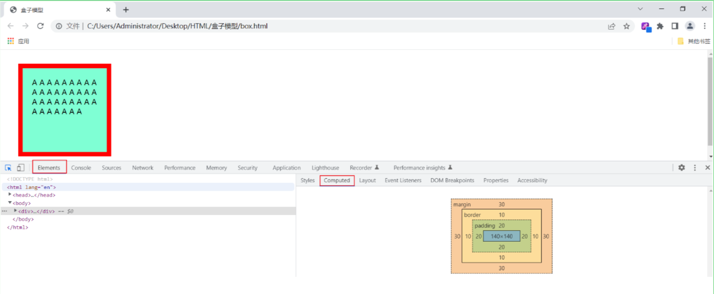
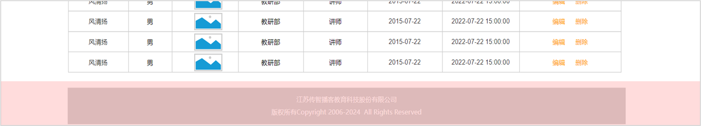

## 前端Web基础（HTML+CSS）

### HTML快速入门

#### Web前端开发介绍

**Web标准**

Web标准也称网页标准，由一系列的标准组成，大部分由W3C（World Wide Web Consortium，万维网联盟）负责制定

**网页的三个组成部分：**

HTML：负责网页的结构（页面元素和内容）

CSS：负责网页的表现（页面元素的外观、位置等页面样式，如：颜色、大小等）

JavaScript：负责网页的行为（交互效果）

#### HTML、CSS介绍

**HTML**

- HTML（HyperText Markup Language）：超文本标记语言
	- 超文本：超越了文本的限制，比普通文本更强大。除了文字信息，还可以定义图片、音频、视频等内容
	- 标记语言：由标签 "<标签名>" 构成的语言
		- HTML标签都是预定义好的。例如：使用\<h1>展示标题，使用\展示图片，使用\<video>展示视频
		- HTML代码直接在浏览器中运行，HTML标签由浏览器解析


**CSS**

CSS（Cascading Style Sheet）：层叠样式表，用于控制页面的样式(表现)


#### HTML入门程序

**HTML快速入门**

1. 新建文本文件，后缀名改为 .html
2. 编写HTML的基本骨架，定义标题
3. 在 \<body> 中填写内容

**HTML基本骨架**


**HTML标签特点**

- html标签不区分大小写，<font color='red'>建议小写</font>
- html标签的属性值使用单引号/<font color='red'>双引号</font>都可以
- html语法结构松散，但是<font color='red'>建议规范书写</font>

### 常见标签和样式（央视新闻案例）

- html页面在渲染展示的时候，是从上往下逐行解析展示的。
- 所以，编写页面的时候，根据页面的布局，从上往下编写。

#### 央视新闻-标题排版

- 标题标签：`<h1> - <h6>`
- 超链接标签：`<a href="" target="">...</a>`
	- `href`：指定资源访问的url
	- `target`：指定在何处打开资源链接
		- `_self`：默认值，在当前页面打开
		- `_blank`：在空白页面打开

**示例代码：**

```html
<!DOCTYPE html>
<html lang="en">
  <head>
    <meta charset="UTF-8" />
    <meta name="viewport" content="width=device-width, initial-scale=1.0" />
    <title>【新思想引领新征程】推进长江十年禁渔 谱写长江大保护新篇章</title>
  </head>
  <body>
    <!-- 定义一个标题, 标题内容: 【新思想引领新征程】推进长江十年禁渔 谱写长江大保护新篇章 -->
    <h1>【新思想引领新征程】推进长江十年禁渔 谱写长江大保护新篇章</h1>

    <!-- 定义一个超链接, 里面展示 央视网 -->
    <!-- 
    a 超链接标签:
      href: 链接地址 - url地址
      target: 打开方式 
        _blank: 新窗口打开
        _self: 本窗口打开(默认)
    -->
    <a href="https://www.cctv.com" target="_blank">央视网</a>
    2024年05月15日 20:07
  </body>
</html>
```

#### 央视新闻-标题样式

**CSS引入方式**

- 行内样式：写在标签的style属性中（`<h1 style="...">`）（<font color='red'>配合JavaScript使用</font>）
- 内部样式：写在style标签中（`<style> … </style>`）（<font color='red'>可以写在页面任何位置，但通常约定写在head标签中</font>）
- 外部样式：写在一个单独的.css文件中（`xxx.css   <link href="...">`）（<font color='red'>需要通过 link 标签在网页中引入</font>）

**颜色表示**

| **表示方式**   | **属性值**    | **说明**                             | **示例**                           |
| -------------- | ------------- | ------------------------------------ | ---------------------------------- |
| 关键字         | 颜色英文单词  | red、green、blue                     | red、green、blue...                |
| rgb表示法      | rgb(r,g,b)    | 红绿蓝三原色，取值：0-255            | rgb(0,0,0)、rgb(255,0,0)           |
| rgba表示法     | rgba(r,g,b,a) | 红绿蓝三原色，a表示透明度，取值：0-1 | rgba(0,0,0,0.3)、rgba(255,0,0,0.5) |
| 十六进制表示法 | #rrggbb       | #开头，将数字转换成十六进制表示      | #000000、#ff0000，简写：#000、#f00 |

**颜色属性**

- `color`: 设置文本内容的颜色

**示例代码：**

```html
<!DOCTYPE html>
<html lang="en">
  <head>
    <meta charset="UTF-8" />
    <meta name="viewport" content="width=device-width, initial-scale=1.0" />
    <title>【新思想引领新征程】推进长江十年禁渔 谱写长江大保护新篇章</title>
    <!-- 方式二: 内部样式 -->
    <style>
      span {
        /* 关键字 */
        /* color: gray; */

        /* RGB表示法 */
        /* color: rgb(255, 120, 0); */

        /* RGBA表示法 */
        /* color: rgba(255, 120, 0, 0); */

        /* 十六进制表示法 */
        /* color: #0000ff; */
        color: #b2b2b2;
      }
    </style>

    <!-- 方式三: 外部样式 -->
    <!-- <link rel="stylesheet" href="css/news.css"> -->
  </head>

  <body>
    <!-- 定义一个标题, 标题内容: 【新思想引领新征程】推进长江十年禁渔 谱写长江大保护新篇章 -->
    <h1>【新思想引领新征程】推进长江十年禁渔 谱写长江大保护新篇章</h1>

    <!-- 定义一个超链接, 里面展示 央视网 -->
    <a href="https://www.cctv.com" target="_blank">央视网</a>

    <!-- 方式一: 行内样式 -->
    <!-- <span style="color: gray;">2024年05月15日 20:07</span> -->

    <span>2024年05月15日 20:07</span>
  </body>
</html>
```

#### 央视新闻-标题样式（选择器）

**最为常见的三类选择器**

| **选择器**     | **写法**           | **示例**   | **示例说明**                       |
| -------------- | ------------------ | ---------- | ---------------------------------- |
| **元素选择器** | 元素名称 {...}     | h1 {...}   | 选择页面上所有的\<h1>标签          |
| **类选择器**   | .class属性值 {...} | .cls {...} | 选择页面上所有class属性为cls的标签 |
| **id选择器**   | #id属性值 {...}    | #hid {...} | 选择页面上id属性为hid的标签        |

**<font color='cornflowerblue'>优先级：id选择器 -> 类选择器 -> 元素选择器</font>**

**示例代码：**

```html
<!DOCTYPE html>
<html lang="en">
  <head>
    <meta charset="UTF-8" />
    <meta name="viewport" content="width=device-width, initial-scale=1.0" />
    <title>【新思想引领新征程】推进长江十年禁渔 谱写长江大保护新篇章</title>
    <style>
      /* 元素选择器 */
      /*
      span {
        color: #b2b2b2;
      }
      */

      /* 类选择器 */
      /*
      .cls {
        color: #ff0000;
      }
      */

      /* ID选择器 */
      #time {
        color: #b2b2b2;
      }

      a {
        /* 去除超链接下方的下划线 */
        text-decoration: none;
      }
    </style>
  </head>

  <body>
    <!-- 定义一个标题, 标题内容: 【新思想引领新征程】推进长江十年禁渔 谱写长江大保护新篇章 -->
    <h1>【新思想引领新征程】推进长江十年禁渔 谱写长江大保护新篇章</h1>

    <!-- 定义一个超链接, 里面展示 央视网 -->
    <a href="https://www.cctv.com" target="_blank">央视网</a>

    <span class="cls" id="time">2024年05月15日 20:07</span>
  </body>
</html>
```

#### 央视新闻-正文排版

**标签**

`<video>`

- 作用：视频标签
- 属性/说明：
	- src：指定视频的url（绝对路径/相对路径）
	- controls：是否显示播放控件
	- width：宽度（像素/相对于父元素百分比）；备注: 一般width 和 height 我们只会指定一个，另外一个会自动的等比例缩放
	- height：高度（像素/相对于父元素百分比）；备注: 一般width 和 height 我们只会指定一个，另外一个会自动的等比例缩放

``

- 作用：图片标签
- 属性/说明：src, width，height

`<p>`

- 作用：段落标签

**资源路径写法**

绝对路径

- 绝对磁盘路径（D:/xxx.jpg）
- 绝对网络路径（https://xxx.jpg）

相对路径

- 当前目录：./ (可以省略)
- 上一级目录：../

**示例代码：**

```html
<!DOCTYPE html>
<html lang="en">
  <head>
    <meta charset="UTF-8" />
    <meta name="viewport" content="width=device-width, initial-scale=1.0" />
    <title>【新思想引领新征程】推进长江十年禁渔 谱写长江大保护新篇章</title>
    <style>
      #time {
        color: #b2b2b2;
      }

      a {
        /* 去除超链接下方的下划线 */
        text-decoration: none;
      }
    </style>
  </head>

  <body>
    <!-- --------------------------- 新闻标题 -------------------------------- -->
    <!-- 定义一个标题, 标题内容: 【新思想引领新征程】推进长江十年禁渔 谱写长江大保护新篇章 -->
    <h1>【新思想引领新征程】推进长江十年禁渔 谱写长江大保护新篇章</h1>

    <!-- 定义一个超链接, 里面展示 央视网 -->
    <a href="https://www.cctv.com" target="_blank">央视网</a>

    <span class="cls" id="time">2024年05月15日 20:07</span>
    <br /><br />

    <!-- --------------------------- 新闻正文 -------------------------------- -->
    <!-- 定义一个视频, 引入 video/news.mp4 -->
    <!-- 
      video标签属性 
        src: 视频地址
        controls: 显示播放控件
        autoplay: 自动播放
        width: 视频宽度(建议: 宽度和高度只设置一个即可, 另一个会等比例缩放) 
        height: 视频高度
          单位: 
            px: 像素
            %: 百分比 (相对于父元素的百分比)
    -->
    <video src="video/news.mp4" controls width="80%"></video>
    <!-- <audio src="audio/news.mp3" controls></audio> -->

    <p>
      央视网消息（新闻联播）：作为共抓长江大保护的标志性工程，长江十年禁渔今年进入第四年。总书记指出，长江禁渔是为全局计、为子孙谋的重要决策。牢记总书记嘱托，沿江省市持续推进长江水生生物多样性恢复，努力保障退捕渔民就业生活。这段时间，记者深入长江两岸，记录下禁渔工作取得的重要阶段性成效和广大干部群众坚定不移推进长江十年禁渔的扎实行动。
    </p>

    <p>行走在长江沿线，科研人员发现很多可喜现象。</p>

    <!-- 定义一张图片, 引入 img/1.gif -->
    <!-- 
      img标签属性:  
        src: 图片的访问地址
          1. 绝对路径
            1.1 绝对磁盘路径: C:\Users\Administrator\Desktop\img\1.gif (不推荐)
            1.2 绝对网络路径: https://www.baidu.com/img/1.gif
          2. 相对路径
            2.1 ./ : 当前目录 (可以省略) , 如: ./img/1.gif
            2.2 ../: 上一级目录
        width: 图片宽度(建议: 宽度和高度只设置一个即可, 另一个会等比例缩放)
        height: 图片高度
    -->
    

    <p>
      在长江南源，一处小头裸裂尻鱼新的栖息地被发现，鱼的数量大约超3万尾，为水生态保护提供了珍贵数据。
    </p>

    <p>
      在长江中游，追踪显示，人工增殖放流的中华鲟成功入海率已经从45%左右提升至60%以上；鄱阳湖鱼类小型化、低龄化趋势得到遏制，栖息地生存环境得以改善。
    </p>

    <p>
      在长江下游，今年3月起，南京秦淮河入江口首次出现野生中华绒螯蟹大规模洄游现象，种群数量明显增加。
    </p>

    

    <p>水生生物资源恢复向好，见证了长江十年禁渔三年多来的阶段性成果。</p>

    <p>
      实施长江十年禁渔，是以同志为核心的党中央从中华民族长远利益出发作出的重要决策。党的十八大以来，总书记多次深入长江沿线考察调研，详细了解长江十年禁渔的实施情况，他指出，要坚定推进长江十年禁渔，巩固好已经取得的成果。
    </p>

    

    <p>
      按照部署，自2021年1月1日起，在长江干流、大型通江湖泊、重要支流和长江口部分海域实行为期十年的禁渔，常年禁止天然渔业资源的生产性捕捞。禁渔三年多来，相关评估显示，长江干流和鄱阳湖、洞庭湖水生生物完整性指数由禁渔前最差的“无鱼”提升了两个等级。2022年，长江江豚数量达到1249头，实现历史性止跌回升。长江干流水质连续4年全线保持Ⅱ类。
    </p>

    <p>
      实施长江十年禁渔，解决好渔民上岸后的生产生活问题，禁渔才有稳定扎实的社会基础。
    </p>

    

    <p>
      安徽退捕转产的3万多名渔民，在政府的引导下接受就业培训。在当涂县，免费学习养殖技术，养殖生态螃蟹成了退捕渔民的新选择。
    </p>

    <p>
      在拥有洞庭湖超六成水域的湖南岳阳，政府帮扶上岸渔民建起养殖场，发展风干鱼产业，还带领他们学习直播带货，拓宽销路。
    </p>

    <p>
      在渔民退捕上岸的鄱阳湖棠荫岛，当地在继续保护好生态的前提下，正探索规划利用独特的自然资源发展旅游产业。禁渔三年多来，有关部门对23.1万退捕渔民逐一建档立卡，多渠道提升就业、社保水平。
    </p>

    

    <p>
      长江十年禁渔实施以来，沿江省市合力攻坚、久久为功，长江大保护不断向纵深推进，持续巩固禁渔成果。下一步，沿江省市还将加强水生生物重要栖息地修复，建立退捕渔民动态精准帮扶服务，完善跨区域、跨部门执法合作机制，确保一江清水绵延后世、惠泽人民。
    </p>
  </body>
</html>
```

#### 央视新闻-正文样式

**标签**

| **标签**                                  | **作用** | **属性/说明**          |
| ----------------------------------------- | -------- | ---------------------- |
| \<b> / <font color='red'>\<strong></font> | **加粗** | \<strong> 具有强调语义 |
| \<u> / <font color='red'>\<ins></font>    | 下划线   | \<ins> 具有强调语义    |
| \<i> / <font color='red'>\<em></font>     | *倾斜*   | \<em> 具有强调语义     |
| \<s> / <font color='red'>\<del>  </font>  | 删除线   | \<del> 具有强调语义    |

**字符实体**

| **字符实体** | **属性/说明** |
| ------------ | ------------- |
| \&nbsp;      | 空格          |
| \&lt;        | <             |
| \&gt;        | >             |

**CSS属性**

`line-height`：设置行高

`text-indent`：首行缩进

**示例代码：**

```html
<!DOCTYPE html>
<html lang="en">
  <head>
    <meta charset="UTF-8" />
    <meta name="viewport" content="width=device-width, initial-scale=1.0" />
    <title>【新思想引领新征程】推进长江十年禁渔 谱写长江大保护新篇章</title>
    <style>
      #time {
        color: #b2b2b2;
      }

      a {
        /* 去除超链接下方的下划线 */
        text-decoration: none;
      }

      p {
        /* 设置行高 */
        line-height: 2; /* 行高: 2倍行高 */

        /* 设置首行缩进 */
        text-indent: 2em; /* 首行缩进2个字符 */
      }
    </style>
  </head>

  <body>
    <!-- --------------------------- 新闻标题 -------------------------------- -->
    <!-- 定义一个标题, 标题内容: 【新思想引领新征程】推进长江十年禁渔 谱写长江大保护新篇章 -->
    <h1>【新思想引领新征程】推进长江十年禁渔 谱写长江大保护新篇章</h1>

    <!-- 定义一个超链接, 里面展示 央视网 -->
    <a href="https://www.cctv.com" target="_blank">央视网</a>

    <span class="cls" id="time">2024年05月15日 20:07</span>
    <br /><br />

    <!-- --------------------------- 新闻正文 -------------------------------- -->
    <!-- 定义一个视频, 引入 video/news.mp4 -->
    <video src="video/news.mp4" controls width="80%"></video>

    <p>
      <!-- <b>央视网消息</b> -->
      <!-- <strong>&nbsp;&nbsp;&nbsp;&nbsp;央视网消息</strong> -->
      <strong>央视网消息</strong>
      （新闻联播）：作为共抓长江大保护的标志性工程，长江十年禁渔今年进入第四年。总书记指出，长江禁渔是为全局计、为子孙谋的重要决策。牢记总书记嘱托，沿江省市持续推进长江水生生物多样性恢复，努力保障退捕渔民就业生活。这段时间，记者深入长江两岸，记录下禁渔工作取得的重要阶段性成效和广大干部群众坚定不移推进长江十年禁渔的扎实行动。
    </p>

    <p>行走在长江沿线，科研人员发现很多可喜现象。</p>

    <!-- 定义一张图片, 引入 img/1.gif -->
    

    <p>
      在长江南源，一处小头裸裂尻鱼新的栖息地被发现，鱼的数量大约超3万尾，为水生态保护提供了珍贵数据。
    </p>

    <p>
      在长江中游，追踪显示，人工增殖放流的中华鲟成功入海率已经从45%左右提升至60%以上；鄱阳湖鱼类小型化、低龄化趋势得到遏制，栖息地生存环境得以改善。
    </p>

    <p>
      在长江下游，今年3月起，南京秦淮河入江口首次出现野生中华绒螯蟹大规模洄游现象，种群数量明显增加。
    </p>

    

    <p>水生生物资源恢复向好，见证了长江十年禁渔三年多来的阶段性成果。</p>

    <p>
      实施长江十年禁渔，是以同志为核心的党中央从中华民族长远利益出发作出的重要决策。党的十八大以来，总书记多次深入长江沿线考察调研，详细了解长江十年禁渔的实施情况，他指出，要坚定推进长江十年禁渔，巩固好已经取得的成果。
    </p>

    

    <p>
      按照部署，自2021年1月1日起，在长江干流、大型通江湖泊、重要支流和长江口部分海域实行为期十年的禁渔，常年禁止天然渔业资源的生产性捕捞。禁渔三年多来，相关评估显示，长江干流和鄱阳湖、洞庭湖水生生物完整性指数由禁渔前最差的“无鱼”提升了两个等级。2022年，长江江豚数量达到1249头，实现历史性止跌回升。长江干流水质连续4年全线保持Ⅱ类。
    </p>

    <p>
      实施长江十年禁渔，解决好渔民上岸后的生产生活问题，禁渔才有稳定扎实的社会基础。
    </p>

    

    <p>
      安徽退捕转产的3万多名渔民，在政府的引导下接受就业培训。在当涂县，免费学习养殖技术，养殖生态螃蟹成了退捕渔民的新选择。
    </p>

    <p>
      在拥有洞庭湖超六成水域的湖南岳阳，政府帮扶上岸渔民建起养殖场，发展风干鱼产业，还带领他们学习直播带货，拓宽销路。
    </p>

    <p>
      在渔民退捕上岸的鄱阳湖棠荫岛，当地在继续保护好生态的前提下，正探索规划利用独特的自然资源发展旅游产业。禁渔三年多来，有关部门对23.1万退捕渔民逐一建档立卡，多渠道提升就业、社保水平。
    </p>

    

    <p>
      长江十年禁渔实施以来，沿江省市合力攻坚、久久为功，长江大保护不断向纵深推进，持续巩固禁渔成果。下一步，沿江省市还将加强水生生物重要栖息地修复，建立退捕渔民动态精准帮扶服务，完善跨区域、跨部门执法合作机制，确保一江清水绵延后世、惠泽人民。
    </p>
  </body>
</html>
```

#### 央视新闻-整体布局

**需求**

通过css使新闻网页的整体内容，占用整个页面宽度的70%，并且横向居中展示。

**实现代码：**

```html
<!DOCTYPE html>
<html lang="en">
  <head>
    <meta charset="UTF-8" />
    <meta name="viewport" content="width=device-width, initial-scale=1.0" />
    <title>【新思想引领新征程】推进长江十年禁渔 谱写长江大保护新篇章</title>
    <style>
      #time {
        color: #b2b2b2;
      }

      a {
        /* 去除超链接下方的下划线 */
        text-decoration: none;
      }

      p {
        /* 设置行高 */
        line-height: 2; /* 行高: 2倍行高 */

        /* 设置首行缩进 */
        text-indent: 2em; /* 首行缩进2个字符 */
      }

      /* 整体版面居中显示 */
      #content-container {
        width: 70%; /* 宽度: 70% */
        margin: 0 auto;
      }
    </style>
  </head>

  <body>
    <div id="content-container">
      <!-- --------------------------- 新闻标题 -------------------------------- -->
      <!-- 定义一个标题, 标题内容: 【新思想引领新征程】推进长江十年禁渔 谱写长江大保护新篇章 -->
      <h1>【新思想引领新征程】推进长江十年禁渔 谱写长江大保护新篇章</h1>

      <!-- 定义一个超链接, 里面展示 央视网 -->
      <a href="https://www.cctv.com" target="_blank">央视网</a>

      <span class="cls" id="time">2024年05月15日 20:07</span>
      <br /><br />

      <!-- --------------------------- 新闻正文 -------------------------------- -->
      <!-- 定义一个视频, 引入 video/news.mp4 -->
      <video src="video/news.mp4" controls width="100%"></video>

      <p>
        <strong>央视网消息</strong>
        （新闻联播）：作为共抓长江大保护的标志性工程，长江十年禁渔今年进入第四年。总书记指出，长江禁渔是为全局计、为子孙谋的重要决策。牢记总书记嘱托，沿江省市持续推进长江水生生物多样性恢复，努力保障退捕渔民就业生活。这段时间，记者深入长江两岸，记录下禁渔工作取得的重要阶段性成效和广大干部群众坚定不移推进长江十年禁渔的扎实行动。
      </p>

      <p>行走在长江沿线，科研人员发现很多可喜现象。</p>

      <!-- 定义一张图片, 引入 img/1.gif -->
      

      <p>
        在长江南源，一处小头裸裂尻鱼新的栖息地被发现，鱼的数量大约超3万尾，为水生态保护提供了珍贵数据。
      </p>

      <p>
        在长江中游，追踪显示，人工增殖放流的中华鲟成功入海率已经从45%左右提升至60%以上；鄱阳湖鱼类小型化、低龄化趋势得到遏制，栖息地生存环境得以改善。
      </p>

      <p>
        在长江下游，今年3月起，南京秦淮河入江口首次出现野生中华绒螯蟹大规模洄游现象，种群数量明显增加。
      </p>

      

      <p>水生生物资源恢复向好，见证了长江十年禁渔三年多来的阶段性成果。</p>

      <p>
        实施长江十年禁渔，是以同志为核心的党中央从中华民族长远利益出发作出的重要决策。党的十八大以来，总书记多次深入长江沿线考察调研，详细了解长江十年禁渔的实施情况，他指出，要坚定推进长江十年禁渔，巩固好已经取得的成果。
      </p>

      

      <p>
        按照部署，自2021年1月1日起，在长江干流、大型通江湖泊、重要支流和长江口部分海域实行为期十年的禁渔，常年禁止天然渔业资源的生产性捕捞。禁渔三年多来，相关评估显示，长江干流和鄱阳湖、洞庭湖水生生物完整性指数由禁渔前最差的“无鱼”提升了两个等级。2022年，长江江豚数量达到1249头，实现历史性止跌回升。长江干流水质连续4年全线保持Ⅱ类。
      </p>

      <p>
        实施长江十年禁渔，解决好渔民上岸后的生产生活问题，禁渔才有稳定扎实的社会基础。
      </p>

      

      <p>
        安徽退捕转产的3万多名渔民，在政府的引导下接受就业培训。在当涂县，免费学习养殖技术，养殖生态螃蟹成了退捕渔民的新选择。
      </p>

      <p>
        在拥有洞庭湖超六成水域的湖南岳阳，政府帮扶上岸渔民建起养殖场，发展风干鱼产业，还带领他们学习直播带货，拓宽销路。
      </p>

      <p>
        在渔民退捕上岸的鄱阳湖棠荫岛，当地在继续保护好生态的前提下，正探索规划利用独特的自然资源发展旅游产业。禁渔三年多来，有关部门对23.1万退捕渔民逐一建档立卡，多渠道提升就业、社保水平。
      </p>

      

      <p>
        长江十年禁渔实施以来，沿江省市合力攻坚、久久为功，长江大保护不断向纵深推进，持续巩固禁渔成果。下一步，沿江省市还将加强水生生物重要栖息地修复，建立退捕渔民动态精准帮扶服务，完善跨区域、跨部门执法合作机制，确保一江清水绵延后世、惠泽人民。
      </p>
    </div>
  </body>
</html>
```

#### CSS盒子模型

**盒子模型介绍**

- 盒子：页面中所有的元素（标签），都可以看做是一个 <font color='red'>盒子</font>，由盒子将页面中的元素包含在一个矩形区域内，通过盒子的视角更方便的进行页面布局
- 盒子模型组成：<font color='red'>内容区域（content）</font>、<font color='red'>内边距区域（padding）</font>、<font color='red'>边框区域（border）</font>、<font color='red'>外边距区域（margin）</font>


CSS盒子模型，其实和日常生活中的包装盒是非常类似的，就比如：


盒子的大小，其实就包括三个部分： border、padding、content，而margin外边距是不包括在盒子之内的

**布局标签**

- 布局标签：实际开发网页中，会大量频繁的使用 div 和 span 这两个没有语义的布局标签。
- 标签：`<div>` `<span>`
- 特点：
- `<div>`标签：
	- 一行只显示一个（独占一行）
	- 宽度默认是父元素的宽度，高度默认由内容撑开
	- 可以设置宽高（`width`、`height`）
- `<span>`标签：
	- 一行可以显示多个
	- 宽度和高度默认由内容撑开
	- 不可以设置宽高（`width`、`height`）

**示例代码：**

```html
<!DOCTYPE html>
<html lang="en">
  <head>
    <meta charset="UTF-8" />
    <meta http-equiv="X-UA-Compatible" content="IE=edge" />
    <meta name="viewport" content="width=device-width, initial-scale=1.0" />
    <title>盒子模型</title>
    <style>
      div {
        width: 200px; /* 宽度 */
        height: 200px; /* 高度 */
        box-sizing: border-box; /* 指定width height为盒子的高宽 */
        background-color: aquamarine; /* 背景色 */

        padding: 20px 20px 20px 20px; /* 内边距, 上 右 下 左 , 边距都一行, 可以简写: padding: 20px;*/
        border: 10px solid red; /* 边框, 宽度 线条类型 颜色 */
        margin: 30px 30px 30px 30px; /* 外边距, 上 右 下 左 , 边距都一行, 可以简写: margin: 30px; */
      }
    </style>
  </head>

  <body>
    <div>
      A A A A A A A A A A A A A A A A A A A A A A A A A A A A A A A A A A
    </div>
  </body>
</html>
```

代码编写好了, 可以通过浏览器打开该页面, 通过开发者工具,我们就可以看到盒子的大小 , 以及盒子各个组成部分(内容、内边距、边框、外边距)：


我们也可以，通过浏览器的开发者工具，清晰的看到这个盒子，以及每一个部分的大小：



**备注：**

- 上述的padding、margin属性值，可以是4个值、也可以是两个值、也可以是一个值，具体的含义如下：
- `padding: 20px 20px 20px 20px;`  -------> 表示上、右、下、左都是20px；
- `padding: 20px 10px;` ----------------------> 表示上下是20px，左右是10px；
- `padding: 20px;` -----------------------------> 表示上、右、下、左都是20px；

**<font color='red'>注意事项：</font>**

- 如果只需要设置某一个方位的边框、内边距、外边距，可以在属性名后加上 –位置，如：padding-top、padding-left、padding-right …

### 常见标签和样式（Tlias案例）

#### Tlias案例-顶部导航栏制作

**页面原型：**


**给AI的提示词：**

```html
你是一名前端开发工程师，帮我生成一个HTML页面，页面整体有4个部分组成，先来实现第一个部分：
1. 顶栏
内容：包含左侧的标题“Tlias智能学习辅助系统”，字体需加大加粗，以突出显示；右侧则放置“退出登录”文字链接。
布局：确保标题与退出登录文本位于同一行内，分别左对齐与右对齐 。
```

**页面代码：**

```html
<!DOCTYPE html>
<html lang="zh-CN">
  <head>
    <meta charset="UTF-8" />
    <meta name="viewport" content="width=device-width, initial-scale=1.0" />
    <title>Tlias智能学习辅助系统</title>
    <style>
      body {
        margin: 0;
      }

      /* 顶栏样式 */
      .header {
        display: flex;
        justify-content: space-between;
        align-items: center;
        background-color: #f1f1f1;
        padding: 10px 20px;
        box-shadow: 0 2px 5px rgba(0, 0, 0, 0.1);
      }

      /* 加大加粗标题 */
      .header h1 {
        margin: 0;
        font-size: 24px;
        font-weight: bold;
      }

      /* 文本链接样式 */
      .header a {
        text-decoration: none;
        color: #333;
        font-size: 16px;
      }
    </style>
  </head>
  <body>
    <!-- 顶栏 -->
    <div class="header">
      <h1>Tlias智能学习辅助系统</h1>
      <a href="#">退出登录</a>
    </div>

    <!-- 其他部分可以在这里添加 -->
  </body>
</html>
```

#### Flex布局

那在上述的案例代码中，其实我们用到了一种布局模式，叫 **flex布局**

- flex是flexible Box的缩写，意为"弹性布局"。采用flex布局的元素，称为Flex容器（container），它的所有子元素自动成为容器成员，称为Flex项目（item）

- <font color='red'>通过给父容器添加flex属性,来控制子元素的位置和排列方式</font>


**示例代码：**

```html
<!DOCTYPE html>
<html lang="en">
  <head>
    <meta charset="UTF-8" />
    <meta name="viewport" content="width=device-width, initial-scale=1.0" />
    <title>Document</title>
    <style>
      #container {
        display: flex;
        /* justify-content: space-between; */ /* 先两边贴边，再平分剩余空间 */
        /* justify-content: flex-start;*/ /* 从头开始排列  */
        /* justify-content: flex-end; */ /* 从尾开始排列 */
        /* justify-content: center; */ /* 居中排列 */
        /* justify-content: space-around; */ /* 两边留白，中间平分，平分剩余空间 */
        flex-direction: row;
        justify-content: space-between;
        background-color: #aeea6a;
        width: 400px;
        height: 300px;
      }

      #container div {
        background-color: #e866ef;
        width: 100px;
        height: 50px;
      }
    </style>
  </head>
  <body>
    <div id="container">
      <div>Flex Item</div>
      <div>Flex Item</div>
      <div>Flex Item</div>
    </div>
  </body>
</html>
```

**flex布局相关的CSS样式**


如果主轴设置为row，其实就是横向布局； 主轴设置为column，其实就是纵向布局


#### 常见的标签和样式-表单标签

**表单：**在网页中主要负责数据采集功能，如 注册、登录等数据采集

**表单项：**表单项是组成表单的基本元素，允许用户输入或选择数据，并将这些数据提交给服务器


**表单标签**

- 表单场景: 表单就是在网页中负责数据采集功能的，如：注册、登录的表单。 
- 表单标签: `<form>`
- 表单属性:
	- `action`: 规定表单提交时，向何处发送表单数据，表单提交的URL。
	- `method`: 规定用于发送表单数据的方式，常见为： GET、POST。
		- `GET`：表单数据是拼接在url后面的， 如： xxxxxxxxxxx?username=Tom&age=12，url中能携带的表单数据大小是有限制的。
		- `POST`： 表单数据是在请求体（消息体）中携带的，大小没有限制。
- 表单项标签: 不同类型的input元素、下拉列表、文本域等。
	- `input`: 定义表单项，通过type属性控制输入形式
	- `select`: 定义下拉列表
	- `textarea`: 定义文本域

**GET方式提交表单：**

```html
<!DOCTYPE html>
<html lang="en">
  <head>
    <meta charset="UTF-8" />
    <meta http-equiv="X-UA-Compatible" content="IE=edge" />
    <meta name="viewport" content="width=device-width, initial-scale=1.0" />
    <title>HTML-表单</title>
  </head>
  <body>
    <!-- 
      form表单属性: 
        action: 表单提交的url, 往何处提交数据 . 如果不指定, 默认提交到当前页面
        method: 表单的提交方式 .
          get: 在url后面拼接表单数据, 比如: ?username=Tom&age=12 , url长度有限制 . 默认值
          post: 在消息体(请求体)中传递的, 参数大小无限制的.
    -->

    <form action="" method="get">
      用户名: <input type="text" name="username" /> 
        
      年龄: <input type="text" name="age" />
        
      <input type="submit" value="提交" />
    </form>
  </body>
</html>
```

表单编写完毕之后，通过浏览器打开此表单，然后再表单项中录入值之后，点击提交，我们会看到表单的数据在url后面提交到服务端，格式为：?username=Tom&age=12


**POST方式提交表单：**

```html
<!DOCTYPE html>
<html lang="en">
  <head>
    <meta charset="UTF-8" />
    <meta http-equiv="X-UA-Compatible" content="IE=edge" />
    <meta name="viewport" content="width=device-width, initial-scale=1.0" />
    <title>HTML-表单</title>
  </head>
  <body>
    <!-- 
      form表单属性: 
        action: 表单提交的url, 往何处提交数据 . 如果不指定, 默认提交到当前页面
        method: 表单的提交方式 .
          get: 在url后面拼接表单数据, 比如: ?username=Tom&age=12 , url长度有限制 . 默认值
          post: 在消息体(请求体)中传递的, 参数大小无限制的.
    -->

    <form action="" method="post">
      用户名: <input type="text" name="username" />

      年龄: <input type="text" name="age" />

      <input type="submit" value="提交" />
    </form>
  </body>
</html>
```

表单编写完毕之后，通过浏览器打开此表单，然后再表单项中录入值之后，点击提交，我们会看到表单的数据在url后面提交到服务端，格式为：?username=Tom&age=12


**<font color='red'>注意事项：</font>**

表单中的所有表单项，要想能够正常的采集数据，在提交的时候能提交到服务端，表单项必须指定name属性。 否则，无法提交该表单项

```html
用户名: <input type="text" name="username">
```

#### 常见的标签和样式-表单项标签

在一个表单中，可以存在很多的表单项，而虽然表单项的形式各式各样，但是表单项的标签其实就只有三个，分别是：

- `<input>`: 表单项 , 通过type属性控制输入形式。

| type取值                 | 描述                                 |
| ------------------------ | ------------------------------------ |
| text                     | 默认值，定义单行的输入字段           |
| password                 | 定义密码字段                         |
| radio                    | 定义单选按钮                         |
| checkbox                 | 定义复选框                           |
| file                     | 定义文件上传按钮                     |
| date/time/datetime-local | 定义日期/时间/日期时间               |
| number                   | 定义数字输入框                       |
| email                    | 定义邮件输入框                       |
| hidden                   | 定义隐藏域                           |
| submit / reset / button  | 定义提交按钮 / 重置按钮 / 可点击按钮 |

- `<select>`: 定义下拉列表, `<option>` 定义列表项
- `<textarea>`: 文本域

**示例代码：**

创建一个新的表单项的html文件，具体内容如下：

```html
<!DOCTYPE html>
<html lang="en">
  <head>
    <meta charset="UTF-8" />
    <meta http-equiv="X-UA-Compatible" content="IE=edge" />
    <meta name="viewport" content="width=device-width, initial-scale=1.0" />
    <title>HTML-表单项标签</title>
  </head>
  <body>
    <!-- value: 表单项提交的值 -->
    <form action="/save" method="post">
      姓名: <input type="text" name="name" /> <br /><br />

      密码: <input type="password" name="password" /> <br /><br />

      性别: <input type="radio" name="gender" value="1" /> 男
      <label><input type="radio" name="gender" value="2" /> 女 </label>
      <br /><br />

      爱好:
      <label><input type="checkbox" name="hobby" value="java" /> java </label>
      <label><input type="checkbox" name="hobby" value="game" /> game </label>
      <label><input type="checkbox" name="hobby" value="sing" /> sing </label>
      <br /><br />

      图像: <input type="file" name="image" /> <br /><br />

      生日: <input type="date" name="birthday" /> <br /><br />

      时间: <input type="time" name="time" /> <br /><br />

      日期时间: <input type="datetime-local" name="datetime" /> <br /><br />

      学历:
      <select name="degree">
        <option value="">----------- 请选择 -----------</option>
        <option value="1">大专</option>
        <option value="2">本科</option>
        <option value="3">硕士</option>
        <option value="4">博士</option>
      </select>
      <br /><br />

      描述: <textarea name="description" cols="30" rows="10"></textarea>
      <br /><br />

      <input type="hidden" name="id" value="1" />

      <!-- 表单常见按钮 -->
      <input type="button" value="按钮" />
      <input type="reset" value="重置" />
      <input type="submit" value="提交" />
      <br />
    </form>
  </body>
</html>
```

`<label>`标签用于为表单元素（如输入框、复选框、单选按钮等）定义标签文本，主要作用是增强表单的可用性和可访问性

- **<font color='cornflowerblue'>提升用户体验</font>**：扩大了可点击区域，用户点击文本即可操作对应的表单元素，尤其对复选框和单选按钮非常友好
- **<font color='cornflowerblue'>增强可访问性</font>**：屏幕阅读器会将`<label>`文本与关联的表单元素关联起来，帮助视力障碍用户理解表单用途

通过浏览器打开上述的表单项html文件，最终展示出的表单信息如下：


而对于`<input type="hidden">`，是一个隐藏域，在表单中并不会显示出来，但是在提交表单的时候，是会提交到服务端的。 接下来，我们就点击提交按钮，来提交当前表单，看看提交的数据：


#### Tlias案例-搜索表单区域

**页面原型：**


**AI提示词：**

```html
再继续帮我生成第二个部分: 
2. 搜索表单区域
组成：包括三个输入控件和两个操作按钮。输入控件具体为：姓名（文本输入框）、性别（下拉选择，选项包括 男/女， 默认为空）、职位（下拉选择，选项包括班主任、讲师、学工主管、教研主管、咨询师， 默认为空）。
按钮：“查询”与“清空”按钮，用于提交表单或重置表单项 。
布局：所有表单项及按钮需水平排列于一行 ，确保美观大气 。
```

**页面代码：**

```html
<!DOCTYPE html>
<html lang="zh-CN">
  <head>
    <meta charset="UTF-8" />
    <meta name="viewport" content="width=device-width, initial-scale=1.0" />
    <title>Tlias智能学习辅助系统</title>
    <style>
      body {
        margin: 0;
      }

      /* 顶栏样式 */
      .header {
        display: flex;
        justify-content: space-between;
        align-items: center;
        background-color: #f1f1f1;
        padding: 10px 20px;
        box-shadow: 0 2px 5px rgba(0, 0, 0, 0.1);
      }

      /* 加大加粗标题 */
      .header h1 {
        margin: 0;
        font-size: 24px;
        font-weight: bold;
      }

      /* 文本链接样式 */
      .header a {
        text-decoration: none;
        color: #333;
        font-size: 16px;
      }

      /* 搜索表单区域 */
      .search-form {
        display: flex;
        align-items: center;
        padding: 20px;
        background-color: #f9f9f9;
      }

      /* 表单控件样式 */
      .search-form input[type="text"],
      .search-form select {
        margin-right: 10px;
        padding: 5px 10px;
        border: 1px solid #ccc;
        border-radius: 4px;
        width: 200px;
      }

      /* 按钮样式 */
      .search-form button {
        padding: 5px 15px;
        margin-left: 10px;
        background-color: #007bff;
        color: white;
        border: none;
        border-radius: 4px;
        cursor: pointer;
      }

      /* 清空按钮样式 */
      .search-form button.clear {
        background-color: #6c757d;
      }
    </style>
  </head>
  <body>
    <!-- 顶栏 -->
    <div class="header">
      <h1>Tlias智能学习辅助系统</h1>
      <a href="#">退出登录</a>
    </div>

    <!-- 搜索表单区域 -->
    <form class="search-form">
      <input type="text" name="name" placeholder="姓名" />
      <select name="gender">
        <option value="">性别</option>
        <option value="1">男</option>
        <option value="2">女</option>
      </select>
      <select name="job">
        <option value="">职位</option>
        <option value="1">班主任</option>
        <option value="2">讲师</option>
        <option value="3">学工主管</option>
        <option value="4">教研主管</option>
        <option value="5">咨询师</option>
      </select>
      <button type="submit">查询</button>
      <button type="reset" class="clear">清空</button>
    </form>
  </body>
</html>
```

**页面效果：**


#### Tlias案例-表格数据展示区域

**页面原型：**


**AI提示词：**

```html
再继续帮我生成第三个部分: 
3. 表格展示区
表格结构：展示列包括姓名、性别（显示男/女）、头像（小图标展示）、职位（显示班主任/讲师/学工主管/教研主管/咨询师）、入职日期、最后操作时间、操作（里包含两个按钮 编辑 与 删除）。
数据模拟：基于《笑傲江湖》小说人物生成4条虚拟数据，每条数据应包含上述所有列的信息，以体现实际应用场景 。
样式：可适当调整表格样式，确保美观大气。
```

**页面代码：**

```html
<!DOCTYPE html>
<html lang="zh-CN">
  <head>
    <meta charset="UTF-8" />
    <meta name="viewport" content="width=device-width, initial-scale=1.0" />
    <title>Tlias智能学习辅助系统</title>
    <style>
      body {
        margin: 0;
      }

      /* 顶栏样式 */
      .header {
        display: flex;
        justify-content: space-between;
        align-items: center;
        background-color: #f1f1f1;
        padding: 10px 20px;
        box-shadow: 0 2px 5px rgba(0, 0, 0, 0.1);
      }

      /* 加大加粗标题 */
      .header h1 {
        margin: 0;
        font-size: 24px;
        font-weight: bold;
      }

      /* 文本链接样式 */
      .header a {
        text-decoration: none;
        color: #333;
        font-size: 16px;
      }

      /* 搜索表单区域 */
      .search-form {
        display: flex;
        align-items: center;
        padding: 20px;
        background-color: #f9f9f9;
      }

      /* 表单控件样式 */
      .search-form input[type="text"],
      .search-form select {
        margin-right: 10px;
        padding: 5px 10px;
        border: 1px solid #ccc;
        border-radius: 4px;
        width: 200px;
      }

      /* 按钮样式 */
      .search-form button {
        padding: 5px 15px;
        margin-left: 10px;
        background-color: #007bff;
        color: white;
        border: none;
        border-radius: 4px;
        cursor: pointer;
      }

      /* 清空按钮样式 */
      .search-form button.clear {
        background-color: #6c757d;
      }

      /* 表格样式 */
      .table {
        min-width: 100%;
        border-collapse: collapse;
        margin: 0 20px;
      }

      /* 设置表格单元格边框 */
      .table td,
      .table th {
        border: 1px solid #ddd;
        padding: 8px;
        text-align: center;
      }

      /* 头像样式 */
      .avatar {
        width: 50px;
        height: 50px;
        object-fit: cover;
        border-radius: 50%;
      }
    </style>
  </head>
  <body>
    <!-- 顶栏 -->
    <div class="header">
      <h1>Tlias智能学习辅助系统</h1>
      <a href="#">退出登录</a>
    </div>

    <!-- 搜索表单区域 -->
    <form class="search-form" action="#" method="post">
      <input type="text" name="name" placeholder="姓名" />
      <select name="gender">
        <option value="">性别</option>
        <option value="1">男</option>
        <option value="2">女</option>
      </select>
      <select name="job">
        <option value="">职位</option>
        <option value="1">班主任</option>
        <option value="2">讲师</option>
        <option value="3">学工主管</option>
        <option value="4">教研主管</option>
        <option value="5">咨询师</option>
      </select>
      <button type="submit">查询</button>
      <button type="reset" class="clear">清空</button>
    </form>

    <!-- 表格展示区 -->
    <table class="table table-striped table-bordered">
      <!-- 表头 -->
      <thead>
        <tr>
          <th>姓名</th>
          <th>性别</th>
          <th>头像</th>
          <th>职位</th>
          <th>入职日期</th>
          <th>最后操作时间</th>
          <th>操作</th>
        </tr>
      </thead>
      <!-- 表体 -->
      <tbody>
        <tr>
          <td>令狐冲</td>
          <td>男</td>
          <td>
            
          </td>
          <td>讲师</td>
          <td>2021-03-15</td>
          <td>2023-07-30T12:00:00Z</td>
          <td class="btn-group">
            <button>编辑</button>
            <button>删除</button>
          </td>
        </tr>
        <tr>
          <td>任盈盈</td>
          <td>女</td>
          <td>
            
          </td>
          <td>学工主管</td>
          <td>2020-04-10</td>
          <td>2023-07-29T15:00:00Z</td>
          <td class="btn-group">
            <button>编辑</button>
            <button>删除</button>
          </td>
        </tr>
        <tr>
          <td>岳不群</td>
          <td>男</td>
          <td>
            
          </td>
          <td>教研主管</td>
          <td>2019-01-01</td>
          <td>2023-07-30T10:00:00Z</td>
          <td class="btn-group">
            <button>编辑</button>
            <button>删除</button>
          </td>
        </tr>
        <tr>
          <td>宁中则</td>
          <td>女</td>
          <td>
            
          </td>
          <td>班主任</td>
          <td>2018-06-01</td>
          <td>2023-07-29T09:00:00Z</td>
          <td class="btn-group">
            <button>编辑</button>
            <button>删除</button>
          </td>
        </tr>
      </tbody>
    </table>
  </body>
</html>
```

**页面效果：**


**表格标签**

| 标签      | 描述                                                         |
| --------- | ------------------------------------------------------------ |
| `<table>` | 定义表格整体                                                 |
| `<thead>` | 用于定义表格头部(可选)                                       |
| `<tbody>` | 定义表格中的主体部分(可选)                                   |
| `<tr>`    | 表格的行，可以包裹多个 `<td>`                                |
| `<td>`    | 表格单元格(普通)，可以包裹内容；如果是表头单元格，可以替换为 `<th>` |

#### Tlias案例-底部版权区域

**页面原型：**



**AI提示词：**

```html
再继续帮我生成第二个部分: 
4. 页脚版权区域
内容：第一行显示公司全称“江苏传智播客教育科技股份有限公司”；第二行展示版权信息，“版权所有 Copyright 2006-2024 All Rights Reserved”。
设计：该区域应具有灰色背景，字体颜色为白色，居中对齐，以营造专业且统一的视觉效果 。
```

**页面代码：**

```html
<!DOCTYPE html>
<html lang="zh-CN">
  <head>
    <meta charset="UTF-8" />
    <meta name="viewport" content="width=device-width, initial-scale=1.0" />
    <title>Tlias智能学习辅助系统</title>
    <style>
      body {
        margin: 0;
      }

      /* 顶栏样式 */
      .header {
        display: flex;
        justify-content: space-between;
        align-items: center;
        background-color: #f1f1f1;
        padding: 10px 20px;
        box-shadow: 0 2px 5px rgba(0, 0, 0, 0.1);
      }

      /* 加大加粗标题 */
      .header h1 {
        margin: 0;
        font-size: 24px;
        font-weight: bold;
      }

      /* 文本链接样式 */
      .header a {
        text-decoration: none;
        color: #333;
        font-size: 16px;
      }

      /* 搜索表单区域 */
      .search-form {
        display: flex;
        align-items: center;
        padding: 20px;
        background-color: #f9f9f9;
      }

      /* 表单控件样式 */
      .search-form input[type="text"],
      .search-form select {
        margin-right: 10px;
        padding: 5px 10px;
        border: 1px solid #ccc;
        border-radius: 4px;
        width: 200px;
      }

      /* 按钮样式 */
      .search-form button {
        padding: 5px 15px;
        margin-left: 10px;
        background-color: #007bff;
        color: white;
        border: none;
        border-radius: 4px;
        cursor: pointer;
      }

      /* 清空按钮样式 */
      .search-form button.clear {
        background-color: #6c757d;
      }

      .table {
        min-width: 100%;
        border-collapse: collapse;
        margin: 0 20px;
      }

      /* 设置表格单元格边框 */
      .table td,
      .table th {
        border: 1px solid #ddd;
        padding: 8px;
        text-align: center;
      }

      .avatar {
        width: 50px;
        height: 50px;
        object-fit: cover;
        border-radius: 50%;
      }

      /* 页脚版权区域 */
      .footer {
        background-color: #8f8c8c;
        color: white;
        text-align: center;
        padding: 20px 0;
        margin-top: 30px;
      }

      .footer .company-name {
        font-size: 1.1em;
        font-weight: bold;
      }

      .footer .copyright {
        font-size: 0.9em;
      }
    </style>
  </head>
  <body>
    <!-- 顶栏 -->
    <div class="header">
      <h1>Tlias智能学习辅助系统</h1>
      <a href="#">退出登录</a>
    </div>

    <!-- 搜索表单区域 -->
    <form class="search-form" action="#" method="post">
      <input type="text" name="name" placeholder="姓名" />
      <select name="gender">
        <option value="">性别</option>
        <option value="1">男</option>
        <option value="2">女</option>
      </select>
      <select name="job">
        <option value="">职位</option>
        <option value="1">班主任</option>
        <option value="2">讲师</option>
        <option value="3">学工主管</option>
        <option value="4">教研主管</option>
        <option value="5">咨询师</option>
      </select>
      <button type="submit">查询</button>
      <button type="reset" class="clear">清空</button>
    </form>

    <!-- 表格展示区 -->
    <table class="table table-striped table-bordered">
      <!-- 表头 -->
      <thead>
        <tr>
          <th>姓名</th>
          <th>性别</th>
          <th>头像</th>
          <th>职位</th>
          <th>入职日期</th>
          <th>最后操作时间</th>
          <th>操作</th>
        </tr>
      </thead>
      <!-- 表体 -->
      <tbody>
        <tr>
          <td>令狐冲</td>
          <td>男</td>
          <td>
            
          </td>
          <td>讲师</td>
          <td>2021-03-15</td>
          <td>2023-07-30T12:00:00Z</td>
          <td class="btn-group">
            <button>编辑</button>
            <button>删除</button>
          </td>
        </tr>
        <tr>
          <td>任盈盈</td>
          <td>女</td>
          <td>
            
          </td>
          <td>学工主管</td>
          <td>2020-04-10</td>
          <td>2023-07-29T15:00:00Z</td>
          <td class="btn-group">
            <button>编辑</button>
            <button>删除</button>
          </td>
        </tr>
        <tr>
          <td>岳不群</td>
          <td>男</td>
          <td>
            
          </td>
          <td>教研主管</td>
          <td>2019-01-01</td>
          <td>2023-07-30T10:00:00Z</td>
          <td class="btn-group">
            <button>编辑</button>
            <button>删除</button>
          </td>
        </tr>
        <tr>
          <td>宁中则</td>
          <td>女</td>
          <td>
            
          </td>
          <td>班主任</td>
          <td>2018-06-01</td>
          <td>2023-07-29T09:00:00Z</td>
          <td class="btn-group">
            <button>编辑</button>
            <button>删除</button>
          </td>
        </tr>
      </tbody>
    </table>

    <!-- 页脚版权区域 -->
    <footer class="footer">
      <p class="company-name">江苏传智播客教育科技股份有限公司</p>
      <p class="copyright">版权所有 Copyright 2006-2024 All Rights Reserved</p>
    </footer>
  </body>
</html>
```

`<footer>`是一个语义化标签，用于定义文档或 section（章节）的页脚部分。它属于 HTML5 新增的语义化标签，旨在让网页结构更清晰，同时提升机器可读性（如搜索引擎、屏幕阅读器等）

**页面效果：**


#### Tlias案例-版心居中

这个案例类似于央视新闻页面，页面中的内容，都需要居中显示，所以这里呢，我们就可以使用盒子模型来进行布局。具体代码如下：

**页面最终代码：**

```html
<!DOCTYPE html>
<html lang="zh-CN">
  <head>
    <meta charset="UTF-8" />
    <meta name="viewport" content="width=device-width, initial-scale=1.0" />
    <title>Tlias智能学习辅助系统</title>
    <style>
      body {
        margin: 0;
      }

      /* 顶栏样式 */
      .header {
        display: flex;
        justify-content: space-between;
        align-items: center;
        background-color: #c2c0c0;
        padding: 10px 20px;
        box-shadow: 0 2px 5px rgba(0, 0, 0, 0.1);
      }

      /* 加大加粗标题 */
      .header h1 {
        margin: 0;
        font-size: 24px;
        font-weight: bold;
      }

      /* 文本链接样式 */
      .header a {
        text-decoration: none;
        color: #333;
        font-size: 16px;
      }

      /* 搜索表单区域 */
      .search-form {
        display: flex;
        align-items: center;
        padding: 20px;
        background-color: #f9f9f9;
      }

      /* 表单控件样式 */
      .search-form input[type="text"],
      .search-form select {
        margin-right: 10px;
        padding: 5px 10px;
        border: 1px solid #ccc;
        border-radius: 4px;
        width: 200px;
      }

      /* 按钮样式 */
      .search-form button {
        padding: 5px 15px;
        margin-left: 10px;
        background-color: #007bff;
        color: white;
        border: none;
        border-radius: 4px;
        cursor: pointer;
      }

      /* 清空按钮样式 */
      .search-form button.clear {
        background-color: #6c757d;
      }

      .table {
        min-width: 100%;
        border-collapse: collapse;
      }

      /* 设置表格单元格边框 */
      .table td,
      .table th {
        border: 1px solid #ddd;
        padding: 8px;
        text-align: center;
      }

      .avatar {
        width: 30px;
        height: 30px;
        object-fit: cover;
        border-radius: 50%;
      }

      /* 页脚版权区域 */
      .footer {
        background-color: #c2c0c0;
        color: white;
        text-align: center;
        padding: 10px 0;
        margin-top: 30px;
      }

      .footer .company-name {
        font-size: 1.1em;
        font-weight: bold;
      }

      .footer .copyright {
        font-size: 0.9em;
      }

      #container {
        width: 80%;
        margin: 0 auto; /* 水平居中 */
      }
    </style>
  </head>
  <body>
    <div id="container">
      <!-- 顶栏 -->
      <div class="header">
        <h1>Tlias智能学习辅助系统</h1>
        <a href="#">退出登录</a>
      </div>

      <!-- 搜索表单区域 -->
      <form class="search-form" action="#" method="post">
        <input type="text" name="name" placeholder="姓名" />
        <select name="gender">
          <option value="">性别</option>
          <option value="male">男</option>
          <option value="female">女</option>
        </select>
        <select name="position">
          <option value="">职位</option>
          <option value="班主任">班主任</option>
          <option value="讲师">讲师</option>
          <option value="学工主管">学工主管</option>
          <option value="教研主管">教研主管</option>
          <option value="咨询师">咨询师</option>
        </select>
        <button type="submit">查询</button>
        <button type="reset" class="clear">清空</button>
      </form>

      <!-- 表格展示区 -->
      <table class="table table-striped table-bordered">
        <!-- 表格标题 -->
        <thead>
          <tr>
            <th>姓名</th>
            <th>性别</th>
            <th>头像</th>
            <th>职位</th>
            <th>入职日期</th>
            <th>最后操作时间</th>
            <th>操作</th>
          </tr>
        </thead>
        <!-- 表格内容 -->
        <tbody>
          <tr>
            <td>令狐冲</td>
            <td>男</td>
            <td>
              
            </td>
            <td>讲师</td>
            <td>2021-03-15</td>
            <td>2023-07-30T12:00:00Z</td>
            <td class="btn-group">
              <button>编辑</button>
              <button>删除</button>
            </td>
          </tr>
          <tr>
            <td>任盈盈</td>
            <td>女</td>
            <td>
              
            </td>
            <td>学工主管</td>
            <td>2020-04-10</td>
            <td>2023-07-29T15:00:00Z</td>
            <td class="btn-group">
              <button>编辑</button>
              <button>删除</button>
            </td>
          </tr>
          <tr>
            <td>岳不群</td>
            <td>男</td>
            <td>
              
            </td>
            <td>教研主管</td>
            <td>2019-01-01</td>
            <td>2023-07-30T10:00:00Z</td>
            <td class="btn-group">
              <button>编辑</button>
              <button>删除</button>
            </td>
          </tr>
          <tr>
            <td>宁中则</td>
            <td>女</td>
            <td>
              
            </td>
            <td>班主任</td>
            <td>2018-06-01</td>
            <td>2023-07-29T09:00:00Z</td>
            <td class="btn-group">
              <button>编辑</button>
              <button>删除</button>
            </td>
          </tr>
        </tbody>
      </table>

      <!-- 页脚版权区域 -->
      <footer class="footer">
        <p class="company-name">江苏传智播客教育科技股份有限公司</p>
        <p class="copyright">
          版权所有 Copyright 2006-2024 All Rights Reserved
        </p>
      </footer>
    </div>
  </body>
</html>
```

**页面效果：**


## 前端Web基础（JS、Vue+Ajax）

### JavaScript（核心语法）

#### JavaScript介绍

**JavaScript**（简称：**JS**） 是一门跨平台、面向对象的脚本语言，是用来控制网页行为的，实现人机交互效果。JavaScript 和 Java 是完全不同的语言，不论是概念还是设计。但是基础语法类似

- 组成：
	- ECMAScript: 规定了JS基础语法核心知识，包括变量、数据类型、流程控制、函数、对象等
	- BOM：浏览器对象模型，用于操作浏览器本身，如：页面弹窗、地址栏操作、关闭窗口等
	- DOM：文档对象模型，用于操作HTML文档，如：改变标签内的内容、改变标签内字体样式等

**备注：**ECMA国际（前身为欧洲计算机制造商协会），制定了标准化的脚本程序设计语言 ECMAScript，这种语言得到广泛应用。而JavaScript是遵守ECMAScript的标准的（ES2024是最新版本）

#### JavaScript核心语法-引入方式

同样，js代码也是书写在html中的，那么html中如何引入js代码呢？主要通过下面的2种引入方式：

**第一种方式：内部脚本，将JS代码定义在HTML页面中**

- JavaScript代码必须位于`<script></script>`标签之间
- 在HTML文档中，<font color='red'>可以在任意地方，放置任意数量的`<script></script>`</font>
- <font color='cornflowerblue'>一般会把脚本置于`<body>`元素的底部，可改善显示速度</font>

**<font color='cornflowerblue'>示例代码：</font>**

```html
<!DOCTYPE html>
<html lang="en">
  <head>
    <meta charset="UTF-8" />
    <meta name="viewport" content="width=device-width, initial-scale=1.0" />
    <title>JS 引入方式</title>
  </head>
  <body>
    <script>
      alert("Hello JS");
    </script>
  </body>
</html>
```

**第二种方式：外部脚本， 将JS代码定义在外部 JS文件中，然后引入到 HTML页面中**

- 外部JS文件中，只包含JS代码，不包含`<script>`标签
- 引入外部js的`<script>`标签，必须是双标签

**<font color='cornflowerblue'>示例代码：</font>**

- 在js目录下，定义一个js文件`demo.js`，在文件中编写js代码，如下：

```js
alert('Hello JS')
```

- 在html文件中，通过`<script></script>`引入js文件`demo.js`，如下：

```html
<script src="js/demo.js"></script>
```

<font color='red'>注意1：</font>demo.js中只有js代码，没有`<script>`标签

<font color='red'>注意2：</font>通过`<script></script>`标签引入外部JS文件时，标签不能自闭合，如：`<script src="js/demo.js" />`

**JS书写规范**

- 结束符：每行js代码，结尾以分号结尾，而结尾的分号可有可无（建议在一个项目中保持一致，要么全部都加，要么全部都不加）
- 注释：单行注释，多行注解的写法， 与java中一致

#### JavaScript核心语法-变量和常量

**输出语句**

在JS中有3种输出语句，分别是：

| api                 | 描述             |
| ------------------- | ---------------- |
| window.alert(...)   | 警告框           |
| document.write(...) | 在HTML 输出内容  |
| console.log(...)    | 写入浏览器控制台 |

**<font color='cornflowerblue'>示例代码：</font>**

```html
<!DOCTYPE html>
<html lang="en">
  <head>
    <meta charset="UTF-8" />
    <meta http-equiv="X-UA-Compatible" content="IE=edge" />
    <meta name="viewport" content="width=device-width, initial-scale=1.0" />
    <title>JS基础语法</title>
  </head>
  <body>
    <script>
      //方式一: 写入浏览器的body区域
      document.write("Hello JS (document.write)");

      //方式二: 弹出框
      window.alert("Hello JS (window.alert)");

      //方式三: 控制台
      console.log("Hello JS (console.log)");
    </script>
  </body>
</html>
```

**变量**

接下来，我们再来讲解JS中的变量。在js中，变量的声明和java中还是不同的

- JS中主要通过 `let` 关键字来声明变量的
- JS是一门<font color='red'>弱类型</font>语言，变量是可以存放不同类型的值的
- 变量名需要遵循如下规则：
	- 组成字符可以是任何字母、数字、下划线（_）或美元符号（$），且数字不能开头
	- 变量名严格区分大小写，如：name和Name是不同的变量
	- 不能使用关键字作为变量名，如：let、if、for等

**<font color='cornflowerblue'>示例代码：</font>**

```html
<script>
  //变量
  let a = 20;
  a = "Hello";
  alert(a);
</script>
```

上述的示例中，大家会看到变量a既可以存数字，又可以存字符串。 因为JS是弱类型语言

<font color='orange'>PS. 在早期的JS中，声明变量还可以使用 `var` 关键字来声明。例如:</font>

```html
<body>
  <script>
    //var声明变量
    var name = "A";
    name = "B";
    alert(name);

    var name = "C";
    alert(name);
  </script>
</body>
```

打开浏览器运行之后，大家会发现，可以正常执行，第一次弹出 B，第二次弹出 C 。我们看到 name变量重复声明了，但是呢，如果使用var关键字，是没有问题的，可以重复声明

<font color='red'>var声明的变量呢，还有一些其他不严谨的地方，这里就不再一一列举了，所以这个声明变量的关键字，并不严谨 【不推荐】</font>

**常量**

在JS中，如果声明一个场景，需要使用`const`关键字。一旦声明，常量的值就不能改变 （不可以重新赋值）

**<font color='cornflowerblue'>示例代码：</font>**

```html
<body>
  <script>
    //常量
    const PI = 3.14;
    PI = 3.15;
    alert(PI);
  </script>
</body>
```

浏览器打开之后，会报如下错误：


该错误就表示，常量不可以被重新分配值

#### JavaScript核心语法-数据类型

虽然JS是弱数据类型的语言，但是JS中也存在数据类型，JS中的数据类型分为 ：原始数据类型 和 引用数据类型。那这部分，我们先来学习原始数据类型，主要包含以下几种类型：

| 数据类型  | 描述                                                         |
| --------- | ------------------------------------------------------------ |
| number    | 数字（整数、小数、NaN(Not a Number)）                        |
| string    | 字符串，单双引('...')、双引号("...")、反引号(`...`)皆可，正常使用推荐单引号 |
| boolean   | 布尔。true，false                                            |
| null      | 对象为空。 JavaScript 是大小写敏感的，因此 null、Null、NULL是完全不同的 |
| undefined | 当声明的变量未初始化时，该变量的默认值是 undefined           |

使用`typeof` 关键字可以返回变量的数据类型，接下来我们需要通过书写代码来演示js中的数据类型

**代码如下:**

```html
<!DOCTYPE html>
<html lang="en">
  <head>
    <meta charset="UTF-8" />
    <meta http-equiv="X-UA-Compatible" content="IE=edge" />
    <meta name="viewport" content="width=device-width, initial-scale=1.0" />
    <title>JS-数据类型</title>
  </head>
  <body>
    <script>
      //原始数据类型
      alert(typeof 3); //number
      alert(typeof 3.14); //number

      alert(typeof "A"); //string
      alert(typeof "Hello"); //string

      alert(typeof true); //boolean
      alert(typeof false); //boolean

      alert(typeof null); //object

      var a;
      alert(typeof a); //undefined
    </script>
  </body>
</html>
```

对于字符串类型的数据，除了可以使用双引号（"..."）、单引号（'...'）以外，还可以使用反引号 （``）。 而使用反引号引起来的字符串，也称为 **模板字符串**

- 模板字符串的使用场景：拼接字符串和变量
- 模板字符串的语法：
	- \`...` ：反引号 （英文输入模式下键盘 tab 键上方波浪线 ~ 那个键）
	- 内容拼接时，使用 ${ } 来引用变量

**示例代码：**

```html
<script>
  let name = "Tom";
  let age = 18;
  console.log("大家好, 我是新入职的" + name + ", 今年" + age + "岁了, 请多多关照"); //原始方式 , 手动拼接字符串
  console.log(`大家好, 我是新入职的${name}, 今年${age}岁了, 请多多关照`); //使用模板字符串方式拼接字符串
</script>
```

#### JavaScript核心语法-函数

**函数（function）**是被设计用来执行特定任务的代码块，方便程序的封装复用。 那我们学习函数，主要就是学习JS中函数的定义及调用的语法

**方式一**

格式如下：

```JavaScript
function 函数名(参数1,参数2..) {
  要执行的代码
}
```

因为JavaScript是弱数据类型的语言，所以有如下几点需要注意：

- 形参不需要声明类型，并且JS中不管什么类型都是let去声明，加上也没有意义。
- 返回值也不需要声明类型，直接return即可

<font color='cornflowerblue'>**示例：**</font>

```JavaScript
function add(a, b) {
  return a + b;
}
```

如果要调用上述的函数add，可以使用：函数名称(实际参数列表)

```JavaScript
let result = add(10,20);
alert(result);
```

我们在调用add函数时，再添加2个参数，修改代码如下：

```JavaScript
var result = add(10,20,30,40);
alert(result);
```

浏览器打开，发现没有错误，并且依然弹出30，这是为什么呢？

因为在JavaScript中，函数的调用只需要名称正确即可，参数列表不管的。如上述案例，10传递给了变量a，20传递给了变量b，而30和40没有变量接受，但是不影响函数的正常调用

<font color='red'>注意：</font>由于JS是弱类型语言，形参、返回值都不需要指定类型。在调用函数时，实参个数与形参个数可以不一致，但是建议一致

**方式二**

刚才我们定义函数，是为函数指定了一个名字。 那我们也可以不为函数指定名字，那这一类的函数，我们称之为**匿名函数**。那接下来，方式二，就来介绍一下匿名函数的定义和调用

**匿名函数：**是指一种没有名称的函数，由于它们没有名称，因此无法直接通过函数名来调用，而是通过变量或表达式来调用

匿名函数定义可以通过两种方式：函数表达式 和 箭头函数

- 示例一（**函数表达式**）：

```JavaScript
var add = function (a, b) {
  return a + b;
};
```

- 示例二（**箭头函数**）：

```JavaScript
var add = (a, b) => {
  return a + b;
};
```

上述匿名函数声明好了之后，是将这个函数赋值给了add变量。 那我们就可以直接通过add函数直接调用，调用代码如下：

```JavaScript
let result = add(10,20);
alert(result);
```

而箭头函数这种形式，在现在的前端开发中用的会更多一些

#### JavaScript核心语法-自定义对象

在 JavaScript 中自定义对象特别简单，其语法格式如下：

```javascript
let 对象名 = {
  属性名1: 属性值1,
  属性名2: 属性值2,
  属性名3: 属性值3,
  方法名称: function (形参列表) {},
};
```

我们可以通过如下语法调用属性：

```JavaScript
对象名.属性名
```

通过如下语法调用函数：

```JavaScript
对象名.方法名()
```

**代码演示：**

```html
<script>
  //自定义对象
  let user = {
    name: "Tom",
    age: 10,
    gender: "男",
    sing: function () {
      console.log("悠悠的唱着最炫的民族风~");
    },
  };

  console.log(user.name);
  user.sing();
</script>
```

浏览器控制台结果如下：


其中，上述函数定义的语法可以简化成如下格式：

```html
<script>
  //自定义对象
  let user = {
    name: "Tom",
    age: 10,
    gender: "男",
    sing() {
      console.log("悠悠的唱着最炫的民族风~");
    },
  };

  console.log(user.name);
  user.sing();
</script>
```

#### JavaScript核心语法-JSON

JSON对象：**J**ava**S**cript **O**bject **N**otation，JavaScript对象标记法。JSON是通过JavaScript标记法书写的文本。其格式如下：

```json
{
  "key": value,
  "key": value,
  "key": value
}
```

其中，**key必须使用引号并且是双引号标记，value可以是任意数据类型**

而由于语法简单，层级结构鲜明，现多用于作为数据载体，在网络中进行数据传输


**代码演示：**

```javascript
//3. JSON - JS对象标记法
let person = {
  name: "itcast",
  age: 18,
  gender: "男",
};
alert(JSON.stringify(person)); //js对象 --> json字符串

let personJson = '{"name": "heima", "age": 18}';
alert(JSON.parse(personJson).name);
```

**API说明：**

`JSON.stringify(...)`：作用就是将js对象，转换为json格式的字符串

`JSON.parse(...)`：作用就是将json格式的字符串，转为js对象

#### JavaScript核心语法-DOM

**DOM介绍**

DOM：Document Object Model 文档对象模型。也就是 JavaScript 将 HTML 文档的各个组成部分封装为对象

DOM 其实我们并不陌生，之前在学习 XML 就接触过，只不过 XML 文档中的标签需要我们写代码解析，而 HTML 文档是浏览器解析。封装的对象分为

- Document：整个文档对象
- Element：元素对象
- Attribute：属性对象
- Text：文本对象
- Comment：注释对象

如下图，左边是 HTML 文档内容，右边是 DOM 树


那么我们学习DOM技术有什么用呢？主要作用如下：

- 改变 HTML 元素的内容
- 改变 HTML 元素的样式（CSS）
- 对 HTML DOM 事件作出反应
- 添加和删除 HTML 元素

**DOM操作**

- DOM的核心思想：将网页的内容当做对象来处理，标签的所有属性在该对象上都可以找到，并且修改这个对象的属性，就会自动映射到标签身上
- document对象
	- 网页中所有内容都封装在document对象中
	- 它提供的属性和方法都是用来访问和操作网页内容的，如：document.write(…)
- DOM操作步骤:
	- 获取DOM元素对象
	- 操作DOM对象的属性或方法 (查阅文档)

- 我们可以通过如下两种方式来获取DOM元素
	- 根据CSS选择器来获取DOM元素，获取到匹配到的第一个元素：`document.querySelector('CSS选择器');`
	- 根据CSS选择器来获取DOM元素，获取匹配到的所有元素：`document.querySelectorAll('CSS选择器');`

<font color='red'>注意：获取到的所有元素，会封装到一个NodeList节点集合中，是一个伪数组（有长度、有索引的数组，但没有push、pop等数组方法）</font>

**<font color='cornflowerblue'>代码演示：</font>**

```html
<!DOCTYPE html>
<html lang="en">
  <head>
    <meta charset="UTF-8" />
    <meta name="viewport" content="width=device-width, initial-scale=1.0" />
    <title>JS-DOM</title>
  </head>
  <body>
    <h1 id="title1">11111</h1>
    <h1>22222</h1>
    <h1>33333</h1>

    <script>
      // 1. 修改第一个h1标签中的文本内容
      // 1.1 获取DOM对象
      // let h1 = document.querySelector('#title1');
      // let h1 = document.querySelector('h1'); // 获取第一个h1标签

      let hs = document.querySelectorAll("h1");

      // 1.2 调用DOM对象中属性或方法
      hs[0].innerHTML = "修改后的文本内容";
    </script>
  </body>
</html>
```

<font color='orange'>PS：在早期的JS中，我们也可以通过如下方法获取DOM元素（了解）</font>

- document.getElementById(...)：根据id属性值获取，返回单个Element对象
- document.getElementsByTagName(...)：根据标签名称获取，返回Element对象数组
- document.getElementsByName()：根据name属性值获取，返回Element对象数组
- document.getElementsByClassName()：根据class属性值获取，返回Element对象数组